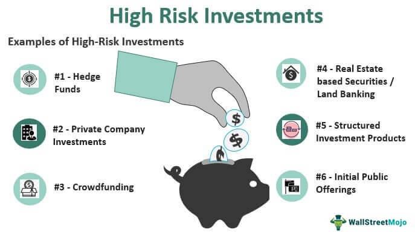

Investing is a critical component of financial growth, offering a variety of avenues with diverse risk and reward profiles. Among these, high-risk investments stand out due to their potential for significant returns, albeit with a greater chance of capital loss. For those willing to navigate this volatility, the allure lies in the possibility of doubling their returns through strategic choices and informed management.

Algorithmic trading, commonly referred to as algo trading, is transforming the investment landscape by infusing automation into trading strategies. This technological advance facilitates more disciplined and expedited decision-making, reducing the influence of human emotions and biases associated with manual trading. Algo trading operates by executing trades based on predefined parameters like timing, price, and quantity, thereby enhancing efficiency and accuracy.



This article seeks to examine effective investment strategies tailored for high-risk environments, particularly emphasizing the potential to amplify returns through the integration of algo trading. By automating trading decisions, investors can potentially harness market opportunities more effectively. Moreover, algorithms can process large datasets rapidly, identifying patterns and signals that might elude human traders.

The discussion will include a comprehensive overview of high-risk investments, the importance of evaluating potential rewards, and the application of algorithms to optimize trading decisions. With the right approach, the confluence of high-risk investment strategies and automated trading can position investors favorably to maximize their returns while managing inherent risks.

## Table of Contents

## Understanding High-Risk Investments

High-risk investments are characterized by the potential for significant returns along with an equally considerable chance of incurring substantial losses, including the total loss of the invested capital. These investments attract investors seeking higher gains compared to more traditional and safer options. The nature of high-risk investments typically demands a keen understanding of the specific markets and an acknowledgment of the associated volatility.

Prominent examples of high-risk investments include cryptocurrencies, small-cap stocks, and emerging markets. Cryptocurrencies, digital or virtual currencies that use cryptographic technology for secure financial transactions, are known for their extreme price volatility. For instance, Bitcoin, the first and most well-known cryptocurrency, has experienced sharp fluctuations in its value, influenced by a variety of factors such as regulatory news, technological developments, and market sentiments [1].

Small-cap stocks, which represent shares of companies with smaller market capitalizations, offer the potential for rapid growth but are often more susceptible to market [volatility](/wiki/volatility-trading-strategies) compared to large-cap stocks. These stocks may lack the financial stability of larger, more established companies, making them riskier. However, they provide opportunities for substantial returns if the company succeeds in its growth trajectory.

Emerging markets refer to economies that are in the process of rapid industrialization and economic growth. While these markets present opportunities due to rising consumer bases and increasing investment, they also pose risks due to potential political instability, currency fluctuation, and less mature financial systems. Investing in emerging markets requires careful scrutiny of the geopolitical climate and economic health of the respective countries.

Investors considering high-risk investments must critically evaluate their risk tolerance, which is the degree of variability in investment returns that an individual is willing or able to withstand in their investment portfolio. This involves understanding one's financial goals, investment timeline, and ability to endure potential losses without compromising overall financial stability.

Diversification of an investment portfolio is a key strategy to mitigate the risks associated with high-risk investments. By spreading investments across different asset classes and geographic regions, investors can potentially reduce the impact of poor performance in any one area. For instance, while investing in small-cap stocks, an investor might also allocate funds to bonds or other more stable assets to balance out potential volatility.

In conclusion, high-risk investments can be an integral part of a strategic investment portfolio, offering substantial gain opportunities. However, they require a thorough understanding of the risks involved and a careful assessment of one's financial capacity to absorb potential losses. Diversification and a clear evaluation of personal risk tolerance are crucial to navigating high-risk investments successfully.

[1] Nakamoto, S. (2008). Bitcoin: A Peer-to-Peer Electronic Cash System. Bitcoin.org.

## Evaluating Potential Returns

High returns in high-risk investments often come with substantial volatility, necessitating a meticulous evaluation of potential returns. This involves a comprehensive analysis of past performance, market trends, and expert opinions, all of which contribute to making informed decisions.

Firstly, analyzing past performance is foundational. Historical data provides insights into how an asset or investment performed under various market conditions. This analysis can help identify patterns or cycles, which, although not perfectly predictive, offer a basis for anticipating future movement. For instance, a small-cap stock that consistently outperforms the market during growth periods might exhibit potential for significant returns during economic expansions.

Market trends are equally critical. Understanding macroeconomic indicators, industry developments, and geopolitical events can help anticipate shifts in investment landscapes. For instance, trends in technology adoption can impact the growth prospects of tech stocks, while regulatory changes can influence the attractiveness of emerging market investments. Keeping abreast of these trends helps investors position their portfolios to capitalize on upcoming opportunities.

Expert opinions offer additional perspectives. Analysts and market strategists often provide insights based on complex models and extensive research, which individual investors might find invaluable. However, it is important to use these opinions as part of a broader research effort, not as sole guidance.

Balancing potential returns with financial goals and risk appetite is crucial. High-risk investments should align with the investor's overall financial strategy. Investors must determine their capacity and willingness to withstand potential losses, considering their investment horizon and financial objectives. High returns should not compromise financial stability or lead to undue stress.

Case studies illustrate strategies where investors have successfully doubled their returns through strategic planning. For example, adopting a contrarian approach, where investors buy undervalued assets that are unpopular, can yield substantial returns once the market recognizes their true value. Similarly, leveraging [algorithmic trading](/wiki/algorithmic-trading) strategies to capitalize on market inefficiencies has enabled some investors to achieve remarkable gains.

In summary, evaluating potential returns in high-risk investments demands a thorough understanding of past performance, market trends, and expert insights. Balancing these elements with personal financial goals and risk tolerances is essential for maximizing returns responsibly.

 to Algo Trading

Algorithmic trading, commonly referred to as algo trading, involves the use of computer programs to execute trades based on pre-defined criteria such as timing, price, and [volume](/wiki/volume-trading-strategy). By automating the trading process, algo trading offers increased accuracy and efficiency, significantly reducing the potential for human error. This type of trading is particularly beneficial in volatile markets, where speedy decision-making is crucial.

By leveraging algorithmic trading, investors can capitalize on market opportunities that may not be visible or accessible through manual trading methods. The precision of algo trading enables the execution of complex strategies at a rapid pace without the emotional biases that can affect human traders.

One of the key strengths of algorithmic trading lies in its ability to utilize [artificial intelligence](/wiki/ai-artificial-intelligence) (AI) and [machine learning](/wiki/machine-learning). These technologies enable the development of sophisticated algorithms that can analyze vast amounts of data in real time. Machine learning models can detect patterns and trends that would be challenging for humans to identify, thus providing a competitive edge.

The use of AI and machine learning has advanced algo trading from basic rule-based strategies to more complex predictive models. For example, using historical data, machine learning algorithms can forecast future market movements and adjust trading strategies accordingly. This capability allows for dynamic adaptation to ever-changing market conditions.

Here is a simple illustrative Python example of an algorithmic trading strategy using moving averages:

```python
import pandas as pd

# Sample data assumed to be loaded as a pandas DataFrame
data = pd.read_csv('market_data.csv')

# Define short and long-term moving averages
short_window = 40
long_window = 100

# Calculate moving averages
data['short_mavg'] = data['price'].rolling(window=short_window, min_periods=1, center=False).mean()
data['long_mavg'] = data['price'].rolling(window=long_window, min_periods=1, center=False).mean()

# Define trading signals
data['signal'] = 0
data['signal'][short_window:] = np.where(data['short_mavg'][short_window:] > data['long_mavg'][short_window:], 1, 0)

# Calculate positions based on signals
data['positions'] = data['signal'].diff()

print(data[['price', 'short_mavg', 'long_mavg', 'signal', 'positions']].tail())
```

In this example, a simple strategy is employed using moving averages to generate buy and sell signals. When the short-term moving average crosses above the long-term moving average, a buy signal is triggered, and when it crosses below, a sell signal occurs. This type of strategy can be further enhanced with the power of machine learning to refine entry and [exit](/wiki/exit-strategy) points, based on historical performance and predictive analytics.

In conclusion, algorithmic trading represents a transformative approach to investment management, marrying technology with financial markets to create efficient, accurate, and nimble trading operations. As AI and machine learning continue to evolve, the potential for more intricate and successful trading algorithms will undoubtedly expand, opening new avenues for profit in the financial markets.

## Developing Effective Algo Trading Strategies

Developing effective algorithmic trading strategies requires a disciplined approach that blends market insights with technological precision. A crucial first step is identifying key trading signals that can inform decision-making. These signals are typically derived from technical indicators, such as moving averages, relative strength index (RSI), or Bollinger bands, which help in detecting market trends and potential reversals. Select parameters such as the time frame, asset class, and [liquidity](/wiki/liquidity-risk-premium) requirements that align with your trading goals and risk tolerance.

Once the parameters are set, [backtesting](/wiki/backtesting) the algorithm is essential to validate its potential effectiveness. Backtesting involves running the algorithm against historical market data to evaluate how it would have performed. This process helps in identifying flaws and optimizing the strategy before deployment. For instance, Python's `pandas` and `[backtrader](/wiki/backtrader)` libraries can be leveraged to simulate trades and analyze performance:

```python
import backtrader as bt
import pandas as pd

# Load historical data
data = pd.read_csv('historical_data.csv', index_col='Date', parse_dates=True)

# Create a backtrader data feed
data_feed = bt.feeds.PandasData(dataname=data)

# Define a simple moving average crossover strategy
class SmaCross(bt.SignalStrategy):
    def __init__(self):
        sma1 = bt.ind.SMA(period=10)  # Short-term moving average
        sma2 = bt.ind.SMA(period=30)  # Long-term moving average
        self.signal_add(bt.SIGNAL_LONG, sma1 > sma2)

# Initialize and run the cerebro engine
cerebro = bt.Cerebro()
cerebro.addstrategy(SmaCross)
cerebro.adddata(data_feed)
cerebro.run()

# Plot results
cerebro.plot()
```

Continuous monitoring and adaptive adjustments are pivotal for maintaining the algorithm's performance amidst evolving market conditions. The dynamic nature of financial markets means that a once-profitable strategy could become obsolete if not regularly updated. Incorporating machine learning models can enhance adaptability by enabling the algorithm to learn from new data and adjust its parameters autonomously.

Collaboration with experienced quant developers or traders is also recommended. These professionals bring a wealth of expertise in statistical analysis and market behavior that can significantly refine the algorithm's robustness. They can also assist in implementing risk management controls, such as stop-loss limits and position-sizing rules, integral for minimizing potential losses.

Ultimately, successful algorithmic trading strategies are built on a foundation of rigorous analysis, robust testing, and agile adaptation to market changes.

## Risk Management in High-Risk Investments with Algo Trading

Effective risk management is a crucial aspect of navigating high-risk investments, particularly when leveraging algorithmic trading strategies. The integration of hedging techniques and stop-loss orders into trading algorithms can significantly reduce the likelihood of substantial losses. These mechanisms allow traders to predefine acceptable loss limits and automate responses to adverse market movements, thus providing a structured approach to mitigating risk.

Hedging involves taking offsetting positions in related securities to minimize potential losses. Algorithms can automate hedging by detecting correlations between assets and executing trades that balance exposure. For instance, an investor holding a volatile [cryptocurrency](/wiki/cryptocurrency) might hedge by simultaneously taking a position in a more stable asset or derivative linked to the broader market, such as an [ETF](/wiki/etf-trading-strategies). Through programming, this strategy can become dynamic, adjusting hedge ratios based on changing volatility or asset price behavior.

Stop-loss orders are another vital tool in risk management. These are pre-programmed triggers that liquidate a position when it reaches a certain loss threshold. By incorporating stop-loss orders into an algorithm, traders ensure that emotional biases do not delay necessary liquidation, reducing the chance of severe loss. A simple Python code snippet implementing a stop-loss order could look like this:

```python
def execute_trade(price, stop_loss_threshold):
    if price <= stop_loss_threshold:
        # Execute sell order
        print("Trade executed: Position sold at", price)
    else:
        print("Trade held: Current price", price)

# Example usage
current_price = 95
stop_loss = 100
execute_trade(current_price, stop_loss)
```

In addition to using hedging and stop-loss mechanisms, diversification is a powerful risk management strategy. A diversified portfolio spreads investment across various asset classes, reducing the impact of adverse movements in any single market. Algorithms can assist in maintaining diversification by automatically reallocating capital as market conditions evolve, ensuring that risk exposure remains balanced. This adaptability is crucial in high-risk trading environments, where market dynamics can shift rapidly.

Finally, it is imperative to regularly review and update trading algorithms. Markets are influenced by countless variables, and strategies that were once effective may become obsolete or even detrimental as conditions change. Ensuring that algorithms align with current market trends and reflect the investor's risk tolerance is essential for sustained success. Regular updates can also incorporate new financial models or data sources, increasing the sophistication and potential efficacy of the algorithms used.

By integrating these risk management techniques with algorithmic trading, investors can more effectively navigate the challenges of high-risk investments. This structured approach not only protects capital but also positions investors to capitalize on market opportunities, ultimately enhancing the potential for substantial returns while minimizing associated risks.

## Conclusion

High-risk investments, while volatile, offer a significant opportunity for investors aiming to double their returns. Such investments require a keen understanding of market dynamics and a readiness to assume substantial risk. Algorithmic trading, or algo trading, emerges as a valuable tool in managing these investments effectively, facilitating a systematic approach to both risk management and profit maximization.

Algo trading utilizes computer algorithms to execute trades based on predefined criteria, such as price, timing, and volume. This automation can quickly capitalize on fleeting market opportunities that may be too swift for manual trading. By employing advanced data analytics and machine learning, investors can enhance their decision-making processes, ensuring more precise and timely interventions in the market.

To leverage the potential of high-risk investments through algo trading effectively, it is essential for investors to judiciously evaluate risks and returns. This involves analyzing historical data, monitoring current market trends, and understanding future projections. By integrating these insights into sophisticated trading strategies, investors could potentially enhance the performance of their portfolios.

The dynamic nature of financial markets necessitates continuous adaptation and learning. Staying informed about technological advancements in algo trading and evolving market conditions is crucial for maintaining a competitive edge. Regular assessments and adjustments to trading algorithms help in capturing new opportunities and mitigating risks associated with high-risk investments.

In conclusion, the strategic use of algorithmic trading in high-risk investments can provide a systematic means to manage and capitalize on market opportunities. By carefully balancing risks and potential returns through the use of advanced algorithmic strategies, investors may enhance their portfolios' performance, achieving their financial objectives in a challenging yet rewarding market environment.

## References & Further Reading

[1]: Nakamoto, S. (2008). ["Bitcoin: A Peer-to-Peer Electronic Cash System."](https://nakamotoinstitute.org/library/bitcoin/) Bitcoin.org.

[2]: Bergstra, J., Bardenet, R., Bengio, Y., & Kégl, B. (2011). ["Algorithms for Hyper-Parameter Optimization."](https://dl.acm.org/doi/10.5555/2986459.2986743) Advances in Neural Information Processing Systems 24.

[3]: ["Advances in Financial Machine Learning"](https://www.amazon.com/Advances-Financial-Machine-Learning-Marcos/dp/1119482089) by Marcos Lopez de Prado.

[4]: ["Evidence-Based Technical Analysis: Applying the Scientific Method and Statistical Inference to Trading Signals"](https://www.amazon.com/Evidence-Based-Technical-Analysis-Scientific-Statistical/dp/0470008741) by David Aronson.

[5]: ["Machine Learning for Algorithmic Trading"](https://github.com/PacktPublishing/Machine-Learning-for-Algorithmic-Trading-Second-Edition) by Stefan Jansen.

[6]: ["Quantitative Trading: How to Build Your Own Algorithmic Trading Business"](https://www.amazon.com/Quantitative-Trading-Build-Algorithmic-Business/dp/1119800064) by Ernest P. Chan.