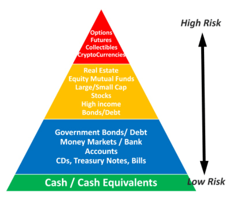

## Table of Contents

## What are high-risk investments?

High-risk investments are types of investments that have a higher chance of losing money. They can be exciting because they might also give you a lot of money if things go well. But, because they are risky, you could lose all or most of what you put in. Examples of high-risk investments include stocks of small companies, cryptocurrencies, and some types of real estate.

People often choose high-risk investments because they want to grow their money faster than with safer investments like savings accounts or government bonds. However, it's important to understand that with high risk comes the possibility of high loss. It's a good idea to only invest money in high-risk options that you can afford to lose, and to do a lot of research or talk to a financial advisor before making these kinds of investments.

## Why might someone consider high-risk investments?

People might consider high-risk investments because they want to make more money faster than with safer choices like savings accounts. High-risk investments can sometimes grow a lot in value. For example, if you buy a stock in a small company and it does really well, you could earn a lot more than if you had put your money in a bank.

However, it's not all about making money quickly. Some people enjoy the excitement and challenge of investing in things like cryptocurrencies or new businesses. They like the thrill of trying to pick winners in a risky market. But everyone should remember that with high risk comes the chance of losing money, so it's important to only invest what you can afford to lose and to do your homework first.

## What does it mean for an investment to potentially double returns?

When an investment potentially doubles returns, it means that the money you put into it could grow to be twice as much as you started with. For example, if you invest $100 and the investment doubles, you would end up with $200. This is exciting because it means you could make a lot of money quickly. But remember, this is just a possibility, and it doesn't always happen.

Investments that have the potential to double returns are often high-risk. This means there's also a big chance that you could lose money instead of making it. So, it's really important to think carefully and maybe talk to a financial advisor before you decide to invest in something that could double your money. It's all about balancing the chance of big gains with the risk of big losses.

## What are some common examples of high-risk investments?

High-risk investments are things you can put your money into that have a big chance of losing money but also a big chance of making a lot of money. Some common examples are stocks in small companies, also called penny stocks. These are stocks that don't cost much to buy, but the companies are often new or not very stable, so they can go up or down a lot. Another example is cryptocurrencies like Bitcoin or Ethereum. These are digital money that people buy and sell online, and their prices can change a lot very quickly.

Another type of high-risk investment is investing in startups or new businesses. When you invest in a startup, you're betting that the company will grow and become successful, but many startups fail, so it's very risky. Lastly, there's also high-risk real estate, like buying property to fix up and sell for a profit. This can be risky because it costs a lot of money and takes time, and there's no guarantee you'll be able to sell the property for more than you spent on it.

These kinds of investments can be exciting because if they do well, you could make a lot of money. But it's really important to remember that you could also lose a lot of money. So, always think carefully and maybe talk to someone who knows about money before you decide to put your money into these kinds of investments.

## How can beginners identify high-risk investment opportunities?

Beginners can identify high-risk investment opportunities by looking at how stable the investment is. If it's something new or not well-known, like a small company's stock or a new [cryptocurrency](/wiki/cryptocurrency), it's probably high-risk. These kinds of investments can change a lot in value very quickly, which makes them risky. Also, if you see that the investment promises really big returns in a short time, that's another sign it's high-risk. Big rewards usually come with big risks.

Another way to spot high-risk investments is to do some research. Look up the investment online and see what other people are saying about it. If you find a lot of warnings or stories about people losing money, that's a clue it's high-risk. Talking to someone who knows about money, like a financial advisor, can also help. They can tell you if an investment is too risky for you based on what you want to achieve and how much risk you're okay with taking.

## What are the key factors to consider before investing in high-risk assets?

Before you decide to put your money into high-risk assets, it's really important to think about how much risk you're okay with. High-risk investments can make you a lot of money, but they can also make you lose a lot. So, you need to ask yourself if you can handle the ups and downs. It's also a good idea to only use money that you can afford to lose. That way, if things don't go well, it won't hurt your everyday life.

Another thing to consider is how much you know about the investment. High-risk assets can be complicated, so it's smart to do a lot of research. Look up the investment online, read about it, and see what other people are saying. If you don't understand something, it might be too risky for you. Talking to a financial advisor can also help. They can give you advice based on what you want to achieve and how much risk you're comfortable with.

## How does risk management play a role in high-risk investments?

Risk management is super important when you're thinking about high-risk investments. It's all about figuring out how much you could lose and trying to make that loss smaller. One way to do this is by not putting all your money into one thing. Instead, you spread it out over different investments. This way, if one investment goes bad, you won't lose everything. It's like not putting all your eggs in one basket.

Another part of risk management is knowing how much risk you can handle. Everyone is different, and what might be too scary for one person might be okay for another. So, before you invest, think about how you would feel if you lost money. If it would keep you up at night, maybe high-risk investments aren't for you. Also, always have a plan for what you'll do if things go wrong. This way, you can make smart choices and not just hope for the best.

## What are the historical performance trends of high-risk investments?

High-risk investments have always been a bit of a roller coaster. They can go up a lot and make people a lot of money, but they can also go down a lot and make people lose money. For example, stocks in small companies or new businesses, called penny stocks, can sometimes grow really fast if the company does well. But a lot of these companies don't make it, so people who invested in them lose money. The same goes for cryptocurrencies like Bitcoin. They've had times where their value went up a lot, but they've also had times where they dropped a lot.

Looking back, high-risk investments like these have had some big wins but also some big losses. People who got into Bitcoin early made a lot of money when it went up, but people who bought it at its highest price lost a lot when it went down. The same thing happens with investing in startups. Some startups become big and successful, like Amazon or Google when they were new, and people who invested early made a lot of money. But for every big success, there are a lot of startups that fail, and people who invested in them lost their money. So, the history of high-risk investments shows that they can be really exciting and rewarding, but they can also be really risky and lead to big losses.

## How can diversification affect the outcomes of high-risk investment portfolios?

Diversification means spreading your money across different kinds of investments instead of putting it all in one place. When you do this with a high-risk investment portfolio, it can help lower the chance of losing all your money. If one investment goes down a lot, the others might stay the same or even go up, which can balance things out. This way, even though you're taking big risks, you're not putting all your eggs in one basket.

Even with diversification, high-risk investments can still lose money. But having a mix of different investments can make the ups and downs a bit smoother. For example, if you have money in stocks, cryptocurrencies, and maybe some real estate, a drop in one area might not hurt as much because the others could be doing okay. So, while diversification doesn't take away all the risk, it can help manage it better and give you a better chance of making some money in the long run.

## What advanced strategies can experts use to maximize returns from high-risk investments?

Experts can use a few smart strategies to try to make more money from high-risk investments. One strategy is called hedging, where they use other investments to protect against losses. For example, if they invest in a stock that might go down, they might also buy something called a put option, which can help them make money if the stock does go down. Another strategy is called active trading, where they buy and sell investments quickly to take advantage of short-term changes in price. This can be risky, but experts who know what they're doing might make more money this way.

Another way experts try to maximize returns is by doing a lot of research and staying up to date on what's happening in the market. They look at trends, read news, and use data to make better guesses about which high-risk investments might do well. They also use something called portfolio rebalancing, where they regularly adjust their investments to keep the right mix of risk and reward. By keeping an eye on their investments and making changes when needed, they can try to get the best results from their high-risk choices.

## How do market conditions influence the success of high-risk investments?

Market conditions play a big role in how well high-risk investments do. When the economy is doing well, people feel more confident and might be more willing to take risks. This can make high-risk investments like stocks in small companies or cryptocurrencies go up in value because more people are buying them. On the other hand, if the economy is not doing well, people might be scared to lose money and stay away from risky investments. This can make the value of these investments go down because fewer people want to buy them.

Also, things like interest rates and new laws can change how high-risk investments do. If interest rates go up, borrowing money becomes more expensive, which can make it harder for new businesses to grow and might hurt their stock prices. New laws or rules can also affect high-risk investments. For example, if the government makes new rules about cryptocurrencies, it could make their prices go up or down depending on what the rules are. So, understanding market conditions is really important for anyone thinking about high-risk investments.

## What are the tax implications and legal considerations for high-risk investments?

When you make money from high-risk investments, you have to think about taxes. The money you make from selling stocks, cryptocurrencies, or other investments is called capital gains. In many places, you have to pay taxes on these gains. How much you pay can depend on how long you held the investment. If you held it for a short time, you might pay a higher tax rate than if you held it for a long time. Also, some countries have special rules for things like cryptocurrencies, so it's good to check what the rules are where you live.

There are also legal things to consider with high-risk investments. Some investments might need you to follow special rules or get certain permissions. For example, investing in startups might need you to understand securities laws, which are rules about buying and selling parts of a company. Breaking these rules can get you in trouble. Also, some high-risk investments, like certain types of real estate deals, might need you to have a license or follow specific laws. So, it's important to know the laws in your area and maybe talk to a lawyer before you invest in something risky.

## References & Further Reading

[1]: Nakamoto, S. (2008). ["Bitcoin: A Peer-to-Peer Electronic Cash System."](https://nakamotoinstitute.org/library/bitcoin/) Bitcoin.org.

[2]: Bergstra, J., Bardenet, R., Bengio, Y., & Kégl, B. (2011). ["Algorithms for Hyper-Parameter Optimization."](https://dl.acm.org/doi/10.5555/2986459.2986743) Advances in Neural Information Processing Systems 24.

[3]: ["Advances in Financial Machine Learning"](https://www.amazon.com/Advances-Financial-Machine-Learning-Marcos/dp/1119482089) by Marcos Lopez de Prado.

[4]: ["Evidence-Based Technical Analysis: Applying the Scientific Method and Statistical Inference to Trading Signals"](https://www.amazon.com/Evidence-Based-Technical-Analysis-Scientific-Statistical/dp/0470008741) by David Aronson.

[5]: ["Machine Learning for Algorithmic Trading"](https://github.com/PacktPublishing/Machine-Learning-for-Algorithmic-Trading-Second-Edition) by Stefan Jansen.

[6]: ["Quantitative Trading: How to Build Your Own Algorithmic Trading Business"](https://www.amazon.com/Quantitative-Trading-Build-Algorithmic-Business/dp/1119800064) by Ernest P. Chan.