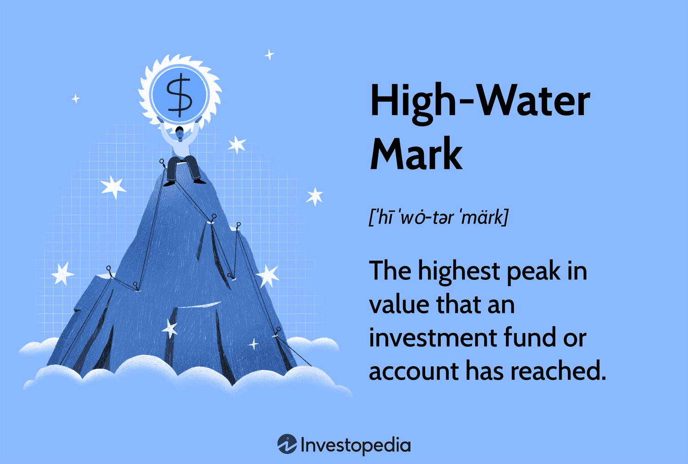

Understanding the term 'high-water mark' is crucial for those involved in investment finance and algorithmic trading. The high-water mark concept is integral to the financial domain, particularly in the context of hedge funds and performance-based compensation. Essentially, a high-water mark represents the peak value that an investment account has achieved. It is chiefly used as a reference point to determine compensation for fund managers. Specifically, managers are required to surpass this benchmark to earn performance fees, especially after periods of loss, ensuring that investors are not subjected to fees unless the fund's performance recovers beyond its previous peak.

The significance of high-water marks extends beyond mere compensation structures. In investment management, they act as safeguards for investors, ensuring that they pay fees only when substantive value is generated. This mechanism fosters transparency, fairness, and encourages fund managers to aim for consistent and sustainable performance, rewarding them when these goals are met.



Furthermore, high-water marks play a pivotal role in algorithmic trading, where they are used to set performance benchmarks and evaluate the efficiency of trading algorithms. They serve as key indicators in developing strategies that enhance trading performance, ensuring that the algorithms are not just making trades, but doing so profitably and effectively.

Overall, high-water marks are essential tools that help align the interests of investors and fund managers, promote long-term investment goals, and enhance the analytical capabilities of algorithmic trading platforms. Their role in the financial industry continues to grow, underscoring their importance in both traditional and tech-driven trading environments.

## Table of Contents

## What is a High-Water Mark?

A high-water mark represents the peak value an investment account has reached. This financial metric is crucial in evaluating performance and establishing benchmarks for compensation in investment management, particularly within hedge funds. The high-water mark establishes a threshold that fund managers must surpass before they can earn performance-based fees, especially after experiencing a loss.

In most hedge fund structures, managers earn performance fees only if the fund's net asset value (NAV) exceeds the previous high-water mark. For example, if a fund's NAV was $100 million at its peak and subsequently fell to $90 million, the manager would not receive performance fees until the NAV rises above $100 million. This structure incentivizes managers to recover losses and achieve consistent performance in their investment strategies.

The use of high-water marks aligns the interests of fund managers and investors by ensuring that fees are paid only on actual gains beyond prior achievements. This protects investors from being charged fees during periods of poor performance, providing a level of transparency and fairness.

In practical terms, high-water marks can also be represented with a simple mathematical expression. Let $V_t$ represent the value of the investment fund at time $t$. The high-water mark $H_t$ at time $t$ is then given by:

$$
H_t = \max_{s \leq t} (V_s)
$$

This equation implies that the high-water mark at time $t$ is the maximum value of the fund from inception up to time $t$. Fund managers must push $V_t$ above $H_t$ to be eligible for performance fees again. This mechanism promotes accountability and aligns performance incentives with client expectations.

## Significance in Investment Finance

High-water marks serve an essential function in investment finance by providing a structure that safeguards investors from incurring fees associated with suboptimal fund performance. This mechanism ensures that fund managers are only incentivized through performance fees when the fund's value surpasses its previous peak, thereby aligning the managers' interests with those of the investors. 

In practical terms, a high-water mark acts as a threshold that must be exceeded before fund managers can earn additional performance-based compensation. This approach mitigates the risk of managers being rewarded during periods of negative or underwhelming performance. Suppose a fund initially valued at $100 million appreciates to $120 million. Here, the high-water mark is set at $120 million. If the fund then declines to $110 million, the fund manager cannot receive performance fees until the fund's value surpasses $120 million again.

The high-water mark provides a transparent and objective benchmark that enhances fairness in fund management. Investors are assured that they only pay for genuine performance improvements over previous peaks, eliminating the potential for excessive fee structures in periods of mediocrity or loss. This aspect of the high-water mark fosters investor confidence and promotes a sense of security.

Furthermore, high-water marks encourage consistent fund performance by incentivizing managers to pursue sustainable growth strategies and stable returns. Knowing that fees are contingent on surpassing previous high points, fund managers are motivated to execute investment strategies that involve both long-term planning and risk management, rather than immediate gains that could jeopardize future performance.

Moreover, high-water marks can be utilized in [algorithmic trading](/wiki/algorithmic-trading) to set performance benchmarks, which are crucial in developing efficient trading strategies. Algorithms designed to surpass these benchmarks must incorporate sophisticated techniques to account for various market conditions, adding a layer of resilience to trading approaches. In this manner, high-water marks help maintain an environment where investors are protected from undue costs, transparency is upheld, and fund managers remain dedicated to delivering consistent and robust performance.

## Algorithmic Trading and High-Water Marks

Algorithmic trading employs sophisticated computer algorithms to execute trades at high speeds, often far exceeding human capabilities. This high-speed trading framework is highly dependent on mathematical models and quantitative analysis to capture fleeting market opportunities. In this context, high-water marks play a crucial role by offering a structured way to evaluate the performance of these trading algorithms.

A high-water mark in algorithmic trading serves as a benchmark indicator. When a trading system reaches a new peak performance level, this becomes the new high-water mark. Subsequent performance is then measured against this highest level, ensuring that trading strategies are assessed for their ability to maintain or surpass previous performance levels. The motivation behind using high-water marks in this way is to provide a clear performance metric that encapsulates both risk management and potential returns.

By setting these performance benchmarks, high-water marks help in critiquing the algorithm's efficiency. They allow developers and traders to analyze how well an algorithm performs in different market conditions. For instance, if an algorithm consistently surpasses its high-water marks, it indicates robustness and adaptability to varying market scenarios. On the other hand, if an algorithm struggles to reach its previous high-water mark after a period of losses, it may signal the need for strategy reevaluation or algorithmic adjustments.

To illustrate the concept further, consider a Python implementation that logs the highest equity level achieved by an algorithm. This simple script can help track and update the high-water mark dynamically:

```python
class TradingAlgorithm:
    def __init__(self):
        self.equity = 100000  # Initial capital in USD
        self.high_water_mark = self.equity

    def update_equity(self, new_equity):
        self.equity = new_equity
        if self.equity > self.high_water_mark:
            self.high_water_mark = self.equity

    def get_high_water_mark(self):
        return self.high_water_mark

# Example usage
algo = TradingAlgorithm()
trades = [102000, 99500, 105000, 103000]

for trade in trades:
    algo.update_equity(trade)
    print(f"Current Equity: {trade}, High-Water Mark: {algo.get_high_water_mark()}")
```

This code snippet initializes a trading algorithm with a given starting equity. As new trades are executed, it updates the current equity and compares it against the high-water mark, updating it if the new equity exceeds it. This kind of mechanism is essential in ensuring that the algorithm's performance is transparent and measurable over time.

Implementing high-water marks provides a dual advantage: it aligns performance assessment with investor expectations and helps fine-tune algorithms for optimal market performance. By focusing on these benchmarks, traders and developers can refine their algorithms to be more resilient and lucrative, ultimately driving improved trading outcomes.

## Examples and Case Studies

Renaissance Technologies, a prominent [hedge fund](/wiki/hedge-fund-trading-strategies), is renowned for its application of quantitative models to drive trading strategies. High-water marks play a critical role in its hedge fund structures, particularly within the Medallion Fund. The fund employs sophisticated algorithms to exploit market inefficiencies and set high-water marks as benchmarks for manager compensation. This mechanism ensures that investors are not charged performance fees unless the fund surpasses its previous peak value.

An exemplary case is the Medallion Fund's consistent track record of generating profits even during market downturns. The implementation of high-water marks is vital in this context as it aligns the interests of fund managers with investors. When faced with a loss, fund managers must attain the prior peak before performance fees are reinstated, providing an incentive to recover losses effectively and maintain investor trust.

In a broader scope, various trading environments utilize high-water marks to enforce transparency and fairness. For instance, a hedge fund operating in the equities market might use a high-water mark to motivate fund managers to achieve peak performance throughout the financial year. Successful implementation of high-water marks is often associated with balancing investor protection and incentivizing fund managers to deliver consistent results.

Consider a hypothetical scenario where a fund begins with an initial value of $100 million. If the fund appreciates to $120 million and subsequently declines to $110 million, the high-water mark remains at $120 million. The fund manager will not receive performance fees until the fund surpasses the $120 million mark again. This structure encourages risk management and the pursuit of long-term value rather than short-term gains.

In algorithmic trading, firms utilize high-water marks to evaluate the efficacy of trading algorithms. By establishing these benchmarks, trading firms ensure algorithms consistently perform at optimal levels, reducing the likelihood of complacency and enhancing algorithmic efficiency over time. Through real-world scenarios, high-water marks have proven instrumental in maintaining discipline, encouraging resilience during downtrends, and fostering an environment conducive to sustainable growth.

## Advantages and Disadvantages

High-water marks offer several advantages within investment finance and fund management. One primary advantage is the alignment of interests between investors and fund managers. By setting a high-water mark, fund managers are incentivized to achieve consistent positive performance as they can only earn performance fees when the investment portfolio exceeds its previous peak value. This arrangement motivates managers to focus on maximizing returns and protecting investor capital, promoting long-term performance.

High-water marks also enhance fairness and transparency in the fee structure of investment funds. Investors are protected from paying performance fees during periods of poor performance; only when the fund regains its past peak value can managers claim performance fees. This structure encourages investors to remain engaged with their investments, knowing their interests are safeguarded.

However, high-water marks are not without disadvantages. A significant drawback is the reduced incentive for fund managers during prolonged loss periods. When an investment fund underperforms and cannot recapture its previous peak, managers may find it challenging to reach the high-water mark again, leading to diminished motivation. This scenario can result in manager attrition, as skilled managers may seek opportunities that provide more immediate compensation for their efforts.

Furthermore, high-water marks can induce short-term risk-taking behaviors among managers attempting to recover losses quickly to surpass the high-water mark, potentially compromising long-term investment strategies. Balancing the pursuit of high returns with risk management is crucial to maintaining a sustainable and robust investment approach.

In conclusion, effectively weighing the pros and cons of high-water marks is essential for informed decision-making in fund management. While they align interests and promote performance accountability, the challenges during extended loss periods and the temptation to take excessive risks must be carefully managed. Fund managers and investors need to understand the implications of high-water marks to leverage their benefits while minimizing potential drawbacks.

## Conclusion

High-water marks are pivotal in shaping investment strategies and performance evaluation, serving as a fundamental tool for both investors and fund managers. In investment management, particularly within hedge funds, the high-water mark is crucial for determining performance-based fees. It ensures that fund managers are rewarded for achieving gains beyond previous peaks, thereby aligning their interests closely with those of their investors. This mechanism acts as a safeguard, preventing fund managers from [earning](/wiki/earning-announcement) fees during periods of unsatisfactory performance and incentivizing them to recover lost ground before charging performance fees.

In the era of algorithmic trading, the significance of high-water marks is further solidified. As algorithmic platforms execute trades at unprecedented speeds and volumes, high-water marks serve as critical benchmarks to evaluate the efficacy of trading algorithms. By assessing whether trading strategies can surpass previous high-water marks, traders can determine the viability and strength of their algorithms. This evaluation process is vital for maintaining robust trading strategies that maximize returns and manage risks effectively.

For investors and fund managers, understanding and leveraging high-water marks is essential for achieving optimal results. When properly utilized, high-water marks not only align incentives and enhance performance accountability but also foster a transparent and fair investment environment. As the financial landscape increasingly relies on automated and data-driven strategies, the role of high-water marks remains indispensable in guiding investment decisions and advancing the efficiency of modern trading systems.

## Further Reading and Resources

For those interested in gaining a more comprehensive understanding of hedge fund fee structures and the application of high-water marks, Investopedia offers a detailed overview. This resource breaks down the intricacies of management fees and performance-based compensation, highlighting how high-water marks serve as a crucial threshold in the determination of these fees. [Investopedia - Hedge Fund Fee Structures](https://www.investopedia.com/articles/financialcareers/06/hedgefundfees.asp).

To deepen your knowledge of high-water marks in trading, academic papers and articles provide insightful analyses on their effects and implementations. These resources can offer statistical evaluations and case studies demonstrating the operational models of high-water marks in various trading scenarios, focusing on their effectiveness and impact on fund performance.

Staying abreast of the latest trends and innovations in algorithmic trading is vital for both investors and traders. Industry news platforms and specialized newsletters frequently cover developments such as the integration of high-water marks in algorithm settings and algorithmic strategy enhancements. Subscribing to these updates can provide ongoing education and real-time information essential for navigating the constantly evolving trading environment.

By utilizing these resources, individuals can enhance their understanding of high-water marks' significance and their role in optimizing investment returns while ensuring they remain informed about the rapid changes within algorithmic trading landscapes.

## References & Further Reading

[1]: Investopedia. ["Hedge Fund Fee Structures"](https://www.investopedia.com/terms/t/two_and_twenty.asp).

[2]: Lopez de Prado, M. (2018). ["Advances in Financial Machine Learning."](https://www.amazon.com/Advances-Financial-Machine-Learning-Marcos/dp/1119482089) Wiley.

[3]: Aronson, D. R. (2006). ["Evidence-Based Technical Analysis: Applying the Scientific Method and Statistical Inference to Trading Signals."](https://www.amazon.com/Evidence-Based-Technical-Analysis-Scientific-Statistical/dp/0470008741) Wiley. 

[4]: Chan, E. P. (2009). ["Quantitative Trading: How to Build Your Own Algorithmic Trading Business."](https://github.com/ftvision/quant_trading_echan_book) Wiley.

[5]: Jansen, S. (2020). ["Machine Learning for Algorithmic Trading."](https://github.com/stefan-jansen/machine-learning-for-trading) Packt Publishing.