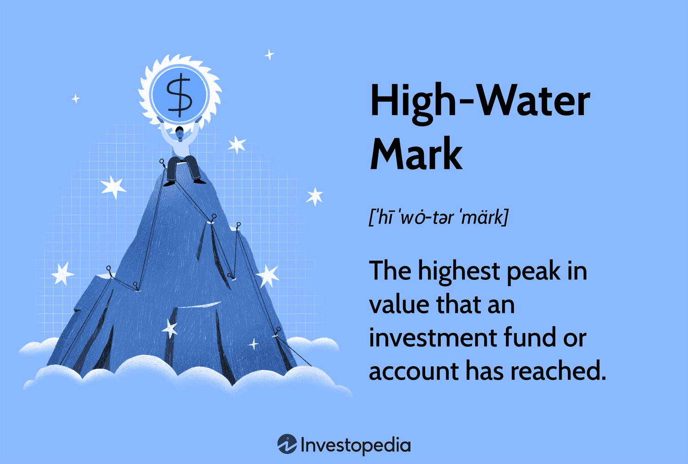

In the rapidly evolving world of finance, algorithmic trading exemplifies the intersection of technology and financial expertise, streamlining the trading process and enhancing market efficiency. This method involves using algorithms to automate trading decisions, a significant departure from traditional manual trading practices. One of the crucial components in this technological transition is the concept of the high watermark, a term commonly used in asset management and hedge funds. Its significance extends into algorithmic trading, providing a unique perspective on performance measurement and strategy development.

The high watermark is essentially a performance metric that represents the peak value an investment portfolio or fund must reach before a trader is entitled to earn performance fees. This ensures that traders are rewarded based on genuine gains rather than transient market fluctuations. In algorithmic trading, this mechanism is particularly important due to the rapid trading and frequent portfolio value changes inherent in high-frequency trading environments.

Understanding the implications of the high watermark within algorithmic trading is essential, as it influences trading strategies and performance metrics. It acts as a safeguard for investors, ensuring they do not incur fees during periods when the portfolio value is recovering from a loss. This protection encourages a more disciplined approach to trading, aligning the interests of traders and investors, and promoting sustainable financial growth.

## Table of Contents

## Understanding High Watermark

The high watermark is a fundamental concept in the world of finance, particularly in asset management and hedge funds, and it plays a crucial role in [algorithmic trading](/wiki/algorithmic-trading) environments. At its core, the high watermark establishes the highest value that an investment portfolio or fund must achieve before performance fees can be levied against profits. This mechanism is crucial for ensuring that performance fees are only paid when the portfolio achieves a new peak, thereby protecting investors from incurring fees during periods of recovery following losses.

In algorithmic trading, the high watermark concept becomes even more significant due to the inherent [volatility](/wiki/volatility-trading-strategies) and rapid trading associated with this mode of investing. Algorithmic trading often involves automated and high-frequency trading strategies, where the portfolio value can fluctuate significantly over short periods. To address such fluctuations, a high watermark mechanism ensures that traders do not earn performance fees until the portfolio exceeds its previous highest value. This alignment of interest is integral to fostering trust between traders and investors, as it assures investors that fees are only paid when tangible profit improvements occur.

For example, consider a situation where a trader implements a trading algorithm that leads to an initial profit, pushing the portfolio value to a new high watermark of $1 million. If subsequent trades result in losses and the portfolio value drops to $900,000, any recovery in the portfolio's value up to the previous watermark of $1 million does not trigger performance fees. Only when the portfolio surpasses the $1 million mark again will the trader earn performance fees on additional profits.

The high watermark system acts as an incentive for traders to prioritize sustainable and consistent profit strategies, discouraging excessive risk-taking. In this context, its application within algorithmic trading encourages a disciplined approach to strategy development and implementation. Algorithmic traders must design robust algorithms that not only maximize profits but also consider risk management to ensure that the portfolio consistently achieves new high watermarks. This alignment is crucial for maintaining investor confidence and demonstrating the trader's commitment to long-term value creation rather than short-term gains.

Overall, the high watermark is a key safeguard for investors, ensuring that performance fees are earned only through genuine, sustainable gains. This protective measure reinforces the importance of risk management and strategic planning in algorithmic trading, ultimately contributing to a transparent and investor-aligned trading environment.

## The Role of High Watermark in Algos

Algorithmic trading often utilizes high-frequency trading ([HFT](/wiki/high-frequency-trading-strategies)) strategies, which can cause notable fluctuations in portfolio value due to the rapid succession of trades executed. A high watermark mechanism acts as a safeguard in these scenarios by ensuring that performance fees are only accrued on actual profit gains, thus protecting investors from paying fees on mere recovery or volatile market-induced gains. 

In the context of algorithmic trading, a high watermark creates an environment where traders are compelled to focus on sustained profitability. Traders must exceed previous portfolio peaks before they can charge performance fees, thus aligning their incentives more closely with those of the investors. This system compels traders to exercise caution and avoid opportunistic strategies that might only lead to short-lived gains. It fosters responsible trading behavior by promoting strategies that aim for consistent performance improvements.

In terms of decision-making and strategy formulation, high watermark mechanisms heavily influence the construction and execution of trading algorithms. Traders are encouraged to deploy algorithms that optimize for steady growth rather than engage in high-risk maneuvers that could produce volatile results. The presence of a high watermark can lead traders to maintain a disciplined approach, often requiring additional layers of risk management strategies to minimize drawdowns and protect portfolio value.

Moreover, a high watermark can also serve as a benchmark for evaluating strategy efficacy. By setting a clear target for performance fees, traders can assess whether their algorithmic strategies are meeting investor expectations. This benchmark encourages continuous strategy refinement and innovation, as traders experiment with different methodologies to surpass previous performance highs.

In conclusion, the high watermark mechanism fixes the problem of fee misalignment in algorithmic trading by enforcing a strict criterion for performance evaluation. It encourages traders to prioritize real value generation over rapid, unsustainable portfolio movements and ensures that only substantive, investor-benefiting performance changes are rewarded. This not only protects investor interests but also enhances the robustness and reliability of algorithmic trading strategies.

## Impact on Algorithmic Trading Strategies

High watermarks significantly influence algorithmic trading strategies, prompting traders to adapt their approaches to achieve sustainable returns and avoid excessive risk-taking. The high watermark serves as a critical performance benchmark, ensuring that traders and funds only earn performance fees when the portfolio value surpasses its previous peak. This clause safeguards investors and encourages strategic prudence among traders.

### Strategic Shifts in Algorithmic Trading

Traders often recalibrate their strategies to navigate the constraints imposed by the high watermark. This recalibration primarily focuses on balancing risk and reward, ensuring a consistent performance without unnecessary volatility. To maintain profitability above the previous high watermark, traders may focus on:

1. **Risk Management Adjustments**: Traders often refine their risk management frameworks by incorporating tighter stop-loss mechanisms or diversifying their portfolios to mitigate potential downturns. This ensures that their trading positions are aligned with the overall goal of achieving steady returns.

2. **Algorithm Optimization**: By continuously optimizing their algorithms, traders can fine-tune trading signals and execution strategies to better respond to market conditions. This might involve backtesting different scenarios and adjusting parameters to align with historical data performance.

3. **Portfolio Rebalancing**: Regular rebalancing of the portfolio can help in maintaining a balanced exposure to different asset classes and trading strategies. By doing so, traders can potentially reduce the impact of any single strategy underperforming and thus protect the cumulative portfolio value.

### Psychological Impacts on Traders

The high watermark concept instills a psychological discipline in traders. Knowing that their performance fees are contingent on surpassing prior peaks, traders are encouraged to take a methodical approach to strategy development. This mindset can have several psychological effects:

- **Risk Aversion**: With the high watermark acting as a performance gatekeeper, traders might naturally develop an aversion to excessive risk-taking. This could lead to a more calculated approach toward trade selection and execution.

- **Long-term Focus**: Traders may prioritize long-term gains over short-term profits, focusing on strategies that promise sustainable returns over impulsive, high-risk maneuvers. This shift often results in a holistic view of the market, emphasizing continuous performance elevation.

- **Performance Motivation**: The goal to exceed previous high-water marks can motivate traders to constantly improve their strategies, seek innovative trading ideas, and remain abreast of market developments.

Through strategic shifts and psychological adaptations, the high watermark serves not only as a financial threshold but also as a catalyst for disciplined trading practices among algorithmic traders. The discipline enforced by this benchmark ensures that traders are consistently working towards enhancing profitability while minimizing risk exposure.

## Comparison with Other Financial Metrics

The high watermark concept is an essential metric in algorithmic trading, but it gains significant depth when considered alongside other financial performance metrics like the Sharpe ratio, maximum drawdown, and alpha. Understanding these metrics in tandem offers traders a more comprehensive framework for evaluating and enhancing their trading strategies.

The high watermark primarily serves as a performance fee benchmark, ensuring that fees are only charged when surpassing previous peak values. This guards investors against paying for recoveries from losses rather than genuine performance improvements. In contrast, the Sharpe ratio measures risk-adjusted returns, providing insights into how well the return of an investment compensates for the risk taken. It is calculated as:

$$
\text{Sharpe Ratio} = \frac{E[R] - R_f}{\sigma}
$$

where $E[R]$ is the expected portfolio return, $R_f$ is the risk-free rate, and $\sigma$ is the standard deviation of portfolio returns. While the high watermark safeguards against illusory growth, the Sharpe ratio offers a lens to view profitability against volatility, emphasizing efficiency in trading.

Maximum drawdown represents the largest peak-to-trough decline in a portfolio, highlighting the risk of significant losses. High watermark considerations prevent traders from charging fees during recovery phases, echoing the maximum drawdown's role of awareness around potential capital erosion. By comparing the two, traders can better understand the interplay between fee structures and capital protection requirements.

Alpha, or the excess return on an investment relative to the market or a benchmark index, further complements these metrics. It reflects a trader’s ability to generate returns above the typical market movement, representing skill or active management. High watermark focuses on net gains, while alpha demonstrates outperformance beyond market trends, both incentivizing traders to surpass standard benchmarks for genuine value creation.

Conjoining these metrics, the high watermark can serve as a long-term performance measure, reinforcing a disciplined approach where traders not only focus on surpassing past peaks but also strive for return efficiency (Sharpe ratio), risk management (maximum drawdown), and market outperformance (alpha). These integrated metrics ensure a balanced evaluation, guiding algorithmic traders toward sustainable and strategically sound practices.

## Real-World Applications

High watermark concepts have played a critical role in shaping algorithmic trading and fund management practices. In many firms, it is integrated into risk management and performance evaluation frameworks. By ensuring that performance fees are only charged on gains surpassing previous peaks, the high watermark acts as a protective measure for investors, offering a baseline for assessing genuine profitability.

A notable case illustrating the application of high watermark is that of Renaissance Technologies, one of the most successful quantitative hedge funds. Renaissance employs a high watermark mechanism within its Medallion Fund to align the interests of investors and traders. This guarantees that performance fees are levied only when the fund exceeds its historical peak value, fostering long-term value creation over short-term gains.

In high-frequency trading environments, where rapid market fluctuations are frequent, the high watermark serves as a safeguard against temporary market upticks. For instance, in volatile equity markets, algorithmic traders adopt strategies that manage exposure and mitigate risk, ensuring that any upward adjustments in the portfolio surpass the high watermark before performance fees are assessed.

Regarding its integration for risk management, firms often implement high watermark in tandem with advanced analytics tools that track portfolio performance. These systems provide real-time insights and set alerts when portfolio value nears or exceeds past peaks. This integration supports informed decision-making, helping traders adjust strategies to maintain positions above high watermark levels sustainably.

Market scenarios such as prolonged bear markets present challenges where maintaining positions above the high watermark may require strategic adjustments. During these periods, traders might pivot towards more diversified asset allocations or leverage protective options strategies to cushion against drawdowns, thus maintaining their high watermark goals.

In conclusion, the high watermark is a practical tool in algorithmic trading, guiding firms in creating symbiotic relationships between trader motivation and investor protection. By prioritizing authentic value, it ensures that both traders and investors can achieve their objectives without compromising on matters of risk and performance.

## Challenges and Considerations

High watermark provisions, while beneficial in aligning incentives between traders and investors, can lead to challenges such as increased pressure on traders and potential strategic misalignment. These issues arise primarily due to the inherent requirement that traders must surpass previous maximum portfolio values to earn performance fees. Consequently, traders may experience heightened stress as they strive to achieve new profit highs, potentially leading to risky decision-making or departure from core strategy principles.

Traders and firms must carefully consider several factors to effectively implement high watermark provisions without compromising trading strategies or risk levels. One such consideration is the establishment of clear guidelines and risk management protocols that set boundaries for trading practices, ensuring adherence to established risk tolerances. Implementing a robust risk management framework, incorporating stop-loss measures and value-at-risk (VaR) assessments, can help mitigate the potential for adverse outcomes.

The integration of advanced technology solutions can assist in addressing the challenges associated with high watermarks. Algorithmic systems equipped with real-time analytics and alert mechanisms enable traders to make informed decisions quickly and adjust strategies in response to market developments. Machine learning models, in particular, can enhance predictive accuracy, allowing traders to optimize trade execution while adhering to the high watermark parameter.

To maintain a balanced trading environment, it is essential to foster a culture of discipline and continuous learning among trading teams. Regular training sessions and scenario analyses can prepare traders for different market conditions and enhance their ability to adapt strategies effectively. Moreover, establishing performance review mechanisms that focus on long-term metrics, rather than short-term gains, aligns team efforts with the fund’s overall objectives, reducing pressure to surpass high watermarks through excessive risk-taking.

In summary, while high watermark provisions introduce certain challenges, adopting structured risk management practices, leveraging technology, and promoting a culture of informed trading can help traders and firms navigate these complexities. By doing so, they can uphold the integrity of trading strategies while achieving sustained profitability.

## Conclusion

Algorithmic trading has transformed the financial industry by integrating technology with trading strategies. An integral component of this system is the high watermark, a mechanism designed to ensure that performance fees are only charged when a new peak in investment value is reached. This principle is pivotal for protecting investors from being charged during recovery phases following losses, thus maintaining fairness and motivating traders towards achieving genuine profits.

The high watermark plays a crucial role in shaping algorithmic trading strategies by driving disciplined trading practices and encouraging a careful balance between risk and reward. By linking performance fees to consistent performance rather than temporary gains, traders are incentivized to employ thorough analysis and thoughtful decision-making processes. This not only cements the importance of sustainable growth strategies but also aligns with the broader objectives of risk management and investor protection.

A well-rounded approach to algorithmic trading requires considering high watermark alongside other financial metrics such as the Sharpe ratio, maximum drawdown, and alpha. Each metric provides unique insights into different facets of trading performance and risk. Therefore, integrating high watermark considerations with these metrics enables traders to gain a comprehensive understanding of their trading activities and performance. This holistic perspective is vital for formulating strategies that are both profitable and resilient to market volatility.

Traders are encouraged to explore and implement these insights to refine their algorithmic trading strategies. By taking into account the high watermark mechanism along with other performance metrics, traders can enhance their strategies, ensure ethical fee structures, and ultimately deliver value to investors. The nuanced understanding of how these components interact is key to navigating the complexities of the financial markets effectively.

## References

- **Databento's Algorithmic Trading Guide**: This guide provides a comprehensive overview of algorithmic trading, detailing the use of computer algorithms to execute trades at optimal speeds. It covers strategies, risks, and how various trading indicators, such as the high watermark, integrate within algorithmic trading frameworks. [Databento Website](https://www.databento.com)

- **Investopedia's Basics of Algorithmic Trading**: Investopedia offers a detailed look at the principles underlying algorithmic trading, encompassing the automated execution of orders based on preset conditions. It explains key terms and metrics, like the high watermark, employed to safeguard investor interests and optimize trading strategies. [Investopedia Article](https://www.investopedia.com/terms/a/algorithmictrading.asp)

- **24markets.com Insights on Benefits and Risks of Algorithmic Trading**: This source outlines both the advantages, such as efficiency and reduced human error, and the potential risks associated with algorithmic trading. It highlights the significance of integrating metrics like the high watermark to mitigate risks and align trader incentives with investor protections. [24markets.com](https://www.24markets.com/)

- **High Watermark in Trading - Additional Credible Sources and Case Studies**: Various studies and articles illustrate the application and impact of the high watermark in trading. These resources provide empirical data and analyses of its role in performance fee structures and its influence on trading behavior, emphasizing the high watermark's preventative function against unnecessary fee payments during portfolio rebound phases.

## References & Further Reading

[1]: Lopez de Prado, M. (2018). ["Advances in Financial Machine Learning."](https://www.amazon.com/Advances-Financial-Machine-Learning-Marcos/dp/1119482089) Wiley.

[2]: Chan, E. P. (2008). ["Quantitative Trading: How to Build Your Own Algorithmic Trading Business."](https://github.com/ftvision/quant_trading_echan_book) Wiley.

[3]: Aronson, D. R. (2006). ["Evidence-Based Technical Analysis: Applying the Scientific Method and Statistical Inference to Trading Signals."](https://www.wiley.com/en-us/Evidence+Based+Technical+Analysis%3A+Applying+the+Scientific+Method+and+Statistical+Inference+to+Trading+Signals-p-9780470008744) Wiley.

[4]: Jansen, S. (2018). ["Machine Learning for Algorithmic Trading."](https://github.com/stefan-jansen/machine-learning-for-trading) Packt Publishing.

[5]: Investopedia. ["Basics of Algorithmic Trading."](https://www.investopedia.com/articles/active-trading/101014/basics-algorithmic-trading-concepts-and-examples.asp) Accessed on [Date].

[6]: 24markets.com. ["Benefits and Risks of Algorithmic Trading."](https://24markets.com/education/benefits-and-risks-of-algo-trading-understanding-algorithmic-trading) Accessed on [Date].