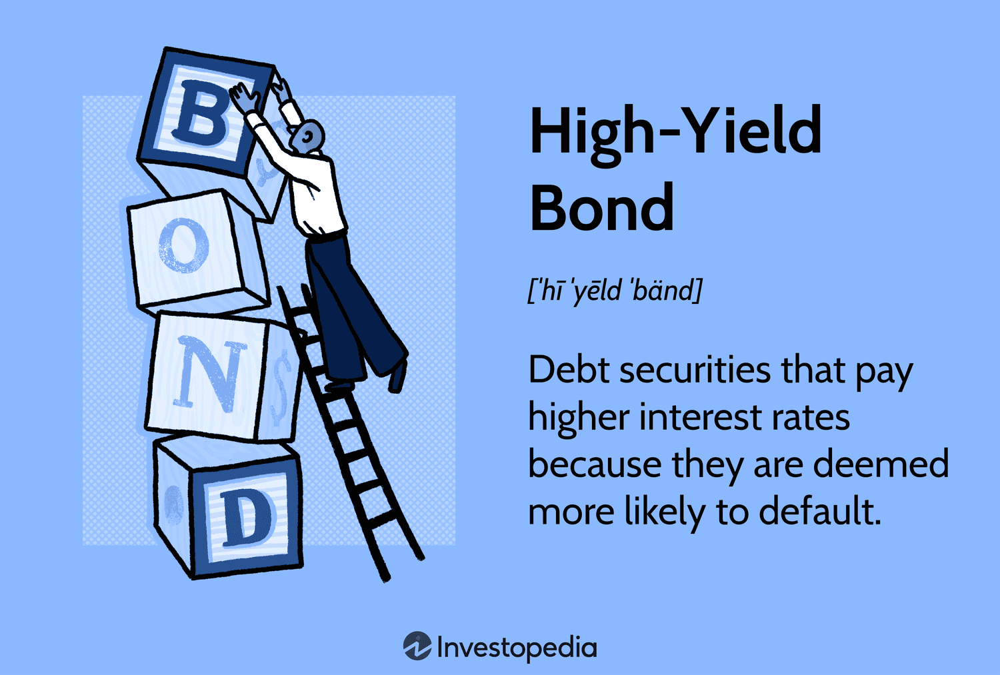

## Table of Contents

## What are high-yield bonds?

High-yield bonds are a type of bond that offers higher interest rates than other bonds. They are also known as junk bonds. These bonds are issued by companies that might have a higher risk of not being able to pay back the money they borrow. Because of this higher risk, investors get paid more interest as a reward for taking that risk.

People invest in high-yield bonds to earn more money from the interest payments. But, there is a chance that the company could run into financial trouble and not be able to pay back the bond. This makes high-yield bonds riskier than other bonds, like those issued by the government or big, stable companies. Investors need to think carefully about the balance between the higher rewards and the higher risks before they decide to buy these bonds.

## How do high-yield bonds differ from investment-grade bonds?

High-yield bonds and investment-grade bonds are different mainly because of their risk and the interest they pay. High-yield bonds, also called junk bonds, come from companies that might have money problems. This makes them riskier. Because they are riskier, these bonds pay more interest to people who buy them. It's like a reward for taking a bigger chance. On the other hand, investment-grade bonds are from companies that are more stable and less likely to have money troubles. They are safer, so they don't need to pay as much interest.

When you think about buying bonds, you need to decide how much risk you want to take. If you buy high-yield bonds, you might get more money from the interest, but there's a bigger chance the company won't pay you back. With investment-grade bonds, you get less interest, but it's more likely the company will pay you back because they are more financially secure. It's all about finding the right balance between the money you can earn and the risk you're willing to take.

## What are the potential benefits of investing in high-yield bonds?

Investing in high-yield bonds can offer higher returns than other types of bonds. Since these bonds are riskier, the companies that issue them have to pay more interest to attract investors. This means that if you invest in high-yield bonds, you could earn more money from the interest payments compared to safer bonds like government or investment-grade bonds. For people looking to grow their money faster, the higher interest rates from high-yield bonds can be a big draw.

Another benefit is that high-yield bonds can help spread out your investment risks. When you put your money in different types of investments, it's called diversification. By adding high-yield bonds to your investment mix, you're not putting all your eggs in one basket. This can protect your overall investment if other parts of your portfolio, like stocks, don't do well. High-yield bonds can also act as a cushion during times when the economy is not doing great, because they might still pay interest even when other investments are struggling.

## What are the risks associated with high-yield bonds?

High-yield bonds come with higher risks because they are issued by companies that might have money problems. There's a bigger chance that these companies won't be able to pay back the money they borrowed. This is called default risk. If a company defaults, you might lose some or all of the money you invested in their bonds. Also, high-yield bonds can be more affected by changes in the economy. If the economy gets worse, these companies might have an even harder time paying back their debts, which makes high-yield bonds riskier during tough economic times.

Another risk is that high-yield bonds can be harder to sell quickly. This is called [liquidity](/wiki/liquidity-risk-premium) risk. If you need to get your money out of high-yield bonds fast, you might not be able to find someone to buy them from you right away. This can be a problem if you need your money for something else. Also, the prices of high-yield bonds can go up and down a lot. This is called [interest rate](/wiki/interest-rate-trading-strategies) risk. If interest rates go up, the value of your high-yield bonds might go down, which means you could lose money if you decide to sell them before they mature.

## How can an investor assess the creditworthiness of a high-yield bond?

To assess the creditworthiness of a high-yield bond, an investor should look at the credit ratings given by rating agencies like Moody's, Standard & Poor's, or Fitch. These agencies give grades to bonds based on how likely they think the company is to pay back its debt. A high-yield bond usually has a lower rating, like BB or lower, which means it's riskier. But even within high-yield bonds, some are riskier than others. So, it's good to compare the ratings of different bonds to see which ones might be safer.

Another way to assess creditworthiness is by looking at the company's financial health. You can check their financial statements to see if they are making money, how much debt they have, and if they can pay their bills. If a company has a lot of debt compared to what it earns, it might be riskier. You can also look at news and reports about the company to see if there are any signs of trouble. Talking to a financial advisor can also help you understand if a high-yield bond is a good choice for you based on your own risk and investment goals.

## What role do high-yield bonds play in a diversified investment portfolio?

High-yield bonds can be a helpful part of a diversified investment portfolio because they offer higher interest rates than other bonds. This means they can help you earn more money from your investments. When you mix high-yield bonds with other types of investments like stocks and safer bonds, you spread out your risks. If one part of your portfolio, like stocks, goes down in value, the high-yield bonds might still be paying you interest. This can help balance out your overall investment performance.

However, high-yield bonds also come with higher risks. They are issued by companies that might have money problems, so there's a chance they won't be able to pay you back. This means you need to be careful about how much of your portfolio you put into high-yield bonds. By keeping them as just one part of a bigger, varied investment plan, you can enjoy their higher returns while also protecting yourself against their risks. It's all about finding the right mix that fits your comfort with risk and your goals for [earning](/wiki/earning-announcement) money.

## How have high-yield bonds performed historically compared to other asset classes?

High-yield bonds have generally done better than other bonds like government or investment-grade bonds over time. They give higher interest payments because they are riskier. Over the long run, high-yield bonds have often given returns that are somewhere between what you get from safer bonds and what you might get from stocks. This means they can be a good middle ground for people who want more return than from safe bonds but are not ready to take the full risk of stocks.

However, high-yield bonds can be more up and down than other bonds. They can lose value if the economy gets bad, because the companies that issue them might have trouble paying back their debts. During times like the 2008 financial crisis or the 2020 economic downturn due to the global health crisis, high-yield bonds saw big drops in value. But they also bounced back well when things got better. So, while they can offer good returns, they come with more risk and can be more affected by what's happening in the economy.

## What are the key factors to consider when selecting high-yield bonds for investment?

When [picking](/wiki/asset-class-picking) high-yield bonds to invest in, it's important to look at the credit rating of the bond. Credit rating agencies like Moody's or Standard & Poor's give grades to bonds based on how likely they think the company is to pay back its debt. A high-yield bond usually has a lower rating, which means it's riskier. But even among high-yield bonds, some are safer than others. So, you should compare the ratings of different bonds to see which ones might be less risky. Also, think about how much interest the bond pays. Higher interest rates mean more money for you, but they also often come with more risk.

Another key thing to consider is the financial health of the company issuing the bond. You can check their financial statements to see if they are making money and if they can pay their bills. If a company has a lot of debt compared to what it earns, it might be riskier. It's also a good idea to look at news and reports about the company to see if there are any signs of trouble. Finally, think about how high-yield bonds fit into your overall investment plan. They can help you earn more money, but they are riskier than other bonds. So, you need to decide how much risk you're okay with and how these bonds fit with your other investments.

## How does the economic cycle impact high-yield bond performance?

The economic cycle can really affect how well high-yield bonds do. When the economy is doing well, companies usually make more money and have an easier time paying back their debts. This means high-yield bonds can do better because there's less chance the companies will run into money trouble. During good economic times, people might feel more confident about taking risks, so they might buy more high-yield bonds, which can make their prices go up.

But when the economy starts to get worse, high-yield bonds can have a harder time. If companies are struggling to make money, they might not be able to pay back what they owe. This makes high-yield bonds riskier, and people might start selling them, which can make their prices go down. During tough economic times, like a recession, high-yield bonds can lose a lot of value because investors get worried about the companies' ability to pay back their debts. So, the ups and downs of the economy can really change how high-yield bonds perform.

## What are the tax implications of investing in high-yield bonds?

When you invest in high-yield bonds, you need to think about taxes. The interest you earn from these bonds is usually taxed as regular income. This means it gets added to your other income and is taxed at your normal tax rate. So, if you're in a high tax bracket, you might end up paying a lot of taxes on the interest from high-yield bonds. This can make the after-tax return, or the money you actually get to keep, lower than you might expect.

Another thing to consider is if you buy or sell high-yield bonds before they mature. If you sell them for more than you paid, you might have to pay capital gains tax on the profit. If you sell them for less, you might be able to use the loss to reduce your taxes. Also, some high-yield bonds can be issued as municipal bonds, which might have different tax rules. Municipal bonds can sometimes be tax-free at the federal level, and sometimes at the state level too, depending on where you live and where the bond is from. So, it's important to understand the tax rules for the specific high-yield bonds you're looking at.

## How can investors use high-yield bond funds or ETFs to gain exposure to this asset class?

Investors can use high-yield bond funds or ETFs to easily invest in high-yield bonds without having to pick individual bonds themselves. These funds and ETFs hold a bunch of different high-yield bonds, which helps spread out the risk. By buying shares in a high-yield bond fund or [ETF](/wiki/etf-trading-strategies), you get a piece of all the bonds in the fund. This can be a simpler way to invest in high-yield bonds because someone else, like the fund manager, does the work of choosing which bonds to buy.

Another good thing about using high-yield bond funds or ETFs is that they can be easier to buy and sell than individual bonds. If you need to get your money out quickly, it's usually easier to sell shares in a fund or ETF than to find someone to buy your individual bonds. But remember, these funds and ETFs still come with the same risks as high-yield bonds. The value of the fund can go up and down, and there's still a chance the companies might not be able to pay back their debts. So, it's important to think about how these funds fit into your overall investment plan and how much risk you're okay with taking.

## What advanced strategies can expert investors use to enhance returns from high-yield bonds?

Expert investors can use a few smart strategies to get more out of their high-yield bond investments. One way is to use a strategy called "credit analysis." This means they look really closely at the financial health of the companies that issue the bonds. They check things like how much money the company is making, how much debt it has, and if it can pay its bills. By picking bonds from companies that are doing well but still offer high interest rates, they can lower their risk while still getting good returns. Another strategy is to trade high-yield bonds actively. This means they buy and sell bonds based on what's happening in the market and the economy. If they think the economy is going to get better, they might buy more high-yield bonds because the companies will have an easier time paying back their debts.

Another advanced strategy is to use "duration management." This means they think about how long they want to hold onto the bonds. If they think interest rates are going to go up, they might choose bonds that will mature sooner. This way, they can reinvest the money at the new, higher interest rates. On the other hand, if they think interest rates will go down, they might pick bonds that will last longer so they can keep getting the higher interest rates for a longer time. Finally, some expert investors use "sector rotation." This means they move their money between different types of high-yield bonds, like those from energy companies or tech companies, based on which sectors they think will do well in the future. By using these strategies, expert investors can try to get more out of their high-yield bond investments while managing the risks.

## References & Further Reading

[1]: Altman, E. I., & Bruner, R. F. (1977). ["High-Yield Bonds: Investment Performance and Economic Impact."](https://www.sciencedirect.com/science/article/pii/S0378426697000368) Financial Analysts Journal.

[2]: Fridson, M. S., & Garman, J. (2013). ["Uncovering the Beware of Junk Bonds"](https://www.sciencedirect.com/science/article/pii/S1366554503000541) Investopedia.

[3]: Liu, L. Y., & Malatesta, P. H. (2006). ["Credit Rating Changes and Momentum."](https://www.researchgate.net/publication/256067015_Credit_Rating_and_Underpricing_of_Seasoned_Equity_Offerings) The Journal of Financial Research, 29(4).

[4]: Pyles, M. K. (2013). ["High Yield Bonds: Market Structure, Valuation, and Portfolio Strategies."](https://www.amazon.com/High-Yield-Bonds-Structure-Strategies/dp/0070067864) CFA Institute.

[5]: Trester, J. J. (2014). ["Junk Bond Investing: Everything You Need to Know to Double Your Income."](https://fastercapital.com/content/Junk-Bonds--The-High-Yield-Investment-Opportunity-You-Need-to-Know-About.html) Wiley.