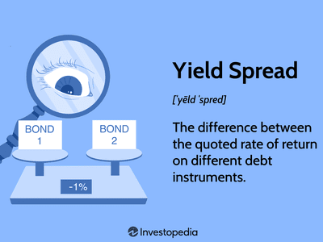

## Table of Contents

## What is a high-yield bond?

A high-yield bond is a type of bond that offers a higher interest rate than other bonds. These bonds are also called junk bonds. They are riskier because the companies that issue them might have financial problems. Because of this, investors get paid more to take on the extra risk.

People buy high-yield bonds to earn more money from their investments. These bonds can be a good choice for investors who are willing to take more risk for the chance of higher returns. But, if the company that issued the bond runs into trouble, it might not be able to pay back the money it owes. This means investors could lose their investment.

## How does the spread of a high-yield bond differ from that of a government bond?

The spread of a high-yield bond is the difference between its yield and the yield of a similar government bond. High-yield bonds have a bigger spread because they are riskier. The companies that issue these bonds might have money problems, so investors want more reward for taking that risk. This means high-yield bonds pay more interest than government bonds.

Government bonds, on the other hand, are seen as very safe. Countries like the U.S. or Germany are not likely to go bankrupt, so their bonds have smaller spreads. Investors are okay with lower interest rates because they trust that the government will pay them back. So, the spread of a high-yield bond is usually much larger than the spread of a government bond.

## What factors influence the spread of high-yield bonds?

The spread of high-yield bonds is influenced by many things. One big factor is how risky the company issuing the bond is. If a company is having money problems or is in a shaky industry, investors will want a bigger reward for lending them money. This means the spread will be larger. Also, the overall economy plays a role. If the economy is doing well, investors might feel safer and the spread could be smaller. But if the economy is struggling, investors will want more to take on the risk, making the spread bigger.

Another thing that affects the spread is how much demand there is for high-yield bonds. If lots of people want to buy these bonds, the spread might go down because issuers don't have to offer as much to attract buyers. On the other hand, if fewer people want to buy, issuers might have to offer a bigger spread to get investors interested. Finally, interest rates set by central banks can also impact the spread. If interest rates go up, the spread on high-yield bonds might need to increase to stay attractive to investors compared to other investment options.

## How can investors use high-yield bond spreads to assess market conditions?

Investors can use high-yield bond spreads to get a sense of how the market is feeling about risk. If the spread between high-yield bonds and government bonds is getting bigger, it might mean that investors are worried. They think the economy might be in trouble or that companies with high-yield bonds are riskier. So, they want more money to take on that risk. On the other hand, if the spread is getting smaller, it could mean that investors feel safer. They think the economy is doing well and companies are less likely to run into money problems.

Another way investors can use high-yield bond spreads is to compare them over time. If the spreads are much higher than usual, it might be a sign that the market is very nervous. This could be a good time for investors to be careful and maybe look for safer investments. If the spreads are lower than usual, it might mean the market is feeling confident. Investors might see this as a good time to take on more risk, hoping to earn higher returns. By watching these spreads, investors can make smarter choices about when to buy or sell high-yield bonds.

## What is the historical performance of high-yield bond spreads?

High-yield bond spreads have gone up and down a lot over the years. During good economic times, like the late 1990s and mid-2000s, the spreads were usually smaller. This is because investors felt safe and didn't need a big reward to buy high-yield bonds. But during tough times, like the 2008 financial crisis or the early days of the COVID-19 pandemic in 2020, the spreads got a lot bigger. Investors were scared and wanted more money to take on the risk of high-yield bonds.

Over the long run, high-yield bond spreads can show us how the market feels about risk. When the economy is doing well, the spreads tend to be lower because everyone feels safer. But when things get shaky, the spreads get wider as investors want more reward for the risk they're taking. By looking at these patterns, we can see how high-yield bond spreads have changed with the ups and downs of the economy.

## How do high-yield bond spreads correlate with economic cycles?

High-yield bond spreads go up and down with the economy. When the economy is doing well, like during good times in the late 1990s and mid-2000s, the spreads are usually smaller. This happens because people feel safe and don't need a big reward to buy high-yield bonds. They trust that companies will pay them back, so they're okay with smaller spreads.

But when the economy is struggling, like during the 2008 financial crisis or the early days of the COVID-19 pandemic in 2020, the spreads get a lot bigger. People get scared and want more money to take on the risk of high-yield bonds. They worry that companies might not be able to pay them back, so they need bigger spreads to feel okay about investing.

By watching how high-yield bond spreads change, we can see how people feel about the economy. Smaller spreads mean people feel good and safe, while bigger spreads show that people are worried and want more reward for taking risks.

## What are the risks associated with investing in high-yield bonds based on their spreads?

Investing in high-yield bonds can be risky, especially when looking at their spreads. If the spread between a high-yield bond and a government bond is very big, it means investors are worried. They think the company might have money problems and might not be able to pay back the bond. This makes the bond riskier. If you invest in a high-yield bond with a big spread, you could lose money if the company runs into trouble.

On the other hand, if the spread is small, it might seem safer. But there's still risk. Small spreads can mean that lots of people want to buy high-yield bonds, making them seem less risky. But if the economy takes a turn for the worse, those spreads can get bigger fast. This means the bond that seemed safe might suddenly become risky, and you could lose money if you need to sell it when the spread is big.

## How can high-yield bond spreads be used in portfolio diversification?

High-yield bond spreads can help investors spread out their money in different ways. When you see the spreads, you can tell how risky high-yield bonds are compared to safer government bonds. If the spreads are small, it might mean the economy is doing well and high-yield bonds are less risky. You might want to put more money into high-yield bonds to get higher returns. But if the spreads are big, it means investors are worried about the economy and high-yield bonds are riskier. You might want to put less money in high-yield bonds and more in safer investments like government bonds to protect your money.

By watching high-yield bond spreads, you can change your investments to fit the economy. When the spreads are small, adding high-yield bonds to your portfolio can help you make more money. But when the spreads get bigger, you can lower the risk in your portfolio by putting more money into safer bonds. This way, you can balance risk and reward, making your investments safer and possibly more profitable over time.

## What are some advanced analytical tools used to predict changes in high-yield bond spreads?

To predict changes in high-yield bond spreads, investors use advanced tools like regression analysis. This tool helps them look at past data to see how different things, like the economy or interest rates, have changed the spreads before. By understanding these patterns, investors can guess what might happen to the spreads in the future. They can use this information to decide when to buy or sell high-yield bonds.

Another tool is machine learning. This tool uses computers to find patterns in big sets of data that people might not see. Machine learning can look at lots of different things at the same time, like how the economy is doing, what companies are saying, and even what people are saying on social media. By finding these patterns, machine learning can help predict if high-yield bond spreads will get bigger or smaller. This can help investors make smarter choices about their money.

## How do global economic events impact high-yield bond spreads?

Global economic events can have a big impact on high-yield bond spreads. When something big happens, like a financial crisis or a global health emergency, investors get worried. They start thinking that companies might have a harder time paying back their bonds. This worry makes them want more money to take on the risk of buying high-yield bonds. So, the spreads between high-yield bonds and safer government bonds get bigger. For example, during the 2008 financial crisis and the early days of the COVID-19 pandemic, high-yield bond spreads grew a lot because investors were scared about the economy.

On the other hand, when the global economy is doing well, high-yield bond spreads can get smaller. Good news, like strong economic growth or low unemployment, makes investors feel safer. They think companies are less likely to run into money problems, so they don't need as much reward to buy high-yield bonds. This means the spreads between high-yield bonds and government bonds shrink. By watching these global events, investors can get a sense of how risky high-yield bonds might be and adjust their investments accordingly.

## What role do credit rating agencies play in determining high-yield bond spreads?

Credit rating agencies help figure out how risky high-yield bonds are. They give each bond a grade, like a school report card, to show how likely the company is to pay back the money it owes. If a bond gets a low grade, it means the company is riskier and might have trouble paying back the bond. This makes investors want more money to take on that risk, so the spread between the high-yield bond and a safer government bond gets bigger. On the other hand, if a bond gets a higher grade, it means the company is less risky, and investors might be okay with a smaller spread.

Changes in these grades can also shake up the high-yield bond market. If a credit rating agency decides to lower a bond's grade, it can make investors worried. They might think the company is in more trouble than they thought, so they want a bigger reward for holding onto the bond. This can make the spread grow even more. But if a bond's grade goes up, it can make investors feel safer, and the spread might get smaller. So, credit rating agencies play a big part in deciding how big the spreads on high-yield bonds will be.

## How can investors hedge against potential losses from high-yield bond spread fluctuations?

Investors can hedge against potential losses from high-yield bond spread fluctuations by using something called credit default swaps (CDS). A CDS is like an insurance policy for bonds. If the company that issued the bond can't pay back the money it owes, the CDS will help cover the loss. By buying a CDS, investors can protect themselves from losing money if the high-yield bond spreads get bigger because the company is in trouble. This way, they can still try to earn money from the high-yield bonds but have a safety net if things go wrong.

Another way to hedge is by diversifying their investments. Instead of putting all their money into high-yield bonds, investors can spread it out across different types of investments, like stocks, government bonds, and other assets. If high-yield bond spreads get bigger and the value of those bonds goes down, the other investments might still do well. This can help balance out any losses from the high-yield bonds. By mixing up their investments, investors can lower the risk of losing a lot of money if high-yield bond spreads change a lot.

## What is the understanding of High-Yield Bonds?

High-yield bonds, commonly referred to as junk bonds, are fixed-income securities that offer higher yields than investment-grade bonds due to their lower credit ratings. These bonds are typically issued by companies or entities that do not meet the more stringent credit criteria required for investment-grade bonds, often reflecting a higher risk of default. The distinguishing characteristic of high-yield bonds lies in their position within credit ratings systems. While investment-grade bonds are rated BBB- or higher by agencies like Standard & Poor’s (or Baa3 or higher by Moody's), high-yield bonds fall below these ratings thresholds. This classification indicates a higher risk but also the potential for greater returns.

The risk and return profile of high-yield bonds is a crucial [factor](/wiki/factor-investing) for investors. These bonds can offer substantial rewards, as the higher yield is intended to compensate for the increased credit risk. The potential for capital appreciation also exists if the issuing company improves its creditworthiness and the bonds are upgraded to a higher rating category. However, the associated risks are significant. Credit risk is paramount, as the issuing entity may default on interest or principal payments. Additionally, these bonds are susceptible to [interest rate](/wiki/interest-rate-trading-strategies) risk; rising interest rates can lead to a decline in bond prices, disproportionately affecting lower-rated bonds. Liquidity risk is also a concern, as high-yield bonds may not trade as frequently, making it challenging to buy or sell large quantities without affecting the price.

Credit ratings play a pivotal role in the pricing and yields of high-yield bonds. Ratings agencies assess the creditworthiness of the bond issuer, influencing investor perception and demand. Bonds with lower ratings generally attract higher yields to compensate for the perceived risk. These ratings inform the spread between high-yield and treasury bonds, an indicator of the additional risk premium required by investors. For example, a bond rated BB might have a yield spread of several percentage points over a similar-duration U.S Treasury bond. The correlation between ratings and bond spreads can be expressed as:

$$
\text{Yield Spread} = \text{Yield}_{\text{High-Yield Bond}} - \text{Yield}_{\text{Treasury Bond}}
$$

In summary, high-yield bonds represent a significant opportunity for investors willing to accept higher risk for potentially enhanced returns. Understanding their risk and return profile, alongside the pivotal role of credit ratings, is essential for informed investment decisions.

## What is the Concept of Bond Spreads?

Bond spreads are a crucial concept in the bond market, representing the yield difference between different types of bonds, often categorized by credit quality. Bond spreads are typically expressed as the yield difference between a corporate bond and a comparable risk-free government bond. For high-yield bonds, also known as junk bonds, these spreads serve as key indicators of risk and market conditions. 

### Calculation of Bond Spreads

The bond spread is calculated by subtracting the yield of a risk-free government bond (e.g., U.S. Treasury bond) from the yield of a corporate bond. Mathematically, it can be expressed as:

$$
\text{Bond Spread} = \text{Yield of Corporate Bond} - \text{Yield of Government Bond}
$$

This calculation helps investors evaluate the additional yield they earn for taking on additional risk. High-yield bond spreads are particularly significant because they indicate the perceived risk of default compared to safer government bonds.

### Significance of High-Yield Bond Spreads

High-yield bond spreads are a vital tool for assessing market conditions. They reflect the risk premium that investors require to hold riskier debt over virtually risk-free government securities. A widening spread indicates an increasing perceived risk, often due to deteriorating credit conditions or an economic downturn. Conversely, a narrowing spread suggests a decrease in perceived risk, indicating improved economic conditions or strengthening corporate credit quality.

For investors, understanding these spreads is essential for making informed investment decisions. They provide insights into credit risk, investor sentiment, and the overall state of credit markets. A significant movement in high-yield spreads can signal shifts in market risk appetite and [liquidity](/wiki/liquidity-risk-premium).

### Economic Indicators Embedded in Bond Spreads

Changes in bond spreads can serve as reliable indicators of broader economic trends. A widening of high-yield spreads may precede an economic slowdown as investors become wary of corporate default risks. For example, during financial crises or periods of economic uncertainty, spreads typically widen due to the increased risk of default and economic instability.

Conversely, tightening spreads can indicate economic strength and stability, reflecting investor confidence in the financial health of corporations. Historical trends show that high-yield bond spreads often serve as a leading indicator, signaling economic shifts before they are reflected in other economic data.

In conclusion, bond spreads, specifically high-yield bond spreads, offer valuable insights into market conditions and economic trends. Understanding these spreads is critical for investors navigating the complexities of high-yield bond markets. By examining the direction and magnitude of changes in these spreads, investors can gauge market sentiment and make informed decisions aligned with their risk tolerance and investment objectives.

## References & Further Reading

[1]: Fridson, M. & Garman, J. (2001). ["The Complete Guide to Investing in Bonds and Bond Funds: How to Earn High Rates of Return – Safely."](https://archive.org/details/completeguidetoi0000maed_s9x3) Prima Publishing.

[2]: ["High-Yield Bonds: Market Structure, Valuation, and Portfolio Strategies"](https://www.amazon.com/High-Yield-Bonds-Structure-Strategies/dp/0070067864) by T. D. Sanders and F. J. Fabozzi

[3]: ["The Bond Book: Everything Investors Need to Know About Treasuries, Municipals, GNMAs, Corporates, Zeros, Bond Funds, Money Market Funds, and More"](https://www.amazon.com/Bond-Book-Third-Everything-Treasuries/dp/007166470X) by Annette Thau

[4]: Acharya, V. & Schaefer, S. (2006). ["Liquidity Risk and Corporate Bond Returns."](https://www.sciencedirect.com/science/article/pii/S0304405X13002031) The Journal of Finance, 61(2), 1110-1137.

[5]: ["Bloomberg Barclays US Corporate High Yield Bond Index – Overview."](https://www.bloomberg.com/markets/rates-bonds/bloomberg-fixed-income-indices) Bloomberg Indices.