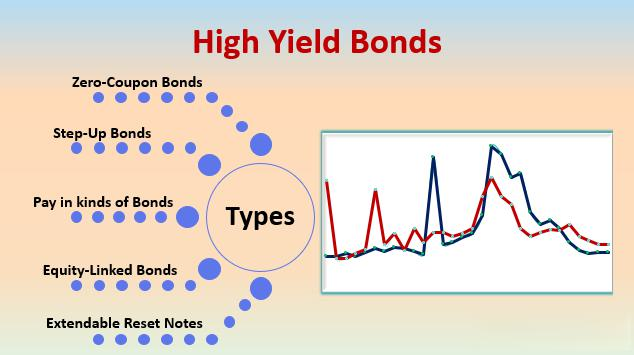

## Table of Contents

## What are high-yield bonds?

High-yield bonds are a type of bond that offers a higher interest rate than regular bonds. They are also called junk bonds. These bonds are issued by companies that might have more risk, so they need to offer a higher return to attract investors. People who buy high-yield bonds are taking a bigger chance that the company might not be able to pay back the money.

Even though high-yield bonds can be risky, they can also be a good way to make more money. Investors who are willing to take on more risk might find that these bonds give them better returns than safer investments like government bonds. It's important for investors to do their homework and understand the risks before they decide to buy high-yield bonds.

## How do high-yield bonds differ from investment-grade bonds?

High-yield bonds and investment-grade bonds are different mainly because of their risk and the interest they offer. High-yield bonds, also known as junk bonds, are issued by companies that might have more financial problems. Because these companies are riskier, they have to offer higher interest rates to get people to buy their bonds. On the other hand, investment-grade bonds are issued by companies that are financially stable and less likely to have trouble paying back their debts. These bonds have lower interest rates because they are safer.

The main difference between the two is the credit rating. Investment-grade bonds have a high credit rating, which means they are considered safe by credit rating agencies. These agencies give them ratings like AAA, AA, A, or BBB. High-yield bonds have lower ratings, usually BB or below, which means they are seen as riskier. Investors looking for safer investments will go for investment-grade bonds, while those willing to take more risk for a chance at higher returns might choose high-yield bonds.

## What are the main types of high-yield bonds?

High-yield bonds can be split into two main types: corporate bonds and emerging market bonds. Corporate high-yield bonds are issued by companies that might have a lot of debt or other financial problems. These companies need to offer higher interest rates to get people to buy their bonds. This type of bond is common in countries with strong economies, like the United States and Europe.

The other type is emerging market high-yield bonds. These are issued by governments or companies in countries that are still developing their economies. These countries can be riskier because they might have more political or economic problems. But, they can offer higher returns to attract investors. People who invest in these bonds are taking a bigger risk, but they might get more money back if things go well.

## What are the risks associated with investing in high-yield bonds?

Investing in high-yield bonds comes with some risks that people should know about. The biggest risk is that the company or country issuing the bond might not be able to pay back the money they borrowed. This is called default risk. Because high-yield bonds are issued by companies or countries that are already struggling financially, there's a higher chance they won't be able to pay back their debts. If this happens, investors could lose some or all of the money they put into the bond.

Another risk is that the value of high-yield bonds can go up and down a lot. This is called [interest rate](/wiki/interest-rate-trading-strategies) risk. When interest rates in the economy change, the value of bonds can change too. If interest rates go up, the value of existing bonds usually goes down. This can be a problem for people who might need to sell their bonds before they mature. They could end up selling them for less than they paid. Also, high-yield bonds can be affected by changes in the economy or problems in certain industries, which can make their value go down.

Finally, there's the risk of [liquidity](/wiki/liquidity-risk-premium). High-yield bonds might be harder to sell quickly because fewer people want to buy them. This means if an investor needs to get their money out of a high-yield bond fast, they might have trouble finding someone to buy it. This can be a big problem in times when the market is not doing well, and people are trying to sell their investments to avoid losing more money.

## How can high-yield bonds benefit a diversified investment portfolio?

Adding high-yield bonds to a diversified investment portfolio can help increase the overall return. High-yield bonds offer higher interest rates than regular bonds because they are riskier. This means that if everything goes well, investors can earn more money from these bonds than from safer investments like government bonds or investment-grade bonds. By including high-yield bonds, investors can potentially boost the income they get from their portfolio, which can be especially helpful for those who need regular income from their investments.

High-yield bonds can also help spread out risk in a portfolio. Even though these bonds are riskier on their own, when mixed with other types of investments like stocks, real estate, and safer bonds, they can balance out the overall risk. If stocks go down, high-yield bonds might still provide good returns, helping to cushion the impact of losses in other areas. This way, high-yield bonds can make a portfolio more stable and resilient to market changes, as long as investors are careful about how much they put into these riskier bonds.

## What are the key factors to consider when selecting high-yield bonds?

When [picking](/wiki/asset-class-picking) high-yield bonds, one important thing to look at is the credit rating. High-yield bonds have lower ratings, usually BB or below, which means they are riskier. But within this group, some bonds might be less risky than others. It's a good idea to check the ratings from different agencies and see if they have been getting better or worse over time. Also, look at the company's financial health. Are they making enough money to pay back their debts? Are their debts growing? Understanding the company's situation can help you decide if their bonds are a good choice.

Another thing to think about is the bond's interest rate and how it compares to other bonds. High-yield bonds offer higher interest rates to attract investors, but it's important to see if the extra interest is worth the extra risk. Also, consider how long the bond lasts. Longer-term bonds might offer higher interest rates, but they also come with more risk because things can change a lot over time. Finally, think about the bond's liquidity. Can you sell it easily if you need to? High-yield bonds can be harder to sell quickly, so this is something to keep in mind.

Overall, choosing high-yield bonds involves balancing the potential for higher returns against the risks. It's important to do your homework and maybe even talk to a financial advisor to make sure you understand what you're getting into. By looking at the credit rating, the company's financial health, the interest rate, the bond's term, and its liquidity, you can make a more informed decision about which high-yield bonds might be right for your investment goals.

## How do interest rates affect the performance of high-yield bonds?

Interest rates have a big impact on high-yield bonds. When interest rates in the economy go up, the value of existing bonds usually goes down. This happens because new bonds that are issued will have higher interest rates, making the older bonds less attractive to investors. So, if someone wants to sell their high-yield bonds before they mature, they might have to sell them for less than they paid. This is called interest rate risk, and it's something to think about when investing in high-yield bonds.

On the other hand, when interest rates go down, the value of existing high-yield bonds can go up. This is because the interest rates on these bonds become more attractive compared to new bonds being issued with lower rates. Investors might be willing to pay more for these bonds because they offer better returns. So, high-yield bonds can perform better when interest rates are falling. But, it's important to remember that high-yield bonds are still riskier than other bonds, so changes in interest rates are just one piece of the puzzle to consider.

## What role do credit ratings play in high-yield bond investments?

Credit ratings are really important when it comes to high-yield bond investments. They tell you how likely it is that the company or country issuing the bond will be able to pay back the money they borrowed. High-yield bonds have lower credit ratings, usually BB or below, which means they are riskier. But, even within this group, some bonds might be less risky than others. By looking at the credit ratings from different agencies, investors can get a better idea of how safe a bond is. If a company's credit rating is getting better, it might be a good sign that their financial health is improving.

Understanding credit ratings can help investors decide which high-yield bonds to buy. If a bond has a very low credit rating, it means there's a higher chance the company might not pay back the money. But, these bonds also offer higher interest rates to make up for the extra risk. So, investors need to think about whether the higher interest rate is worth the risk. By paying attention to credit ratings and how they change over time, investors can make smarter choices about which high-yield bonds to include in their portfolio.

## What are some common strategies for investing in high-yield bonds?

One common strategy for investing in high-yield bonds is to focus on diversification. This means spreading your money across different high-yield bonds from various companies or countries. By doing this, you lower the risk that one bond will cause big problems for your whole investment. If one company can't pay back its bond, the others might still be doing well. Another part of this strategy is to mix high-yield bonds with other types of investments, like stocks or safer bonds. This way, if the high-yield bonds don't do well, your other investments might help balance things out.

Another strategy is to pay close attention to the credit ratings of the bonds you're looking at. Credit ratings tell you how likely it is that a company will pay back its debt. By choosing bonds with better credit ratings within the high-yield category, you might lower your risk a bit. Some investors also keep an eye on how these ratings change over time. If a company's credit rating is getting better, it might be a good sign to buy their bond. On the other hand, if the rating is getting worse, it might be time to sell or avoid that bond.

Some investors use a strategy called "laddering" with high-yield bonds. This means buying bonds that mature at different times. For example, you might buy some bonds that mature in one year, some in two years, and some in three years. This way, you get money back at different times, which can help you manage your cash flow better. It also means you can take advantage of changing interest rates. If rates go up, you can reinvest the money from the bonds that mature at a higher rate. If rates go down, you still have bonds that were bought at a higher rate.

## How can investors mitigate the risks of high-yield bond investments?

Investors can lower the risks of high-yield bonds by spreading their money across different bonds. This means buying bonds from different companies or even different countries. If one bond doesn't do well, the others might still be okay. It's also smart to mix high-yield bonds with other types of investments, like stocks or safer bonds. This way, if the high-yield bonds go down, the other investments might help balance things out.

Another way to reduce risk is to pay close attention to credit ratings. High-yield bonds have lower ratings, but some are less risky than others. By choosing bonds with better ratings within the high-yield category, investors can lower their risk a bit. It's also important to keep an eye on how these ratings change over time. If a company's rating is getting better, it might be a good time to buy their bond. If the rating is getting worse, it might be time to sell or avoid that bond.

## What are the tax implications of investing in high-yield bonds?

When you invest in high-yield bonds, you need to think about taxes. The interest you earn from these bonds is usually taxed as regular income. This means you might have to pay more taxes on this money than if it was from other types of investments, like stocks or municipal bonds. The tax rate depends on your income and where you live. So, it's a good idea to talk to a tax advisor to understand how much you might have to pay in taxes.

Another thing to consider is if you buy and sell high-yield bonds. If you sell a bond for more than you paid for it, you might have to pay capital gains tax. This tax is usually lower than the tax on regular income, but it still affects how much money you keep. If you sell the bond for less than you paid, you might be able to use that loss to lower your taxes on other gains. Again, it's smart to talk to a tax advisor to make sure you understand all the tax rules and how they apply to your high-yield bond investments.

## How do global economic conditions influence high-yield bond markets?

Global economic conditions can have a big impact on high-yield bond markets. When the world economy is doing well, companies are usually making more money and are less likely to have trouble paying back their debts. This makes high-yield bonds seem less risky, and more people might want to buy them. On the other hand, if the global economy is struggling, companies might have a harder time making money. This can make it more likely that they won't be able to pay back their bonds, which makes high-yield bonds riskier. So, when the economy is not doing well, fewer people might want to buy high-yield bonds, and their prices might go down.

Changes in global interest rates also affect high-yield bond markets. When interest rates around the world go up, the value of existing high-yield bonds usually goes down. This is because new bonds that are issued will have higher interest rates, making the older bonds less attractive to investors. If someone wants to sell their high-yield bonds before they mature, they might have to sell them for less than they paid. On the other hand, when global interest rates go down, the value of existing high-yield bonds can go up. This is because the interest rates on these bonds become more attractive compared to new bonds being issued with lower rates. So, high-yield bonds can perform better when global interest rates are falling.

## References & Further Reading

[1]: Bergstra, J., Bardenet, R., Bengio, Y., & Kégl, B. (2011). ["Algorithms for Hyper-Parameter Optimization."](https://papers.nips.cc/paper/4443-algorithms-for-hyper-parameter-optimization) Advances in Neural Information Processing Systems 24.

[2]: ["Advances in Financial Machine Learning"](https://www.amazon.com/Advances-Financial-Machine-Learning-Marcos/dp/1119482089) by Marcos Lopez de Prado

[3]: ["Evidence-Based Technical Analysis: Applying the Scientific Method and Statistical Inference to Trading Signals"](https://books.google.com/books/about/Evidence_Based_Technical_Analysis.html?id=MeoJAQAAMAAJ) by David Aronson

[4]: ["Machine Learning for Algorithmic Trading"](https://github.com/stefan-jansen/machine-learning-for-trading) by Stefan Jansen

[5]: ["Quantitative Trading: How to Build Your Own Algorithmic Trading Business"](https://www.amazon.com/Quantitative-Trading-Build-Algorithmic-Business/dp/1119800064) by Ernest P. Chan