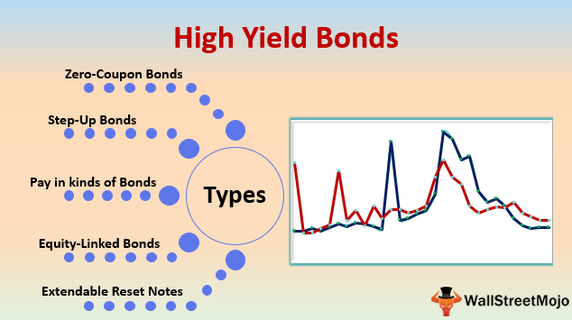

## Table of Contents

## What are TIPS and how do they work?

TIPS stands for Treasury Inflation-Protected Securities. They are special bonds issued by the U.S. government that help protect your money from inflation. Inflation is when prices for things like food and gas go up over time. TIPS adjust their value based on the Consumer Price Index, which measures inflation. This means that if inflation goes up, the value of your TIPS goes up too, so your money keeps its buying power.

When you buy TIPS, you get interest payments every six months. The interest rate is fixed, but the amount of money you get changes because it's based on the adjusted value of the TIPS. For example, if inflation goes up, the value of your TIPS increases, and so does the amount of interest you receive. At the end of the term, which can be 5, 10, or 30 years, you get back the adjusted value of your TIPS, which could be more than what you originally paid if there was inflation. TIPS are a good way to keep your savings safe from losing value due to inflation.

## What are high-yield TIPS bond funds?

High-yield TIPS bond funds are investment funds that focus on Treasury Inflation-Protected Securities (TIPS) but aim to offer higher returns than regular TIPS. These funds work by investing in a mix of TIPS and other securities that might have higher risks but also higher potential rewards. The goal is to beat inflation and provide better returns for investors.

These funds are managed by professionals who choose which TIPS and other securities to buy and sell. They try to balance the risk and reward to give investors the best possible outcome. Keep in mind that while high-yield TIPS bond funds can offer better returns, they can also be riskier than regular TIPS. So, it's important to understand the risks before investing.

## How do high-yield TIPS bond funds differ from regular TIPS?

High-yield TIPS bond funds and regular TIPS are both designed to protect your money from inflation, but they work a bit differently. Regular TIPS are individual bonds issued by the U.S. government. They adjust their value based on inflation and pay a fixed [interest rate](/wiki/interest-rate-trading-strategies). When you buy regular TIPS, you know exactly what you're getting: a safe investment that keeps up with inflation.

On the other hand, high-yield TIPS bond funds are managed by professionals who invest in a mix of TIPS and other securities. These funds aim to give you higher returns than regular TIPS by taking on more risk. While regular TIPS are pretty safe, high-yield TIPS bond funds might invest in riskier assets to try to beat inflation and earn more money for you. This means they can offer better returns, but they also come with more risk.

## What are the benefits of investing in high-yield TIPS bond funds?

Investing in high-yield TIPS bond funds can help your money grow faster than regular TIPS. These funds try to beat inflation by choosing a mix of investments that might be riskier but can offer bigger rewards. If you want your savings to keep up with, or even do better than, the rising costs of things like food and gas, high-yield TIPS bond funds could be a good choice. They aim to give you more money back than you would get from just holding regular TIPS.

Another benefit is that these funds are managed by professionals who know a lot about investing. They do the hard work of [picking](/wiki/asset-class-picking) the right mix of TIPS and other securities to try to get the best results for you. This can save you time and effort, and it might help you feel more confident about your investments. Just remember, while high-yield TIPS bond funds can offer better returns, they also come with more risk, so it's important to think about how much risk you're okay with before you invest.

## What are the risks associated with high-yield TIPS bond funds?

High-yield TIPS bond funds can be riskier than regular TIPS because they try to get higher returns by investing in riskier assets. This means there's a chance you could lose some of your money if the investments don't do well. For example, if the fund managers pick securities that don't perform as expected, the value of your investment could go down. This is different from regular TIPS, which are backed by the U.S. government and are generally seen as very safe.

Another risk is that these funds can be affected by changes in interest rates. If interest rates go up, the value of the bonds in the fund might go down, which could lower the overall value of your investment. Also, because high-yield TIPS bond funds aim for higher returns, they might not be as stable as regular TIPS. This means the value of your investment could go up and down more often, which might make you feel nervous if you don't like a lot of ups and downs in your investments.

## How can someone start investing in high-yield TIPS bond funds?

To start investing in high-yield TIPS bond funds, you'll need to open an account with a brokerage firm or an investment platform that offers these funds. You can do this online or by visiting a branch if they have one. Once your account is set up, you'll need to deposit money into it. After that, you can search for high-yield TIPS bond funds on the platform. Look at the details of each fund, like their past performance and the fees they charge, to decide which one you want to invest in. When you've made your choice, you can buy shares of the fund using the money in your account.

Before you start investing, it's a good idea to think about how much risk you're comfortable with. High-yield TIPS bond funds can offer higher returns than regular TIPS, but they also come with more risk. Make sure you understand these risks and how they might affect your money. It might also help to talk to a financial advisor who can give you advice based on your goals and how much risk you're okay with. Once you've done your research and feel ready, you can go ahead and make your investment.

## What factors should be considered when choosing a high-yield TIPS bond fund?

When choosing a high-yield TIPS bond fund, one important [factor](/wiki/factor-investing) to consider is the fund's performance history. You want to look at how the fund has done over time to see if it has been able to beat inflation and give good returns to investors. Another thing to check is the fees the fund charges. High fees can eat into your returns, so it's good to pick a fund with lower fees if possible. Also, think about the fund's risk level. High-yield funds can be riskier than regular TIPS, so make sure the fund's risk matches what you're comfortable with.

Another factor is the fund manager's experience and track record. A good manager can make a big difference in how well the fund does. Look into how long they've been managing the fund and their past performance. It's also helpful to see if the fund is diversified. A well-diversified fund will spread its investments across different types of securities, which can help lower the risk. Lastly, consider your own investment goals and how long you plan to keep your money in the fund. If you're saving for a long-term goal, you might be okay with more risk, but if you need the money soon, you might want something safer.

## How do high-yield TIPS bond funds perform in different economic conditions?

High-yield TIPS bond funds can do well in times when inflation is going up. Because these funds invest in TIPS and other securities, they can adjust to rising prices and try to give you returns that are better than just keeping up with inflation. If the economy is doing well and companies are making more money, the riskier securities in the fund might also do better, which can help the fund's overall performance.

On the other hand, these funds can have a tougher time when the economy is not doing well or when interest rates go up a lot. If the economy is struggling, the riskier investments in the fund might lose value, which can pull down the fund's returns. Also, when interest rates rise, the value of the bonds in the fund might go down, which can hurt the fund's performance. So, high-yield TIPS bond funds can be a good choice in some economic conditions, but they can also be riskier in others.

## What is the historical performance of high-yield TIPS bond funds?

High-yield TIPS bond funds have had mixed results over time. In years when inflation was high, these funds often did well because they were able to adjust to rising prices and give investors returns that beat inflation. For example, during periods of economic growth when companies were doing well, the riskier parts of these funds, like corporate bonds, could also do better, helping the overall performance of the fund. This made high-yield TIPS bond funds a good choice for people looking to grow their money faster than just keeping up with inflation.

However, these funds can struggle in tougher economic times or when interest rates go up a lot. If the economy is not doing well, the riskier investments in the fund might lose value, which can drag down the fund's returns. Also, when interest rates rise, the value of the bonds in the fund can go down, making the fund's performance worse. So, while high-yield TIPS bond funds can offer good returns in some years, they can also be riskier and have lower returns in others.

## How do taxes affect returns from high-yield TIPS bond funds?

Taxes can make a big difference in how much money you get to keep from high-yield TIPS bond funds. When you earn money from these funds, you have to pay taxes on the interest you get every year. The interest from TIPS is usually taxed as regular income, which means it can be taxed at a higher rate than other types of investment income like dividends or capital gains. This can lower the amount of money you get to keep from your investment.

Also, when you sell your shares in a high-yield TIPS bond fund, you might have to pay capital gains tax if the value of your investment went up. If you held the shares for less than a year, you'll pay short-term capital gains tax, which is the same as your regular income tax rate. If you held them for more than a year, you'll pay long-term capital gains tax, which is usually lower. So, it's important to think about taxes when you're figuring out how much money you'll really make from high-yield TIPS bond funds.

## What are some of the top high-yield TIPS bond funds available in the market?

Some of the top high-yield TIPS bond funds available in the market include the PIMCO Real Return Fund (PRRIX) and the Vanguard Inflation-Protected Securities Fund Admiral Shares (VAIPX). These funds are known for their solid performance and are managed by experienced professionals. The PIMCO Real Return Fund, for example, aims to provide returns that outpace inflation by investing in a mix of TIPS and other securities. It's managed by a team led by Mihir Worah, who has a strong track record in managing fixed income investments. On the other hand, the Vanguard Inflation-Protected Securities Fund focuses on a more conservative approach, with a lower expense ratio, making it a cost-effective choice for investors looking to protect their money from inflation.

Another notable fund is the American Century Inflation-Adjusted Bond Fund (AIANX), which also seeks to beat inflation through a diversified portfolio of TIPS and other securities. This fund is managed by a team with deep expertise in fixed income markets, aiming to provide steady returns over time. Each of these funds has its own strategy and risk level, so it's important for investors to look at their past performance, fees, and how they fit with their own investment goals before choosing one. By considering these factors, you can pick a high-yield TIPS bond fund that helps your money grow while keeping up with or beating inflation.

## How do professional investors use high-yield TIPS bond funds in their portfolios?

Professional investors often use high-yield TIPS bond funds to help protect their clients' money from inflation while trying to get better returns than regular TIPS. They might add these funds to a portfolio to balance out riskier investments like stocks. By including high-yield TIPS bond funds, they aim to keep the portfolio's value stable even when prices for things like food and gas go up. These funds can also help diversify a portfolio, which means spreading out investments to lower the overall risk. Professional investors choose funds that have a good track record and are managed by experienced people to make sure they're getting the best possible results for their clients.

When deciding how much to invest in high-yield TIPS bond funds, professional investors think about their clients' goals and how much risk they're okay with. If a client is saving for a long time and can handle more ups and downs, they might put more money into these funds. But if a client needs the money soon or wants to be safer, they might use these funds more carefully. Professional investors also keep an eye on the economy and interest rates, adjusting the amount in high-yield TIPS bond funds to take advantage of good times and protect against bad times. This way, they can help their clients' money grow while keeping it safe from inflation.

## References & Further Reading

[1]: ["Advances in Financial Machine Learning"](https://www.amazon.com/Advances-Financial-Machine-Learning-Marcos/dp/1119482089) by Marcos Lopez de Prado

[2]: ["Machine Learning for Algorithmic Trading"](https://github.com/stefan-jansen/machine-learning-for-trading) by Stefan Jansen

[3]: ["Quantitative Trading: How to Build Your Own Algorithmic Trading Business"](https://github.com/LucindaYa/quant-resources/blob/master/Quantitative%20Trading%20How%20to%20Build%20Your%20Own%20Algorithmic%20Trading%20Business.pdf) by Ernest P. Chan

[4]: ["Evidence-Based Technical Analysis: Applying the Scientific Method and Statistical Inference to Trading Signals"](https://www.amazon.com/Evidence-Based-Technical-Analysis-Scientific-Statistical/dp/0470008741) by David Aronson

[5]: Brealey, R. A., Myers, S. C., & Allen, F. (2020). ["Principles of Corporate Finance."](https://www.mheducation.com/highered/product/Principles-of-Corporate-Finance-Brealey.html) McGraw Hill.

[6]: Ilmanen, A. (2011). ["Expected Returns: An Investor's Guide to Harvesting Market Rewards."](https://onlinelibrary.wiley.com/doi/pdf/10.1002/9781118467190.fmatter) Wiley.