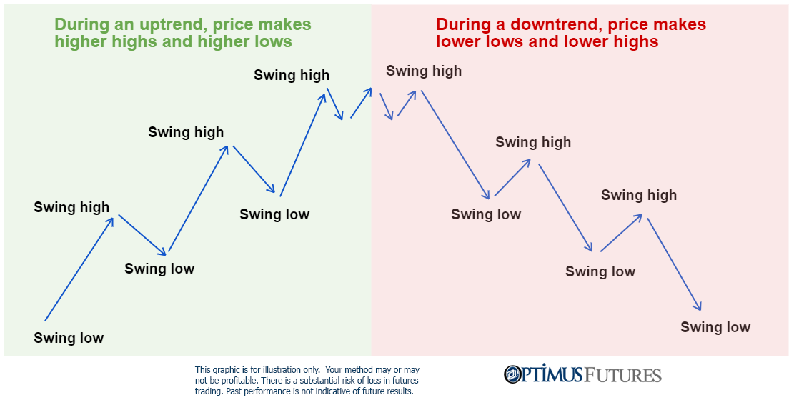

## Table of Contents

## What is the Higher Highs and Higher Lows pattern?

The Higher Highs and Higher Lows pattern is a trend that shows up on price charts in trading. It means that the price of something, like a stock or a currency, keeps going up over time. You can see this pattern when each new peak (high) is higher than the last one, and each new bottom (low) is also higher than the last one. This pattern tells traders that the price is in an uptrend, which means more people want to buy than sell.

This pattern is important because it helps traders decide when to buy or sell. If they see higher highs and higher lows, they might think the price will keep going up, so they buy. But, it's not a sure thing. Sometimes the pattern can change, and the price might start to go down. Traders need to watch the pattern carefully and use other tools to make good choices.

## How can beginners identify Higher Highs and Higher Lows on a chart?

To find Higher Highs and Higher Lows on a chart, beginners should start by looking at the peaks and valleys on the price line. A higher high is when the price reaches a new peak that is taller than the previous peak. For example, if the price went up to $10 before and now it's at $12, that's a higher high. A higher low happens when the price dips down but stays above the last low point. If the price dropped to $8 before and now it's only going down to $9, that's a higher low. By spotting these patterns, you can see if the price is trending up.

It's helpful to use a chart with clear lines or markers to make it easier to see these patterns. You can draw lines connecting the highs and the lows to see if they are going up over time. If the line connecting the highs keeps going up and the line connecting the lows also goes up, you've got a Higher Highs and Higher Lows pattern. Remember, it's good to look at several points on the chart to make sure the pattern is strong and not just a short-term change. This way, beginners can start to understand how the price is moving and make better decisions.

## Why is the Higher Highs and Higher Lows pattern significant in technical analysis?

The Higher Highs and Higher Lows pattern is important in technical analysis because it helps traders see if a price is going up over time. When you see that each new peak is higher than the last one and each new dip is also higher than the last one, it tells you that more people want to buy than sell. This pattern shows a strong uptrend, which means the price is likely to keep going up. Traders use this information to decide when to buy, hoping to make money as the price rises.

This pattern is also useful because it helps traders understand the strength of the trend. If the higher highs and higher lows keep happening, it shows that the uptrend is strong and likely to continue. But, if the pattern starts to change and the highs and lows start to get lower, it could mean the trend is weakening or about to reverse. By watching this pattern, traders can make better choices about when to buy or sell, and how to manage their risks.

## Can you explain the difference between Higher Highs and Higher Lows and Lower Highs and Lower Lows?

Higher Highs and Higher Lows show that the price of something is going up over time. When you see a new peak that is taller than the last one, that's a higher high. When the price dips down but stays above the last low point, that's a higher low. This pattern means that more people want to buy than sell, and it shows a strong uptrend. Traders use this to decide when to buy, hoping the price will keep going up.

On the other hand, Lower Highs and Lower Lows show that the price is going down over time. A lower high happens when the price reaches a new peak, but it's not as high as the last one. A lower low is when the price drops to a new bottom that's lower than the last one. This pattern means that more people want to sell than buy, showing a strong downtrend. Traders use this to decide when to sell, expecting the price to keep going down.

## What are the key psychological factors driving the formation of Higher Highs and Higher Lows?

The formation of Higher Highs and Higher Lows is driven by the psychology of hope and optimism among traders and investors. When people see the price going up, they start to believe that it will keep going up. This belief makes more people want to buy, which pushes the price even higher. Each time the price reaches a new high, it makes people feel more confident. When the price dips a little but stays higher than before, it shows that people are still willing to buy at higher prices, keeping the trend going.

On the other hand, fear and doubt can break the pattern. If traders start to worry that the price won't keep going up, they might decide to sell. This can make the price go down more than before, breaking the pattern of higher lows. But as long as the hope and optimism stay strong, the pattern of Higher Highs and Higher Lows will continue, showing that people believe in the upward trend.

## How does the Higher Highs and Higher Lows pattern relate to trend confirmation?

The Higher Highs and Higher Lows pattern is a big help for confirming a trend. When you see the price making higher highs and higher lows, it means the price is going up over time. This pattern shows that more people want to buy than sell, which makes the trend stronger. Traders use this pattern to feel sure that the price will keep going up. If the pattern keeps happening, it tells them the uptrend is real and they can trust it.

But, the pattern is not just about seeing it once. Traders need to see it happen over and over to be really sure about the trend. If the pattern stops, like if the highs and lows start to go down, it might mean the trend is changing. So, the Higher Highs and Higher Lows pattern is a key way to check if a trend is strong and likely to keep going, helping traders make better choices about buying and selling.

## What are common mistakes traders make when interpreting the Higher Highs and Higher Lows pattern?

One common mistake traders make when looking at the Higher Highs and Higher Lows pattern is jumping in too soon. They might see just one or two higher highs and higher lows and think the trend is strong. But, a real trend needs to show this pattern over and over again. If traders buy too early, they might end up losing money if the pattern doesn't keep going.

Another mistake is not paying attention to other signs on the chart. The Higher Highs and Higher Lows pattern is helpful, but it's not the only thing traders should look at. They need to use other tools and signs to make sure the trend is strong. If they only focus on this one pattern, they might miss important information that could change their trading decisions.

Lastly, some traders might ignore when the pattern starts to change. If the highs and lows start to go down, it could mean the trend is ending. But, if traders are too focused on the idea of an uptrend, they might not see these changes and keep buying even when they should be selling. It's important to always watch the pattern and be ready to change plans if it starts to break.

## How can the Higher Highs and Higher Lows pattern be used in conjunction with other technical indicators?

Traders can use the Higher Highs and Higher Lows pattern with other tools to make better choices. For example, they might use moving averages to see the trend more clearly. A moving average is a line on the chart that shows the average price over time. If the price is making higher highs and higher lows and it's also above the moving average, it's a strong sign that the trend is going up. This can help traders feel more sure about buying.

Another tool traders might use is the Relative Strength Index (RSI). The RSI tells you if a price is too high or too low compared to what it has been in the past. If the price is making higher highs and higher lows and the RSI is not too high, it can mean the trend is strong and not overdone. But, if the RSI is very high, it might mean the price is going to stop going up soon. By looking at both the Higher Highs and Higher Lows pattern and the RSI, traders can get a better idea of when to buy or sell.

## What are the limitations of relying solely on the Higher Highs and Higher Lows pattern for trading decisions?

Relying only on the Higher Highs and Higher Lows pattern can be risky because it doesn't tell the whole story. This pattern shows that the price is going up over time, but it doesn't say anything about other important things that can affect the price. For example, big news events or changes in the market can make the price go down even if the pattern looks good. If traders only look at this pattern, they might miss these important signs and make bad choices.

Also, the Higher Highs and Higher Lows pattern can be tricky because it needs to happen over and over to be a strong sign of a trend. If traders jump in too early, thinking the pattern means the price will keep going up, they might lose money if the pattern stops. It's better to use this pattern with other tools like moving averages or the RSI to get a fuller picture of what's happening with the price. This way, traders can make smarter decisions and not just rely on one thing.

## How can advanced traders use Higher Highs and Higher Lows to set more precise entry and exit points?

Advanced traders can use the Higher Highs and Higher Lows pattern to set more precise entry points by waiting for the pattern to confirm itself multiple times. Instead of jumping in after seeing just one or two higher highs and higher lows, they look for a series of these patterns to establish a strong uptrend. Once they see this consistent pattern, they might enter a trade just after the price breaks above the most recent higher high. This approach helps them get in at a point where the trend seems most likely to continue, reducing the risk of entering too early and facing a reversal.

For setting [exit](/wiki/exit-strategy) points, advanced traders can use the Higher Highs and Higher Lows pattern to identify potential signs of a trend weakening. They might start planning their exit when they see the pattern start to break, such as when a new high is not as high as the previous one or a new low dips below the last higher low. By setting their exit points near these potential reversal points, traders can lock in profits before the trend fully reverses. Using this pattern along with other technical indicators like moving averages or the RSI can help them fine-tune these exit points, making their trading strategy more effective and less risky.

## Can the Higher Highs and Higher Lows pattern be applied effectively to different time frames and asset classes?

The Higher Highs and Higher Lows pattern can be used on different time frames, like short-term charts that show price changes over minutes or hours, and long-term charts that show changes over days, weeks, or even months. On shorter time frames, traders might see this pattern more often, but it can be less reliable because prices can change quickly. On longer time frames, the pattern might be clearer and more reliable, showing a stronger trend that could last longer. No matter the time frame, traders need to look at the pattern over several points to make sure it's a real trend and not just a short-term change.

This pattern can also work well with different types of assets, like stocks, currencies, commodities, and even cryptocurrencies. Each type of asset might move differently, but the idea of looking for higher highs and higher lows to spot an uptrend stays the same. For example, stocks might show this pattern more smoothly because they are traded during set hours, while cryptocurrencies can be more volatile and show the pattern in a more choppy way. By understanding how the pattern works with different assets and time frames, traders can use it to make better choices about when to buy and sell.

## What are some real-world examples where the Higher Highs and Higher Lows pattern has accurately predicted market movements?

One real-world example of the Higher Highs and Higher Lows pattern accurately predicting market movements is the rise of Apple Inc.'s stock price from 2019 to 2021. During this period, Apple's stock consistently showed higher highs and higher lows on its monthly charts. For instance, each time the stock hit a new peak, it was higher than the previous peak, and even when it dipped, the lows were higher than before. Traders who recognized this pattern could have bought the stock early on and seen significant gains as the price continued to rise, eventually reaching new all-time highs.

Another example is the Bitcoin price surge in late 2020 and early 2021. Bitcoin's price chart during this time showed a clear pattern of higher highs and higher lows on weekly charts. Each new high was above the last, and the lows kept getting higher, indicating a strong uptrend. Traders who spotted this pattern and bought Bitcoin could have benefited from the rapid price increase, as the [cryptocurrency](/wiki/cryptocurrency) soared to new record levels. This pattern helped traders confirm the bullish trend and make profitable trading decisions.

## References & Further Reading

[1]: Bergstra, J., Bardenet, R., Bengio, Y., & Kégl, B. (2011). ["Algorithms for Hyper-Parameter Optimization."](https://papers.nips.cc/paper/4443-algorithms-for-hyper-parameter-optimization) Advances in Neural Information Processing Systems 24.

[2]: ["Advances in Financial Machine Learning"](https://books.google.com/books/about/Advances_in_Financial_Machine_Learning.html?id=oU9KDwAAQBAJ) by Marcos Lopez de Prado

[3]: ["Evidence-Based Technical Analysis: Applying the Scientific Method and Statistical Inference to Trading Signals"](https://www.amazon.com/Evidence-Based-Technical-Analysis-Scientific-Statistical/dp/0470008741) by David Aronson

[4]: ["Machine Learning for Algorithmic Trading"](https://github.com/stefan-jansen/machine-learning-for-trading) by Stefan Jansen

[5]: ["Quantitative Trading: How to Build Your Own Algorithmic Trading Business"](https://books.google.com/books/about/Quantitative_Trading.html?id=j70yEAAAQBAJ) by Ernest P. Chan