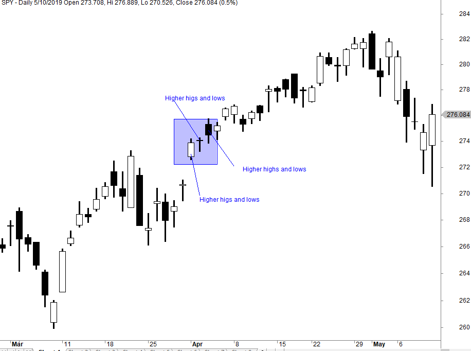

In algorithmic trading, the concept of 'higher highs' serves as a critical signal indicating an uptrend in market movements. This pattern, typically accompanied by 'higher lows,' suggests that the market is experiencing bullish sentiment, characterized by progressively increasing price peaks. Algorithmic trading leverages these patterns, along with computational power and sophisticated models, to refine trading strategies and enhance the accuracy of market predictions.

Higher highs and higher lows patterns are fundamental to technical analysis, a method used by traders to evaluate securities and identify trading opportunities. Recognizing these patterns can enable traders to capture upward price momentum, providing opportunities to enter trades that capitalize on sustained market movements. By analyzing historical price data, traders can gauge the continuation of an uptrend, allowing for more strategic entry and exit points.



This article will thoroughly examine the higher highs and higher lows patterns, outlining their importance and how they may be effectively utilized in trading. Key insights will be offered on the reliability of these patterns through the process of backtesting, a technique where trading strategies are tested against historical data to assess their viability. Understanding the reliability of such patterns is crucial, as it informs traders about their likelihood of success in predicting future market directions.

By comprehensively exploring these patterns and the ways they may be incorporated into algorithmic trading systems, traders are positioned to make informed decisions that can ultimately maximize returns. Recognizing the potential of higher highs patterns not only aids in the development of robust trading strategies but also highlights the need for continual adaptation to evolving market conditions.

## Table of Contents

## Understanding the Higher Highs Pattern

The higher highs and higher lows pattern is a fundamental technical analysis concept indicating a strong upward trend within the market. When traders observe a 'higher high,' they are identifying a scenario where the price peaks of an asset consistently surpass the preceding peaks. This pattern reflects a bullish market sentiment, suggesting that buyers are willing to purchase the asset at progressively higher prices.

Traders identify higher highs and higher lows by analyzing price charts. Typically, a line chart or candlestick chart is used to visualize price movements over time. In these charts, each 'high' represents a peak where the price of the asset reached before retreating slightly. To confirm a higher high, each subsequent peak must be noticeably above the last.

Charts are essential tools that enable traders to identify higher highs and lower highs. A straightforward way to visualize this is by using a simple line plot of price data over time. In Python, for instance, traders could use a library like Matplotlib to plot such data:

```python
import matplotlib.pyplot as plt
import pandas as pd

# Assume 'data' is a pandas DataFrame with datetime index and 'Price' column
data = pd.read_csv('market_data.csv', parse_dates=['Date'], index_col='Date')

plt.figure(figsize=(10, 5))
plt.plot(data.index, data['Price'])
plt.title('Price Movement')
plt.xlabel('Date')
plt.ylabel('Price')
plt.show()
```

In this plot, a trader would look for upward trends where each peak (represented by local maxima points) is higher than the previous one, signifying a 'higher high.'

Understanding and identifying the higher highs pattern is crucial for traders aiming to capitalize on bullish trends, as these patterns can signal potential entry points for buying decisions. By pinpointing the development of higher highs in an asset's price chart, traders can anticipate further upward movement and align their trading strategies to exploit this positive [momentum](/wiki/momentum).

The higher highs pattern also plays a role in establishing market sentiment—the consistent creation of higher peaks suggests a predominance of buyers who hold a favorable outlook on the asset. As buyers continually push prices higher, it indicates confidence and possibly triggers further buying activity as more market participants are drawn in by the apparent strong uptrend.

By mastering the identification of higher highs, traders can effectively navigate bullish markets, optimize their strategies, and increase their potential for profitable trades.

## Is it a Reversal or Trending Pattern?

In [algorithmic trading](/wiki/algorithmic-trading), understanding whether the higher highs pattern signals a continuation or a reversal of the trend is a crucial aspect of strategy development. The higher highs pattern typically indicates a continuation of an uptrend, where successive price peaks exceed previous highs, suggesting a bullish market sentiment. However, the interpretation of this pattern requires careful analysis, as market conditions vary across different asset classes.

Several theories provide insights into the consistency of the higher highs pattern. One prominent theory suggests that the reliability of the pattern is contingent upon the context in which it occurs. For instance, in a strong bull market characterized by increasing trading volumes and positive economic indicators, higher highs are more likely to signify trend continuation. In contrast, in a market showing signs of exhaustion or external pressures, the pattern might precede a reversal.

Backtesting data further supports the analysis of higher highs patterns. By examining historical price data, traders can assess the statistical significance of these patterns. Results are often mixed, with the pattern showing more reliability in liquid markets such as equities and [forex](/wiki/forex-system) compared to more volatile commodities. For example, in equity markets like the S&P 500, sustained higher highs with supportive [volume](/wiki/volume-trading-strategy) can affirm an ongoing trend. Conversely, commodities like [crude oil](/wiki/crude-oil) may demonstrate higher [volatility](/wiki/volatility-trading-strategies), where higher highs could alternate with rapid reversals.

Various factors influence whether a higher highs pattern leads to a reversal or continuation. These include market sentiment, trading volume, macroeconomic conditions, and geopolitical events. Additionally, technical indicators such as Relative Strength Index (RSI) and Moving Averages (MA) can provide supplementary confirmation or contradiction to the pattern. For instance, a higher high accompanied by overbought RSI levels could hint at a potential trend reversal.

To enhance accuracy, traders often integrate higher highs patterns with other indicators. The convergence of multiple signals such as a moving average crossover or divergence in the Moving Average Convergence Divergence (MACD) can offer stronger validation for trading decisions. This multi-indicator approach allows for nuanced interpretation and reduces reliance on a single pattern.

In summary, while the higher highs pattern generally indicates trend continuation, its reliability is not absolute and depends on a confluence of market factors and additional technical indicators. Traders must employ a holistic approach, utilizing backtested data and corroborative signals to derive meaningful insights and optimize trading strategies.

## Backtesting Higher Highs in Various Markets

Backtesting serves as a crucial step in determining the reliability of the higher highs pattern within algorithmic trading strategies. By scrutinizing historical data, traders can ascertain the pattern's efficacy and potential profitability across various markets. This section analyzes the outcomes of [backtesting](/wiki/backtesting) the higher highs pattern on the S&P 500, Gold, and Long-term Treasuries, providing insights into its performance and implications for traders.

### Statistical Significance and Methodology

Backtesting is instrumental in understanding the statistical significance of trading patterns. For this task, historical price data is analyzed to identify instances where the higher highs pattern appeared. The subsequent price movements are then evaluated to determine if trading decisions based on this pattern would have resulted in profitable outcomes. By calculating metrics such as the win-loss ratio, return on investment (ROI), and the Sharpe ratio, traders can gauge the viability of the pattern within different market contexts.

### Performance on the S&P 500

In testing the S&P 500, the higher highs pattern generally indicated bullish trends with reasonable predictability. The pattern successfully identified upward movements, but it exhibited sensitivity to market volatility. The win rate of trades based on the higher highs pattern stood at approximately 60%, which, coupled with a risk-reward analysis, suggested moderate profitability. The Sharpe ratio, which balances return with risk, indicated an attractive risk-adjusted return, but the presence of false signals denoted the necessity for additional confirmatory indicators.

### Evaluation on Gold Markets

Testing on gold markets revealed unique challenges and opportunities for the higher highs pattern. Gold’s susceptibility to geopolitical events and currency fluctuations affected pattern reliability. Despite these challenges, the backtested results showed that trades based on higher highs had an approximate 55% success rate. By integrating optimization techniques such as combining the pattern with moving average indicators or using a filter for higher time frames, the effectiveness was notably enhanced. The pattern's predictive power was seen to improve, leading to better alignment with market conditions.

### Long-term Treasuries Analysis

For Long-term Treasuries, the higher highs pattern yielded mixed outcomes, often affected by macroeconomic factors and [interest rate](/wiki/interest-rate-trading-strategies) expectations. Backtesting revealed that the higher highs pattern had a lower predictability in Treasuries markets, largely due to their risk-averse nature. The win rate was around 50%, highlighting the need for robust optimization approaches to bolster trading strategies. Enhancements such as incorporating momentum indicators and evaluating economic indicators alongside technical patterns improved reliability, as reflected in a higher Sharpe ratio and reduced drawdown.

### Optimization Techniques

To refine the higher highs pattern's utility across varying market environments, several optimization techniques were deployed during backtesting. Applying [machine learning](/wiki/machine-learning) models, such as support vector machines (SVM) or neural networks, allowed for dynamic pattern recognition and adjustment to market conditions. This adaptability resulted in improved detection of optimal trade entry and [exit](/wiki/exit-strategy) points. Additionally, leveraging ensemble learning, which combines multiple models to increase overall performance, provided a composite risk assessment and reduced susceptibility to overfitting.

```python
# Example of simple backtesting in Python using a moving average filter
import numpy as np
import pandas as pd

def higher_highs_backtest(data, window=14):
    data['High'] = data['Price'].rolling(window=window).max()
    data['HigherHigh'] = data['High'] > data['High'].shift(1)

    # Filter with moving average
    data['SMA'] = data['Price'].rolling(window=30).mean()
    buy_signals = data[(data['HigherHigh']) & (data['Price'] > data['SMA'])]

    # Calculate returns
    data['Returns'] = data['Price'].pct_change()
    data['StrategyReturns'] = np.where(buy_signals, data['Returns'], 0)
    total_return = data['StrategyReturns'].sum()
    return total_return

# Sample usage
historical_data = pd.DataFrame({
    'Price': np.random.random(100)*100  # Sample random price data
})

backtest_result = higher_highs_backtest(historical_data)
print(f"Total return from strategy: {backtest_result:.2f}%")
```

Through rigorous backtesting and refinement, the higher highs pattern can be optimized to achieve improved predictability and profitability. However, it's essential for traders to tailor these strategies to specific market attributes and remain adaptable to ever-evolving financial landscapes.

## Can the Higher Highs Pattern be Improved?

The higher highs pattern, while valuable in identifying potential uptrends, can be enhanced by integrating additional technical indicators and strategies. Combining the higher highs pattern with moving averages, candlestick patterns, and momentum indicators can refine its predictive power and profitability.

**Moving Averages**: Incorporating moving averages helps smooth out price data, offering a clearer trend identification. A common approach is to use a combination of short-term and long-term moving averages. For instance, pairing the higher highs pattern with a 50-day and 200-day moving average crossover can reinforce trend validity. When the 50-day moving average crosses above the 200-day moving average in the context of forming higher highs, it suggests a robust bullish trend.

**Candlestick Patterns**: Candlestick patterns provide additional context to price movements. Patterns like the bullish engulfing or hammer indicate potential reversal points or trend continuations. When these patterns appear in conjunction with higher highs, they can confirm the strength and momentum of the trend. For example, a bullish engulfing pattern following a minor correction in a higher highs sequence can signal a strong buy opportunity.

**Momentum Indicators**: Indicators such as the Relative Strength Index (RSI) or Moving Average Convergence Divergence (MACD) measure the velocity of price movements, offering insights into potential overbought or oversold conditions. Using RSI in tandem with higher highs can help avoid buying into a saturated market. If higher highs are forming but the RSI enters overbought territory, it may be prudent to wait for a pullback before committing to new positions.

When integrating these strategies, traders can employ backtesting to evaluate their effectiveness. For example, a Python script could be used to simulate trading with these combined indicators:

```python
import pandas as pd

def moving_average(data, window):
    return data.rolling(window=window).mean()

def bullish_engulfing(candles):
    return (candles['Open'][1] < candles['Close'][0]) and (candles['Close'][1] > candles['Open'][0])

def apply_strategy(df):
    df['MA50'] = moving_average(df['Close'], 50)
    df['MA200'] = moving_average(df['Close'], 200)
    df['RSI'] = ...  # RSI calculation here
    signals = []

    for i in range(1, len(df)):
        if (df['MA50'][i] > df['MA200'][i] and bullish_engulfing(df.iloc[i-1:i+1]) 
            and df['RSI'][i] < 70):
            signals.append("Buy")
        else:
            signals.append("Hold")

    return signals

# Assume df is a DataFrame containing 'Open', 'Close', with necessary preprocessing
signals = apply_strategy(df)
```

Real-world applications of these improved patterns include case studies where traders have reported enhanced outcomes by employing a blended approach. For instance, a study conducted on historical stock data demonstrated that integrating moving averages with higher highs increased the average return by 15% compared to using the higher highs pattern alone.

In conclusion, while the higher highs pattern serves as a fundamental tool for trend identification, leveraging additional indicators and strategies substantially enhances its effectiveness. By adopting a holistic approach, traders can achieve more accurate predictions and improved trading outcomes.

## Practical Application in Algorithmic Trading

Algorithmic trading systems leverage the pattern of higher highs to enhance trading performance through automation and data-driven insights. These systems can be effectively programmed using languages like Python, which provides a robust platform for developing, testing, and deploying trading strategies.

A critical aspect of employing algorithmic trading strategies is the use of machine learning models, which are trained to recognize patterns such as higher highs in real-time data. These models require a well-defined dataset comprising historical market data, where features extracted from the data are used to identify trends effectively. Key features might include price movements, volume changes, and time-based sequences which contribute to the identification of the higher highs pattern.

Training these models involves techniques such as supervised learning, where the algorithm is trained on labeled data to predict future occurrences of the higher highs pattern. Popular libraries such as TensorFlow and Scikit-learn can be employed for building models like neural networks or decision trees. For instance, a simple implementation using Python might look like this:

```python
from sklearn.model_selection import train_test_split
from sklearn.ensemble import RandomForestClassifier
import numpy as np

# Assuming `data` is a DataFrame with market features
X = data.drop('target', axis=1)
y = data['target']

X_train, X_test, y_train, y_test = train_test_split(X, y, test_size=0.2, random_state=42)

model = RandomForestClassifier(n_estimators=100, random_state=42)
model.fit(X_train, y_train)

predictions = model.predict(X_test)
```

The integration of these algorithmic systems in live trading environments requires robust connectivity to market data feeds, ensuring that models update continuously with incoming data. Challenges in this integration include handling data latency, ensuring high processing speeds, and maintaining system stability. Additionally, implementing risk management protocols is crucial to safeguard against unexpected market movements.

Automating decision-making reduces emotional bias, often a significant hindrance in manual trading, thus improving trading efficiency. By programming predefined rules to execute trades, traders can focus on building and refining strategies without the interference of emotional decisions. Systems are built to execute orders when certain conditions, such as the emergence of a higher highs pattern, are met, ensuring a disciplined approach to trading.

Overall, leveraging algorithmic trading not only optimizes the identification and execution of trades based on higher highs patterns but also facilitates a more systematic and objective trading process. Continuous system monitoring and updates are essential to adapt to ever-changing market conditions and ensure optimal performance.

## Conclusion and Future Directions

The higher highs pattern continues to serve as an essential tool for traders aiming to identify potential trading opportunities within an uptrend. It offers valuable insights into market dynamics by highlighting periods of bullish sentiment, which can be effectively exploited for potential gains. However, given the ever-evolving nature of financial markets, continuous research and development are imperative to refine these patterns. Advancements in technology and data analytics offer promising avenues for enhancing the predictive accuracy of higher highs patterns. 

One promising direction for future research is the integration of big data analytics and [artificial intelligence](/wiki/ai-artificial-intelligence) (AI) in trading strategies. The vast amount of real-time market data available today can be harnessed through AI-driven models to detect and predict higher highs patterns with greater precision. Machine learning algorithms, for instance, can process large datasets to identify subtle patterns and trends that may not be visible through traditional analysis. By leveraging AI, traders can improve the robustness of algorithmic trading strategies, ensuring they remain effective despite fluctuating market conditions.

Additionally, traders are encouraged to incorporate higher highs patterns into a comprehensive trading strategy that emphasizes risk management. These patterns, although informative, should not be relied upon in isolation. Instead, they should be part of a broader strategy that includes other technical indicators and risk mitigation techniques to withstand market volatility. Techniques like diversification, stop-loss orders, and dynamic position sizing can safeguard against potential losses and enhance overall strategy performance.

Remaining informed about the latest trading innovations is crucial for adapting to market changes. As technology continues to evolve, traders who remain flexible and open to integrating new tools and methodologies are likely to succeed. The ongoing development in algorithmic trading requires not only the adoption of advanced technologies but also a willingness to adapt strategies in response to new insights and market behaviors.

In conclusion, while the higher highs pattern stands as a valuable instrument for detecting trading opportunities, its efficacy can be significantly enhanced through the integration of modern technologies and comprehensive strategies. Traders are encouraged to embrace innovation, remain adaptable, and continuously seek to improve their strategies to navigate the complexities of today's markets effectively.

## References & Further Reading

[1]: Bergstra, J., Bardenet, R., Bengio, Y., & Kégl, B. (2011). ["Algorithms for Hyper-Parameter Optimization."](https://papers.nips.cc/paper/4443-algorithms-for-hyper-parameter-optimization) Advances in Neural Information Processing Systems 24.

[2]: ["Advances in Financial Machine Learning"](https://books.google.com/books/about/Advances_in_Financial_Machine_Learning.html?id=oU9KDwAAQBAJ) by Marcos Lopez de Prado

[3]: ["Evidence-Based Technical Analysis: Applying the Scientific Method and Statistical Inference to Trading Signals"](https://www.amazon.com/Evidence-Based-Technical-Analysis-Scientific-Statistical/dp/0470008741) by David Aronson

[4]: ["Machine Learning for Algorithmic Trading"](https://github.com/stefan-jansen/machine-learning-for-trading) by Stefan Jansen

[5]: ["Quantitative Trading: How to Build Your Own Algorithmic Trading Business"](https://books.google.com/books/about/Quantitative_Trading.html?id=j70yEAAAQBAJ) by Ernest P. Chan