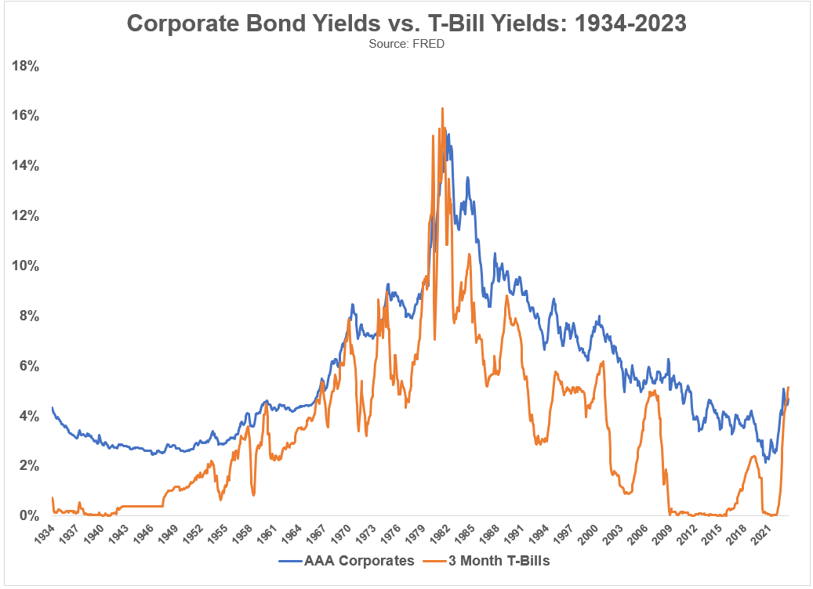

## Table of Contents

## What are commercial bills?

Commercial bills are a type of short-term financial instrument used by businesses to manage their cash flow. They are essentially promissory notes issued by a company to its suppliers or creditors, promising to pay a certain amount of money on a specific date. This helps businesses to delay payment for goods or services they have received, allowing them to use their cash for other purposes in the meantime.

These bills can also be traded in the financial market. If a supplier needs cash immediately, they can sell the bill to a bank or another investor at a discount. The buyer of the bill will then receive the full amount when the bill matures. This makes commercial bills a useful tool for both the issuing company and the holder of the bill, as it provides flexibility and liquidity in managing finances.

## What are Treasury bills (T-Bills)?

Treasury bills, or T-Bills, are short-term loans to the government. When you buy a T-Bill, you are lending money to the government for a short time, usually from a few weeks to a year. In return, the government promises to pay you back the full amount you lent, plus a little extra as interest. This interest is called the discount, because T-Bills are sold for less than their face value.

People like T-Bills because they are very safe. Since they are backed by the government, the chance of not getting your money back is very low. T-Bills are also easy to buy and sell, making them a good choice for people who want to keep their money safe but still earn a bit of interest. They are a popular choice for investors looking for a secure place to park their money for a short time.

## How do commercial bills differ from T-Bills?

Commercial bills and T-Bills are both short-term financial instruments, but they are used for different purposes. Commercial bills are issued by businesses to manage their cash flow. When a company buys goods or services, it can issue a commercial bill to the supplier, promising to pay later. This helps the company keep its money longer. Commercial bills can also be sold to banks or investors before they are due, which gives the seller quick cash but at a lower price than the bill's full value.

On the other hand, T-Bills are issued by the government to borrow money for a short time, usually less than a year. When you buy a T-Bill, you're lending money to the government, and they promise to pay you back with a little extra interest. T-Bills are very safe because they are backed by the government, so there's almost no chance of losing your money. People often use T-Bills to keep their money safe while earning a bit of interest.

In summary, commercial bills help businesses manage their payments and cash flow, while T-Bills are a way for the government to borrow money. Both can be bought and sold, but they serve different needs and have different levels of safety.

## What factors contribute to the higher yields of commercial bills?

Commercial bills often have higher yields than T-Bills because they come with more risk. When a business issues a commercial bill, it's promising to pay back the money it borrowed. But businesses can sometimes struggle to pay back their debts, especially if they run into financial trouble. This risk means that investors want a higher return for lending money to a business instead of the government. So, commercial bills offer higher interest rates to attract investors.

Another reason for higher yields is that commercial bills are less liquid than T-Bills. Liquidity means how easily you can buy or sell something. T-Bills are very easy to buy and sell because they are backed by the government and many people trust them. Commercial bills, on the other hand, might be harder to sell quickly, especially if the business issuing them is not well-known or is facing financial issues. Because of this, investors need a higher yield to make up for the risk of not being able to sell the bill easily.

## Can you explain the risk-return tradeoff between commercial bills and T-Bills?

The risk-return tradeoff between commercial bills and T-Bills is all about balancing the chance of making more money with the chance of losing money. Commercial bills usually offer higher returns, or interest rates, than T-Bills. This is because they come with more risk. When you buy a commercial bill, you're lending money to a business. Businesses can sometimes struggle to pay back their debts, which means there's a bigger chance you might not get your money back. So, to make it worth the risk, businesses have to offer higher interest rates to attract investors.

On the other hand, T-Bills are much safer. They are loans to the government, and the government is very unlikely to default on its debts. Because T-Bills are so safe, they don't need to offer high interest rates to attract investors. People are happy to lend money to the government at lower rates because they know their money is almost guaranteed to come back. So, if you want to keep your money safe, you might choose T-Bills, but if you're willing to take on more risk for a chance at higher returns, you might go for commercial bills.

## How does the credit rating of issuers affect the yield of commercial bills?

The credit rating of the issuer is very important for the yield of commercial bills. A credit rating is like a report card that tells investors how likely a business is to pay back its debts. If a business has a high credit rating, it means people trust that the business will pay back the money it borrows. Because of this trust, the business doesn't have to offer a high interest rate to get people to buy its commercial bills. So, the yield, or the interest rate, on these bills will be lower.

On the other hand, if a business has a low credit rating, it means there's a bigger chance it might not be able to pay back its debts. This makes investors nervous, so the business has to offer a higher interest rate to convince people to buy its commercial bills. This means the yield on these bills will be higher. In simple terms, the riskier the business, the higher the yield it has to offer to attract investors.

## What role does the maturity period play in the yield differences between commercial bills and T-Bills?

The maturity period, which is how long you have to wait before getting your money back, plays a big role in the yield differences between commercial bills and T-Bills. Usually, the longer you have to wait, the higher the yield you get. This is because the longer you lend your money, the more risk there is that something might go wrong and you might not get your money back. So, both commercial bills and T-Bills with longer maturity periods often offer higher yields to make up for this extra risk.

For commercial bills, the maturity period can vary a lot, and this can affect their yields. If a business issues a commercial bill that takes longer to mature, it might have to offer a higher yield to attract investors because of the added risk. T-Bills, on the other hand, usually have shorter maturity periods, often no more than a year. Even though T-Bills are safer, if they have a longer maturity, their yields might be a bit higher than those with shorter maturities. But overall, T-Bills still have lower yields than commercial bills because they are backed by the government and considered very safe.

## How do market conditions influence the yields of commercial bills compared to T-Bills?

Market conditions can really change the yields of commercial bills and T-Bills. When the economy is doing well, businesses might be more confident and willing to borrow money. This can make commercial bills more popular, but if too many businesses want to borrow, they might have to offer higher yields to attract investors. On the other hand, if the economy is struggling, businesses might be scared to borrow, so fewer commercial bills are issued. This can make their yields go up because investors want more reward for taking on risk in tough times.

T-Bills are different because they are backed by the government, which makes them safer. When the economy is shaky, people might want to move their money into safe investments like T-Bills, which can make their yields go down because the government doesn't have to offer much to attract investors. But if the economy is doing great, people might look for better returns elsewhere, so T-Bills might need to offer slightly higher yields to stay competitive. Overall, market conditions affect commercial bills more because they are riskier, while T-Bills stay more stable because of their safety.

## What are the tax implications of investing in commercial bills versus T-Bills?

When you invest in commercial bills, the interest you earn is usually taxable. This means you have to pay taxes on the money you make from the bills. The tax rate depends on your income and the tax laws where you live. If you sell the commercial bill before it matures and make a profit, you might also have to pay capital gains tax. This can make the actual return you get from commercial bills lower than the yield they offer because you have to give some of your earnings to the government.

On the other hand, the interest from T-Bills is often exempt from state and local taxes, but you still have to pay federal taxes on it. This can make T-Bills a bit more attractive if you live in a place with high state and local taxes. Just like with commercial bills, if you sell T-Bills before they mature and make a profit, you might have to pay capital gains tax. But because T-Bills are safer and often have lower yields, the tax impact might not be as big as with commercial bills.

## How can investors assess the liquidity of commercial bills in comparison to T-Bills?

Investors can assess the liquidity of commercial bills compared to T-Bills by looking at how easy it is to buy and sell them. T-Bills are very liquid because they are backed by the government, which means lots of people trust them and want to buy them. This makes it easy to sell T-Bills quickly if you need your money back. On the other hand, commercial bills can be less liquid. They are issued by businesses, and if the business is not well-known or is having financial trouble, it might be harder to find someone to buy the bill from you. So, you might have to wait longer or accept a lower price to sell a commercial bill.

Another way to assess liquidity is by looking at the market where these bills are traded. T-Bills are traded in a very active market with lots of buyers and sellers, which makes them easy to trade. Commercial bills might not have such a big market, especially if they are from smaller or less-known companies. This means there might be fewer people interested in buying them, which can make them less liquid. Overall, T-Bills are usually much more liquid than commercial bills, which is something investors need to think about when deciding where to put their money.

## What are the historical yield trends of commercial bills versus T-Bills, and what do they indicate?

Historically, commercial bills have usually offered higher yields than T-Bills. This is because commercial bills are riskier since they are issued by businesses that might struggle to pay back their debts. During good economic times, the yield difference between commercial bills and T-Bills might be smaller because businesses are doing well and investors feel more confident. But when the economy is not doing so well, the yield difference can grow bigger because investors want more reward for taking on the risk of lending to businesses that might be in trouble.

Looking at past data, you can see that the yields on both commercial bills and T-Bills go up and down based on what's happening in the economy and the interest rates set by the central bank. For example, if the central bank raises interest rates, the yields on both types of bills might go up. But commercial bills usually go up more because they are riskier. These trends show that investors need to think about the economy and how much risk they are willing to take when choosing between commercial bills and T-Bills.

## How do advanced financial models predict the yield spread between commercial bills and T-Bills?

Advanced financial models use lots of data and math to predict the yield spread between commercial bills and T-Bills. They look at things like the health of the economy, how likely businesses are to pay back their debts, and what the central bank is doing with interest rates. These models also think about how much risk investors are willing to take and how easy it is to buy and sell these bills. By putting all this information together, the models can guess how much higher the yield on commercial bills will be compared to T-Bills.

These predictions help investors make smart choices about where to put their money. If the models say the yield spread will get bigger, it might be a good time to invest in commercial bills because they will offer higher returns. But if the spread is expected to shrink, T-Bills might be a safer bet. The models are not perfect, but they give investors a good idea of what might happen based on what's going on in the economy and the financial markets.

## What is the understanding of T-Bills?

Treasury Bills, commonly known as T-bills, are short-term debt securities issued by a government to finance its short-term financial requirements. They are typically issued with maturities ranging from a few days to one year. T-bills are considered one of the safest investment avenues as they are backed by the government's full faith and credit. 

### Characteristics of Treasury Bills
T-bills do not pay interest in the conventional sense. Instead, they are issued at a discount to their face value, and investors receive the face value at maturity. The profit for the investor is the difference between the purchase price and the amount received at maturity. This structure is known as a discount yield and can be calculated using the formula:

$$
\text{Discount Yield} = \frac{(\text{Face Value} - \text{Purchase Price})}{\text{Face Value}} \times \frac{360}{\text{Days to Maturity}}
$$

This implies that T-bills are zero-coupon securities, and the return is derived from the appreciation of the security's price over time rather than periodic interest payments.

### Issuance and Role in Government Financing
T-bills are issued through a competitive bidding process at government auctions. Investors can submit non-competitive bids, where they agree to accept the yield determined at auction, or competitive bids, where they specify the yield they are willing to accept. The issuing process ensures that the government can secure funds efficiently without paying excessive interest rates. T-bills serve an essential role in government financing by providing a mechanism to manage short-term [liquidity](/wiki/liquidity-risk-premium) needs and to refinance existing debts. They also function as a tool for implementing monetary policies.

### Benefits of Treasury Bills
One of the primary advantages of investing in T-bills is their low-risk profile. Being government-backed, they [carry](/wiki/carry-trading) minimal default risk, making them an attractive option for risk-averse investors. Additionally, T-bills often come with tax advantages; for instance, interest income from T-bills is generally exempt from state and local income taxes, although it is subject to federal taxes. This can enhance the net yield for certain investors compared to other taxable investment vehicles.

### Challenges of T-Bill Investment
Despite their safety and liquidity, T-bills present certain challenges, primarily their low yield. Since they are considered low-risk, the return on T-bills is usually lower than that of corporate bonds or equities. This low yield can pose an opportunity cost, especially in times of low-interest rates when inflation may erode real returns. Furthermore, T-bills may not provide significant income for investors seeking substantial quarterly or annual returns. 

Overall, Treasury Bills are a critical component of the financial market, providing both a safe haven for conservative investors and a crucial financing tool for governments. However, investors need to weigh the benefits of safety against the trade-off of potentially lower returns.

## What are the key aspects of exploring commercial bills?

Commercial bills, often referred to as bills of exchange, are short-term financial instruments used primarily in corporate finance. These bills are typically issued by a company to raise funds, serving as a promise to pay a specific sum to the bearer at a future date. They are crucial for managing corporate cash flow and financing trade-related transactions. The key characteristic of commercial bills is their high negotiability, enabling them to be easily bought and sold in the secondary market.

When comparing commercial bills to Treasury Bills (T-bills), one of the primary considerations is credit risk. T-bills are government-backed securities, which implies a near-zero default risk, given the implicit backing by the issuing country's government. In contrast, commercial bills carry a higher credit risk as they rely on the issuing company's financial health and creditworthiness. The credit ratings assigned by agencies such as Moody's, S&P Global, and Fitch Ratings play a significant role in determining this risk level.

The higher yields associated with commercial bills can be attributed to their increased credit risk relative to T-bills. Investors demand a premium for assuming this additional risk, resulting in higher interest rates or yields. The yield of a commercial bill can generally be expressed using the formula:

$$
\text{Yield} = \frac{\text{Face Value} - \text{Purchase Price}}{\text{Purchase Price}} \times \frac{360}{\text{Days to Maturity}}
$$

This formula illustrates that yields are influenced by the purchase price, the face value, and the time to maturity, incentivizing investors despite the higher credit risk involved.

The creditworthiness of the issuer significantly impacts the yield of commercial bills. A company with a high credit rating can issue bills at lower yields as the perceived risk by investors is less. Conversely, companies with lower credit ratings or those in financially distressed industries might offer bills with higher yields to attract cautious investors. Consequently, the economic environment and the issuing company's financial forecasts are critical in shaping investors' perceptions and decisions regarding commercial bills. 

In sum, commercial bills serve vital roles in corporate finance by facilitating liquidity and short-term funding. The comparison with T-bills highlights the delicate balance investors must maintain between risk and return, with creditworthiness playing a pivotal role in the pricing of these instruments.

## References & Further Reading

[1]: Lo, A. W., Mamaysky, H., & Wang, J. (2000). ["Foundations of Technical Analysis: Computational Algorithms, Statistical Inference, and Empirical Implementation."](https://www.cis.upenn.edu/~mkearns/teaching/cis700/lo.pdf) The Review of Financial Studies, 14(2), 275-301.

[2]: Aldridge, I. (2013). ["High-Frequency Trading: A Practical Guide to Algorithmic Strategies and Trading Systems"](https://www.amazon.com/High-Frequency-Trading-Practical-Algorithmic-Strategies/dp/1118343506). Wiley Finance.

[3]: [U.S. Department of the Treasury.](https://home.treasury.gov/) "Treasury Securities & Programs," detailing the role and function of Treasury bills.

[4]: Chlistalla, M. (2011). ["High-frequency trading: Better than its reputation?"](https://c.mql5.com/forextsd/forum/168/high-frequency_trading_-_better_than_its_reputation.pdf) Deutsche Bank Research.

[5]: Malkiel, B. G., & Fama, E. F. (1970). ["Efficient Capital Markets: A Review of Theory and Empirical Work."](https://www.jstor.org/stable/2325486) The Journal of Finance, 25(2), 383-417.

[6]: Taleb, N. N. (2007). ["The Black Swan: The Impact of the Highly Improbable"](https://archive.org/details/10.1.1.695.4305) Random House. 

[7]: Jorion, P. (2007). ["Value at Risk: The New Benchmark for Managing Financial Risk"](https://link.springer.com/article/10.1007/s11408-007-0057-3) McGraw-Hill.