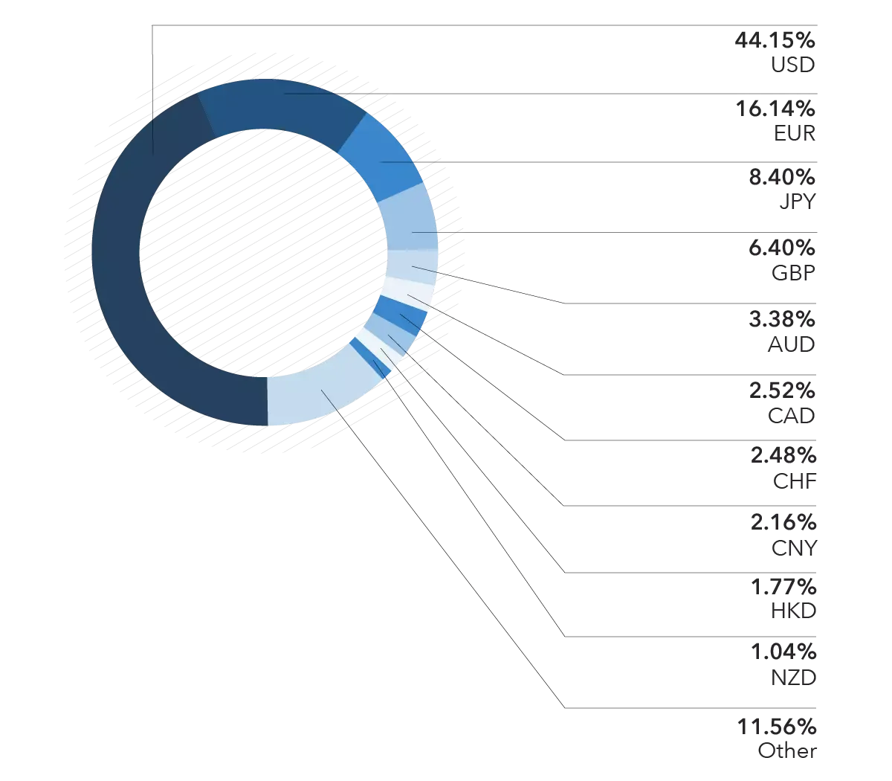

## Table of Contents

## What is a tradable currency?

A tradable currency is money that people can exchange for other currencies or goods. It is used in buying and selling things across different countries. For example, if you want to buy something from another country, you might need to trade your country's currency for the currency of the country where the item is from.

Most countries have their own tradable currency, like the US dollar, the Euro, or the Japanese yen. These currencies can be traded on something called the foreign exchange market, where people and businesses buy and sell different currencies. The value of a tradable currency can go up or down based on things like how well the country's economy is doing or what is happening in the world.

## Why are some currencies considered more tradable than others?

Some currencies are considered more tradable than others because they are used a lot in international trade and are easy to buy and sell. For example, the US dollar, the Euro, and the Japanese yen are used all over the world. Many countries use these currencies to buy and sell things with other countries. Because they are used so much, it's easy to find someone who wants to trade them. This makes them very liquid, which means they can be quickly turned into other currencies or goods without losing much value.

Another reason some currencies are more tradable is because the countries that use them have strong and stable economies. When a country's economy is doing well, people trust its currency more. They believe that the currency will keep its value over time. This trust makes people more willing to use the currency in trades. On the other hand, if a country's economy is not doing well, people might not want to use its currency because they are worried it might lose value. So, currencies from countries with strong economies, like the US or Germany, are more tradable than those from countries with weaker economies.

## What are the most commonly traded currencies in the world?

The most commonly traded currencies in the world are the US dollar, the Euro, and the Japanese yen. The US dollar is used a lot because many countries use it to buy and sell things with other countries. It's also the main currency used in international trade. The Euro is used by many countries in Europe, and it's easy to trade because it's used by a big group of countries. The Japanese yen is also very popular because Japan has a strong economy and a lot of trade with other countries.

Other currencies that are often traded include the British pound, the Swiss franc, the Canadian dollar, and the Australian dollar. The British pound is used a lot because the UK has a big economy and a lot of trade with other countries. The Swiss franc is popular because Switzerland has a very stable economy, and people trust its currency. The Canadian and Australian dollars are also traded a lot because both countries have strong economies and a lot of trade with other countries.

These currencies are the most commonly traded because they are used a lot in international trade and are easy to buy and sell. They come from countries with strong and stable economies, which makes people trust them more. When people trust a currency, they are more willing to use it in trades, which makes it more tradable.

## How does liquidity affect the tradability of a currency?

Liquidity is how easily a currency can be bought or sold without changing its price too much. When a currency is very liquid, it means a lot of people want to trade it. This makes it easier to find someone who wants to trade that currency, so you can buy or sell it quickly. The US dollar, the Euro, and the Japanese yen are very liquid because they are used a lot in international trade. This makes them very tradable.

If a currency is not very liquid, it can be hard to find someone who wants to trade it. This can make it take longer to buy or sell the currency, and the price might change a lot while you are trying to trade it. Currencies from smaller countries or countries with weaker economies might not be as liquid. This makes them less tradable because people might not want to use them if they are worried about not being able to trade them easily later.

## What role does the forex market play in currency trading?

The [forex](/wiki/forex-system) market, or foreign exchange market, is where people and businesses trade different currencies. It's like a big marketplace where you can swap one country's money for another country's money. The forex market is open all the time, except on weekends, and it's used by banks, big companies, and even regular people to buy and sell currencies. This market helps make sure that you can always trade one currency for another, no matter where you are in the world.

The forex market is really important because it helps set the price of currencies. When a lot of people want to buy a certain currency, its price goes up. If a lot of people want to sell it, the price goes down. This is how the value of currencies changes all the time. The forex market also helps countries trade with each other by making it easy to use different currencies. Without the forex market, it would be hard for countries to buy and sell things with each other because they wouldn't be able to easily change their money into the money of the country they are trading with.

## How do geopolitical factors influence currency tradability?

Geopolitical factors, like what's happening between countries, can change how easy it is to trade a country's currency. If there's a lot of fighting or tension between countries, people might not want to use the currency from those countries. They might think it's risky because the value of the currency could go down if the situation gets worse. For example, if there's a war or big political problems, people might not want to trade the currency from the country involved because they're worried about what might happen.

On the other hand, if a country is doing well and getting along with other countries, people might feel more safe using its currency. They might think the currency will stay strong and be easy to trade. For example, if a country signs a big trade deal with another country, people might want to use its currency more because it shows that the country is doing well and is trusted by other countries. So, what's happening in the world can make people more or less willing to trade a country's currency.

## What are the key economic indicators that affect currency values?

Economic indicators are like signs that show how well a country's economy is doing. Some of the most important ones that affect currency values are interest rates, inflation rates, and gross domestic product (GDP). Interest rates are what banks charge for loans. If a country's interest rates go up, people might want to buy more of its currency because they can earn more money from it. Inflation rates show how fast prices are going up. If inflation is high, it can make a currency less valuable because people need more of it to buy the same things. GDP is how much a country makes in total. If GDP is growing, it usually means the economy is doing well, which can make the currency more valuable.

Another important indicator is unemployment rates. If a lot of people are out of work, it can make the economy weaker, which can make the currency less valuable. Trade balance is also important. It shows if a country is selling more things to other countries than it's buying from them. If a country has a trade surplus, it can make its currency more valuable because other countries need to buy its currency to pay for its goods. On the other hand, if a country has a trade deficit, it can make its currency less valuable because it's buying more from other countries than it's selling to them. All these indicators help people decide if they want to buy or sell a country's currency.

## How can traders assess the volatility of a currency?

Traders can assess the [volatility](/wiki/volatility-trading-strategies) of a currency by looking at how much its value changes over time. They might use something called historical volatility, which looks at past price changes to see how much the currency has moved up and down. If a currency's value has changed a lot in the past, it might be more volatile. Traders can also use something called implied volatility, which comes from options prices and shows what people expect the currency's value to do in the future. If people expect big changes, the implied volatility will be high.

Another way to assess currency volatility is by using technical analysis. Traders look at charts and patterns to see if the currency is moving a lot or staying steady. They might use tools like the Average True Range (ATR) to measure how much the currency's price is changing. If the ATR is high, it means the currency is more volatile. Also, traders pay attention to news and events that can cause big changes in a currency's value, like elections or economic reports. If there are a lot of these events happening, the currency might be more volatile.

## What are the advantages of trading highly liquid currencies?

Trading highly liquid currencies has some big advantages. When a currency is very liquid, it means a lot of people want to trade it. This makes it easy to buy and sell the currency quickly without changing its price too much. For example, if you want to trade the US dollar, you can do it fast because so many people are trading it all the time. This is good for traders because they can get in and out of trades easily, which helps them make money faster.

Another advantage is that highly liquid currencies usually have smaller price changes. Because so many people are trading them, the price doesn't jump around as much. This makes it easier for traders to predict what the currency will do next. When the price is more stable, traders can feel more confident about their trades. This can help them make better decisions and maybe even make more money.

## How do central bank policies impact currency tradability?

Central bank policies can really change how easy it is to trade a country's currency. One big way they do this is by setting interest rates. If a central bank raises interest rates, it can make people want to buy more of that country's currency because they can earn more money from it. This can make the currency more valuable and easier to trade. On the other hand, if the central bank lowers interest rates, people might not want to buy as much of the currency because they won't earn as much from it. This can make the currency less valuable and harder to trade.

Another way central bank policies affect currency tradability is through things like quantitative easing or tightening. If a central bank starts buying a lot of its own currency, like in quantitative easing, it can make the currency less valuable because there's more of it around. This can make people less willing to trade it. But if the central bank starts selling its currency, like in tightening, it can make the currency more valuable because there's less of it around. This can make people more willing to trade it. So, what central banks do can make a big difference in how easy or hard it is to trade a country's currency.

## What strategies can be used to trade highly tradable currencies effectively?

When trading highly tradable currencies, one effective strategy is to use technical analysis. This means looking at charts and patterns to see how the currency has moved in the past and trying to guess where it might go next. Traders often use tools like moving averages and the Relative Strength Index (RSI) to help them make decisions. Because highly tradable currencies are very liquid, their prices don't jump around as much, which makes it easier to use these tools to predict what will happen next. This can help traders buy and sell at the right times to make more money.

Another strategy is to pay attention to economic news and events. Highly tradable currencies are often affected by things like [interest rate](/wiki/interest-rate-trading-strategies) changes, inflation reports, and big economic announcements. Traders can use this information to make better trades. For example, if a central bank is going to raise interest rates, traders might want to buy that currency because it could become more valuable. By keeping an eye on the news and understanding how it might affect the currency, traders can make smarter decisions and take advantage of the opportunities that come with trading highly tradable currencies.

## How do technological advancements influence the trading of currencies?

Technological advancements have made it a lot easier for people to trade currencies. Before, you had to call a bank or a broker to buy or sell a currency, and it could take a long time. Now, with the internet and trading platforms, you can trade currencies from your computer or phone anytime you want. These platforms show you all the information you need, like the prices of different currencies and charts that help you see how they are moving. This makes it faster and easier to make trades, and it also means more people can do it, not just big banks and companies.

Another way technology has changed currency trading is by using computers to make trades automatically. These are called [algorithmic trading](/wiki/algorithmic-trading) systems, and they use special programs to buy and sell currencies based on rules you set up. For example, you can tell the program to buy a currency if its price goes up a certain amount, and it will do it for you without you having to watch the market all the time. This can help traders make money even when they are not looking at the screen, and it can also help them make better decisions because the computer can look at a lot of information very quickly.

## References & Further Reading

[1]: Bergstra, J., Bardenet, R., Bengio, Y., & Kégl, B. (2011). ["Algorithms for Hyper-Parameter Optimization."](https://dl.acm.org/doi/10.5555/2986459.2986743) Advances in Neural Information Processing Systems 24.

[2]: ["Advances in Financial Machine Learning"](https://www.amazon.com/Advances-Financial-Machine-Learning-Marcos/dp/1119482089) by Marcos Lopez de Prado

[3]: ["Evidence-Based Technical Analysis: Applying the Scientific Method and Statistical Inference to Trading Signals"](https://www.amazon.com/Evidence-Based-Technical-Analysis-Scientific-Statistical/dp/0470008741) by David Aronson

[4]: ["Machine Learning for Algorithmic Trading"](https://github.com/PacktPublishing/Machine-Learning-for-Algorithmic-Trading-Second-Edition) by Stefan Jansen

[5]: ["Quantitative Trading: How to Build Your Own Algorithmic Trading Business"](https://books.google.com/books/about/Quantitative_Trading.html?id=j70yEAAAQBAJ) by Ernest P. Chan