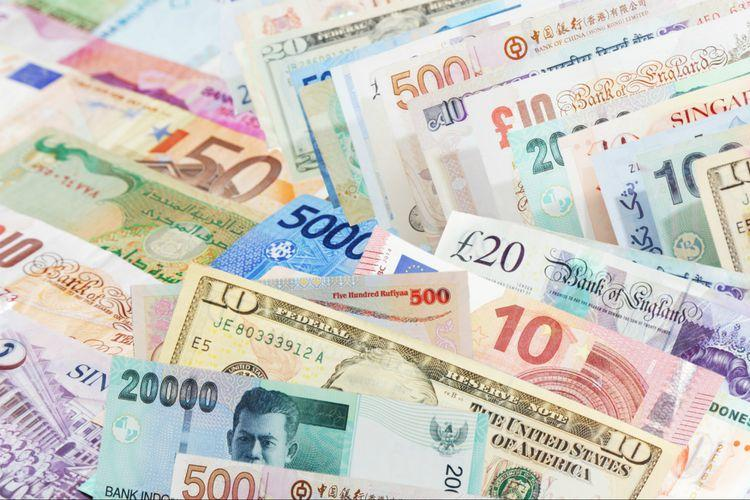

In the world of finance, understanding tradable currencies and their role in currency exchange is crucial. The foreign exchange market, commonly referred to as Forex, is the platform where currencies are traded, establishing itself as the largest financial market worldwide. Characterized by its immense liquidity and dynamic nature, Forex involves participants from governments to individual traders.

This article explores the top tradable currencies and how algorithmic trading is transforming currency exchange. The significance of key currencies is not just in their economic stability but also in their ubiquitous acceptance for trade, investment, and reserve holdings. The US Dollar (USD), Euro (EUR), and Japanese Yen (JPY), among others, are pivotal to the forex market structure due to their stability and wide acceptance.



With advancements in technology, algorithmic trading is becoming integral to forex trading strategies. This type of trading leverages computer programs to execute trades at rapid speeds and with high efficiency. Such technology-driven methods aim to optimize trading performance, minimize error, and enhance decision-making processes. Algorithms use historical and real-time data to predict currency movements, offering traders a tactical advantage in the competitive forex landscape.

The article will cover the significance of these key currencies and examine the role of algorithms in optimizing currency exchanges. By integrating high-frequency trading and complex mathematical models, traders can navigate the volatile environment of the forex market with increased precision. Understanding both the technical and fundamental aspects of these currencies and trading strategies is essential for success in today's financial ecosystem.

## Table of Contents

## Understanding Tradable Currencies

Tradable currencies form the backbone of the foreign exchange market, often referred to as the Forex market. These currencies are actively bought and sold, facilitating international trade and investment. Typically, they originate from countries with stable and robust economies. A stable economic environment often translates to lower currency risk, making these currencies more appealing to traders and investors.

Economic stability, which significantly influences currency tradability, can be assessed through various indicators such as GDP growth rates, inflation rates, and unemployment levels. A country with a consistently growing GDP, low inflation, and low unemployment is generally considered economically stable. This stability reduces the risk of currency depreciation, making the currency more attractive in the forex market.

Interest rates play a crucial role in the tradability of currencies. Typically, higher interest rates offer investors a higher return on investments denominated in that currency, increasing demand. However, it is essential to balance interest rates with inflation levels, as too high rates can raise inflationary pressures, undermining currency value. 

The political climate is another vital [factor](/wiki/factor-investing) in assessing a currency's tradability. Political stability or instability can cause currency fluctuations due to changes in economic policies, trade agreements, or geopolitical tensions. Stable political systems and policies that promote economic growth and stability usually support a favorable trading environment for the national currency.

Certain characteristics make currencies more desirable for trading. These include [liquidity](/wiki/liquidity-risk-premium), which measures how easily a currency can be bought or sold without causing significant price changes. Currencies with high liquidity, such as the US Dollar or Euro, are typically more stable and less prone to drastic fluctuations, making them preferable for traders.

Another desirable characteristic is transparency in economic data and financial policies. Countries that frequently release reliable economic data enable traders to make informed decisions, increasing the currency's appeal.

Understanding which currencies are tradable and desirable is vital for those engaged in international trade or [forex](/wiki/forex-system) trading. An informed approach enables traders to navigate forex markets effectively, capitalize on opportunities, and manage risks associated with currency fluctuations. Thus, a deep comprehension of economic indicators, interest rates, and political climates is essential in assessing the tradability and potential profitability of currency pairs in the market.

## Top Currencies in the Forex Market

The foreign exchange market, often referred to as Forex, is a decentralized global marketplace where the world’s currencies are traded. Among the multitude of currencies available, certain currencies dominate trading due to their economic stability, global demand, and influence on international markets. The US Dollar (USD), Euro (EUR), and Japanese Yen (JPY) are the most traded currencies, contributing to more than half of the daily trading [volume](/wiki/volume-trading-strategy) in Forex.

The US Dollar (USD) holds the status of the most dominant currency in global trade, serving as the world's primary reserve currency. Its robust liquidity and widespread acceptance make it a benchmark in currency pairs, meaning many currency exchange rates are often quoted against the USD. The dollar's influence extends beyond borders, impacting global commodity prices and international financial markets.

The Euro (EUR), introduced in 1999, is the official currency of the Eurozone, a region comprising 19 of the 27 European Union countries. The Euro serves as the second most traded currency in the Forex market. Its significance stems from the economic power of the Eurozone, the consistency in monetary policy efforts by the European Central Bank, and its crucial role in global trade and finance.

The Japanese Yen (JPY) is Asia’s most heavily traded currency and is frequently used as a benchmark in international finance. Recognized for its stability, the Yen is a preferred currency for [carry](/wiki/carry-trading) trades, where investors borrow in Japan's low-interest environment to invest in higher-yielding currencies. The economic policies of the Bank of Japan also affect the Yen's valuation and global trade dynamics.

Other notable currencies in the Forex market include the British Pound (GBP), which, despite the UK's [exit](/wiki/exit-strategy) from the EU, remains resilient due to the country's significant financial services sector. The Australian Dollar (AUD) is highly influenced by commodity prices due to Australia's rich natural resource exports. Similarly, the Canadian Dollar (CAD) is traded extensively, with its value tightly linked to [crude oil](/wiki/crude-oil) prices, an essential export for Canada.

The Swiss Franc (CHF) is synonymous with stability and is considered a "safe haven" currency, especially during times of global economic uncertainty. Meanwhile, the Chinese Yuan (CNY), though not as freely traded as other major currencies due to China's controlled monetary policy, is increasingly significant due to China's expanding role in international trade and finance.

Understanding the [volatility](/wiki/volatility-trading-strategies), liquidity, and market influence of these currencies is crucial for traders and investors. Currency values fluctuate based on a multitude of factors, including economic indicators, geopolitical developments, and market sentiment. Traders often assess these currencies using statistical methods or economic models to predict movements and optimize trading strategies. As such, proficiency in monitoring these key currencies offers a strategic advantage in navigating the complexities of the Forex market.

## The Mechanism of Currency Exchange

Currency exchange involves converting one currency into another at a specific exchange rate, playing a pivotal role in global finance by enabling international commerce and investment. As the largest financial market, the foreign exchange (forex) market operates 24 hours a day across multiple time zones, affording participants worldwide the opportunity to engage in currency trading continuously. This round-the-clock operation is facilitated by a decentralized structure with major financial centers in London, New York, Tokyo, and Sydney, among others.

The exchange rate is the price of one currency in terms of another and is subject to constant fluctuations influenced by various factors. The primary determinant of exchange rates is supply and demand dynamics. When the demand for a currency increases, its value appreciates relative to other currencies, and conversely, if demand decreases, its value depreciates.

Geopolitical events also significantly impact exchange rates. Political instability, changes in government policy, and international relations can all affect investor confidence, leading to volatility in currency prices. For example, a country experiencing political turmoil may see its currency depreciate due to reduced investor confidence and capital flight.

Economic indicators are critical in determining exchange rates. Key indicators such as inflation rates, interest rates, gross domestic product (GDP) growth, and employment figures are closely monitored by forex traders and businesses. For instance, higher interest rates often attract foreign investment, strengthening a country's currency. Conversely, higher inflation typically erodes purchasing power, leading to currency depreciation.

Central banks also play a crucial role in influencing exchange rates through monetary policy. By adjusting interest rates and engaging in open market operations, central banks can directly affect currency values. For example, a central bank may intervene in the forex market to stabilize its currency by buying or selling large amounts of its currency to influence exchange rates.

Traders can capitalize on exchange rate fluctuations through various strategies. One common approach is currency [arbitrage](/wiki/arbitrage), where traders exploit the price differences of a currency in different markets to achieve a risk-free profit. Another strategy is speculative trading, where traders aim to profit from anticipated movements in exchange rates based on market analysis and predictions.

Algorithmic trading in the forex market allows for the automation of these strategies, enabling the rapid execution of trades based on pre-set criteria. These algorithms analyze vast amounts of market data, identifying patterns and trends that human traders might overlook. Python, due to its rich ecosystem of financial libraries, is often used to develop these trading algorithms. Below is a simple example of a Python algorithm that uses historical data to analyze moving average crossovers, a popular trading signal:

```python
import pandas as pd

def moving_average_cross_strategy(data, short_window, long_window):
    signals = pd.DataFrame(index=data.index)
    signals['price'] = data['Close']
    signals['short_mavg'] = data['Close'].rolling(window=short_window, min_periods=1, center=False).mean()
    signals['long_mavg'] = data['Close'].rolling(window=long_window, min_periods=1, center=False).mean()

    # Signal generation
    signals['signal'] = 0.0
    signals['signal'][short_window:] = np.where(signals['short_mavg'][short_window:] 
                                                > signals['long_mavg'][short_window:], 1.0, 0.0)   
    signals['positions'] = signals['signal'].diff()

    return signals

# Example usage, assuming 'data' is a DataFrame containing historical price data with a 'Close' column:
# signals = moving_average_cross_strategy(data, short_window=40, long_window=100)
```

This algorithm helps identify buy or sell signals by cross-referencing short-term and long-term moving averages, a technique often employed to gauge market [momentum](/wiki/momentum).

Understanding the mechanisms of currency exchange and the factors that influence exchange rates are essential for forex traders and businesses. It allows them to make informed decisions, mitigate risks, and seize opportunities in the dynamic forex market.

 to Algorithmic Trading

Algorithmic trading, commonly referred to as algo trading, is a technique that employs computer algorithms to automate trading processes, enabling the execution of orders at much greater speed and volume than would be possible with human intervention alone. At its core, algo trading uses sophisticated mathematical models to analyze market data, identify trading opportunities, and make prompt trading decisions. This ability to evaluate market conditions and execute trades in milliseconds offers a significant advantage in markets characterized by high volatility and liquidity.

Forex, the foreign exchange market, stands out as a prime field for the application of [algorithmic trading](/wiki/algorithmic-trading) due to its immense size and constant operation. The forex market is highly volatile, driven by numerous factors such as geopolitical events, economic indicators, and market sentiment. Algo trading systems can quickly respond to these changes, making it well-suited for such a dynamic environment.

One of the critical benefits of algorithmic trading is its capacity to reduce human error and mitigate the influence of emotion on trading decisions. Human traders can be prone to making errors under stress or reacting emotionally to market movements, potentially leading to suboptimal decisions. In contrast, algorithms operate based on pre-set criteria and data-driven insights, ensuring consistency and rationality in trading actions.

For instance, an algorithm might use [statistical arbitrage](/wiki/statistical-arbitrage) strategies that involve exploiting price differentials between related currency pairs. Consider two highly correlated currency pairs: EUR/USD and GBP/USD. An algorithm might monitor these pairs and execute trades when the price deviation from their historical correlation exceeds a certain threshold. By automating this process, the algorithm can capture small profit opportunities that occur frequently, something that would be difficult for a human trader to replicate manually.

Moreover, the capability of algorithmic trading extends beyond merely executing trades. Algorithms can be programmed to undertake complex analysis, optimizing trading strategies through techniques such as [machine learning](/wiki/machine-learning). For example, in Python, a trader might use libraries like `pandas` for data manipulation and `scikit-learn` for implementing machine learning models to refine their trading strategies continuously. Here's a simplistic example of how a machine learning model could be employed in a forex trading strategy:

```python
import pandas as pd
from sklearn.ensemble import RandomForestClassifier
from sklearn.model_selection import train_test_split
from sklearn.metrics import accuracy_score

# Load historical forex data
data = pd.read_csv('forex_data.csv')

# Define features and target
features = data[['moving_average', 'rsi', 'macd']]
target = data['trend']

# Split into training and testing sets
X_train, X_test, y_train, y_test = train_test_split(features, target, test_size=0.2, random_state=42)

# Initialize and train the model
model = RandomForestClassifier(n_estimators=100)
model.fit(X_train, y_train)

# Make predictions
predictions = model.predict(X_test)

# Evaluate the model
accuracy = accuracy_score(y_test, predictions)
print(f'Model Accuracy: {accuracy:.2f}')
```

In this example, a Random Forest classifier is utilized to predict market trends based on technical indicators like moving averages, relative strength index (RSI), and the moving average convergence divergence (MACD). While simplistic, such models can be refined to account for numerous other variables, thereby enhancing their predictive power.

In summary, algorithmic trading introduces a level of speed, precision, and analytical capacity to currency exchange that is unmatched by traditional trading methods. Its widespread application in the forex market points to its effectiveness and the inherent advantages it offers in processing vast amounts of data and executing trades with minimal latency.

## Benefits of Algorithmic Trading in Forex

Algorithmic trading in the foreign exchange (forex) market presents several distinct advantages that can enhance trading efficiency and profitability. At the core, algorithmic trading significantly boosts the capability to process substantial volumes of data expeditiously. This rapid data processing allows traders to analyze various market conditions and make informed decisions promptly. Additionally, the potential for [backtesting](/wiki/backtesting) is a vital benefit of algorithmic trading. By utilizing historical data, traders can evaluate the effectiveness of different trading strategies before deploying them in real-time environments. This capability helps in optimizing strategies and minimizing unforeseen risks.

Another major advantage of algorithmic trading is its impact on market liquidity and price discovery. Algorithms can execute trades almost instantaneously, which contributes to smoother trading operations and more accurate price setting. This ability to react swiftly to market changes helps ensure that asset prices more accurately reflect current demand and supply conditions, facilitating better market dynamics.

Algorithmic trading also plays a crucial role in reducing transaction costs. By optimizing the timing of trades and enhancing execution efficiency, traders can minimize slippage and other costs associated with delayed or inefficient trade execution. This optimization is crucial in the high-frequency environment of forex markets, where even minor deviations can lead to substantial cost differences over time.

In summary, the benefits of algorithmic trading in forex include rapid data processing, strategy backtesting, enhanced market liquidity, improved price discovery, and reduced transaction costs. These advantages provide traders with a competitive edge, enabling them to operate more effectively in the fast-paced forex market.

## Challenges and Risks of Algorithmic Trading

Algorithmic trading, while providing numerous advantages such as speed and efficiency, is not without its challenges and risks. One of the primary concerns is the potential for technical failures. These failures could result from software bugs, connectivity issues, or hardware malfunctions, leading to unintended trades and substantial financial losses. An algorithm might execute trades based on incorrect or outdated data if systems are not updated or maintained properly.

Market volatility represents another significant risk for algorithmic trading. During periods of high volatility, such as political unrest or economic data releases, market conditions can change rapidly. If algorithms are not calibrated to handle such fluctuations, they may execute trades that lead to unexpected losses. Moreover, algorithms that rely heavily on historical data might not perform well in unprecedented market conditions.

Liquidity issues also pose a threat, particularly during periods of extreme market stress. In such scenarios, even large trades might face difficulties finding counterparties, leading to slippage where trades are executed at less favorable prices than expected. This can be exacerbated if multiple trading algorithms attempt to execute large volumes of trades simultaneously, further reducing liquidity.

Regulatory concerns add another layer of complexity. There is ongoing debate about the transparency and fairness of automated trading systems. Regulators worry about potential market manipulation and the ability of these systems to unfairly advantage some market participants over others. Ensuring compliance with regulatory frameworks requires substantial resources and can limit the flexibility of algorithmic trading strategies.

To mitigate these risks, robust risk management is essential. This involves implementing rigorous testing of algorithms under various market conditions, developing fail-safes and redundancies, and continuously monitoring the performance of trading algorithms. Risk management also includes setting appropriate stop-loss levels and diversifying trading strategies to reduce exposure to specific market events. By addressing these challenges proactively, traders can harness the benefits of algorithmic trading while minimizing associated risks.

## Future of Currency Exchange and Algo Trading

The future of currency exchange and algorithmic trading is indisputably intertwined with advancements in technology, particularly [artificial intelligence](/wiki/ai-artificial-intelligence) (AI) and machine learning (ML). These technologies have become pivotal in the evolution of forex trading strategies by enabling the development of predictive models that can analyze vast amounts of data in real-time. AI and ML are employed to detect patterns, trends, and anomalies in the forex market, which can significantly improve decision-making processes and trading outcomes. For example, machine learning algorithms can analyze historical price movements and forecast future trends, providing traders with an edge in identifying potential opportunities.

Blockchain technology and cryptocurrencies are also playing transformative roles in the currency trading landscape. Blockchain offers enhanced security and transparency in transactions, reducing the risk of fraud and ensuring the integrity of trading data. Cryptocurrencies, with their decentralized nature, are challenging traditional currency models and introducing new forms of digital assets into the trading ecosystems. As a result, forex markets are gradually adapting to incorporate these digital currencies, providing more diversified trading opportunities.

The integration of big data and predictive analytics continues to shape modern trading strategies. By leveraging big data, traders can obtain deeper insights into market dynamics, consumer behavior, and economic indicators, all of which can influence currency values. Predictive analytics further enhances this capability by utilizing statistical techniques and machine learning models to forecast future market movements, aiding traders in making informed decisions.

As technology advances, regulatory frameworks are expected to evolve to safeguard market stability and ensure fair trading practices. Regulators are likely to introduce more comprehensive guidelines to oversee the use of AI and algorithmic trading systems, addressing concerns related to market manipulation, ethical AI usage, and the need for transparency in automated trading processes.

In conclusion, the future of currency exchange and algorithmic trading will be heavily dictated by technological innovation. As AI, blockchain, and big data analytics become increasingly integrated into trading practices, the forex market will likely experience more efficiency, reduced transaction costs, and enhanced transparency. These technological advancements, coupled with evolving regulatory measures, are poised to redefine the standard practices in currency trading, offering both opportunities and challenges for market participants.

## Conclusion

Tradable currencies and the intricacies of currency exchange play a critical role in global commerce, impacting everything from international trade to investment strategies. As foreign exchange markets evolve, algorithmic trading has emerged as a revolutionary force, enhancing how these markets operate by providing unprecedented speed and efficiency. With algorithms, trades can be executed in fractions of a second, enabling traders to capitalize on market opportunities that manual trading simply cannot match.

To succeed in forex trading, staying informed about market trends, risks, and associated opportunities is essential. Market conditions are ever-changing, influenced by economic indicators, geopolitical events, and shifts in market sentiment. By leveraging technology, traders can monitor these variables more effectively and adjust their strategies accordingly.

The potential for growth in the forex market will continue to expand alongside advancements in technology. Innovations in artificial intelligence, machine learning, and blockchain are set to further transform the landscape, offering new tools and methodologies for traders. As these technologies mature, they promise not only increased efficiency but also a framework for more sophisticated and informed trading strategies.

This article has laid the groundwork for understanding the significance of top tradable currencies and the transformative impact of algorithmic trading in currency exchange. As we look to the future, the interplay between technology and forex trading will likely be a significant driver of market developments, necessitating continuous learning and adaptation by all market participants.

## References & Further Reading

[1]: Bergstra, J., Bardenet, R., Bengio, Y., & Kégl, B. (2011). ["Algorithms for Hyper-Parameter Optimization."](https://dl.acm.org/doi/10.5555/2986459.2986743) Advances in Neural Information Processing Systems 24.

[2]: ["Advances in Financial Machine Learning"](https://www.amazon.com/Advances-Financial-Machine-Learning-Marcos/dp/1119482089) by Marcos Lopez de Prado

[3]: ["Evidence-Based Technical Analysis: Applying the Scientific Method and Statistical Inference to Trading Signals"](https://www.amazon.com/Evidence-Based-Technical-Analysis-Scientific-Statistical/dp/0470008741) by David Aronson

[4]: ["Machine Learning for Algorithmic Trading"](https://github.com/PacktPublishing/Machine-Learning-for-Algorithmic-Trading-Second-Edition) by Stefan Jansen

[5]: ["Quantitative Trading: How to Build Your Own Algorithmic Trading Business"](https://books.google.com/books/about/Quantitative_Trading.html?id=j70yEAAAQBAJ) by Ernest P. Chan