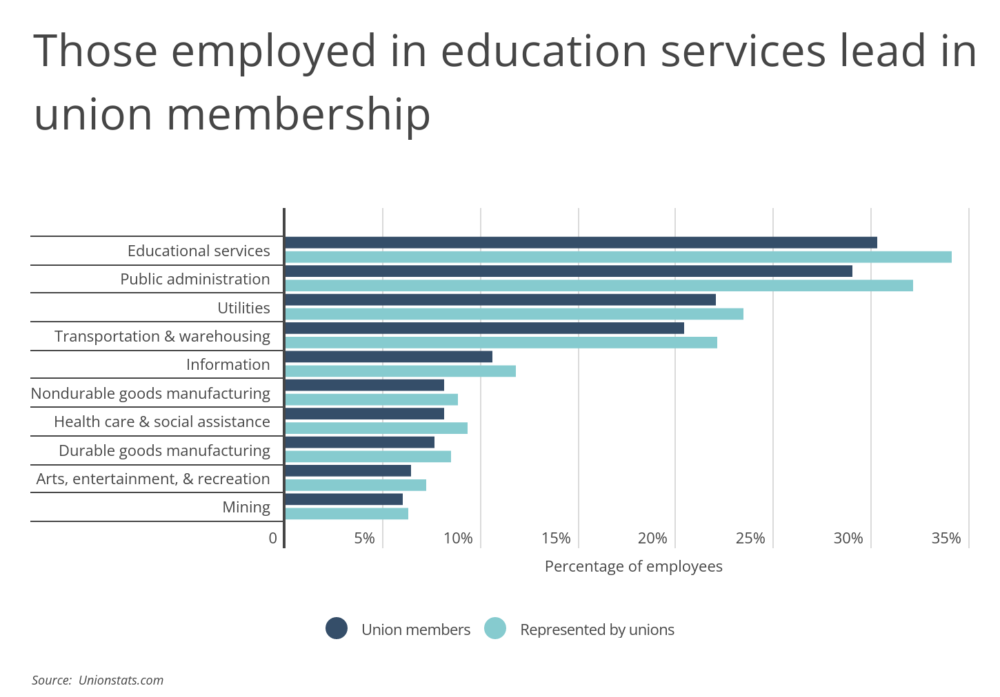

## Table of Contents

## What does it mean for an industry to be unionized?

When an industry is unionized, it means that the workers in that industry have formed or joined a union. A union is a group of workers who come together to have a stronger voice in their workplace. They work together to negotiate better pay, working conditions, and benefits with their employers. Being part of a union gives workers more power because they can support each other and speak as a group instead of as individuals.

In a unionized industry, the union acts as a representative for the workers. They hold meetings and discussions to decide what the workers want and need. Then, they meet with the employers to negotiate these points. This process is called collective bargaining. If the workers and the employers can't agree, the union might decide to take actions like strikes, where workers stop working to show their disagreement. Unionized industries often have better working conditions and benefits because the workers have more power to make changes together.

## Why are some industries more unionized than others?

Some industries are more unionized than others because of the nature of the work and the history of the industry. Jobs that are physically demanding, dangerous, or have low pay often see more union activity. Workers in these jobs want to come together to make their work safer and better paid. For example, industries like construction, manufacturing, and mining have high unionization rates because the work can be tough and risky. These workers have a long history of organizing to improve their conditions.

Another reason is the legal and political environment of the country or region. In some places, laws make it easier for workers to form unions and protect their rights. In other places, laws might make it harder. For example, in countries with strong labor laws, more industries tend to be unionized. Also, if the government supports unions, more workers might join them. On the other hand, if the government or businesses are against unions, it can be harder for workers to organize. This is why you might see more unionized industries in some countries than in others.

## What are the benefits of unionization for workers?

Unionization helps workers by giving them more power to negotiate better pay and benefits. When workers join together in a union, they can talk to their bosses as a group. This makes it easier for them to ask for higher wages, health insurance, and retirement plans. Without a union, each worker has to ask for these things alone, which can be hard. But with a union, workers can support each other and have a better chance of getting what they need.

Unions also help make workplaces safer and fairer. They can fight for rules that protect workers from dangerous jobs and unfair treatment. For example, unions can push for safety equipment, breaks, and limits on how many hours people work. They can also help stop discrimination and make sure everyone is treated the same. This makes the job better for everyone and helps workers feel more secure and respected.

## How does unionization impact the management of a company?

When a company's workers join a union, it changes how the bosses run things. The union becomes a big voice for the workers. The bosses have to talk to the union about important things like pay and rules at work. This can make things slower because the bosses and the union need to agree on changes. Sometimes, the union might ask for things that cost more money or change how the company works. This can be hard for the bosses, especially if they have to spend more money or change their plans.

On the other hand, having a union can also help the company. When workers feel happy and safe, they might work better and stay with the company longer. The union can help solve problems at work before they get big. This can make the workplace more peaceful and help the company run smoothly. But it's important for the bosses and the union to work together well. If they don't, it can lead to fights and strikes, which can hurt the company's work and money.

## Can you name three industries that are typically highly unionized?

Three industries that are typically highly unionized are construction, manufacturing, and education. In construction, workers like carpenters, electricians, and plumbers often join unions to make their jobs safer and to get better pay. The work can be dangerous, so unions help them get the right safety gear and rules to protect them. In manufacturing, workers who make things in factories also join unions a lot. They want better wages and safer working conditions because the jobs can be hard and risky. 

In education, teachers and other school workers often have unions too. They join unions to have a say in things like their pay, how many students they teach, and the resources they get in the classroom. Unions help them fight for better schools and fairer treatment. These three industries show how unions can help workers in different kinds of jobs.

## What role do unions play in negotiating wages and benefits?

Unions help workers negotiate better wages and benefits by talking to the bosses as a group. When workers join a union, they can ask for more money, health insurance, and other good things together. This is called collective bargaining. It's easier for a group of workers to get what they want than for one person alone. The union leaders meet with the company bosses and try to make a deal that's good for everyone. If the bosses and the union can't agree, the workers might go on strike, which means they stop working until they get a better deal.

Unions also make sure that the wages and benefits are fair for everyone. They can stop the company from paying some workers less than others for the same job. This helps make sure that everyone gets treated the same. Unions can also fight for things like paid time off, retirement plans, and help with health care costs. By working together, union members can get better pay and benefits than they could on their own. This makes their lives better and helps them feel more secure at work.

## How has the level of unionization changed over the past few decades in highly unionized industries?

Over the past few decades, the level of unionization in highly unionized industries has gone down in many countries. This means fewer workers are joining unions than before. In industries like manufacturing and construction, where unions used to be very strong, the number of union members has dropped. This happened for a few reasons. Some companies moved their factories to other countries where workers don't have unions. Also, some laws changed to make it harder for workers to join unions. And some workers feel that unions don't help them as much anymore.

Even though unionization has gone down, unions are still important in some highly unionized industries. For example, in education, many teachers are still in unions. These unions help teachers get better pay and better schools. In some places, unions in construction and manufacturing are still strong and help workers a lot. But overall, the number of union members in these industries is not as high as it used to be. Unions are trying to find new ways to help workers and get more people to join, but it's a challenge.

## What are the challenges faced by unions in highly unionized industries?

Unions in highly unionized industries face many challenges. One big challenge is that some companies move their factories to other countries where workers don't have unions. This means fewer workers in the home country are in unions. Also, some laws have changed to make it harder for workers to join unions. For example, some places have "right-to-work" laws that let workers not pay union dues even if they get the benefits of the union. This makes it hard for unions to have enough money to do their work.

Another challenge is that some workers feel unions don't help them as much anymore. They might think the union doesn't fight hard enough for better pay or safer jobs. This can make workers not want to join or stay in the union. Unions also have to deal with companies that don't like unions and try to stop workers from joining. This can make it hard for unions to grow and stay strong. Unions are trying to find new ways to help workers and get more people to join, but it's a big challenge.

## How do union contracts affect the competitiveness of companies in highly unionized industries?

Union contracts can make it harder for companies in highly unionized industries to compete. These contracts often set rules about how much workers get paid and how they should be treated at work. This can make the company's costs go up because they have to pay more for wages and benefits. If other companies in the same industry don't have unions, they might be able to pay their workers less and keep their costs down. This can make it tough for the company with the union to sell their products or services at a lower price, which is important for staying competitive.

On the other hand, union contracts can also help companies in some ways. When workers are happy with their pay and working conditions, they might work harder and stay with the company longer. This can make the company run better and be more productive. Also, having a union can help the company avoid big problems like strikes, which can stop work and hurt the company's business. So, while union contracts can make things more expensive, they can also help the company by making the workers happier and more loyal.

## What are some successful strategies unions have used to increase membership in their industries?

Unions have used different ways to get more people to join them. One way is to talk to workers directly and show them how unions can help them. Unions go to workplaces and talk about better pay, safer jobs, and good benefits. They also use social media and the internet to reach more people. By sharing stories and information online, unions can show workers why joining a union is a good idea. Another way is to work with other groups that support workers' rights. By teaming up with these groups, unions can reach more people and get more support.

Another successful strategy is to focus on young workers. Many unions have started programs to talk to young people about the benefits of joining a union. They go to schools and colleges to talk to students about jobs and how unions can help. Unions also try to make their meetings and activities fun and interesting for young people. By getting young workers excited about unions, they hope to grow their membership for the future. These strategies have helped unions bring in more members and stay strong in their industries.

## How do international differences in labor laws affect unionization rates in global industries?

International differences in labor laws have a big impact on how many workers join unions in global industries. In some countries, the laws make it easy for workers to form unions and protect their rights. These places often have high unionization rates because workers feel safe and supported when they join unions. For example, in countries like Sweden and Denmark, strong labor laws help unions grow and stay strong. Workers know that the law is on their side, so they are more likely to join unions and fight for better pay and working conditions.

In other countries, the laws might make it harder for workers to join unions. These places often have lower unionization rates because workers are worried about losing their jobs or facing other problems if they try to form a union. For example, in some countries, laws like "right-to-work" laws let workers not pay union dues even if they get the benefits of the union. This makes it hard for unions to have enough money to do their work. So, in these places, fewer workers join unions, and the unions are not as strong. These differences in labor laws around the world are a big reason why unionization rates vary so much in global industries.

## What future trends are predicted for unionization in traditionally highly unionized industries?

In the future, unionization in traditionally highly unionized industries might keep going down in some places. This is because more companies are moving their factories to countries where workers don't have unions. Also, some laws are making it harder for workers to join unions. Many workers feel that unions don't help them as much as they used to. But unions are trying to find new ways to help workers and get more people to join. They are using the internet and social media to reach more people and are focusing on young workers to grow their membership.

On the other hand, some experts think that unionization could start to grow again in these industries. This could happen if workers start to see more value in unions. For example, if companies keep cutting wages and making jobs worse, more workers might join unions to fight back. Also, if governments start to support unions more and change the laws to help workers, unionization rates could go up. It's hard to know for sure what will happen, but the future of unionization will depend a lot on how workers, companies, and governments act in the coming years.

## References & Further Reading

[1]: Autor, D. H. (2015). [Why Are There Still So Many Jobs? The History and Future of Workplace Automation.](https://www.aeaweb.org/articles?id=10.1257/jep.29.3.3) Journal of Economic Perspectives, 29(3), 3-30.

[2]: Frey, C. B., & Osborne, M. A. (2017). [The future of employment: How susceptible are jobs to computerisation?](https://www.sciencedirect.com/science/article/pii/S0040162516302244) Technological Forecasting and Social Change, 114, 254-280.

[3]: Tapia, M., Lee, C. K., & Rubin, B. A. (2019). [Why automation does not necessarily lead to job loss: A labor process perspective.](https://pubmed.ncbi.nlm.nih.gov/31426632/) Work and Occupations, 46(1), 83-116.

[4]: Moore, P. V., Upchurch, M., & Whittaker, X. (2018). ["Humans and Machines at work: Monitoring, surveillance and automation in contemporary capitalism,"](https://link.springer.com/content/pdf/10.1007/978-3-319-58232-0_1) Palgrave Macmillan.

[5]: Lobel, O. (2015). [The Law of the Platform.](https://scholarship.law.umn.edu/cgi/viewcontent.cgi?article=1136&context=mlr) UCLA Law Review, 101-173.

[6]: Brynjolfsson, E., & McAfee, A. (2014). ["The Second Machine Age: Work, Progress, and Prosperity in a Time of Brilliant Technologies,"](https://psycnet.apa.org/record/2014-07087-000) W.W. Norton & Company.

[7]: De Stefano, V., & Aloisi, A. (2018). [“Fundamental Labour Rights, Platform Work and Human-Rights Protection of Non-Standard Workers.”](https://papers.ssrn.com/sol3/papers.cfm?abstract_id=3125866) European Journal of Labour Law.