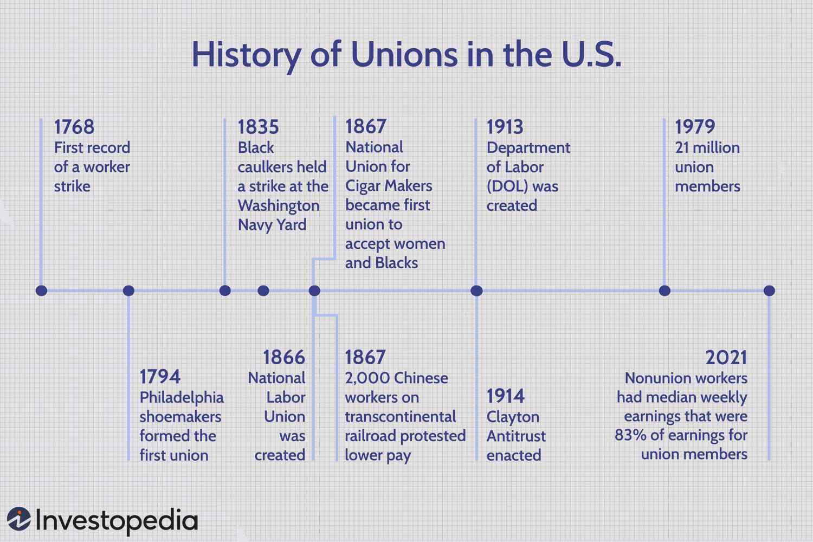

The current landscape of unionized industries is increasingly influenced by technological advancements, which both challenge and provide new opportunities for labor unions. Historically, labor unions have been instrumental in advocating for workers' rights, often through campaigns for fair wages, improved working conditions, and benefits. These efforts have significantly shaped the labor environment over the past century and continue to be relevant in contemporary settings.

In recent years, the integration of modern technologies such as algorithmic trading and automation has transformed many sectors of the economy. These technological tools have introduced new dimensions to traditional roles within unionized workforces, requiring unions to adapt and redefine their strategies. This evolution presents unique challenges, such as the need for unions to ensure fair representation in environments increasingly managed by algorithms. It also raises questions about job security and the ethical use of technology, topics unions must now address to protect the interests of their members.

Amid these changes, there is an opportunity for labor unions to harness technology to enhance their advocacy and operational effectiveness. By embracing digital tools, unions can improve organizational capacity and member engagement, ensuring they remain influential in a rapidly evolving economic landscape. The future of labor unions may well depend on their ability to integrate technological advancements while continuing to safeguard worker rights and promote equitable labor practices. This article will analyze how traditional labor unions intersect with cutting-edge technologies and consider the potential paths forward in this dynamic environment.

## Table of Contents

## The Historical Role of Labor Unions

Labor unions emerged during the Industrial Revolution, a pivotal period characterized by dramatic social and economic transformation. Originating in response to the harsh labor conditions that prevailed in new industrial workplaces, unions aimed to protect the rights and welfare of workers. This era marked a significant shift from agrarian economies to industrialized societies, leading to urbanization and the concentration of labor in factories.

Unions played a vital role in securing fair wages and improving working conditions. They achieved significant victories in advocating for shorter workdays, safer working environments, and compensation for injuries sustained at work. Moreover, they successfully campaigned for essential benefits such as healthcare and retirement plans. These achievements reflected a growing recognition of workers' rights and contributed to shaping labor policies.

Historically, labor unions have also been at the forefront of social reform movements. They fervently advocated for the abolition of child labor, arguing that it was detrimental to both children and society. By pushing for legislation that restricted child labor, unions helped pave the way for mandatory education laws, thereby improving educational opportunities for young people. Their campaigns underscored the role of education in empowering future generations and enhancing societal welfare.

Despite a decline in membership over recent decades, unions remain influential in sectors like education and healthcare. These industries continue to experience substantial union representation, illustrating the persistent role of unions in advocating for employee rights. This enduring influence is seen in the regulatory frameworks that govern modern workplaces. Legislation such as the Fair Labor Standards Act and the Occupational Safety and Health Act reflects the foundational work of unions in establishing standards for worker protection and rights.

In summary, the historical role of labor unions is deeply intertwined with efforts to improve working conditions, advocate for fair labor practices, and contribute to broader social reforms. Although they face contemporary challenges, the legacy of unions is evident in the structures that support worker welfare today.

## Current Unionized Industries and Their Challenges

Industries like education, manufacturing, and public services have traditionally had higher union representation compared to others. This trend is primarily due to the historical origins and collective bargaining agreements established in these sectors. However, over recent decades, the rate of union membership has experienced a noticeable decline. Despite this decrease, public support for unions remains strong, as indicated by surveys demonstrating a consistent appreciation for the role that unions play in advocating for workers' rights and benefits.

The contemporary economic landscape presents several challenges to unionized industries. Globalization and technological advancements, such as automation and [artificial intelligence](/wiki/ai-artificial-intelligence), exert significant pressure on these sectors to adapt. The rapid pace of technological change necessitates a shift in workforce skill requirements, compelling unions to advocate for reskilling and workforce development initiatives to ensure member employability.

Furthermore, unions must confront internal challenges that affect their appeal, particularly to younger workers. High membership dues and depleted pension funds are cited as significant deterrents for new members. These financial obstacles, coupled with a perceived lack of union relevance in addressing modern work-life balance issues, have led to increased scrutiny from potential members.

To remain pertinent amidst a technologically driven and globally competitive economy, unions are tasked with innovating their approaches. They need to focus on bridging the gap between traditional union activities and the evolving economic contexts shaped by digital transformation. Addressing these multifaceted challenges requires strategic planning, inter-union collaboration, and an openness to integrating digital tools to enhance communication and organizational efficacy.

Through proactive adaptation and advocacy, unions have the opportunity to revitalize their influence and continue serving as champions for worker rights in an ever-evolving economic environment.

## Algorithmic Trading and Automation: Implications for Unions

Algorithmic trading and automation are prominent examples of technological advancements reshaping industries, including those with unionized workforces. These systems offer efficiencies by executing trades faster and with fewer errors than humans, fundamentally altering the nature of work and posing significant challenges to labor unions. One primary concern is the impact on job security. Automation can reduce the need for human intervention, leading to job reductions or role changes. Labor unions are therefore tasked with advocating for workers displaced by these technologies and ensuring fair processes are in place.

A major challenge for unions involves addressing biases inherent in algorithmic systems. Algorithms used in trading and automated decision-making can perpetuate inequality if the data they are trained on or their design reflects existing biases. Unions must push for algorithms that are fair, transparent, and accountable. This effort includes advocating for legislation or regulations that mandate thorough testing and validation of algorithms to prevent discriminatory outcomes.

Collaborations between unions and technologists can aid in developing standards and practices that protect workers' rights amidst these shifts. By working together, they can create guidelines ensuring that automation enhances rather than undermines employment conditions. For instance, unions could engage with software developers to influence algorithm design, prioritizing parameters that account for fairness and ethical considerations.

Emphasizing transparency and accountability in algorithmic management is crucial for upholding labor rights. Unions can champion efforts to make the decision-making processes of algorithmic systems understandable and fair. This might involve advocating for the right to audit and understand algorithms affecting employee roles, wages, or job security, ensuring these systems enhance rather than detract from worker welfare.

In summary, [algorithmic trading](/wiki/algorithmic-trading) and automation present both opportunities and considerable challenges for unions. By focusing on fairness, bias mitigation, and collaborative standards development, labor unions can play a proactive role in ensuring that technological progress is aligned with the principles of equity and job security.

## Opportunities for Labor Unions in the Digital Age

Labor unions in the digital age have a unique opportunity to enhance their organizational capacity and improve member engagement through the strategic use of digital tools. The integration of technology into union operations presents numerous possibilities for optimizing communication, promoting transparency, and ultimately, advocating more effectively for workers' rights.

One of the key advantages of digital tools for unions is the enhancement of real-time communication. Platforms such as mobile applications, social media, and messaging services enable unions to disseminate information quickly and efficiently. This capability allows for the rapid mobilization of resources, facilitating timely responses to labor disputes and campaigns for workers' rights. For instance, a union can instantaneously alert its members about a strike action or negotiation updates, ensuring that all stakeholders are well-informed and engaged.

Moreover, the adoption of technology allows unions to shape ethical guidelines for technology use in workplaces. By collaborating with experts in technology and policy, unions can help establish standards that ensure technology is used responsibly and transparently, safeguarding workers' rights. This involves addressing issues related to workers' privacy, data ownership, and the ethical implications of surveillance technologies in the workplace. Unions can advocate for these guidelines at both the organizational and policy levels, contributing to a fairer and more equitable work environment.

Collaboration among unions, facilitated by digital platforms, can enhance overall influence and effectiveness. By forming alliances and sharing resources, unions can present a united front in negotiations and advocacy efforts. Digital platforms can serve as a medium for unions to share successful strategies, develop joint campaigns, and coordinate collective actions across different sectors and geographies.

Additionally, embracing digital interaction can expand union relevance in the modern economy. By utilizing digital tools, unions can engage with younger workers who are more accustomed to digital communication and seek more direct involvement in advocacy efforts. Digital tools provide unions with the means to not only reach a wider audience but also to personalize engagement, making union membership more appealing to the digital-native workforce.

In summary, the strategic adoption of digital tools presents labor unions with numerous opportunities to augment their organizational structures, enhance member engagement, and advocate more effectively for workers' rights while adapting to the evolving economic landscape. By leveraging these technologies, unions can maintain their relevance and continue to protect and promote workers' welfare in an increasingly digital world.

## Conclusion

Labor unions, despite facing a myriad of challenges in the modern era, continue to play an indispensable role in advocating for fair labor practices and safeguarding workers' rights. Their existence is vital in ensuring that workers receive fair wages, safe working conditions, and respect for their rights amid changing economic landscapes.

In embracing technological advancements, unions have the opportunity to enhance their organizational effectiveness. Digital tools can streamline union operations, facilitate better communication among members, and provide platforms for rapid mobilization and advocacy. By integrating such technologies, labor unions can improve their responsiveness to members' needs and thereby strengthen their influence.

To remain relevant, unions must adapt to the economic realities of a digital and globalized workforce. This involves understanding the shifting job markets, the rise of gig economies, and the impacts of globalization on labor conditions. Unions can serve as a crucial buffer and voice for workers who might otherwise be left vulnerable in this evolving environment.

Moreover, labor unions are uniquely positioned to shape the ethical use of technology in workplaces. By engaging with employers and policymakers, unions can advocate for ethical standards that balance technological innovation with the protection of worker welfare. This includes ensuring transparent and fair algorithms in decision-making processes, safeguarding job security in the face of automation, and eliminating biases in technological implementations.

In conclusion, by proactively addressing the challenges posed by technological and economic changes, labor unions can maintain and even enhance their role as protectors of worker rights in the digital era. Through adaptation and strategic engagement with modern technologies, unions can continue to champion ethical labor practices and secure a fair future for workers globally.

## References & Further Reading

[1]: Autor, D. H. (2015). [Why Are There Still So Many Jobs? The History and Future of Workplace Automation.](https://www.aeaweb.org/articles?id=10.1257/jep.29.3.3) Journal of Economic Perspectives, 29(3), 3-30.

[2]: Frey, C. B., & Osborne, M. A. (2017). [The future of employment: How susceptible are jobs to computerisation?](https://www.sciencedirect.com/science/article/pii/S0040162516302244) Technological Forecasting and Social Change, 114, 254-280.

[3]: Tapia, M., Lee, C. K., & Rubin, B. A. (2019). [Why automation does not necessarily lead to job loss: A labor process perspective.](https://pubmed.ncbi.nlm.nih.gov/31426632/) Work and Occupations, 46(1), 83-116.

[4]: Moore, P. V., Upchurch, M., & Whittaker, X. (2018). ["Humans and Machines at work: Monitoring, surveillance and automation in contemporary capitalism,"](https://link.springer.com/content/pdf/10.1007/978-3-319-58232-0_1) Palgrave Macmillan.

[5]: Lobel, O. (2015). [The Law of the Platform.](https://scholarship.law.umn.edu/cgi/viewcontent.cgi?article=1136&context=mlr) UCLA Law Review, 101-173.

[6]: Brynjolfsson, E., & McAfee, A. (2014). ["The Second Machine Age: Work, Progress, and Prosperity in a Time of Brilliant Technologies,"](https://psycnet.apa.org/record/2014-07087-000) W.W. Norton & Company.

[7]: De Stefano, V., & Aloisi, A. (2018). [“Fundamental Labour Rights, Platform Work and Human-Rights Protection of Non-Standard Workers.”](https://papers.ssrn.com/sol3/papers.cfm?abstract_id=3125866) European Journal of Labour Law.