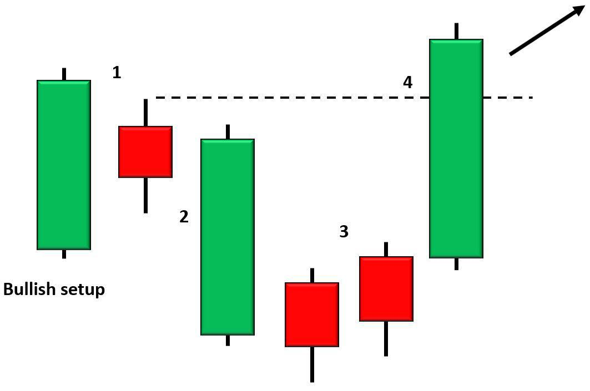

## Table of Contents

## What is the Hikkake Pattern in trading?

The Hikkake Pattern is a type of chart pattern used in trading to spot potential reversals in the market. It is a bit tricky because it looks like a false breakout at first. Imagine you see a price moving up or down and breaking through a certain point, making you think it will keep going that way. But then, it suddenly turns around and goes the opposite way. That's what a Hikkake Pattern does. It tricks traders into thinking the price will keep moving in one direction, but then it reverses.

To spot a Hikkake Pattern, you need to look at the candlesticks on a price chart. If you see an inside bar after a series of higher highs and higher lows, that could be the start of a bearish Hikkake. For a bullish Hikkake, you look for an inside bar after a series of lower highs and lower lows. The key is to wait for the price to break out of the inside bar and then reverse. This pattern helps traders find good entry points for trades, but it's important to use other tools and indicators too, because no pattern works perfectly all the time.

## How does the Hikkake Pattern differ from other candlestick patterns?

The Hikkake Pattern is different from other candlestick patterns because it focuses on a false breakout followed by a reversal. Most candlestick patterns, like the Doji or Hammer, are based on the shape and position of a single candlestick or a small group of candlesticks. They signal potential changes in market direction based on their appearance. In contrast, the Hikkake Pattern involves an inside bar and the price action around it, making it a bit more complex. It tricks traders into thinking the price will continue in one direction after breaking out of the inside bar, only to reverse and go the other way.

Another way the Hikkake Pattern stands out is that it requires more context to identify than many other patterns. For example, a simple pattern like the Engulfing Pattern can be spotted just by looking at two candlesticks where one completely engulfs the other. On the other hand, to spot a Hikkake Pattern, you need to see a series of higher highs and higher lows for a bearish Hikkake, or lower highs and lower lows for a bullish Hikkake, followed by an inside bar and a false [breakout](/wiki/breakout-trading). This makes the Hikkake Pattern less common and more specific, but it can also be a powerful tool for traders who know how to use it correctly.

## What are the key components that form a Hikkake Pattern?

The Hikkake Pattern is made up of a few important parts that you need to see on a price chart. First, you look for a series of price movements. For a bearish Hikkake, you want to see a series of higher highs and higher lows. For a bullish Hikkake, you need to see a series of lower highs and lower lows. After you spot these movements, the next thing to look for is an inside bar. An inside bar is a candlestick that is completely inside the range of the previous candlestick, meaning its high is lower and its low is higher than the previous candlestick.

Once you see the inside bar, the Hikkake Pattern starts to form. The key moment comes when the price breaks out of the inside bar. For a bearish Hikkake, the price breaks above the high of the inside bar, and for a bullish Hikkake, it breaks below the low of the inside bar. This breakout looks like the price is going to keep moving in the direction of the breakout, but in a Hikkake Pattern, it's a false move. The price then reverses and goes the opposite way. This reversal is what makes the Hikkake Pattern useful for traders who can spot it and use it to enter trades at the right time.

## Can you explain the bullish Hikkake Pattern with an example?

Imagine you're looking at a price chart and you see the price has been going down for a while. It keeps making lower highs and lower lows. Then, suddenly, you see a small candlestick that fits completely inside the range of the last candlestick. This small candlestick is called an inside bar. You're watching closely because you know this could be the start of a bullish Hikkake Pattern.

The price then breaks down below the low of the inside bar, and it looks like it's going to keep falling. But then, something surprising happens. Instead of continuing to drop, the price suddenly turns around and starts going up. This is the key part of the bullish Hikkake Pattern - the false breakout followed by a reversal. Traders who spot this pattern might see it as a good time to buy, hoping to catch the start of a new upward trend.

## Can you explain the bearish Hikkake Pattern with an example?

Imagine you're looking at a price chart and you see the price has been going up for a while. It keeps making higher highs and higher lows. Then, you see a small candlestick that fits completely inside the range of the last candlestick. This small candlestick is called an inside bar. You start watching closely because you know this could be the start of a bearish Hikkake Pattern.

The price then breaks up above the high of the inside bar, and it looks like it's going to keep rising. But then, something unexpected happens. Instead of continuing to go up, the price suddenly turns around and starts going down. This is the key part of the bearish Hikkake Pattern - the false breakout followed by a reversal. Traders who spot this pattern might see it as a good time to sell, hoping to catch the start of a new downward trend.

## What are the common entry and exit strategies when trading with the Hikkake Pattern?

When trading with the Hikkake Pattern, a common entry strategy is to wait for the false breakout to happen. For a bullish Hikkake, you would enter a long position after the price breaks below the inside bar's low and then starts to move back up. For a bearish Hikkake, you would enter a short position after the price breaks above the inside bar's high and then starts to move back down. This means you're buying when the price starts to rise after the false breakout, or selling when it starts to fall. It's important to wait for the reversal to confirm the pattern before entering the trade.

For [exit](/wiki/exit-strategy) strategies, traders often use stop-loss orders to limit their losses. If you're in a long position from a bullish Hikkake, you might set your stop-loss just below the low of the inside bar. If you're in a short position from a bearish Hikkake, you might set your stop-loss just above the high of the inside bar. This helps protect you if the price moves against you. To take profits, some traders use a fixed target, like a certain percentage gain, while others might use a trailing stop to let their profits run as the price continues to move in their favor.

## How reliable is the Hikkake Pattern in predicting market movements?

The Hikkake Pattern can be a useful tool for traders, but it's not perfect. Like any trading pattern, it works sometimes but not always. The pattern's reliability can depend on a lot of things, like the market you're trading in, how volatile the price is, and what other indicators you're using. Some traders find it helpful because it can show them when the market might be tricking people into thinking it will keep moving one way, only to go the other way.

No pattern, including the Hikkake Pattern, can predict the market perfectly every time. It's important to use it with other tools and not rely on it alone. By combining the Hikkake Pattern with things like moving averages or other chart patterns, traders can get a better sense of what might happen next. Always remember to manage your risk, use stop-loss orders, and be ready for times when the pattern doesn't work out as expected.

## What are some common mistakes traders make when using the Hikkake Pattern?

One common mistake traders make with the Hikkake Pattern is jumping into a trade too early. They see the inside bar and get excited, but they don't wait for the false breakout and the reversal to happen. This can lead to entering a trade before the pattern is confirmed, which can result in losses if the price doesn't move as expected. It's important to be patient and wait for the whole pattern to form before making a move.

Another mistake is not using other tools to confirm the Hikkake Pattern. Some traders might see the pattern and think it's a sure thing, but they forget that no pattern works every time. It's a good idea to look at other indicators, like moving averages or other chart patterns, to make sure the Hikkake Pattern is showing a real opportunity. Ignoring these extra checks can lead to bad trades and losses.

## How can the Hikkake Pattern be confirmed using technical indicators?

To confirm a Hikkake Pattern, traders often use technical indicators like moving averages. A moving average can show the general direction of the price. If you see a bullish Hikkake Pattern and the price is also above a rising moving average, it can give you more confidence that the price might keep going up. On the other hand, if you see a bearish Hikkake Pattern and the price is below a falling moving average, it can make you feel more sure that the price might keep going down.

Another way to confirm the Hikkake Pattern is by looking at the Relative Strength Index (RSI). The RSI helps you see if a price is overbought or oversold. If you see a bullish Hikkake and the RSI is coming up from being oversold, it can be a good sign that the price might rise. If you see a bearish Hikkake and the RSI is coming down from being overbought, it can be a good sign that the price might fall. Using these indicators with the Hikkake Pattern can help you make better trading decisions.

## What are the best market conditions for using the Hikkake Pattern effectively?

The Hikkake Pattern works best in markets that are trending but also have some periods of consolidation. A trending market means the price is generally moving up or down over time. When you see the price pausing and moving sideways for a bit, that's consolidation. The Hikkake Pattern can catch the moment when the price breaks out of this consolidation but then quickly reverses. This makes it useful in markets where trends are strong, but there are also times when the price seems unsure about which way to go.

It's also important to use the Hikkake Pattern in markets with enough trading activity. If the market is very quiet and not many people are buying or selling, the pattern might not work as well. In busy markets, the false breakout and reversal can happen more clearly, making the Hikkake Pattern easier to spot and use. So, if you're looking to trade with the Hikkake Pattern, try to find markets that have clear trends and enough activity to make the pattern stand out.

## How does the Hikkake Pattern perform across different time frames?

The Hikkake Pattern can work on different time frames, like short ones such as 5 minutes, or longer ones like daily or weekly charts. On shorter time frames, the pattern might show up more often because prices move quickly. This can give you more chances to trade, but it also means you need to watch the market closely because things can change fast. On longer time frames, the Hikkake Pattern might be less common, but when you see it, it can be a stronger signal because it covers more time and shows a bigger trend change.

No matter which time frame you use, the Hikkake Pattern works best in markets with clear trends and enough activity. If the market is too quiet, the pattern might not be as clear or reliable. Also, you need to be patient on longer time frames because it can take more time for the pattern to fully form and for the price to move after the false breakout. Using other indicators along with the Hikkake Pattern can help you make better decisions, no matter the time frame you're looking at.

## Can the Hikkake Pattern be integrated with other trading strategies for better results?

Yes, the Hikkake Pattern can be used with other trading strategies to get better results. For example, you can use it with moving averages to see if the price is following a trend. If you see a bullish Hikkake Pattern and the price is above a rising moving average, it can make you feel more confident that the price might keep going up. On the other hand, if you see a bearish Hikkake Pattern and the price is below a falling moving average, it can make you feel more sure that the price might keep going down. Using these together helps you make smarter trading choices.

Another way to use the Hikkake Pattern with other strategies is by looking at the Relative Strength Index (RSI). The RSI can tell you if a price is overbought or oversold. If you see a bullish Hikkake and the RSI is coming up from being oversold, it can be a good sign that the price might rise. If you see a bearish Hikkake and the RSI is coming down from being overbought, it can be a good sign that the price might fall. By combining the Hikkake Pattern with other indicators like RSI and moving averages, you can get a clearer picture of what might happen next in the market.

## References & Further Reading

[1]: Scholz, H. (2006). ["Technical Analysis: Signals and Measurements."](https://typeset.io/papers/the-trend-is-not-your-friend-why-empirical-timing-success-is-4xwasrkv0j) Springer.

[2]: Chesler, D. L. (2003). ["Pattern Recognition and Trend Analysis in Quantitative Finance."] Chart Seminar.

[3]: Elder, A. (2014). ["The New Trading for a Living: Psychology, Discipline, Trading Tools and Systems, Risk Control, Trade Management."](https://www.amazon.com/New-Trading-Living-Psychology-Discipline/dp/1118443926) Wiley.

[4]: Sweeney, J. (1996). ["Maximum Adverse Excursion: Analyzing Price Fluctuations for Trading Management."](https://books.google.com/books/about/Maximum_Adverse_Excursion.html?id=AcpzjSV_gTkC) CRC Press.

[5]: Bulkowski, T. N. (2005). ["Encyclopedia of Chart Patterns."](https://www.wiley.com/en-us/Encyclopedia+of+Chart+Patterns,+3rd+Edition-p-9781119739685) Wiley. 

[6]: Murphy, J. J. (1999). ["Technical Analysis of the Financial Markets: A Comprehensive Guide to Trading Methods and Applications."](https://archive.org/details/technicalanalysi0000murp) New York Institute of Finance. 

[7]: Pring, M. J. (2002). ["Technical Analysis Explained: The Successful Investor's Guide to Spotting Investment Trends and Turning Points."](https://www.amazon.com/Technical-Analysis-Explained-Fifth-Successful/dp/0071825177) McGraw-Hill Education.