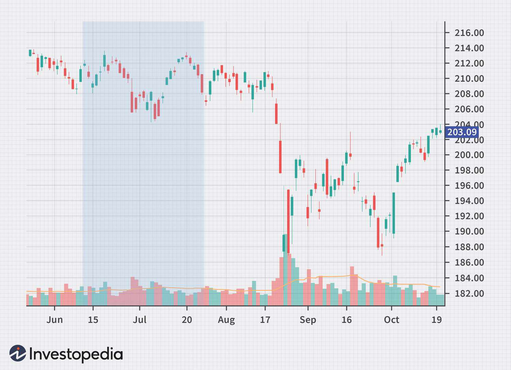

## Table of Contents

## What is the Hindenburg Omen?

The Hindenburg Omen is a technical indicator used to predict a potential stock market crash. It was named after the Hindenburg airship disaster in 1937, symbolizing a dramatic and sudden event. The indicator looks at certain patterns in stock prices and trading volumes to warn investors that a big drop in the market might be coming soon.

To spot a Hindenburg Omen, you need to see a high number of stocks hitting new highs and new lows at the same time. This shows that the market is divided, with some parts doing very well while others are doing very badly. When this happens, it can mean the market is unstable and a crash could be on the way. However, the Hindenburg Omen is not always right, and it has given false alarms in the past.

## Who developed the Hindenburg Omen?

The Hindenburg Omen was developed by a man named Jim Miekka. He came up with this idea in the 1990s. Jim wanted to find a way to warn people about big drops in the stock market. He looked at how stocks were doing and noticed that when a lot of stocks were doing really well and a lot were doing really badly at the same time, it could mean trouble was coming.

Jim named his indicator after the Hindenburg airship disaster because he thought it was a good way to show how sudden and dramatic a market crash could be. Even though the Hindenburg Omen has been useful at times, it's not perfect. Sometimes it warns about a crash that never happens, so people need to be careful and not rely on it too much.

## What are the key components of the Hindenburg Omen?

The Hindenburg Omen looks at a few important things to warn about a possible stock market crash. First, it checks if the number of stocks hitting new highs and new lows on the New York Stock Exchange is very high. This means that while some stocks are doing really well, others are doing really badly at the same time. This split in the market can show that it's not stable and might be about to fall.

Second, the Hindenburg Omen makes sure the stock market isn't moving too much up or down in one direction. It uses something called the McClellan Oscillator to check this. If the market is moving a lot, the warning doesn't count. This helps make sure the signal is more accurate. So, the Hindenburg Omen is all about watching for these special signs in the market to warn people about a big drop that might be coming.

## How is the Hindenburg Omen calculated?

The Hindenburg Omen is calculated by looking at the number of stocks on the New York Stock Exchange (NYSE) that are reaching new 52-week highs and new 52-week lows at the same time. If more than 2.2% of the stocks on the NYSE are hitting new highs and more than 2.2% are hitting new lows in the same period, it's a sign that the market might be unstable. This shows that while some parts of the market are doing really well, other parts are doing really badly, which can be a warning sign of a big drop coming.

To make sure the signal is more accurate, the Hindenburg Omen also checks the McClellan Oscillator, which measures the market's overall movement. If the McClellan Oscillator is not too high or too low, meaning the market isn't moving too much in one direction, the warning from the Hindenburg Omen counts. If the market is moving a lot, the signal is ignored because it might not be a reliable warning. So, the Hindenburg Omen uses these two checks to try to predict when the stock market might crash.

## What is the significance of the 3-month moving average of new highs and new lows in the Hindenburg Omen?

The 3-month moving average of new highs and new lows is an important part of the Hindenburg Omen because it helps to smooth out the data over time. Instead of just looking at the numbers for one day, the 3-month moving average looks at the average number of stocks hitting new highs and new lows over the past three months. This makes the warning more reliable because it's based on a longer period, not just a single day's ups and downs.

This average is used to confirm the signal given by the daily numbers. If the daily number of stocks hitting new highs and new lows is above 2.2% of the total stocks on the NYSE, the 3-month moving average of these numbers must also be above this threshold for the Hindenburg Omen to be triggered. This double-check helps to make sure that the market's split between high performers and low performers is not just a short-term thing, but a more lasting trend that could signal a coming market crash.

## Can you explain the role of market breadth in the Hindenburg Omen?

Market breadth is a key part of the Hindenburg Omen. It looks at how many stocks are going up or down, not just the overall market. The Hindenburg Omen uses market breadth to see if a lot of stocks are hitting new highs while a lot of others are hitting new lows at the same time. This split in the market can show that it's not strong and might be about to fall. The Hindenburg Omen checks if more than 2.2% of the stocks on the New York Stock Exchange are at new highs and more than 2.2% are at new lows in the same period.

This check helps to make the warning more reliable. It shows that the market's problem is not just with a few stocks, but with many different ones. When both new highs and new lows are high, it means the market is divided and could be unstable. This is why market breadth is so important in the Hindenburg Omen. It helps to spot when the market might be in trouble, even if the overall market looks okay.

## What is the threshold for the number of new 52-week highs and lows required to trigger the Hindenburg Omen?

The Hindenburg Omen is triggered when more than 2.2% of the stocks on the New York Stock Exchange (NYSE) hit new 52-week highs and more than 2.2% hit new 52-week lows at the same time. This means that while some stocks are doing really well, others are doing really badly, showing that the market might be unstable.

To make sure this signal is reliable, the Hindenburg Omen also checks the 3-month moving average of these new highs and lows. If both the daily numbers and the 3-month average are above 2.2%, it confirms the warning. This double-check helps to make sure the market's problem is not just a short-term thing, but a more lasting trend that could signal a coming market crash.

## How does the Hindenburg Omen differ from other market indicators?

The Hindenburg Omen is different from other market indicators because it looks at how many stocks are doing really well and how many are doing really badly at the same time. Most other indicators focus on the overall market or just a few big stocks. The Hindenburg Omen pays attention to the smaller details by checking if more than 2.2% of stocks on the New York Stock Exchange are hitting new highs and new lows in the same period. This helps to show if the market is divided and might be about to fall.

Another way the Hindenburg Omen is different is that it uses a special check called the McClellan Oscillator to make sure the market isn't moving too much in one direction. If the market is moving a lot, the warning from the Hindenburg Omen doesn't count. This makes it more accurate because it tries to avoid false alarms. Also, the Hindenburg Omen looks at the 3-month moving average of new highs and lows, which other indicators might not do. This helps to make sure the signal is not just a short-term thing but a more lasting trend that could signal a coming market crash.

## What historical market events have been associated with the Hindenburg Omen?

The Hindenburg Omen has been linked to several big drops in the stock market. One famous time was just before the big crash in 1987, known as Black Monday. The Hindenburg Omen warned about trouble a few weeks before the market fell a lot on October 19, 1987. Another time was before the dot-com bubble burst in 2000. The Hindenburg Omen signaled a warning in the summer of 2000, and then the market started to fall in the fall of that year.

Another big event linked to the Hindenburg Omen was before the financial crisis in 2007-2008. The Omen gave a warning in the summer of 2007, and then the market started to fall in the fall of that year. Even though the Hindenburg Omen has been right sometimes, it has also given warnings that didn't lead to a crash. For example, it warned in 2010 and 2012, but the market didn't fall a lot those times. So, while the Hindenburg Omen can be a helpful warning, it's not always right, and people need to be careful about relying on it too much.

## How reliable is the Hindenburg Omen as a predictor of market downturns?

The Hindenburg Omen has been right sometimes about big drops in the stock market. It warned before big events like the crash in 1987, the dot-com bubble burst in 2000, and the financial crisis in 2007-2008. When it gives a warning, it means that a lot of stocks are doing really well and a lot are doing really badly at the same time, which can be a sign that the market is unstable and might fall soon.

But the Hindenburg Omen is not always right. It has given warnings that didn't lead to a crash, like in 2010 and 2012. This means that while it can be a helpful warning, it's not perfect. People need to be careful and not rely on it too much. They should look at other things too before deciding what to do with their money.

## What are some criticisms or limitations of the Hindenburg Omen?

The Hindenburg Omen has some problems that people talk about. One big issue is that it gives false alarms. This means it warns about a big drop in the market that never happens. For example, it warned in 2010 and 2012, but the market didn't crash those times. This can make people worry for no reason and might make them sell their stocks when they don't need to. Another problem is that the Hindenburg Omen uses a lot of numbers and rules, which can make it hard to understand and use correctly.

Another criticism is that the Hindenburg Omen looks at the stock market in a very specific way. It focuses on how many stocks are hitting new highs and new lows at the same time, but it might miss other important signs. The stock market can be affected by many things like the economy, politics, and world events, and the Hindenburg Omen doesn't take all of these into account. So, while it can be a helpful warning, it's not the only thing people should look at when trying to predict what the market will do.

## How can investors use the Hindenburg Omen in their trading strategies?

Investors can use the Hindenburg Omen as a warning sign to be more careful with their money. When the Hindenburg Omen gives a warning, it means that a lot of stocks are doing really well while a lot are doing really badly at the same time. This can show that the market might be unstable and could fall soon. So, investors might want to think about selling some of their stocks or not buying new ones until the market seems safer. They can use the Hindenburg Omen to help decide when to be more careful and protect their money.

But investors should not rely only on the Hindenburg Omen. It has given false alarms before, which means it warned about a big drop in the market that never happened. So, it's a good idea to look at other things too, like what's happening in the economy, politics, and world events. The Hindenburg Omen can be a helpful part of a bigger plan, but it's not perfect. By using it along with other information, investors can make smarter choices about when to buy or sell stocks.

## What are the criteria for a Hindenburg Omen Signal?

The Hindenburg Omen is recognized for its stringent criteria, essential for identifying potential stock market downturns. Four primary conditions must be satisfied to generate a valid Hindenburg Omen signal:

1. **New 52-Week Highs and Lows Threshold**: The daily number of stocks reaching new 52-week highs and lows must exceed 2.2% of the total number of stocks traded. This condition highlights a significant market disparity, which could suggest instability. Mathematically, this can be expressed as:
$$
   \frac{\text{Number of 52-week highs} + \text{Number of 52-week lows}}{\text{Total number of stocks}} > 0.022

$$

2. **High-Low Proportion Constraint**: The number of stocks hitting new 52-week highs should not exceed twice the number of stocks hitting new 52-week lows. This balance is critical to ensure that the indicator registers legitimate market imbalances without overemphasizing one over the other:
$$
   \text{Number of 52-week highs} \leq 2 \times \text{Number of 52-week lows}

$$

3. **Market Uptrend Verification**: It is crucial that the overall market is in an uptrend, as verified by the 10-week moving average of a major stock market index, such as the NYSE Composite Index. This condition ensures that any signal is generated in the context of market growth, heightening the impact of potential downturn signals. The market is considered to be in an uptrend if:
$$
   \text{Current Index Value} > \text{10-week moving average}

$$

4. **Negative McClellan Oscillator Requirement**: A negative reading from the McClellan Oscillator is necessary to confirm bearish sentiment within the market. The McClellan Oscillator, derived from the difference between the number of advancing and declining issues, reflects the market's internal momentum. A negative value suggests more widespread selling pressure over buying:
$$
   \text{McClellan Oscillator} < 0

$$

Meeting these criteria signals a potential market correction, although the omen is not infallible due to its complexity and vulnerability to false positives. Careful evaluation alongside other market indicators is recommended for a comprehensive analysis.

## References & Further Reading

[1]: Aronson, D. R. (2007). ["Evidence-Based Technical Analysis: Applying the Scientific Method and Statistical Inference to Trading Signals"](https://onlinelibrary.wiley.com/doi/book/10.1002/9781118268315). Wiley.

[2]: Chan, E. P. (2008). ["Quantitative Trading: How to Build Your Own Algorithmic Trading Business"](https://github.com/ftvision/quant_trading_echan_book). Wiley.

[3]: Jansen, S. (2020). ["Machine Learning for Algorithmic Trading: Predictive models to extract signals from market and alternative data for systematic trading strategies with Python"](https://www.amazon.com/Machine-Learning-Algorithmic-Trading-alternative/dp/1839217715). Packt Publishing.

[4]: Lopez de Prado, M. (2018). ["Advances in Financial Machine Learning"](https://www.amazon.com/Advances-Financial-Machine-Learning-Marcos/dp/1119482089). Wiley.

[5]: Depew, S. (2010). ["The Hindenburg Omen: Profit from the Panic and Chaos of the Stock Market"](https://chartschool.stockcharts.com/table-of-contents/trading-strategies-and-models/trading-strategies/hindenburg-omen). Adams Media.