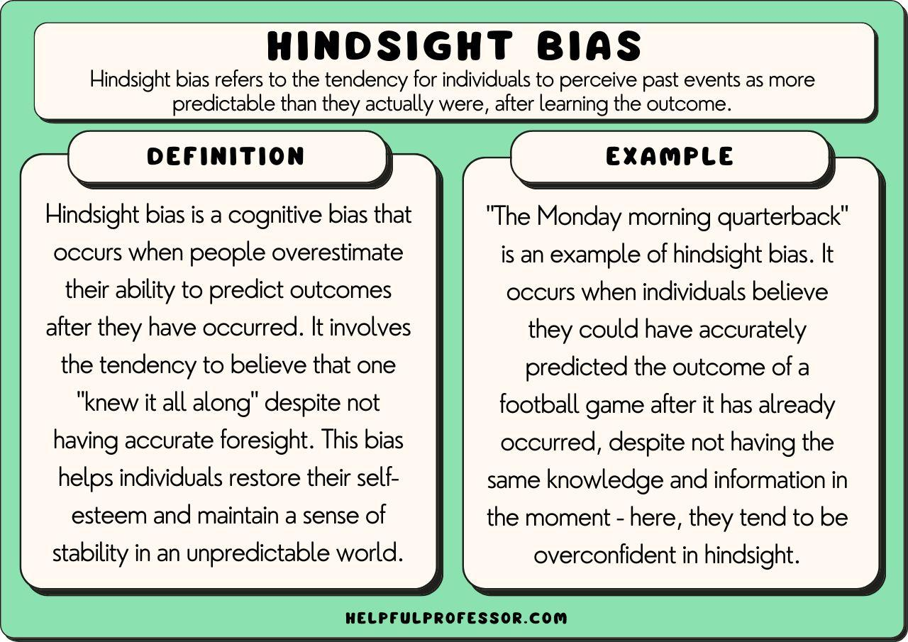

In finance and trading, cognitive biases can shape decision-making processes, often leading to errors and missed potential gains. A particularly relevant bias in this sphere is hindsight bias. This psychological phenomenon occurs when individuals, after an event has occurred, believe they had predicted or could have predicted the event's outcome. This false sense of predictability post-event can distort an individual’s assessment of past decisions, leading to misplaced confidence in their forecasting abilities.

Algorithmic trading, which relies on the execution of trades through automated systems guided by predefined rules and comprehensive data analysis, is not exempt from these cognitive distortions. Although these systems use quantitative models to make trading decisions, the creation of these models is still subject to human influence, leaving room for biases like hindsight bias to creep in.



This article aims to explore the implications of hindsight bias and other cognitive biases on decision-making in algorithmic trading. The discussion will highlight the risks associated with these biases and propose strategies to mitigate their impact, ultimately seeking to improve the accuracy and effectiveness of trading systems.

## Table of Contents

## Understanding Hindsight Bias

Hindsight bias, commonly referred to as the 'knew-it-all-along' effect, is a psychological phenomenon in which individuals perceive events as having been more predictable than they actually were. This cognitive bias emerges when people, after learning the outcome of an event, believe that they had accurately predicted it beforehand. It reflects an altered memory of an original, uncertain situation, creating an illusion of understanding and predictability.

The presence of hindsight bias can have significant implications for decision-making processes. It often leads individuals to overestimate their ability to have anticipated past events, fostering a false sense of confidence in their judgment and predictive capabilities. This misperception can result in flawed decision-making, as people rely on perceived foresight that did not exist, potentially disregarding other critical factors or uncertainties inherent in situations.

In trading, hindsight bias is particularly consequential. Traders affected by this bias may convince themselves that they correctly anticipated market movements, even if their original decisions were based on flawed or incomplete information. This false confidence can distort future decision-making, as traders may become over-reliant on their supposed predictive abilities, potentially leading to risky trades or misallocation of resources. Such overconfidence can further skew trading strategies, making them less responsive to new data or emerging market trends.

To counteract hindsight bias, traders and analysts can adopt structured approaches—recording predictions, decision rationales, and eventual outcomes to create a coherent and unbiased learning loop. Through deliberate and reflective practice, it is possible to recognize and mitigate the influence of this bias on trading decisions.

## Impact of Hindsight Bias on Algorithmic Trading

Algorithmic trading systems, while inherently systematic and data-driven, are nevertheless conceived and developed by human individuals who are inherently susceptible to cognitive biases, including hindsight bias. Hindsight bias often manifests in the belief that past market movements were predictable, thereby influencing the design and optimization of trading models.

Developers affected by hindsight bias may inadvertently tune algorithms too closely to historical data under the erroneous assumption that these patterns were foreseeable. This can result in a phenomenon known as overfitting. An overfitted model is characterized by excellent performance on historical data but fails to generalize well to new, unseen data sets. The implications of overfitting are significant; they can lead to increased financial risks as the trading algorithm may not effectively respond to future market conditions that deviate from past patterns.

Overfitting is problematic because it means that the model has essentially learned the noise in the data as if it were a signal. In formal terms, consider a [machine learning](/wiki/machine-learning) model $f(x)$ built to predict a target variable $y$. If the model is overly complex relative to the underlying structure of the data, it might fit the idiosyncrasies of the training data set, resulting in a low training error but potentially a high prediction error on new data. The mathematical expression for the error of a model can be represented as:

$$
\text{Total Error} = \text{Bias}^2 + \text{Variance} + \text{Irreducible Error}
$$

In this context, overfitting causes the variance component to inflate due to the model's complexity and sensitivity to the training data's noise.

To illustrate this in code, suppose a developer is using a machine learning model such as a decision tree in Python:

```python
from sklearn.tree import DecisionTreeRegressor
from sklearn.model_selection import cross_val_score
import numpy as np

# Hypothetical historical data
X_train = np.random.rand(100, 5)  # 100 samples, 5 features
y_train = np.random.rand(100)     # target variable

# Initialize Decision Tree model
tree = DecisionTreeRegressor(max_depth=10)

# Evaluate model using cross-validation to check for overfitting
scores = cross_val_score(tree, X_train, y_train, cv=10)

print("Cross-validation scores:", scores)
print("Mean cross-validation score:", np.mean(scores))
```

In this example, the model's depth is set high, which could lead the tree to become overfit. Cross-validation is employed to assess how well the model generalizes to an independent data set. If the cross-validation scores fluctuate dramatically, it could be indicative of overfitting, necessitating model simplification or regularization to improve future data performance.

It is crucial for algorithmic developers to remain vigilant of their biases and critically assess their model designs. Robust strategies such as cross-validation, regularization techniques, and avoidance of overly complex models can help mitigate the skewing effects of hindsight bias on algorithmic designs, thus enhancing the adaptive capability of trading systems to unforeseen market dynamics.

## Cognitive Biases in Trading and Their Consequences

Cognitive biases are systematic patterns of deviation from rationality in judgment and decision-making, and they play a significant role in influencing trading behavior. These biases can distort traders' perceptions of market information, leading to suboptimal trading decisions and potentially significant financial losses.

Confirmation bias is one of the most prevalent cognitive biases in trading. It is the tendency to seek, interpret, and remember information that confirms one’s pre-existing beliefs or hypotheses while giving disproportionately less consideration to alternative possibilities. This bias can lead traders to emphasize supportive information for their current holdings or strategies while ignoring data that contradicts their views. For instance, a trader might selectively focus on bullish news reports when holding a long position in a particular stock, neglecting bearish signals that suggest a potential downturn. This selective information processing can result in a skewed view of the market and delayed reaction to changing conditions.

Overconfidence bias is another common bias affecting traders. It occurs when traders overestimate their knowledge, skills, or predictive abilities. Overconfidence can lead traders to take excessive risks, underestimate the likelihood of adverse outcomes, or ignore the warning signs of market corrections. For example, a trader might believe they have superior insight into market movements and thereby increase their positions without adequately hedging or diversifying their portfolio. This false sense of security can result in substantial financial losses if the market moves against their expectations.

Availability bias is the tendency to rely on immediate examples that come to mind when evaluating a specific topic, concept, method, or decision. In trading, this bias may cause traders to focus on recent or vivid events rather than considering all relevant information. For instance, a trader might give undue weight to a recent market rally and assume it will continue indefinitely, thereby ignoring historical cycles or broader market indicators that suggest a correction. The reliance on readily available information rather than a comprehensive analysis can lead to unbalanced and poorly informed trading decisions.

These cognitive biases underscore the importance of a disciplined approach to trading that involves comprehensive analysis, diversification, and a critical evaluation of one's own decision-making processes. By recognizing these biases and actively working to minimize their impact, traders can make more informed and rational decisions, ultimately enhancing their potential for success in the financial markets.

## Strategies to Mitigate Cognitive Biases in Trading

To counteract cognitive biases in trading, traders must actively scrutinize their decision-making processes. This involves adopting various strategies aimed at fostering objectivity and reducing emotional influence.

Maintaining a trading journal is one effective approach. By systematically documenting trades, traders can objectively review and assess their decisions post facto, minimizing the effects of biases like hindsight. Entries in the journal should include the rationale behind each trade, market conditions, the outcome, and reflections on the decision-making process. This practice promotes a more structured and deliberate evaluation of trading activities, facilitating continual learning and adjustment.

Leveraging quantitative models and rules-based trading strategies can substantially minimize emotional judgments and bias. Algorithmic trading systems, governed by pre-established criteria and data-driven methodologies, aim to eliminate subjective interference. Traders should design algorithms with robust [backtesting](/wiki/backtesting), ensuring that models are resilient to overfitting and adaptable to new market data. Python, often used for such tasks, offers libraries like pandas for data manipulation and scikit-learn for model development. For example, a simple moving average crossover strategy can be implemented in Python:

```python
import pandas as pd

# Assuming 'data' is a DataFrame with a 'close' column for closing prices
data['SMA_short'] = data['close'].rolling(window=10).mean()
data['SMA_long'] = data['close'].rolling(window=50).mean()

# Generating buy/sell signals
data['signal'] = 0
data.loc[data['SMA_short'] > data['SMA_long'], 'signal'] = 1
data.loc[data['SMA_short'] < data['SMA_long'], 'signal'] = -1
```

This code snippet implements a simplistic version of a moving average strategy, reducing decisions to systematic rules rather than emotional judgments.

Collaboration with peers and seeking feedback further enhance decision-making by introducing different viewpoints that can challenge cognitive biases. Engaging with a community of traders allows for the exchange of ideas, critique of trading strategies, and identification of potential biases. Constructive feedback can provide insights into alternative approaches and underrated risks, leading to more balanced and informed trading decisions.

These strategies, focused on addressing cognitive biases, are vital for traders aiming to enhance their effectiveness in [algorithmic trading](/wiki/algorithmic-trading). Through the rigorous application of systematic practices and collaborative efforts, traders can favorably position themselves in dynamic and often uncertain financial markets.

## Conclusion

Understanding and mitigating hindsight bias and other cognitive biases is crucial for enhancing decision-making within algorithmic trading. Algorithmic trading systems, though systematic and data-driven, are not devoid of human influence, particularly in their initial design and subsequent adjustments. Recognizing this influence involves acknowledging that biases such as hindsight bias can significantly skew analysis, leading to overfitting and suboptimal trading models.

Implementing systematic approaches is vital to counter these biases. Quantitative models and data-driven frameworks minimize emotional interference and reduce the propensity for bias-driven decisions. Leveraging technology, such as advanced machine learning algorithms, allows for thorough data analysis devoid of subjective human judgments. For example, employing cross-validation techniques during algorithm development can prevent overfitting and ensure robust performance across varied market conditions.

Continuous learning and adaptation to new market environments are equally important. The financial markets are ever-evolving, and so must be the strategies employed within them. Traders should remain vigilant against biases by regularly revisiting and refining their trading models, using new data to challenge and enhance their systems. Engaging in peer reviews and seeking objective feedback can further contribute to reducing bias, fostering an environment where strategies are continually scrutinized and improved.

The journey towards unbiased, effective algorithmic trading is ongoing. By systematically addressing cognitive biases and emphasizing continuous learning, traders can significantly improve their decision-making processes, leading to more informed, profitable trading outcomes.

## References & Further Reading

[1]: Bergstra, J., Bardenet, R., Bengio, Y., & Kégl, B. (2011). ["Algorithms for Hyper-Parameter Optimization."](https://papers.nips.cc/paper/4443-algorithms-for-hyper-parameter-optimization) Advances in Neural Information Processing Systems 24.

[2]: ["Advances in Financial Machine Learning"](https://www.amazon.com/Advances-Financial-Machine-Learning-Marcos/dp/1119482089) by Marcos Lopez de Prado

[3]: ["Evidence-Based Technical Analysis: Applying the Scientific Method and Statistical Inference to Trading Signals"](https://www.amazon.com/Evidence-Based-Technical-Analysis-Scientific-Statistical/dp/0470008741) by David Aronson

[4]: ["Machine Learning for Algorithmic Trading"](https://github.com/stefan-jansen/machine-learning-for-trading) by Stefan Jansen

[5]: ["Quantitative Trading: How to Build Your Own Algorithmic Trading Business"](https://www.amazon.com/Quantitative-Trading-Build-Algorithmic-Business/dp/1119800064) by Ernest P. Chan