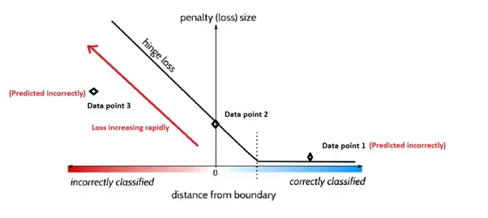

## Table of Contents

## What is Hinge Loss in the context of machine learning?

Hinge Loss is a type of loss function used in machine learning, especially in classification problems like Support Vector Machines (SVMs). It measures how well a model is doing by looking at the difference between the predicted value and the actual value. The goal is to make this difference as small as possible. If the prediction is correct and confident, the hinge loss is zero. But if the prediction is wrong or not confident enough, the hinge loss will be greater than zero, pushing the model to improve.

The formula for hinge loss is simple but effective. For a given prediction $$y$$ and the true label $$y_i$$, the hinge loss $$L$$ is calculated as $$L = \max(0, 1 - y_i \cdot y)$$. This means that if the product $$y_i \cdot y$$ is greater than 1 (meaning the prediction is correct and confident), the loss is zero. But if it's less than 1, the loss is the difference between 1 and that product. This encourages the model to not just get the prediction right, but to do so with high confidence.

In practice, hinge loss helps in creating a clear margin of separation between different classes in a classification problem. This is particularly useful in SVMs, where the goal is to find the hyperplane that best separates the classes with the widest possible margin. By minimizing the hinge loss, the model is encouraged to push the decision boundary away from the data points, making the classification more robust and less sensitive to noise in the data.

## How does Hinge Loss differ from other loss functions like Mean Squared Error?

Hinge Loss and Mean Squared Error (MSE) are both used to measure how well a model is doing, but they work in different ways. Hinge Loss is mainly used for classification problems, like deciding if an email is spam or not. It focuses on getting the right answer and being confident about it. If the model's prediction is correct and confident, the Hinge Loss is zero. But if the prediction is wrong or not confident enough, the Hinge Loss goes up. The formula for Hinge Loss is $$L = \max(0, 1 - y_i \cdot y)$$, where $$y_i$$ is the true label and $$y$$ is the prediction. This encourages the model to push the decision boundary away from the data points, making the classification more robust.

On the other hand, Mean Squared Error is often used for regression problems, like predicting house prices. MSE measures the average of the squares of the errors between the predicted and actual values. The formula for MSE is $$\text{MSE} = \frac{1}{n} \sum_{i=1}^{n} (y_i - \hat{y}_i)^2$$, where $$y_i$$ is the true value, $$\hat{y}_i$$ is the predicted value, and $$n$$ is the number of observations. MSE penalizes larger errors more heavily because of the squaring, which can be useful for making the model more sensitive to outliers. Unlike Hinge Loss, MSE doesn't care about the confidence of the prediction; it just wants the prediction to be as close as possible to the actual value.

## In which types of machine learning problems is Hinge Loss typically used?

Hinge Loss is mainly used in classification problems, where the goal is to sort things into different groups. It's very popular in Support Vector Machines (SVMs), which are a type of machine learning model that tries to find the best way to separate different classes. Hinge Loss helps SVMs do this by making sure the model not only gets the right answer but also does so confidently. The formula for Hinge Loss is $$L = \max(0, 1 - y_i \cdot y)$$, where $$y_i$$ is the true label and $$y$$ is the prediction. This encourages the model to push the decision boundary away from the data points, making the classification more robust.

In addition to SVMs, Hinge Loss can also be used in other types of classification models where you want to create a clear margin between classes. For example, it can be used in some neural networks designed for classification tasks. By using Hinge Loss, these models are encouraged to make strong, confident predictions, which can lead to better performance in telling different classes apart.

## Can you explain the mathematical formula for Hinge Loss?

The formula for Hinge Loss is simple but powerful. It's written as $$L = \max(0, 1 - y_i \cdot y)$$, where $$y_i$$ is the true label and $$y$$ is the prediction from the model. This formula checks if the prediction is correct and confident. If the prediction is right and confident, the Hinge Loss is zero. But if the prediction is wrong or not confident enough, the Hinge Loss is more than zero, which pushes the model to get better.

Hinge Loss works by looking at the difference between the prediction and the true label. If the product of $$y_i$$ and $$y$$ is greater than 1, the loss is zero because the prediction is correct and confident. But if the product is less than 1, the loss is the difference between 1 and that product. This encourages the model to not just get the prediction right, but to do so with high confidence, which is important in classification problems like those used in Support Vector Machines.

## What are the advantages of using Hinge Loss in Support Vector Machines?

Hinge Loss is great for Support Vector Machines (SVMs) because it helps the model find the best way to separate different classes. The formula for Hinge Loss is $$L = \max(0, 1 - y_i \cdot y)$$, where $$y_i$$ is the true label and $$y$$ is the prediction. This formula makes sure the model not only gets the right answer but also does so confidently. If the prediction is correct and confident, the loss is zero. But if the prediction is wrong or not confident enough, the loss goes up. This pushes the model to create a clear margin between classes, which is what SVMs are all about.

Another advantage of using Hinge Loss in SVMs is that it helps the model be more robust. By encouraging a clear margin between classes, the model becomes less sensitive to noise in the data. This means the model can still make good predictions even if there are some mistakes or unusual data points. Hinge Loss helps SVMs find the best decision boundary that keeps the classes as far apart as possible, which leads to better and more reliable classification.

## How does the margin in Hinge Loss affect the model's performance?

The margin in Hinge Loss is like a safety zone that helps the model tell different classes apart more clearly. In Support Vector Machines (SVMs), the margin is the space between the decision boundary and the closest data points from each class. The Hinge Loss formula, $$L = \max(0, 1 - y_i \cdot y)$$, encourages the model to make this margin as wide as possible. If the model's prediction is correct and confident, meaning the product of the true label $$y_i$$ and the prediction $$y$$ is greater than 1, the loss is zero. This means the model is doing a good job of keeping the classes well separated.

A wider margin makes the model more robust and less sensitive to noise in the data. If there are small mistakes or unusual data points, a model with a wider margin can still make good predictions because it has more room to work with. By using Hinge Loss, the model is pushed to not just get the right answer but to do so with high confidence, which leads to better performance in telling different classes apart. This is why Hinge Loss is so useful in SVMs and other classification tasks where clear separation between classes is important.

## What is the role of the hyperparameter 'C' in Hinge Loss?

The hyperparameter 'C' in Hinge Loss is used in Support Vector Machines (SVMs) to control how much the model cares about getting all the data points right versus having a wide margin between classes. A smaller value of 'C' means the model is more relaxed about misclassifying some data points, focusing more on creating a wider margin. This can make the model more robust to noise and less likely to overfit. On the other hand, a larger value of 'C' makes the model try harder to get every data point right, which can lead to a narrower margin but better accuracy on the training data. The right value of 'C' depends on the specific problem and dataset.

In the context of Hinge Loss, 'C' affects how the loss is calculated. The formula for the loss function in SVMs with 'C' is $$L = C \sum_{i=1}^{n} \max(0, 1 - y_i \cdot y) + \frac{1}{2} \|w\|^2$$, where $$y_i$$ is the true label, $$y$$ is the prediction, $$w$$ is the weight vector, and $$n$$ is the number of data points. The term $$C \sum_{i=1}^{n} \max(0, 1 - y_i \cdot y)$$ represents the Hinge Loss, scaled by 'C'. A higher 'C' puts more weight on minimizing the Hinge Loss, pushing the model to classify all points correctly, while a lower 'C' puts more weight on the regularization term $$\frac{1}{2} \|w\|^2$$, encouraging a wider margin.

## How can Hinge Loss be implemented in a practical coding example?

Hinge Loss is used in machine learning to help models make good predictions, especially in classification problems. It's like a way to score how well the model is doing. The formula for Hinge Loss is $$L = \max(0, 1 - y_i \cdot y)$$, where $$y_i$$ is the true label (either 1 or -1) and $$y$$ is the model's prediction. If the prediction is right and confident, the loss is zero. But if the prediction is wrong or not confident enough, the loss goes up. This encourages the model to not just get the right answer but to do so with high confidence.

Here's a simple example of how to implement Hinge Loss in Python. We'll create a function that takes in the true labels and the model's predictions and calculates the Hinge Loss. This example uses a small set of data to show how it works.

```python
import numpy as np

def hinge_loss(y_true, y_pred):
    # Calculate the Hinge Loss
    loss = np.maximum(0, 1 - y_true * y_pred)
    # Return the mean loss
    return np.mean(loss)

# Example data
y_true = np.array([1, -1, 1, -1])
y_pred = np.array([0.8, -0.7, 0.9, -0.6])

# Calculate the Hinge Loss
loss = hinge_loss(y_true, y_pred)
print(f"Hinge Loss: {loss}")
```

In this code, we define a function `hinge_loss` that takes in `y_true` (the true labels) and `y_pred` (the model's predictions). The function uses NumPy to calculate the Hinge Loss for each data point and then returns the average loss. The example data shows a small set of true labels and predictions, and when we run the function, it calculates and prints the Hinge Loss. This simple example helps us understand how Hinge Loss works in practice.

## What are the potential drawbacks or limitations of using Hinge Loss?

Hinge Loss is great for classification problems, like telling if an email is spam or not, but it has some downsides. One big issue is that Hinge Loss can be too strict. It wants the model to not just get the right answer but to do so with high confidence. This can be a problem if the data is noisy or if there are a lot of unusual cases. The formula for Hinge Loss is $$L = \max(0, 1 - y_i \cdot y)$$, where $$y_i$$ is the true label and $$y$$ is the prediction. If the prediction is wrong or not confident enough, the loss goes up, which can make the model too focused on getting every single point right, leading to overfitting.

Another limitation of Hinge Loss is that it's not very good for problems where the data isn't clearly separated into different groups. If the classes overlap a lot, Hinge Loss can struggle to find a good decision boundary. This is because Hinge Loss pushes the model to create a wide margin between classes, but if the classes are too mixed up, a wide margin might not be possible. In these cases, other loss functions like Cross-Entropy might work better because they can handle more complex classification tasks where the classes aren't so clearly separated.

## How does Hinge Loss handle outliers compared to other loss functions?

Hinge Loss is pretty good at dealing with outliers because it focuses on creating a clear margin between different classes. The formula for Hinge Loss is $$L = \max(0, 1 - y_i \cdot y)$$, where $$y_i$$ is the true label and $$y$$ is the prediction. If the prediction is right and confident, the loss is zero. But if the prediction is wrong or not confident enough, the loss goes up. This encourages the model to push the decision boundary away from the data points, making it less sensitive to outliers. Outliers might be far from the decision boundary, but as long as the model keeps a good margin, they won't mess up the classification too much.

Other loss functions, like Mean Squared Error (MSE), can be more affected by outliers. MSE looks at the difference between the prediction and the actual value and squares it, so big mistakes get penalized a lot more. The formula for MSE is $$\text{MSE} = \frac{1}{n} \sum_{i=1}^{n} (y_i - \hat{y}_i)^2$$, where $$y_i$$ is the true value, $$\hat{y}_i$$ is the predicted value, and $$n$$ is the number of observations. This means that outliers, which can have big errors, can really throw off the model's performance. Hinge Loss, on the other hand, doesn't care about the size of the error as much as it cares about whether the prediction is on the right side of the decision boundary and how confident it is.

## Can Hinge Loss be modified for multi-class classification problems?

Hinge Loss is usually used for problems where you're trying to sort things into just two groups, like spam or not spam. But you can change it to work with more than two groups. One way to do this is by using something called One-vs-All or One-vs-Rest. This means you make a separate Hinge Loss calculation for each group, treating it as if it's a two-group problem where one group is the one you're looking at and the other group is everything else. The formula for Hinge Loss in this case would be $$L_i = \max(0, 1 - y_i \cdot (w_i^T x + b_i))$$ for each class $$i$$, where $$y_i$$ is 1 if the example belongs to class $$i$$ and -1 otherwise, $$w_i$$ and $$b_i$$ are the weights and bias for class $$i$$, and $$x$$ is the input.

Another way to change Hinge Loss for more than two groups is to use something called Multi-class SVM. This method looks at all the groups at the same time and tries to find the best way to separate them. The formula for this is a bit more complicated, but it still uses the idea of Hinge Loss. It's written as $$L = \sum_{i=1}^{n} \sum_{j \neq y_i} \max(0, 1 - (w_{y_i}^T x_i + b_{y_i} - w_j^T x_i - b_j))$$, where $$y_i$$ is the true class of the $$i$$-th example, $$w_k$$ and $$b_k$$ are the weights and bias for class $$k$$, and $$x_i$$ is the $$i$$-th input. This formula tries to make sure that the score for the correct class is higher than the score for any other class by at least a margin of 1. Both of these ways to change Hinge Loss for more than two groups help the model learn to tell the different groups apart better.

## What advanced techniques can be applied to optimize Hinge Loss in deep learning models?

To optimize Hinge Loss in deep learning models, one advanced technique is to use gradient descent with adaptive learning rates, like Adam or RMSprop. These methods help the model learn faster and more smoothly by adjusting the learning rate for each parameter based on how much it's changing. This can be especially helpful with Hinge Loss because it encourages the model to create a clear margin between classes. By using these adaptive methods, the model can find the best decision boundary more quickly and effectively. The formula for Hinge Loss is $$L = \max(0, 1 - y_i \cdot y)$$, where $$y_i$$ is the true label and $$y$$ is the prediction. If the prediction is correct and confident, the loss is zero, but if it's wrong or not confident enough, the loss goes up, pushing the model to improve.

Another technique is to use regularization methods like L1 or L2 regularization to prevent overfitting. These methods add a penalty to the loss function to keep the model's weights from getting too big. For Hinge Loss, this can help balance the need for a wide margin with the need to avoid overfitting to the training data. By adding a regularization term to the loss function, like $$L = \max(0, 1 - y_i \cdot y) + \lambda \|w\|^2$$ for L2 regularization, the model can learn a more general decision boundary that works well on new data. This combination of Hinge Loss and regularization can make the model more robust and better at classifying different groups.