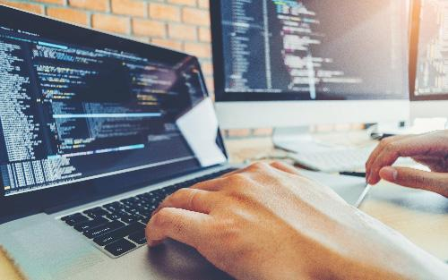

Algorithmic trading refers to the use of computers programmed to follow a defined set of instructions for placing trades to generate profits at a speed and frequency impossible for a human trader. These algorithms can operate across various markets and are used by both institutional investors and individual traders. They serve to remove the emotional aspect of trading and to exploit mathematical and statistical methods to identify profit opportunities. This approach has gained prominence due to its ability to manage vast amounts of orders, rapidly analyze data, and execute trades with precision.

The role of an algo trading software developer is crucial in this landscape. These professionals are responsible for designing and implementing trading strategies, ensuring that they function correctly and efficiently. They bridge the gap between financial market expertise and technological proficiency. Developers are tasked with writing robust, high-performance code often in programming languages such as Python, C++, or Java. They need an intricate understanding of mathematical models and financial markets, alongside technical skills to create algorithms that can process real-time market data, execute orders, and perform post-trade analysis.



The growing demand for sophisticated trading systems arises from the evolving nature of financial markets, where milliseconds can make the difference in profitable trading strategies. With the surge in high-frequency trading and the increasing complexity of financial products, there is a pressing need for systems that can handle these tasks seamlessly. Algorithmic trading now accounts for a significant portion of market trades, creating opportunities for developers who can create systems capable of dealing with the dynamic environment of financial markets.

Expertise in algo trading is valuable because it combines financial knowledge with technical prowess, a blend increasingly sought after in the financial industry. Developing systems that can evaluate streams of data, predict market trends, and execute transactions with minimal latency is both challenging and essential in maintaining a competitive edge in trading. Furthermore, owing to the technical nature of the work, it is an area that is less vulnerable to automation threats, unlike some other roles in finance.

This article will cover various aspects of the field, starting with the responsibilities and required skills of an algo trading software developer. It will discuss key technologies and tools utilized in the domain, the challenges developers face, and the impact of algo trading on financial markets. Additionally, it will delve into the career paths and opportunities available in this high-demand field, providing valuable insights for aspiring developers.

## Table of Contents

## The Role of an Algo Trading Software Developer

Algorithmic trading software developers play a critical role in bridging technology and finance to enhance trading operations. Their primary responsibilities include designing, developing, testing, and deploying algorithms that facilitate automated trading across various financial markets. They must ensure that the developed systems are robust, efficient, and capable of executing trades with precision and speed.

A successful algo trading software developer requires a blend of skills and expertise, predominantly in programming, mathematics, and finance. Programming is fundamental, with languages such as Python, C++, and Java being pivotal due to their efficiency and flexibility. Python, for instance, is favored for its vast libraries in data analysis and [machine learning](/wiki/machine-learning), which are crucial for building sophisticated algorithms. An example of trading logic implemented in Python might resemble:

```python
def moving_average_strategy(prices, short_window, long_window):
    short_mavg = prices.rolling(window=short_window, min_periods=1).mean()
    long_mavg = prices.rolling(window=long_window, min_periods=1).mean()
    signals = (short_mavg > long_mavg).astype(int).diff()
    return signals
```

Mathematics is equally important, as developers often utilize statistical methods and mathematical models to design trading strategies. These strategies include high-frequency trading ([HFT](/wiki/high-frequency-trading-strategies)), which exploits small price discrepancies at rapid speeds, and [arbitrage](/wiki/arbitrage), where traders capitalize on price differences of the same asset in different markets.

Finance knowledge is essential to understand the market dynamics and economic factors that affect asset prices. This includes familiarity with financial instruments, market structures, and the regulatory environment that governs trading activities.

The evolving landscape of financial markets necessitates that algo trading software developers remain at the forefront of technological advancements and market trends. This requires continuous education and adaptation to new tools, frameworks, and methodologies that enhance trading performance and compliance with regulatory standards. By staying informed, developers can optimize algorithms to handle the complexities of modern-[day trading](/wiki/day-trading-spy), thereby maintaining a competitive edge in the financial sector.

## Key Technologies and Tools Used

Algorithmic trading relies heavily on advanced technologies and tools. Key among these are programming languages, data analysis techniques, machine learning, and [backtesting](/wiki/backtesting) frameworks. Each plays an essential role in optimizing and evaluating trading strategies.

Programming languages are fundamental to developing trading algorithms. Python is highly favored within this domain due to its simplicity and extensive library support, including NumPy, Pandas, and SciPy, which facilitate efficient data manipulation and analysis. Python's machine learning libraries, such as TensorFlow and Scikit-learn, further bolster its utility. Java and C++ are also prevalent, primarily for their execution speed and robust performance, which are critical for developing systems like high-frequency trading platforms where latency is a concern.

Data analysis and machine learning are crucial for extracting actionable insights from large volumes of financial data, leading to more informed trading decisions. Machine learning algorithms can identify patterns and forecast market trends, enhancing the predictive power of [algorithmic trading](/wiki/algorithmic-trading) strategies. Techniques such as linear regression, decision trees, and [deep learning](/wiki/deep-learning) models are commonly employed.

The relevance of backtesting frameworks lies in their ability to simulate trading strategies against historical data. This process helps in assessing the viability and performance of strategies before they are deployed in live trading environments. Tools like Backtrader, a Python library designed for backtesting, allow developers to refine strategies by providing insights into their potential profitability and risk metrics.

As technology continues to evolve, future tools and technologies are anticipated to further transform algorithmic trading. Quantum computing, for instance, is poised to revolutionize data processing speeds, potentially offering unprecedented capabilities in analyzing complex datasets. Additionally, advancements in natural language processing (NLP) could improve sentiment analysis by scraping and interpreting financial news and social media, providing traders with a new dimension of data-driven decision-making. 

In summary, the technological landscape in algorithmic trading is dynamic, driven by the constant evolution of programming languages, data analysis techniques, machine learning, and backtesting capabilities. Adapting to these advancements is pivotal for developers aiming to maintain efficient and competitive trading systems.

## Challenges Faced by Algo Trading Software Developers

Algorithmic trading has become a cornerstone of modern financial markets, but it is not without its challenges for software developers in the field. One of the most pervasive issues is market [volatility](/wiki/volatility-trading-strategies). Algorithms must be robust enough to perform under fluctuating market conditions. This requires sophisticated models that can predict and adapt to market shifts, necessitating a deep understanding of quantitative finance and advanced statistical methods. Such models often involve stochastic calculus, deploying methods like the Black-Scholes model to estimate options pricing or using mean-reversion strategies to navigate volatility.

Regulatory compliance further complicates the development of trading algorithms. Developers must navigate a complex landscape of rules imposed by authorities like the Securities and Exchange Commission (SEC) in the United States or the European Securities and Markets Authority (ESMA) in Europe. Maintaining compliance involves ensuring the algorithm's trading activity aligns with regulations designed to prevent market manipulation and the exploitation of market anomalies. This can be addressed by implementing rigorous testing and validation processes that incorporate compliance checks into the algorithm's operations.

From a technical standpoint, optimizing algorithms for speed and efficiency is crucial. High-frequency trading (HFT) systems, for instance, require execution times in the microsecond range. To achieve this, developers often use programming languages like C++ for their high-performance capabilities and implement parallel computing strategies to enhance processing power. For example, leveraging multi-threading in Python using libraries like `concurrent.futures` can significantly decrease computation time:

```python
from concurrent.futures import ThreadPoolExecutor

def analyze_market_data(data_chunk):
    # Process data chunk
    pass

with ThreadPoolExecutor(max_workers=4) as executor:
    executor.map(analyze_market_data, market_data_chunks)
```

Ethical considerations also play a crucial role. Automated systems can create unintended consequences, such as exacerbating market fluctuations or executing trades that impact market fairness. Developers must conduct thorough scenario testing and implement failsafes to minimize detrimental market impact. This can include using risk management algorithms like Value-at-Risk (VaR) to estimate the potential loss in portfolio value.

Developers can overcome these challenges by continuously updating their knowledge base. This entails staying abreast of technological advancements, engaging in industry forums, and participating in ongoing education on financial regulations and ethical standards. Collaborative environments foster innovation, allowing developers to blend diverse skill sets to enhance algorithm performance while adhering to ethical and regulatory standards.

In summary, while algorithmic trading poses numerous challenges—ranging from market conditions and regulatory landscapes to technical demands and ethical considerations—developers equipped with a robust set of skills and a commitment to continuous learning can effectively address these issues, driving innovation and efficiency in financial markets.

## The Impact of Algo Trading on Financial Markets

Algorithmic trading has significantly reshaped the landscape of financial markets, introducing various efficiencies and challenges. By using complex algorithms to execute trading decisions based on mathematical models and market data, it has changed the way trading is conducted.

One of the primary benefits of algorithmic trading is increased [liquidity](/wiki/liquidity-risk-premium). Liquidity refers to the ease with which assets can be bought or sold in the market without affecting their price. Algorithms can execute high-frequency trades that add considerable [volume](/wiki/volume-trading-strategy) to the market, thereby enhancing liquidity. This improvement in market liquidity often leads to reduced transaction costs for traders, as the bid-ask spreads are narrowed when there are more participants executing trades efficiently. This efficiency can be particularly beneficial for institutional investors who often deal with large volumes.

Despite these advantages, algorithmic trading has faced criticism. One major concern is the potential for market manipulation. Sophisticated algorithms can be designed to execute strategies that manipulate market prices, creating artificial demand or supply conditions that can mislead other traders. Moreover, the occurrence of "flash crashes," where the market experiences rapid and deep price drops followed by quick recoveries, has been attributed to algorithmic trading. These incidents can undermine market stability and investor confidence, particularly if algorithmic strategies include aggressive trading tactics that exacerbate price swings.

In response to the challenges posed by algorithmic trading, regulators worldwide have implemented various guidelines and regulations to safeguard market integrity. For instance, regulatory bodies require algorithmic trading systems to have built-in risk controls such as circuit breakers, which help prevent flash crashes by temporarily halting trading during significant price movements. Additionally, there are strict compliance measures mandating that algorithmic trades be transparent and auditable, which help in monitoring and curbing potential abuses like market manipulation.

Algorithmic trading developers must adhere to these regulations meticulously to ensure that their systems do not contribute to adverse market conditions. Developing algorithms within a regulatory framework necessitates a thorough understanding of both financial markets and legal standards, compelling developers to balance innovation with compliance effectively.

Overall, while algorithmic trading has brought transformative efficiencies to financial markets, it also poses challenges that need to be managed with careful regulation and ethical consideration.

## Career Path and Opportunities

Aspiring algo trading software developers can pursue various career paths, typically beginning with entry-level positions such as junior algorithmic traders or software engineers in financial institutions. These roles often involve assisting in the development and maintenance of trading systems, conducting research for strategy development, and performing preliminary data analyses. As professionals gain experience, they may progress to roles like senior algorithmic traders, quantitative analysts, or software development leads. These advanced positions entail leading complex trading strategy development, optimizing algorithm performance, and managing teams of developers.

Educational qualifications play a crucial role in securing a position as an algo trading software developer. Employers typically seek candidates with degrees in computer science, finance, mathematics, or related fields. A solid understanding of programming languages such as Python, C++, or Java is essential, as is familiarity with data analysis, statistical techniques, and financial markets. Advanced education, such as a master’s or doctorate in quantitative finance, computer science, or a related discipline, can further enhance a candidate’s prospects, particularly for more senior positions.

The demand for skilled algo trading software developers is reflected in their competitive salary packages. According to industry reports, entry-level positions may offer salaries ranging from $70,000 to $100,000 annually, depending on the geographic location and firm size. As professionals ascend to senior roles, salaries can significantly increase, often exceeding $150,000 per year, with top-tier firms offering even higher compensation packages. In addition to salary, professionals in this field often receive performance-based bonuses, health benefits, and opportunities for professional development, making it an attractive career option.

Overall, a career in algorithmic trading offers the potential for intellectual challenge, financial reward, and professional growth. By acquiring the necessary technical skills and financial acumen, aspiring developers can position themselves for success in this rapidly evolving sector.

## Conclusion

Algorithmic trading has become an integral part of financial markets, revolutionizing the execution, analysis, and efficiency of trades. As outlined in this article, the role of an algo trading software developer is pivotal because it combines expertise in multiple disciplines such as programming, mathematics, and finance to create robust trading systems. Developers are responsible for designing algorithms that can process market data at high speeds, execute trades with precision, and adapt to ever-evolving market conditions.

The significance of algo trading software developers lies in their ability to innovate and optimize complex trading strategies, such as high-frequency trading and arbitrage, thereby enhancing market liquidity and reducing transaction costs. These professionals must stay abreast of the latest technological advancements and trends to create competitive and compliant algorithms. The growing demand for sophisticated trading systems underscores the need for skilled developers who can transform raw data into actionable trading signals.

For aspiring developers, the pathway to success in this field involves acquiring a strong educational background, typically in computer science, mathematics, or finance, along with hands-on experience in programming languages like Python, Java, and C++. Mastery of data analysis and machine learning techniques is crucial, as is the ability to address challenges related to market volatility, regulatory compliance, and the ethical implications of automated trading. The career opportunities in this high-demand field are vast, offering lucrative salaries and the chance to contribute significantly to the financial industry's advancement.

Looking ahead, the future of algorithmic trading holds promising prospects as technology continues to progress. As markets become increasingly complex and digitized, the role of algo trading software developers will remain vital. Innovations in areas such as [artificial intelligence](/wiki/ai-artificial-intelligence) and quantum computing are anticipated to further transform trading strategies, making the acquisition of cutting-edge skills and knowledge more important than ever. Aspiring developers are encouraged to embrace these developments and equip themselves with the expertise necessary to thrive in this dynamic and evolving field.

## References & Further Reading

[1]: Bergstra, J., Bardenet, R., Bengio, Y., & Kégl, B. (2011). ["Algorithms for Hyper-Parameter Optimization."](https://dl.acm.org/doi/10.5555/2986459.2986743) Advances in Neural Information Processing Systems 24.

[2]: ["Advances in Financial Machine Learning"](https://resources.caih.jhu.edu/textbooks/Resources/_pdfs/Advances_In_Financial_Machine_Learning.pdf) by Marcos Lopez de Prado

[3]: ["Evidence-Based Technical Analysis: Applying the Scientific Method and Statistical Inference to Trading Signals"](https://www.amazon.com/Evidence-Based-Technical-Analysis-Scientific-Statistical/dp/0470008741) by David Aronson

[4]: ["Machine Learning for Algorithmic Trading"](https://github.com/stefan-jansen/machine-learning-for-trading) by Stefan Jansen

[5]: ["Quantitative Trading: How to Build Your Own Algorithmic Trading Business"](https://books.google.com/books/about/Quantitative_Trading.html?id=j70yEAAAQBAJ) by Ernest P. Chan