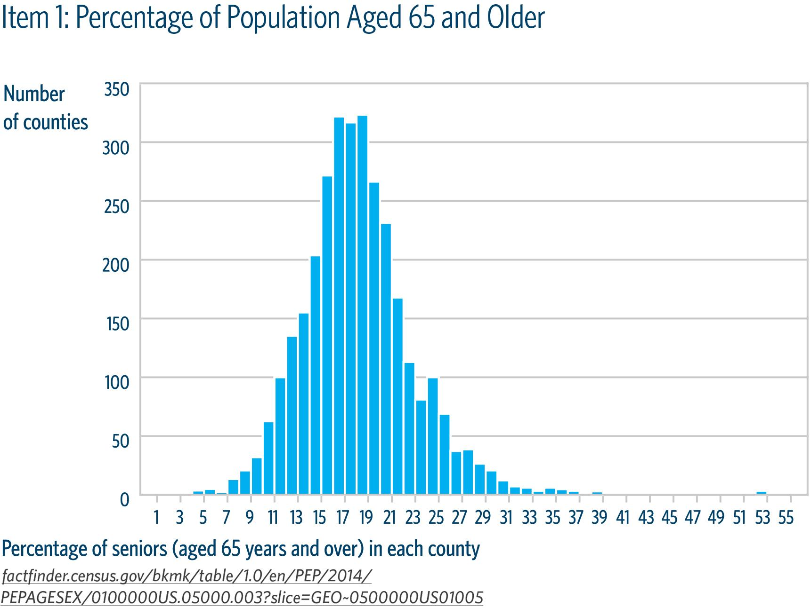

## Table of Contents

## What is a histogram and how does it differ from other types of charts?

A histogram is a type of chart that shows how often different values occur in a set of data. It looks like a series of bars, where each bar represents a range of values, called bins. The height of each bar shows how many times values in that bin appear in the data. For example, if you want to see how many students got different scores on a test, a histogram can show you how many got scores between 0-10, 11-20, and so on.

Histograms are different from other charts like bar graphs and pie charts. A bar graph can show categories, like the number of students in different classes, while a histogram shows continuous data, like test scores. A pie chart shows parts of a whole, like the percentage of students who like different subjects. Unlike a bar graph, the bars in a histogram are always touching because the data is continuous, not separate categories. This makes histograms useful for seeing the shape and spread of data, which can help in understanding patterns and making decisions.

## What kind of data is best suited for visualization using a histogram?

Histograms are best for showing how often different values happen in a set of data that is continuous. Continuous data means it can have any value within a range, like height, weight, or time. For example, if you want to see how long it takes students to finish a test, a histogram can show you how many students took between 10-20 minutes, 21-30 minutes, and so on. This helps you see if most students finished quickly or if it took a long time for everyone.

You can also use histograms for data that is measured in numbers, like test scores or temperatures. They are good for showing if the data is spread out evenly or if it clumps together in certain places. For instance, if you're looking at the ages of people in a town, a histogram can show you if most people are young, old, or if there's a mix of ages. This can help you understand the overall pattern of the data easily.

## How do you construct a basic histogram?

To make a basic histogram, first gather your data. This should be numbers that can be put into groups, like test scores or ages. Decide how many groups, or bins, you want to use. For example, if you're looking at test scores from 0 to 100, you might choose bins like 0-10, 11-20, and so on. Count how many data points fall into each bin. If three students scored between 71 and 80, then the bin for 71-80 would have a count of three.

Next, draw your histogram. On the bottom of your graph, called the x-axis, write the range of each bin. On the side of your graph, called the y-axis, write numbers to show how many data points are in each bin. Draw a bar for each bin, making the height of the bar match the number of data points in that bin. If the 71-80 bin has three students, the bar for that bin would go up to the number three on the y-axis. Make sure the bars touch each other because the data is continuous. Now you have a histogram that shows how your data is spread out.

## What are the key components of a histogram?

A histogram has a few important parts that help show the data clearly. The first part is the x-axis, which is the bottom line of the graph. It shows the different groups, or bins, that the data is divided into. For example, if you're looking at test scores, the x-axis might show bins like 0-10, 11-20, and so on. The second part is the y-axis, which is the side line of the graph. It shows how many data points are in each bin. If three students scored between 71 and 80, the y-axis would show the number three for that bin.

The third part of a histogram is the bars. Each bar represents one bin from the x-axis, and the height of the bar shows the number of data points in that bin, which is read from the y-axis. The bars in a histogram always touch each other because the data is continuous, not separate categories. This makes it easy to see the shape and spread of the data. For example, if most bars are tall in the middle and shorter on the sides, it means the data is grouped around the middle value.

## How do you choose the appropriate number of bins for a histogram?

Choosing the right number of bins for a histogram is important because it can change how the data looks. If you use too few bins, the histogram might not show enough detail about the data. For example, if you're looking at test scores and only use two bins, like 0-50 and 51-100, you won't see if most students scored around 40 or 70. On the other hand, if you use too many bins, the histogram can look messy and hard to understand. If you use 20 bins for the same test scores, each bin might only have a few students, making it hard to see the overall pattern.

A good way to choose the number of bins is to start with a guess and then adjust it. You can use a rule called the square root rule, which says to use the square root of the number of data points as the number of bins. For example, if you have 100 test scores, the square root of 100 is 10, so you could start with 10 bins. Then, look at the histogram and see if it shows the data clearly. If it looks too simple or too complicated, try using a few more or fewer bins until the histogram helps you understand the data well.

## What are the common pitfalls to avoid when creating histograms?

One common mistake when making histograms is choosing the wrong number of bins. If you use too few bins, the histogram might not show the important details in the data. For example, if you're looking at test scores and only use a few big bins, you won't see where most students scored. On the other hand, if you use too many bins, the histogram can look messy and hard to understand. It's good to start with a guess, like using the square root of the number of data points, and then adjust until the histogram shows the data clearly.

Another pitfall to avoid is not making the bars touch each other. In a histogram, the bars should always be touching because the data is continuous, not separate categories. If the bars are spaced apart, it can look like a bar graph instead, which is used for different kinds of data. Also, make sure the bins are the same size. If one bin covers a bigger range of numbers than another, it can make the data look wrong. Keeping the bins the same size helps show the true pattern of the data.

## How can histograms be used to identify the distribution of data?

Histograms are a great way to see how data is spread out. When you look at a histogram, you can tell if the data is spread evenly, or if it's grouped together in certain places. For example, if most of the bars in the histogram are tall in the middle and shorter on the sides, it means the data is clumped around the middle value. This shape is called a normal distribution, and it looks like a bell. If the data is spread out evenly across all the bins, it might mean the data is uniform.

Sometimes, histograms can show if the data is leaning to one side. If the bars are taller on the left side and shorter on the right, it means the data is skewed to the right. This means there are a few high values that are pulling the data that way. If the bars are taller on the right and shorter on the left, the data is skewed to the left, meaning there are a few low values pulling the data that way. By looking at the shape of the histogram, you can understand the distribution of the data and make better decisions based on it.

## What advanced techniques can be used to enhance the information conveyed by histograms?

One way to make histograms more useful is by adding a cumulative frequency line. This line shows how the total number of data points adds up as you go through the bins. It can help you see not just how many data points are in each bin, but also how many are in that bin and all the bins before it. For example, if you're looking at test scores, the cumulative frequency line can show you how many students scored below a certain number. This can be really helpful for understanding where most of the data falls.

Another advanced technique is using different colors or shading for the bars to show more than one set of data on the same histogram. For example, if you want to compare test scores from two different classes, you can use one color for one class and another color for the other class. This way, you can see how the scores are spread out for each class and compare them easily. You can also use this to show different groups within the same data, like boys and girls in a class, to see if there are any differences in their scores.

## How can you compare multiple datasets using histograms?

You can compare multiple datasets using histograms by putting them on the same graph. Use different colors or patterns for the bars of each dataset so you can tell them apart. For example, if you want to compare test scores from two classes, you can use blue bars for one class and red bars for the other. This way, you can see how the scores are spread out for each class and compare them easily. If the blue bars are taller in the middle and the red bars are taller on the right side, it means the first class did better overall, but the second class had some students who scored very high.

Another way to compare multiple datasets is by putting the histograms side by side. Each histogram would show one dataset, and you can look at them next to each other to see the differences. For example, if you're comparing the ages of people in two different towns, you can have one histogram for Town A and another for Town B. If the bars in the histogram for Town A are taller on the left side and the bars for Town B are taller on the right side, it means Town A has more young people and Town B has more old people. This helps you understand how the data is different between the two places.

## What are the best practices for labeling and annotating histograms?

When labeling a histogram, it's important to clearly show what the x-axis and y-axis represent. The x-axis should be labeled with the range of each bin, like "Test Scores" or "Ages," so people know what the bars are showing. The y-axis should be labeled with the number of data points, like "Number of Students" or "Frequency," so people can see how many items are in each bin. Make sure the labels are easy to read and not too small. It's also helpful to add a title to the histogram, like "Distribution of Test Scores," so people know right away what the graph is about.

Annotations can make a histogram even more useful. You can add text or arrows to point out important parts of the data, like where most of the data is clumped or if there are any unusual high or low values. For example, you might add a note saying "Most students scored between 70 and 80" if that's where the tallest bar is. If you're comparing multiple datasets, you can use a legend to explain what the different colors or patterns mean. This helps people understand the data better and see the patterns more clearly.

## How do statistical software tools support the creation and analysis of histograms?

Statistical software tools like Excel, R, and Python make it easy to create and analyze histograms. These tools let you put your data into the program and then quickly turn it into a histogram. You can choose how many bins to use and even change the colors of the bars. For example, in Excel, you can highlight your data, go to the "Insert" tab, and click on "Histogram" to make a graph. In R or Python, you can use commands to tell the computer to make a histogram with your data. These tools also let you save your histogram as a picture or in a report, so you can share it with others easily.

These software tools also help you analyze the data in the histogram. They can show you things like the average, the middle value, and how spread out the data is. For example, R and Python can give you numbers that tell you if the data is normal or skewed. You can also add lines to the histogram, like a cumulative frequency line, to see more about how the data is spread out. These tools make it easier to understand the data and see patterns that might be hard to notice just by looking at the numbers.

## What are some real-world applications where histograms have provided critical insights?

In healthcare, histograms are used to understand how long patients wait in the emergency room. By looking at a histogram of wait times, doctors and hospital managers can see if most patients are seen quickly or if there are long waits. This helps them figure out if they need more staff or if they can change how they work to make things better. For example, if the histogram shows a lot of patients waiting over two hours, the hospital might decide to add more doctors during busy times to help patients faster.

In business, histograms help companies understand how much money they make from different products. If a company sells many types of shoes, they can use a histogram to see which price ranges are most popular. If the histogram shows that most shoes sell between $50 and $100, the company might decide to focus on making more shoes in that price range. This helps them make more money by selling what customers want to buy.

## What is the Role of Histograms in Algorithmic Trading?

In [algorithmic trading](/wiki/algorithmic-trading), histograms are crucial for technical analysis, allowing traders to interpret complex market data efficiently. One of the key applications of histograms in this field is their use in analyzing the Moving Average Convergence Divergence (MACD) indicator. The MACD histogram effectively visualizes the difference between the MACD line and the signal line, which provides insights into the [momentum](/wiki/momentum) of a security.

To understand the MACD histogram, it's essential to recognize its components. The MACD line is calculated by subtracting the 26-period exponential moving average (EMA) from the 12-period EMA. The signal line is usually a 9-period EMA of the MACD line. The histogram is then calculated as:

$$
\text{MACD Histogram} = \text{MACD Line} - \text{Signal Line}
$$

An increase in the MACD histogram indicates that the MACD line is diverging further from the signal line, suggesting an increase in upward momentum. Conversely, a decreasing histogram signifies that the MACD line is converging toward the signal line, implying downward momentum.

Histograms aid traders by visualizing these shifts in momentum, allowing them to identify buy and sell signals more quickly than relying on the MACD and signal lines alone. For instance, when the MACD histogram moves from negative to positive, it can be considered a bullish signal, suggesting a potential buy opportunity. On the other hand, when the histogram transitions from positive to negative, it may suggest bearish sentiments, prompting a sell action.

Python is commonly used to implement these concepts in algorithmic trading. An example of computing and plotting the MACD histogram using Python and the `matplotlib` library is shown below:

```python
import numpy as np
import pandas as pd
import matplotlib.pyplot as plt

# Sample price data
prices = [110, 112, 115, 113, 112, 115, 118, 120, 119, 123, 125, 128]

# Calculate EMAs
exp1 = pd.Series(prices).ewm(span=12, adjust=False).mean()
exp2 = pd.Series(prices).ewm(span=26, adjust=False).mean()

# Compute MACD and Signal Line
macd_line = exp1 - exp2
signal_line = macd_line.ewm(span=9, adjust=False).mean()
macd_histogram = macd_line - signal_line

# Plotting MACD Histogram
plt.figure(figsize=(10, 5))
plt.bar(range(len(macd_histogram)), macd_histogram, label='MACD Histogram')
plt.plot(macd_line, label='MACD Line', color='blue')
plt.plot(signal_line, label='Signal Line', color='red')
plt.title('MACD Histogram')
plt.legend(loc='upper left')
plt.show()
```

This Python code illustrates how to calculate and visualize the MACD histogram, demonstrating its application in real-world trading scenarios. By effectively utilizing histograms, traders can enhance their ability to identify and leverage market opportunities, supporting informed decision-making in algorithmic trading strategies.

## References & Further Reading

[1]: Bergstra, J., Bardenet, R., Bengio, Y., & Kégl, B. (2011). ["Algorithms for Hyper-Parameter Optimization."](https://dl.acm.org/doi/10.5555/2986459.2986743) Advances in Neural Information Processing Systems 24.

[2]: ["Advances in Financial Machine Learning"](https://www.amazon.com/Advances-Financial-Machine-Learning-Marcos/dp/1119482089) by Marcos Lopez de Prado

[3]: ["Evidence-Based Technical Analysis: Applying the Scientific Method and Statistical Inference to Trading Signals"](https://www.amazon.com/Evidence-Based-Technical-Analysis-Scientific-Statistical/dp/0470008741) by David Aronson

[4]: ["Machine Learning for Algorithmic Trading"](https://github.com/stefan-jansen/machine-learning-for-trading) by Stefan Jansen

[5]: ["Quantitative Trading: How to Build Your Own Algorithmic Trading Business"](https://books.google.com/books/about/Quantitative_Trading.html?id=j70yEAAAQBAJ) by Ernest P. Chan