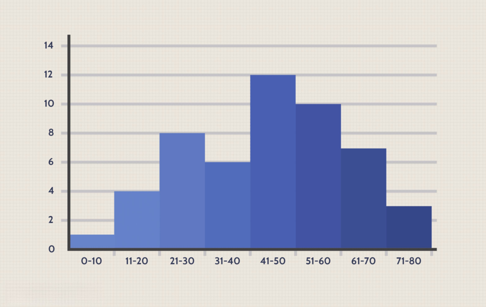

In today's data-driven world, effective data visualization is essential for making informed decisions. This is especially evident in algorithmic trading, where traders rely heavily on statistical data visualization to interpret complex data, detect patterns, and make strategic decisions. 

One of the most common forms of data visualization employed by traders is the histogram. This tool assists in understanding the distribution of data points across specified intervals, providing a visual representation that simplifies the interpretation of large datasets. By grouping data into set intervals, histograms offer an intuitive way to display frequency distributions, making them invaluable in both statistical analysis and trading.



This article will examine the role of histograms and other visualization techniques in algorithmic trading, with a focus on how these tools aid in making accurate trading decisions. We will cover the fundamentals of histograms, outline their differences from bar charts, and explore their applications in technical analysis. Furthermore, we will discuss how algorithmic trading benefits from robust data visualization techniques, which are supported by the right tools and software. These visualization methods empower traders to better interpret market dynamics and improve their decision-making processes.

## Table of Contents

## Understanding Histograms in Data Visualization

A histogram is a powerful graphical representation that organizes a group of data points into user-specified ranges. By aggregating individual data points into specified intervals or "bins," histograms offer an intuitive way to visualize the distribution of data across a dataset. This enables the comprehension of large volumes of data, simplifying the identification of patterns and trends. 

In statistics, histograms prove indispensable for understanding the frequency of variables within set ranges. Unlike a simple list or table, which may overwhelm with detail, a histogram provides an aggregated view that highlights the concentration of data points across different segments of the dataset. Each bin accumulates the frequency of data points falling within that range, forming the basis of the histogram's bars.

Though bearing visual similarities, histograms should not be confused with bar charts. The primary difference lies in the type of data each chart represents. Histograms are designed for continuous data, where each bar represents a frequency or density of data within a continuous interval, and there are no gaps between bars. This continuous nature contrasts with bar charts, which depict categorical data with distinct, discrete groups, typically separated by gaps to emphasize their categorical nature.

In practice, constructing a histogram begins with determining the range of the dataset and dividing it into equal intervals. The number of bins can significantly affect the histogram's readability and interpretability. Few bins might oversimplify the data, obscuring important details, while too many can complicate the analysis by introducing noise.

Consider a Python example using the popular library Matplotlib to create a simple histogram:

```python
import matplotlib.pyplot as plt

# Sample data
data = [23, 45, 56, 78, 12, 23, 44, 55, 14, 15, 67, 68, 29, 75]

# Create a histogram with 5 bins
plt.hist(data, bins=5, edgecolor='black')

# Labeling the axes and title
plt.xlabel('Value Range')
plt.ylabel('Frequency')
plt.title('Histogram Example')

# Display the plot
plt.show()
```

This code snippet illustrates the straightforward process of generating a histogram with Python. The `plt.hist` function automatically calculates the frequency of data points within the defined bins, displaying a clear visualization that enhances data interpretability.

In finance and trading, the application of histograms goes beyond simple frequency calculation. They are utilized to analyze price distributions, [volatility](/wiki/volatility-trading-strategies), and the probability of price movements over specified periods. This makes them an invaluable tool for traders seeking to gain insights into market conditions, detect potential opportunities, and effectively manage risk.

## The Role of Histograms in Algorithmic Trading

In [algorithmic trading](/wiki/algorithmic-trading), histograms are crucial for technical analysis, allowing traders to interpret complex market data efficiently. One of the key applications of histograms in this field is their use in analyzing the Moving Average Convergence Divergence (MACD) indicator. The MACD histogram effectively visualizes the difference between the MACD line and the signal line, which provides insights into the [momentum](/wiki/momentum) of a security.

To understand the MACD histogram, it's essential to recognize its components. The MACD line is calculated by subtracting the 26-period exponential moving average (EMA) from the 12-period EMA. The signal line is usually a 9-period EMA of the MACD line. The histogram is then calculated as:

$$
\text{MACD Histogram} = \text{MACD Line} - \text{Signal Line}
$$

An increase in the MACD histogram indicates that the MACD line is diverging further from the signal line, suggesting an increase in upward momentum. Conversely, a decreasing histogram signifies that the MACD line is converging toward the signal line, implying downward momentum.

Histograms aid traders by visualizing these shifts in momentum, allowing them to identify buy and sell signals more quickly than relying on the MACD and signal lines alone. For instance, when the MACD histogram moves from negative to positive, it can be considered a bullish signal, suggesting a potential buy opportunity. On the other hand, when the histogram transitions from positive to negative, it may suggest bearish sentiments, prompting a sell action.

Python is commonly used to implement these concepts in algorithmic trading. An example of computing and plotting the MACD histogram using Python and the `matplotlib` library is shown below:

```python
import numpy as np
import pandas as pd
import matplotlib.pyplot as plt

# Sample price data
prices = [110, 112, 115, 113, 112, 115, 118, 120, 119, 123, 125, 128]

# Calculate EMAs
exp1 = pd.Series(prices).ewm(span=12, adjust=False).mean()
exp2 = pd.Series(prices).ewm(span=26, adjust=False).mean()

# Compute MACD and Signal Line
macd_line = exp1 - exp2
signal_line = macd_line.ewm(span=9, adjust=False).mean()
macd_histogram = macd_line - signal_line

# Plotting MACD Histogram
plt.figure(figsize=(10, 5))
plt.bar(range(len(macd_histogram)), macd_histogram, label='MACD Histogram')
plt.plot(macd_line, label='MACD Line', color='blue')
plt.plot(signal_line, label='Signal Line', color='red')
plt.title('MACD Histogram')
plt.legend(loc='upper left')
plt.show()
```

This Python code illustrates how to calculate and visualize the MACD histogram, demonstrating its application in real-world trading scenarios. By effectively utilizing histograms, traders can enhance their ability to identify and leverage market opportunities, supporting informed decision-making in algorithmic trading strategies.

## Advanced Data Visualization Techniques in Algorithmic Trading

Beyond the use of histograms, algorithmic trading strategies benefit significantly from advanced data visualization techniques that offer a more comprehensive analysis of market data. Time-series charts, such as line charts and candlestick charts, are crucial for illustrating market trends and detecting potential trading opportunities over a period. These charts display data points at successive time intervals, helping traders to understand trends and cycles in market behavior.

Advanced visualization techniques, including heatmaps, scatter plots, and interactive dashboards, provide additional dimensions of analysis. Heatmaps are powerful tools for representing data density and intensity. In trading, they can be used to visualize [volume](/wiki/volume-trading-strategy) or volatility, highlighting areas of high activity across different time intervals or assets. Scatter plots facilitate the examination of relationships between two numerical variables, often used to detect correlation or causation in trading metrics.

Interactive dashboards integrate multiple data visualization techniques into a cohesive interface, offering traders the ability to interact with data dynamically. These dashboards can display a variety of charts and plots concurrently, enabling traders to explore various datasets and draw insights without needing to switch contexts.

Several tools facilitate the creation of these dynamic and impactful visualizations. Matplotlib, a Python library, is widely used for creating static, interactive, and animated visualizations. It provides a simple but efficient interface for generating plots that are both high in quality and highly customizable. Plotly, another Python library, excels in producing interactive graphs that can be embedded into web applications. Its capability to build dashboards makes it a favorite among traders who need real-time data interaction. Tableau is a powerful analytics platform that simplifies complex data into accessible and actionable visualizations, making it possible to build stories around data insights with minimal technical expertise.

By employing these advanced data visualization techniques, traders can better interpret complex datasets, which enhances the decision-making process and contributes to more effective trading strategies.

## Best Practices for Effective Data Visualization in Trading

For data visualizations to be effective in trading environments, certain best practices should be adhered to. These practices ensure that traders can fully leverage visualization tools to make informed and timely decisions. 

Clarity and simplicity stand at the forefront of these practices. The primary aim is to present data in a straightforward manner that avoids overwhelming the viewer with superfluous details. A well-designed chart succinctly communicates insights, making it a powerful tool for decision-making.

Choosing the appropriate chart type is crucial. Charts need to align with the nature of the data presented for the story to be meaningful and easily digestible. For instance, line charts are excellent for displaying trends over time, while bar charts are better suited for comparing quantities. Misalignment between chart type and data can lead to misunderstandings or overlooked insights.

Consistency in scales and labeling across all visualizations is essential for immediate comprehension. When scales or labels vary without clear indication, it can lead to misinterpretation, potentially skewing trading strategies. Consistent scales and well-defined legends or titles help ensure that viewers can interpret data quickly and accurately.

Color usage is another critical [factor](/wiki/factor-investing) in crafting effective visualizations. Colors should be used strategically to highlight key data points or trends without being distracting. Accessibility considerations, such as accommodating users with color blindness, are essential. Tools like color-blind-friendly palettes ensure visualizations are inclusive to all viewers.

Interactivity is another valuable dimension in data visualizations, allowing users to engage more deeply with data. Interactive features, such as hover functions or clickable elements, provide traders with the ability to conduct real-time analysis. This level of engagement can reveal deeper insights, facilitating more nuanced understanding of market dynamics.

Moreover, tools like Python's Matplotlib or Plotly can be tailored to include these best practices in visualizations. For example, implementing an interactive candlestick chart can be done with Plotly:

```python
import plotly.graph_objects as go

fig = go.Figure(data=[go.Candlestick(x=stock_data['Date'],
                open=stock_data['Open'], high=stock_data['High'],
                low=stock_data['Low'], close=stock_data['Close'])])

fig.update_layout(xaxis_title='Date',
                  yaxis_title='Stock Price',
                  title='Interactive Candlestick Chart',
                  template="plotly_white")

fig.show()
```

This code snippet sets up an interactive candlestick chart, demonstrating the use of clarity, appropriate chart type, and interactivity to enhance trading data visualization.

By adhering to these best practices, traders can enhance their ability to interpret and act upon market data effectively, bolstering their decision-making and strategic capabilities.

## Conclusion

Data visualization, particularly through histograms and advanced techniques, forms an essential part of algorithmic trading strategies. It allows traders to convert extensive amounts of complex data into actionable insights, facilitating efficient interpretation of market dynamics. Histograms, for instance, provide a visual depiction of the frequency distribution of data, which is crucial in understanding market volatility and trends. By analyzing these patterns, traders can make informed decisions about entering or exiting trades.

When traders adhere to best practices in data visualization, they enhance the clarity and interpretability of the information presented. This involves using clear and simple chart types, maintaining consistent scales, and ensuring appropriate use of colors. These practices prevent misinterpretation and allow traders to focus on the most critical aspects of market data.

Moreover, leveraging powerful visualization tools such as Matplotlib, Plotly, and Tableau enables traders to create dynamic and interactive visualizations. These tools assist in uncovering intricate patterns and correlations within data that might otherwise remain unnoticed. By integrating real-time data and interactive elements, traders can engage more deeply with the information, providing deeper insights crucial for strategic decision-making.

In conclusion, mastering data visualization is not just beneficial but essential for anyone engaged in algorithmic trading. It bridges the gap between complex data sets and actionable market insights, streamlining the decision-making process and enhancing overall trading strategies. Effective visualization empowers traders to navigate the fast-paced trading environment more efficiently, ultimately leading to improved outcomes and strategy effectiveness.

## References & Further Reading

[1]: Bergstra, J., Bardenet, R., Bengio, Y., & Kégl, B. (2011). ["Algorithms for Hyper-Parameter Optimization."](https://dl.acm.org/doi/10.5555/2986459.2986743) Advances in Neural Information Processing Systems 24.

[2]: ["Advances in Financial Machine Learning"](https://www.amazon.com/Advances-Financial-Machine-Learning-Marcos/dp/1119482089) by Marcos Lopez de Prado

[3]: ["Evidence-Based Technical Analysis: Applying the Scientific Method and Statistical Inference to Trading Signals"](https://www.amazon.com/Evidence-Based-Technical-Analysis-Scientific-Statistical/dp/0470008741) by David Aronson

[4]: ["Machine Learning for Algorithmic Trading"](https://github.com/stefan-jansen/machine-learning-for-trading) by Stefan Jansen

[5]: ["Quantitative Trading: How to Build Your Own Algorithmic Trading Business"](https://books.google.com/books/about/Quantitative_Trading.html?id=j70yEAAAQBAJ) by Ernest P. Chan