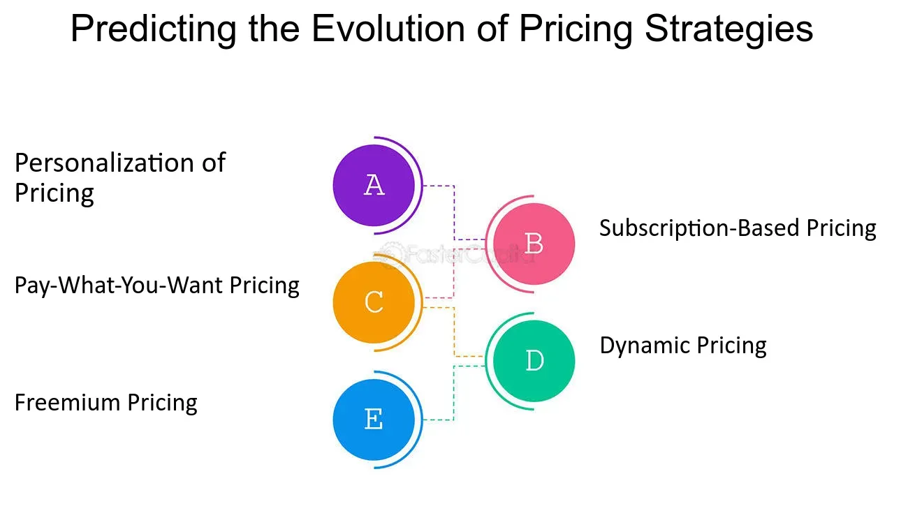

## Table of Contents

## What is historic pricing?

Historic pricing is when a business looks at the prices of their products or services from the past. They do this to see how prices have changed over time. This can help them understand if their prices were too high or too low before, and it can guide them in setting future prices.

By looking at historic pricing, a business can also see how their prices compare to what their competitors were charging in the past. This information can be very useful for making smart decisions about pricing strategies. It helps businesses stay competitive and make sure they are not losing money or customers because of their prices.

## Why is historic pricing important in economics?

Historic pricing is important in economics because it helps us understand how prices have changed over time. By looking at old prices, economists can see patterns and trends that tell us a lot about the economy. For example, if prices for a certain product went up a lot in the past, it might mean that the product became more popular or that it cost more to make. This information helps economists predict what might happen to prices in the future.

Another reason historic pricing is important is that it helps businesses make better decisions. When a company knows what prices were like in the past, they can set their current prices in a way that makes sense. For instance, if a business sees that their prices were too high last year and they lost customers, they might lower their prices now to attract more buyers. This way, historic pricing helps businesses stay competitive and make more money.

Overall, historic pricing gives us a clear picture of the economy's past, which is crucial for understanding its present and future. It's like looking at a map of where we've been to figure out where we're going. Economists and businesses use this information to make smart choices that affect everyone who buys and sells things.

## How does historic pricing differ from current market pricing?

Historic pricing looks at what prices were in the past. It helps us understand how much things cost before and how those prices changed over time. By studying historic pricing, businesses and economists can see patterns and learn from what happened in the past. For example, if the price of a toy went up a lot last year, it might mean that the toy became very popular or that it cost more to make.

Current market pricing, on the other hand, is about what things cost right now. It tells us how much we have to pay for products and services today. Businesses use current market pricing to set their prices in a way that makes sense for today's market. They look at what their competitors are charging and what customers are willing to pay now. This helps them stay competitive and make more money.

Both historic pricing and current market pricing are important, but they serve different purposes. Historic pricing gives us a look back at what happened and helps us learn from the past. Current market pricing focuses on the present and helps businesses make decisions that work right now. Together, they give a full picture of how prices work and change over time.

## What are the common sources of historic pricing data?

Common sources of historic pricing data include old sales records from businesses. These records show what prices were in the past for different products and services. Companies keep these records to track how their prices have changed over time. Another source is government data. Governments collect information about prices and publish it in reports and databases. These can be found online or in libraries and are useful for looking at how prices have changed across different areas and industries.

Economists and researchers also use old newspapers and magazines to find historic pricing data. These publications often list prices for common goods like food, clothing, and housing. By looking at these old ads and articles, people can see what things cost years ago. Additionally, auction records and price guides for collectibles and antiques provide historic pricing information. These records show what people were willing to pay for items at different times in the past, which can be very helpful for understanding how the value of goods has changed.

## How can historic pricing be used to predict future price trends?

Historic pricing helps us guess what might happen to prices in the future by showing us patterns from the past. When we look at how prices changed over time, we can see if they usually go up, down, or stay the same. For example, if the price of a toy always goes up around the holidays, we can predict that it might go up again next holiday season. This helps businesses plan their prices and helps people decide when to buy things.

Another way historic pricing helps predict future trends is by showing us how prices react to big events. If prices went up a lot during a past economic crisis, we might expect them to do the same if another crisis happens. By understanding these patterns, businesses and economists can make better guesses about what will happen next. This information is really useful for making smart choices about buying and selling things in the future.

## What are the key mechanisms involved in collecting historic pricing data?

Collecting historic pricing data involves several steps. First, businesses and organizations gather old sales records. These records show what prices were in the past for different products and services. Companies keep these records to track how their prices have changed over time. Government agencies also collect pricing data and publish it in reports and databases. These can be found online or in libraries and are useful for looking at how prices have changed across different areas and industries.

Another important source of historic pricing data is old newspapers and magazines. These publications often list prices for common goods like food, clothing, and housing. By looking at these old ads and articles, people can see what things cost years ago. Additionally, auction records and price guides for collectibles and antiques provide historic pricing information. These records show what people were willing to pay for items at different times in the past, which can be very helpful for understanding how the value of goods has changed.

All these sources together help create a detailed picture of historic pricing. By carefully collecting and organizing this data, businesses and economists can study past price trends and use them to make better decisions about the future. This process requires careful attention to detail and a good understanding of where to find reliable information.

## How do inflation and deflation affect historic pricing analysis?

Inflation and deflation are big changes in prices that can make historic pricing analysis tricky. Inflation means that prices go up over time. When we look at old prices during inflation, they seem really low compared to today. For example, if a toy cost $10 twenty years ago and it costs $20 now, it might look like the price doubled. But if there was a lot of inflation, maybe the real value of that toy didn't change much at all. So, we need to adjust old prices for inflation to get a true picture of how prices have changed.

Deflation is the opposite of inflation; it means prices go down over time. If we see that prices were higher in the past, it might be because of deflation. For example, if a computer cost $2000 ten years ago and now it costs $1000, it looks like the price dropped a lot. But if there was deflation, the real value might not have changed as much as it seems. Just like with inflation, we need to adjust for deflation to understand how prices really changed. By considering inflation and deflation, we can make better sense of historic pricing and see the true trends in how prices have moved over time.

## What are the challenges in maintaining accurate historic pricing records?

Keeping accurate historic pricing records can be tough because old data can get lost or damaged over time. Paper records might get torn, wet, or fade away. Even digital records can be lost if they are saved on old computers or if the files get corrupted. Sometimes, businesses change their record-keeping systems, which makes it hard to find old information. Also, if a company goes out of business, their old pricing records might disappear completely.

Another challenge is making sure the old prices are right. Sometimes, the numbers written down might have mistakes or be hard to read. If the records are in old formats or use old money, like pounds and shillings, it can be hard to understand them today. Also, when prices change a lot because of inflation or deflation, it can be tricky to compare them to today's prices. All these things make it hard to keep and use historic pricing records accurately.

## How does historic pricing influence long-term investment strategies?

Historic pricing helps people make smart choices about long-term investments. When people look at how prices changed in the past, they can see patterns that help them guess what might happen in the future. For example, if the price of a stock always goes up around the same time every year, an investor might decide to buy that stock before that time to make money. By studying historic pricing, investors can pick the best times to buy and sell things, which can help them make more money over many years.

Another way historic pricing affects long-term investment strategies is by showing how big events, like economic crises, change prices. If prices dropped a lot during past crises, investors might be careful and not put all their money into one thing. They might spread their money around to different investments to be safer. Understanding how prices reacted in the past helps investors plan for the future and make choices that protect their money and help it grow over time.

## What role does technology play in analyzing historic pricing data?

Technology makes it easier to look at old prices and understand them. Computers and special software can take lots of old numbers and organize them quickly. This helps people see patterns and trends that would be hard to find by just looking at papers or old records. For example, a computer can show a graph of how the price of a toy changed over many years, making it easy to see if the price went up or down.

Also, technology helps fix problems with old data. Sometimes, old prices are written down wrong or are hard to read. Special computer programs can clean up this data, making it more accurate. This is important because it helps people trust the information they are using to make decisions. With technology, analyzing historic pricing data becomes faster and more reliable, helping businesses and investors make better choices.

## How can historic pricing be integrated into financial modeling?

Historic pricing can be added to financial models to help make better predictions about the future. When making a financial model, people look at how prices changed in the past to guess how they might change in the future. For example, if the price of a product always goes up during the holiday season, a financial model can use this information to predict that the price might go up again next holiday season. By including historic pricing data, the model can show how prices might move over time, helping businesses plan their budgets and strategies.

Technology makes it easier to include historic pricing in financial models. Special software can take lots of old pricing data and put it into the model quickly. This software can also clean up any mistakes in the old data, making sure the model uses accurate information. By using technology, financial models can be more reliable and help businesses make smarter decisions about their money and investments.

## What advanced statistical methods are used to interpret historic pricing data?

Advanced statistical methods help us understand historic pricing data better. One common method is time series analysis, which looks at how prices change over time. This method can find patterns like seasonal changes or long-term trends. For example, it can show if the price of a toy goes up every holiday season or if the price of a stock slowly goes up over many years. Another method is regression analysis, which helps us see how different things affect prices. It can show if the price of a product goes up when there is more demand or if it goes down when there is a lot of competition.

Another important method is the use of moving averages, which smooth out price changes to make trends easier to see. For example, a 12-month moving average can show the overall trend of a product's price without getting confused by short-term ups and downs. Additionally, economists sometimes use more complex methods like ARIMA (AutoRegressive Integrated Moving Average) models. These models are good at predicting future prices based on past patterns. By using these advanced statistical methods, we can make better guesses about how prices might change in the future and make smarter decisions about buying and selling things.

## What is Historic Pricing: An Overview?

Historic pricing refers to the methodology of valuing financial assets based on historical performance and specific valuation points. In earlier economic history, prior to the advent of real-time data analysis tools and technologies, historic pricing served as a fundamental approach due to the absence of instant asset valuation capabilities. Financial markets relied heavily on historic pricing, which involved assessing assets based on past trends and data sets, to guide investment decisions and market predictions.

During this period, real-time asset valuation posed significant challenges due to limited technological infrastructure and the slow dissemination of market data. As a result, historic pricing emerged as a practical solution. It allowed investors to value stocks, bonds, and other financial instruments by considering historical price trends, earnings reports, and economic conditions over determined periods.

One practical application of historic pricing was in the calculation of the net asset value (NAV) of investment funds, particularly mutual funds. The NAV represents the per-share value of a mutual fund, and it is traditionally computed based on the closing prices of the securities held in the fund's portfolio. This computation relies on static historic pricing data to determine the fund's value at a specific past time, providing investors with the necessary information to appraise their investments.

Mathematically, the NAV can be represented as:

$$
\text{NAV} = \frac{\text{Total Assets} - \text{Total Liabilities}}{\text{Number of Outstanding Shares}}
$$

Here, 'Total Assets' and 'Total Liabilities' are calculated from historical valuations of the assets within the fund. Historic pricing thus provides the backbone for such calculations, offering a snapshot of financial status before real-time systems were feasible.

The foundational role of historic pricing in traditional financial markets cannot be overstated. It provided a structured methodology for investors to make informed decisions based on observable data over time and contributed to shaping the analytical frameworks still in use today. As markets transitioned to more sophisticated pricing methods, historic pricing laid essential groundwork, integrating elements like past performance trends into forward-looking analyses and modern trading strategies.

## What is the relationship between Economic History and Pricing Mechanisms?

Pricing mechanisms have always been central to economic theories, closely intertwined with the fluctuations of supply, demand, and market efficiency. Historically, these mechanisms have been continually shaped by pivotal economic events and policy shifts.

**Gold Standard**

The Gold Standard was a major influence in establishing pricing mechanisms in the late 19th and early 20th centuries. It tied the value of a country's currency directly to a specific amount of gold, thus standardizing the exchange rates and stabilizing international trade. Under the Gold Standard, currency value was intrinsically linked to gold reserves, making prices relatively stable in the international market. However, this system was inflexible during economic downturns because it restricted governments from effectively adjusting the money supply to respond to changing economic conditions.

**The Great Depression**

The Great Depression of the 1930s was another critical event that forced a reevaluation of pricing mechanisms. The collapse of financial markets brought about severe deflationary pressures, disrupting traditional pricing methods. This period highlighted the limitations of the Gold Standard, as countries were unable to stimulate their economies due to fixed currency values. As a response, many abandoned the Gold Standard, transitioning towards fiat money systems that allowed more flexible monetary policies. This shift underscored the need for pricing mechanisms that could accommodate economic fluctuations more dynamically.

**Advanced Financial Instruments**

With the advent of more sophisticated financial instruments in the latter half of the 20th century, pricing mechanisms further evolved. Derivatives, options, and futures introduced complex mathematical models into the sphere of pricing. These instruments required an understanding of probabilistic risk and time value of money, leading to the development of models like the Black-Scholes for option pricing. These models integrated various economic factors to determine asset prices, incorporating [volatility](/wiki/volatility-trading-strategies) and market expectations as crucial components. 

Mathematically, such models are often based on stochastic differential equations. An example of the Black-Scholes model for a European call option is:

$$
C(S, t) = S_t N(d_1) - K e^{-r(T-t)} N(d_2)
$$

where:
- $S$ is the current stock price,
- $K$ is the strike price,
- $T$ is the time to maturity,
- $r$ is the risk-free interest rate,
- $N$ is the cumulative distribution function of the standard normal distribution,
- $d_1$ and $d_2$ are intermediary calculations used in the formula.

These developments marked a significant departure from simple supply-demand equilibrium models, emphasizing the increasing role of prediction and risk management in economic pricing strategies.

In conclusion, historical events and the transition to more advanced financial instruments have profoundly influenced pricing mechanisms in economics. These changes have paved the way for contemporary models that better reflect complex market dynamics and economic realities.

## References & Further Reading

[1]: Smith, Adam. (1776). ["The Wealth of Nations."](https://en.wikipedia.org/wiki/The_Wealth_of_Nations) 

[2]: Ricardo, David. (1817). ["On the Principles of Political Economy and Taxation."](https://www.cambridge.org/core/books/on-the-principles-of-political-economy-and-taxation/5C17BF2152379956950601EFE05AE14F) 

[3]: Hull, John C. (2017). ["Options, Futures, and Other Derivatives."](https://www.semanticscholar.org/paper/Options%2C-Futures%2C-and-Other-Derivatives-Hull/89bdee500c8623864fc9eb7a471546aa713acc44) Pearson.

[4]: Black, F., & Scholes, M. (1973). ["The Pricing of Options and Corporate Liabilities."](https://www.cs.princeton.edu/courses/archive/fall09/cos323/papers/black_scholes73.pdf) Journal of Political Economy, 81(3), 637-654.

[5]: Lopez de Prado, Marcos. (2018). ["Advances in Financial Machine Learning."](https://www.amazon.com/Advances-Financial-Machine-Learning-Marcos/dp/1119482089) John Wiley & Sons.

[6]: Chan, Ernest P. (2009). ["Quantitative Trading: How to Build Your Own Algorithmic Trading Business."](https://github.com/ftvision/quant_trading_echan_book) John Wiley & Sons.

[7]: Taleb, Nassim Nicholas. (2007). ["The Black Swan: The Impact of the Highly Improbable."](https://en.wikipedia.org/wiki/The_Black_Swan:_The_Impact_of_the_Highly_Improbable) Random House.