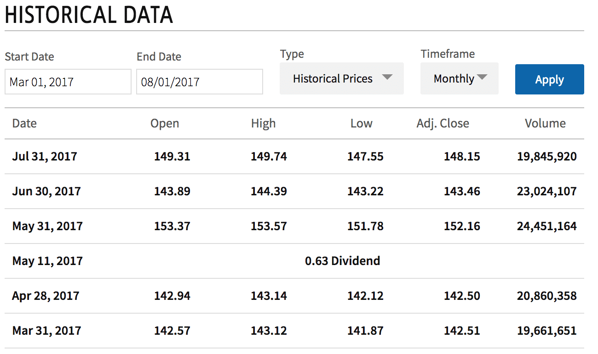

Understanding pricing mechanisms in economics and finance is essential for the efficient operation of markets. From early economic theories to contemporary practices, the process of determining the value of assets has undergone significant development. Historical precedents and modern technological advancements have collectively informed this evolution, influencing how assets are priced today.

Over the centuries, the pricing of financial instruments has been shaped by influential economic theories. Classical economists like Adam Smith and David Ricardo laid the foundational principles of supply and demand, which still underpin modern pricing strategies. Historically, pricing was often based on past performance and fixed valuation points, a method known as historic pricing. This approach was crucial in periods when real-time market data was unavailable or unreliable.



Fast forward to today, and the financial environment has transformed with the introduction of dynamic pricing strategies and algorithmic trading. These advancements have been largely driven by technological innovations, allowing for real-time data processing and more sophisticated predictive analytics. Algorithmic trading, in particular, represents the cutting-edge of modern pricing mechanisms. It leverages historical data to automate trading decisions, enhancing efficiency and accuracy in markets.

Overall, understanding these changes is vital for both investors and economists. Knowing the historical context and evolution of pricing mechanisms provides insight into contemporary trading practices and highlights the importance of adapting to ongoing advancements in technology.

## Table of Contents

## Historic Pricing: An Overview

Historic pricing refers to the methodology of valuing financial assets based on historical performance and specific valuation points. In earlier economic history, prior to the advent of real-time data analysis tools and technologies, historic pricing served as a fundamental approach due to the absence of instant asset valuation capabilities. Financial markets relied heavily on historic pricing, which involved assessing assets based on past trends and data sets, to guide investment decisions and market predictions.

During this period, real-time asset valuation posed significant challenges due to limited technological infrastructure and the slow dissemination of market data. As a result, historic pricing emerged as a practical solution. It allowed investors to value stocks, bonds, and other financial instruments by considering historical price trends, earnings reports, and economic conditions over determined periods.

One practical application of historic pricing was in the calculation of the net asset value (NAV) of investment funds, particularly mutual funds. The NAV represents the per-share value of a mutual fund, and it is traditionally computed based on the closing prices of the securities held in the fund's portfolio. This computation relies on static historic pricing data to determine the fund's value at a specific past time, providing investors with the necessary information to appraise their investments.

Mathematically, the NAV can be represented as:

$$
\text{NAV} = \frac{\text{Total Assets} - \text{Total Liabilities}}{\text{Number of Outstanding Shares}}
$$

Here, 'Total Assets' and 'Total Liabilities' are calculated from historical valuations of the assets within the fund. Historic pricing thus provides the backbone for such calculations, offering a snapshot of financial status before real-time systems were feasible.

The foundational role of historic pricing in traditional financial markets cannot be overstated. It provided a structured methodology for investors to make informed decisions based on observable data over time and contributed to shaping the analytical frameworks still in use today. As markets transitioned to more sophisticated pricing methods, historic pricing laid essential groundwork, integrating elements like past performance trends into forward-looking analyses and modern trading strategies.

## Economic History and Pricing Mechanisms

Pricing mechanisms have always been central to economic theories, closely intertwined with the fluctuations of supply, demand, and market efficiency. Historically, these mechanisms have been continually shaped by pivotal economic events and policy shifts.

**Gold Standard**

The Gold Standard was a major influence in establishing pricing mechanisms in the late 19th and early 20th centuries. It tied the value of a country's currency directly to a specific amount of gold, thus standardizing the exchange rates and stabilizing international trade. Under the Gold Standard, currency value was intrinsically linked to gold reserves, making prices relatively stable in the international market. However, this system was inflexible during economic downturns because it restricted governments from effectively adjusting the money supply to respond to changing economic conditions.

**The Great Depression**

The Great Depression of the 1930s was another critical event that forced a reevaluation of pricing mechanisms. The collapse of financial markets brought about severe deflationary pressures, disrupting traditional pricing methods. This period highlighted the limitations of the Gold Standard, as countries were unable to stimulate their economies due to fixed currency values. As a response, many abandoned the Gold Standard, transitioning towards fiat money systems that allowed more flexible monetary policies. This shift underscored the need for pricing mechanisms that could accommodate economic fluctuations more dynamically.

**Advanced Financial Instruments**

With the advent of more sophisticated financial instruments in the latter half of the 20th century, pricing mechanisms further evolved. Derivatives, options, and futures introduced complex mathematical models into the sphere of pricing. These instruments required an understanding of probabilistic risk and time value of money, leading to the development of models like the Black-Scholes for option pricing. These models integrated various economic factors to determine asset prices, incorporating [volatility](/wiki/volatility-trading-strategies) and market expectations as crucial components. 

Mathematically, such models are often based on stochastic differential equations. An example of the Black-Scholes model for a European call option is:

$$
C(S, t) = S_t N(d_1) - K e^{-r(T-t)} N(d_2)
$$

where:
- $S$ is the current stock price,
- $K$ is the strike price,
- $T$ is the time to maturity,
- $r$ is the risk-free interest rate,
- $N$ is the cumulative distribution function of the standard normal distribution,
- $d_1$ and $d_2$ are intermediary calculations used in the formula.

These developments marked a significant departure from simple supply-demand equilibrium models, emphasizing the increasing role of prediction and risk management in economic pricing strategies.

In conclusion, historical events and the transition to more advanced financial instruments have profoundly influenced pricing mechanisms in economics. These changes have paved the way for contemporary models that better reflect complex market dynamics and economic realities.

## Transition to Modern Pricing Methods

As technology advanced, the landscape of asset pricing underwent a significant transformation, progressing from static historic pricing methods to dynamic forward pricing strategies. Historic pricing relied on past data and fixed valuation points to determine asset values, a method suited to an era when real-time data access was limited. This necessitated periodic recalculations of net asset values (NAV) for mutual funds and similar financial products, often based on the end-of-day prices.

With the development of technology, forward pricing emerged as a superior method, enabling real-time valuation of assets. This dynamic approach allows investors to react promptly to market fluctuations, capitalizing on rapidly changing economic conditions. Forward pricing is grounded in the collection and analysis of real-time data streams, providing up-to-the-minute evaluations and facilitating instant trading decisions. The primary benefit of forward pricing is its ability to incorporate the latest market information, thus offering a more accurate representation of an asset’s current value. This mitigates the risks associated with making decisions based on outdated data.

The shift from historic to forward pricing introduced several challenges. The requirement for continuous data feeds necessitated significant investments in technology infrastructure. Financial institutions had to implement advanced data analytics tools and ensure robust cybersecurity measures to protect sensitive information. The computational power needed to process real-time data also posed a challenge, demanding significant upgrades in hardware and software capabilities.

Moreover, forward pricing demanded a cultural shift within financial institutions. Traditional analysts needed to adapt to a new environment where data-driven decision-making took precedence over experience-based judgment. Training and development became crucial to equip personnel with the skills needed to navigate modern financial markets effectively.

Despite these challenges, the benefits of forward pricing in improving market efficiency and investor responsiveness outweighed the drawbacks. By facilitating the rapid adjustment of asset valuations in response to market conditions, forward pricing has become an indispensable tool in the modern financial landscape. The transition marked a pivotal moment in financial history, laying the groundwork for future innovations, such as [algorithmic trading](/wiki/algorithmic-trading) and [artificial intelligence](/wiki/ai-artificial-intelligence)-driven pricing mechanisms. These advancements continue to redefine asset pricing, ensuring that it remains a dynamic and integral part of the global financial system.

## Algorithmic Trading and Its Impact

Algorithmic trading has become a pivotal element in modern financial markets, marking a significant departure from traditional trading methods. By employing sophisticated algorithms, traders can automate decisions to execute trades at speeds and frequencies far beyond human capacity. This technological advancement allows for a more efficient pricing mechanism, reacting to market conditions in real-time.

Historical data plays a crucial role in the development and successful deployment of algorithmic trading strategies. The primary function of this historical data is in the construction and [backtesting](/wiki/backtesting) of models. Backtesting involves applying trading strategies to historical market data to evaluate how these strategies would have performed in the past. Such analysis helps in refining algorithms, ensuring they are robust and can adapt to varying market conditions.

The use of quantitative models in algorithmic trading is deeply rooted in historical data analysis. A common approach is the use of statistical [arbitrage](/wiki/arbitrage), where algorithms identify price differentials between related financial instruments and execute trades to exploit these inefficiencies. For instance, a mean reversion strategy might involve identifying assets whose current prices deviate significantly from their historical averages, anticipating that prices will eventually return to the mean. 

```python
import numpy as np
import pandas as pd
from sklearn.linear_model import LinearRegression

# Example of a simple mean reversion strategy using historical pricing data
def mean_reversion_strategy(prices, window=20):
    # Calculate the rolling mean and standard deviation
    rolling_mean = prices.rolling(window=window).mean()
    rolling_std = prices.rolling(window=window).std()

    # Identify buy and sell signals based on deviations from the rolling mean
    buy_signals = prices < (rolling_mean - rolling_std)
    sell_signals = prices > (rolling_mean + rolling_std)

    return buy_signals, sell_signals
```

Risk management is another area where historical pricing data proves indispensable. Algorithms can incorporate historical volatility measures to adjust the size of trades dynamically. For example, in higher volatility periods, the algorithm might reduce position sizes to mitigate potential losses.

Furthermore, [machine learning](/wiki/machine-learning) techniques are increasingly utilized to enhance algorithmic trading. Historical data serves as the training set for machine learning models that predict future price movements based on past patterns. These models require an extensive dataset and complex feature engineering but offer the potential for discovering novel trading signals that traditional methods might overlook.

In summary, the integration of algorithmic trading into financial markets fundamentally alters the landscape of pricing mechanisms. By leveraging historical data, these algorithms not only facilitate more accurate pricing but also enhance trading efficiency and risk management. As technology continues to advance, the reliance on well-analyzed historical data will remain a cornerstone of evolving trading strategies.

## Applications of Historical Pricing in Algo Trading

Historical pricing data plays a vital role in algorithmic trading, serving as the backbone for risk management, backtesting, and the development of predictive models. With the advent of big data and advanced computational power, historical data's importance has magnified, enabling traders to derive insights that inform robust trading strategies. 

One primary application of historical pricing data in algorithmic trading is in risk management. By analyzing historical price movements, traders can identify volatility trends, calculate potential losses, and establish risk limits. Value-at-risk (VaR) is one such quantitative risk management technique that utilizes historical data to estimate the potential loss of an investment portfolio over a specified period, given normal market conditions. The historical simulation method for VaR, for instance, involves assuming that the future reflects the past and uses past market data to predict future risk probabilities.

Backtesting is another crucial area where historical pricing data is indispensable. It allows traders to test the effectiveness of trading strategies using historical data before deploying them in live environments. Python, with its extensive libraries such as Pandas for data manipulation and Backtrader for creating trading models, is commonly used for this purpose. For example:
```python
import backtrader as bt
import pandas as pd

# Load historical pricing data
data = pd.read_csv('historical_prices.csv', parse_dates=True, index_col='Date')
cerebro = bt.Cerebro()

# Create a data feed
data_feed = bt.feeds.PandasData(dataname=data)

cerebro.adddata(data_feed)

# Initialize and run the backtest
cerebro.addstrategy(MyStrategy)  # MyStrategy: user-defined trading strategy
cerebro.run()

# Plot results
cerebro.plot()
```
Here, the `MyStrategy` class would contain the logic of the trading strategy, which is then tested against the historical data.

Additionally, historical data assists in developing quantitative models that predict future market movements. Machine learning algorithms such as linear regression, random forests, and neural networks use historical pricing inputs to learn patterns and make predictions. These models require vast amounts of historical data to train effectively and adapt to market dynamics, enhancing the accuracy of predictions. By leveraging historical data, algorithmic traders can refine model parameters to optimize prediction accuracy and trading outcomes.

Moreover, historical pricing data is essential for conducting comprehensive market research, which helps in understanding market conditions over time. Insights drawn from long-term data analysis can reveal cyclical trends, seasonality effects, and shifts in investor behavior, which are crucial for formulating strategic trading decisions. 

In conclusion, historical pricing data remains a cornerstone of algorithmic trading, enhancing the precision and reliability of trading strategies. Its applications span across risk assessment, strategy validation, predictive modeling, and market analysis, underscoring its pivotal role in the efficiency and success of modern trading systems.

## The Future of Pricing Mechanisms in Economics

The rapid advancement of technology is set to significantly transform pricing mechanisms, making them increasingly sophisticated with the integration of artificial intelligence (AI) and machine learning. These technologies offer substantial potential in processing real-time data and enhancing predictive analytics, which are crucial for improving trading outcomes and ensuring market efficiency.

AI and machine learning facilitate the development of real-time pricing platforms that can adjust to market fluctuations almost instantaneously. These platforms can analyze vast amounts of data quickly, identifying patterns and trends that human traders may overlook. Predictive models using machine learning algorithms can forecast pricing trends based on historical data, current market conditions, and various economic indicators. For example, predictive analytics could help identify arbitrage opportunities by analyzing minute price discrepancies across different markets faster than humanly possible.

Furthermore, AI-driven systems have the potential to deepen our understanding of market dynamics by processing unstructured data sources like news articles, social media sentiment, and economic reports. This form of sentiment analysis can be crucial in assessing market reactions to geopolitical events, corporate announcements, or economic policy changes, further refining pricing accuracy and market predictions.

The evolving landscape of pricing mechanisms also suggests an increased reliance on blockchain and distributed ledger technologies (DLTs) to enhance transparency and security in financial transactions. Smart contracts, which execute trades automatically based on predefined criteria, could facilitate more efficient pricing and settlement processes, reducing counterparty risk and operational inefficiencies.

As globalization ties markets closer together, the integration of advanced pricing mechanisms will likely improve market efficiency, reduce [liquidity](/wiki/liquidity-risk-premium) risks, and narrow the bid-ask spreads. However, this evolution also presents challenges, such as the need for sophisticated infrastructure, concerns over data privacy, and the potential for AI models to perpetuate existing market biases if not carefully managed.

The ongoing development of quantum computing also poses tantalizing possibilities for pricing mechanisms. Quantum algorithms may enable unprecedented computational speed and problem-solving capabilities, allowing traders to process complex data sets and perform optimizations that are currently impossible. While still in nascent stages, quantum computing could redefine pricing models by offering solutions to problems that challenge current classical computing methods.

In conclusion, the future direction of pricing mechanisms in economics points toward a landscape heavily influenced by technological innovation. These advancements promise enhanced market responsiveness and efficiency, though they also require careful management to mitigate potential risks associated with their implementation. As we move forward, the interplay between technology and traditional economic principles will continue to shape the evolution of pricing strategies, with significant implications for global markets.

## Conclusion

Pricing mechanisms have significantly evolved, transitioning from traditional methods to sophisticated algorithmic models. This transformation has been driven by advancements in technology, changes in economic theories, and the increasing complexity of financial markets. Initially, pricing was based on historical data, which provided a static snapshot of asset values. This approach, while foundational, lacked the capacity to adjust to rapid market fluctuations. 

As markets became more dynamic, the need for real-time pricing mechanisms surfaced. This led to the development of forward pricing models, which account for current market conditions and future expectations. The shift to forward pricing has enabled more responsive and flexible investment strategies, allowing investors to act swiftly in volatile market environments.

The emergence of algorithmic trading further revolutionized pricing mechanisms. By leveraging large datasets and advanced computational power, algorithms can process market information and execute trades at high speed and with precision. Historical data plays a crucial role here, as it helps algorithmic models to backtest strategies and refine their predictive capabilities. The ability to harness and analyze vast amounts of data has led to more efficient markets and has reduced the costs associated with trading.

Understanding these changes is vital for investors and economists. The interaction between traditional pricing methods and modern algorithmic strategies underscores the importance of adapting to technological advancements in financial analysis. As pricing models continue evolving, they will increasingly integrate artificial intelligence and machine learning, enhancing their ability to predict market trends and manage risks effectively.

This article has outlined the significant transformation of pricing mechanisms and their impact on contemporary trading practices. Both historical perspectives and cutting-edge innovations are crucial for navigating the complexities of modern financial markets. As these pricing strategies continue to evolve, they will play an essential role in shaping global economic landscapes.

## References & Further Reading

[1]: Smith, Adam. (1776). ["The Wealth of Nations."](https://en.wikipedia.org/wiki/The_Wealth_of_Nations) 

[2]: Ricardo, David. (1817). ["On the Principles of Political Economy and Taxation."](https://www.cambridge.org/core/books/on-the-principles-of-political-economy-and-taxation/5C17BF2152379956950601EFE05AE14F) 

[3]: Hull, John C. (2017). ["Options, Futures, and Other Derivatives."](https://www.semanticscholar.org/paper/Options%2C-Futures%2C-and-Other-Derivatives-Hull/89bdee500c8623864fc9eb7a471546aa713acc44) Pearson.

[4]: Black, F., & Scholes, M. (1973). ["The Pricing of Options and Corporate Liabilities."](https://www.cs.princeton.edu/courses/archive/fall09/cos323/papers/black_scholes73.pdf) Journal of Political Economy, 81(3), 637-654.

[5]: Lopez de Prado, Marcos. (2018). ["Advances in Financial Machine Learning."](https://www.amazon.com/Advances-Financial-Machine-Learning-Marcos/dp/1119482089) John Wiley & Sons.

[6]: Chan, Ernest P. (2009). ["Quantitative Trading: How to Build Your Own Algorithmic Trading Business."](https://github.com/ftvision/quant_trading_echan_book) John Wiley & Sons.

[7]: Taleb, Nassim Nicholas. (2007). ["The Black Swan: The Impact of the Highly Improbable."](https://en.wikipedia.org/wiki/The_Black_Swan:_The_Impact_of_the_Highly_Improbable) Random House.