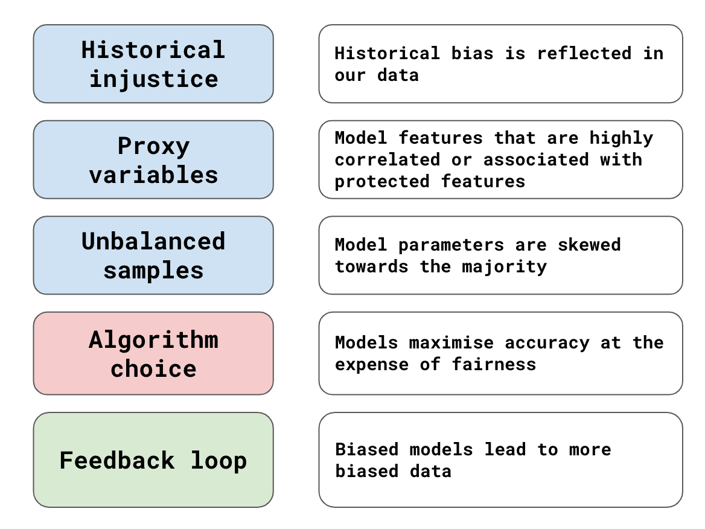

## Table of Contents

## What is historical bias in the context of machine learning?

Historical bias in machine learning happens when the data used to train a model reflects past prejudices or unfair practices. This means that if the data collected from the past contains biases, like discrimination against certain groups of people, the machine learning model will learn and repeat these biases. For example, if a model is trained on historical hiring data where women were less likely to be hired for certain jobs, the model might unfairly predict that women are less suitable for those jobs, even if they are qualified.

To fix historical bias, it's important to look at the data carefully and try to remove or adjust the parts that show bias. This can be done by using methods to make the data more fair or by adding new data that represents different groups more equally. It's a challenging task because sometimes the bias is not easy to see, and it requires a lot of work to make sure the model treats everyone fairly. By being aware of historical bias and working to correct it, we can help make machine learning models more just and useful for everyone.

## How does historical bias affect the performance of machine learning models?

Historical bias can make machine learning models less accurate and fair. When a model is trained on data that has biases from the past, it learns to make predictions based on those biases. For example, if old data shows that people from a certain neighborhood were more likely to be denied loans, a model trained on this data might unfairly predict that people from that neighborhood are riskier borrowers, even if they are not. This can lead to wrong predictions and decisions that hurt certain groups of people.

To fix this, we need to clean the data and make sure it's fair before using it to train models. This might mean removing or changing parts of the data that show bias, or adding more data to balance things out. It's a lot of work, but it's important because it helps the model make better and fairer predictions. By understanding and fixing historical bias, we can make machine learning models that work well for everyone, not just for some people.

## Can you provide examples of historical bias in real-world machine learning applications?

One example of historical bias in [machine learning](/wiki/machine-learning) is in the criminal justice system. Some algorithms used to predict if someone might commit a crime again were trained on data that showed racial biases. This meant the algorithms predicted that Black people were more likely to reoffend than they really were. As a result, these tools unfairly suggested that Black people should be treated more harshly, even if they were not more likely to commit crimes than others.

Another example is in hiring. Some companies used AI to help them choose job applicants. But if the data used to train these AI systems came from a time when women and minorities were less likely to be hired, the AI would learn these biases. So, the AI might unfairly decide that women or minorities are less good at the job, even if they are just as qualified as others. This made it harder for these groups to get hired, continuing the bias from the past.

Fixing these problems is important but hard. We need to check the data carefully and make changes to remove the bias. This might mean using special methods to make the data more fair or adding more data to balance things out. By doing this, we can help make sure that machine learning tools are fair and helpful for everyone, not just some people.

## What are the common sources of historical bias in datasets?

Historical bias in datasets often comes from past practices and societal norms that were unfair. For example, if a company used to hire mostly men for certain jobs, the data from that time will show more men in those roles. When this data is used to train a machine learning model, the model learns that men are more likely to be in those jobs, even if that's not true anymore. This can make the model unfairly favor men over women when making predictions about who should get hired.

Another common source of historical bias is from data collection methods that were biased. If data was collected in a way that left out certain groups of people, like not including people from certain neighborhoods or ethnic backgrounds, the data won't represent everyone fairly. When a model is trained on this data, it will make predictions based on the limited information it has, which can lead to unfair outcomes for the groups that were left out. To fix this, we need to make sure data collection is done in a way that includes everyone equally.

## How can historical bias be identified in a dataset?

Historical bias in a dataset can be identified by looking at the data carefully and checking if certain groups of people are treated unfairly. For example, if you see that women are less likely to be hired for certain jobs in the data, this might be a sign of historical bias. You can use [statistics](/wiki/bayesian-statistics) to see if there are big differences between groups. If the data shows that one group is treated much worse than others, it might be because of past unfair practices.

To find historical bias, you can also compare your data to other sources that are known to be fair. If your data looks very different from these fair sources, it might mean your data has historical bias. Another way is to use special tools and methods that are made to find bias in data. These tools can help you see if the data is treating everyone fairly or if it's repeating old unfair patterns. By using these methods, you can spot historical bias and start to fix it.

## What are the ethical implications of historical bias in machine learning?

Historical bias in machine learning can lead to unfair treatment of people. When a model is trained on data that has old biases, it might make decisions that hurt certain groups, like not giving loans to people from certain neighborhoods or not hiring women for certain jobs. This is wrong because everyone should be treated fairly, no matter their background. If a machine learning model keeps repeating these old unfair patterns, it can make life harder for some people and stop them from getting the same chances as others.

To fix this problem, we need to make sure the data we use to train models is fair and represents everyone equally. This means looking at the data carefully and changing or removing parts that show bias. It's a lot of work, but it's important because it helps make sure that machine learning tools are used in a way that is fair and good for everyone. By understanding and fixing historical bias, we can help build a world where technology helps all people, not just some.

## What techniques can be used to mitigate historical bias in machine learning models?

One way to reduce historical bias in machine learning models is to clean the data before using it to train the model. This means looking at the data carefully and finding parts that show bias, like if certain groups of people are treated unfairly. Once you find these parts, you can change or remove them to make the data more fair. For example, if the data shows that women were less likely to be hired for certain jobs in the past, you can adjust the data to balance things out so that the model doesn't learn this bias. Another way is to add more data to the dataset that represents different groups more equally. This helps the model learn from a more fair set of information.

Another technique is to use special methods to make the model treat everyone fairly. These methods can be used during the training of the model to make sure it doesn't learn the biases in the data. For example, you can use a method called "fairness constraints" that tells the model to make predictions in a way that doesn't unfairly hurt certain groups. There are also tools and algorithms designed to check for bias in the model's predictions and fix them if needed. By using these techniques, we can help make sure that machine learning models are fair and useful for everyone, not just some people.

## How does historical bias relate to other types of bias in machine learning, such as selection bias or confirmation bias?

Historical bias is when data used to train a machine learning model has old unfair patterns from the past. For example, if a company used to hire mostly men for certain jobs, the data will show more men in those roles. When a model learns from this data, it might unfairly predict that men are better for those jobs, even if that's not true anymore. This is different from selection bias, which happens when the way data is collected leaves out certain groups of people. For instance, if a survey only asks people in rich neighborhoods, the data won't represent everyone fairly. Both types of bias can make a model's predictions unfair, but historical bias comes from past unfair practices, while selection bias comes from how data is gathered.

Confirmation bias in machine learning is when people who are working on the model pay more attention to data that supports what they already believe, and ignore data that doesn't. This can make the model learn the wrong things because it's only seeing part of the story. For example, if someone believes that people from a certain area are riskier borrowers, they might focus on data that shows this and ignore data that shows otherwise. Historical bias and confirmation bias can work together to make things worse. If someone believes in old unfair patterns and only looks at data that supports those beliefs, the model will learn and repeat those biases even more strongly. By understanding how these different types of bias work, we can try to fix them and make machine learning models fairer.

## What role does data collection play in the development of historical bias?

Data collection plays a big role in creating historical bias in machine learning. If the way data is collected in the past leaves out certain groups of people or treats them unfairly, this bias gets into the data. For example, if a company only collected data from men for certain jobs because women were not hired for those roles back then, the data will show more men in those jobs. When this data is used to train a machine learning model, the model learns these old unfair patterns and might predict that men are better for those jobs, even if that's not true anymore. This means the model repeats the bias from the past, making it hard for everyone to be treated fairly.

To fix historical bias, we need to make sure data collection is done in a way that includes everyone equally. This means looking at how data was gathered in the past and trying to fix any unfair parts. For instance, if old data shows that certain neighborhoods were left out of loan applications, we can add more data from those neighborhoods to balance things out. By doing this, we help the model learn from a more fair set of information, so it can make better and fairer predictions. It's a lot of work, but it's important because it helps make sure that machine learning tools are used in a way that is good for everyone, not just some people.

## How can organizations implement policies to prevent historical bias in their machine learning systems?

Organizations can prevent historical bias in their machine learning systems by first making sure they collect data in a fair way. This means including everyone equally when gathering data, so that no groups are left out. They should also check old data carefully to see if it has any unfair patterns from the past. If they find these patterns, they can change or remove the biased parts of the data. This helps make sure the data used to train the machine learning model is fair and represents everyone.

Another way organizations can prevent historical bias is by using special methods and tools during the training of the model. These methods can help the model learn in a way that treats everyone fairly. For example, they can use fairness constraints to make sure the model's predictions don't unfairly hurt certain groups. It's also important for organizations to keep checking their models to see if they are working fairly. By doing all these things, organizations can help make sure their machine learning systems are fair and useful for everyone, not just some people.

## What are the latest research findings on addressing historical bias in machine learning?

Recent research on addressing historical bias in machine learning has focused on developing new methods to make data and models fairer. One key finding is the use of "debiasing" techniques, which involve adjusting the data to remove or reduce bias before training the model. For example, researchers have used methods like "reweighting" the data, where they give more importance to underrepresented groups to balance out the dataset. Another approach is "adversarial training," where a second model is used to spot and correct bias in the main model's predictions. These techniques help ensure that the machine learning system does not repeat old unfair patterns.

Another important area of research is the development of fairness metrics and tools to measure and monitor bias in machine learning models. Researchers have created new ways to check if a model is treating different groups fairly, using metrics like "demographic parity" and "equalized odds." These metrics help organizations see if their models are biased and make changes if needed. Additionally, some studies have looked at how to explain the decisions made by machine learning models in a way that is easy to understand, which can help in spotting and fixing bias. By using these new methods and tools, organizations can work towards building machine learning systems that are more fair and helpful for everyone.

## How can the effectiveness of bias mitigation strategies be measured and evaluated?

To measure and evaluate the effectiveness of bias mitigation strategies, we can use fairness metrics. These are special numbers that tell us if a machine learning model is treating everyone fairly. For example, one common metric is "demographic parity," which checks if the model's predictions are the same for different groups of people. Another metric is "equalized odds," which looks at whether the model's predictions are equally accurate for different groups. By using these metrics, we can see if our strategies are working to make the model fairer.

Another way to evaluate bias mitigation strategies is by doing experiments. We can train two versions of a model: one with the bias mitigation strategy and one without it. Then, we compare how well each version does in terms of fairness and accuracy. If the model with the bias mitigation strategy is fairer and still accurate, we know the strategy is working. We can also use tools that explain the model's decisions to see if they are fair. By looking at the model's predictions in detail, we can find and fix any unfair patterns. This helps us make sure our machine learning models are treating everyone the same way.