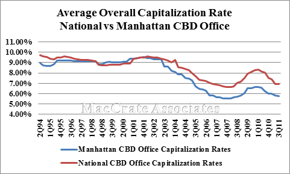

## Table of Contents

## What is a capitalization rate?

A capitalization rate, or cap rate, is a way to figure out how much money an investment property might make. It's like a simple math tool that helps you see if buying a property is a good idea. You find the cap rate by taking the property's yearly income and dividing it by how much the property costs. For example, if a building makes $100,000 a year and costs $1,000,000, the cap rate is 10%.

Cap rates are useful because they let you compare different properties quickly. A higher cap rate usually means the property could make more money, but it might also be riskier. A lower cap rate might mean the property is safer but won't make as much money. It's important to remember that cap rates don't tell the whole story. They don't include things like loans or future costs, so you should use them with other information to make smart choices about buying property.

## Why are capitalization rates important in real estate?

Capitalization rates, or cap rates, are really important in real estate because they help people figure out if a property is a good investment. They do this by showing how much money a property makes compared to how much it costs. For example, if a property has a high cap rate, it might mean it can make a lot of money, but it could also be riskier. On the other hand, a property with a low cap rate might be safer but won't make as much money. This helps investors decide which properties to buy based on how much risk they want to take and how much money they want to make.

Another reason cap rates are important is that they help compare different properties easily. When you're looking at many properties, cap rates give you a quick way to see which ones might be better investments. This is super helpful because it saves time and makes the decision-making process simpler. But remember, cap rates don't tell the whole story. They don't include things like loan payments or future repair costs, so it's important to look at other information too when deciding to buy a property.

## How have capitalization rates in New York City changed over the past decade?

Over the past decade, capitalization rates in New York City have gone through some changes. At the start of the 2010s, cap rates were pretty low because a lot of people wanted to invest in real estate in the city. This high demand pushed property prices up, which made the cap rates lower. But as the decade went on, things started to change. Around 2016 and 2017, cap rates began to go up a bit. This was because more properties were coming onto the market, and investors were starting to be more careful about where they put their money.

By the end of the decade, especially around 2019 and 2020, cap rates in New York City saw even more changes. The big reason for this was the start of the COVID-19 pandemic. A lot of people moved out of the city, and businesses closed down, which made property values drop. This meant that cap rates started to go up because the income from properties went down, but the prices of the properties themselves didn't drop as fast. So, if you were looking at buying property in New York City at the end of the decade, you might have seen higher cap rates than at the beginning, showing that the real estate market had become riskier but could also offer higher returns.

## What factors influence capitalization rates in New York City?

Many things affect capitalization rates in New York City. One big [factor](/wiki/factor-investing) is how much people want to invest in the city. When a lot of people want to buy property, prices go up, and cap rates go down. This happened a lot at the start of the 2010s when New York was a hot spot for investors. Another factor is the economy. If the economy is doing well, more people have jobs and can rent or buy places, which can keep cap rates low. But if the economy is not doing well, fewer people can afford to rent or buy, and cap rates might go up because property values drop.

Another thing that changes cap rates is what's happening with the real estate market itself. If there are a lot of new buildings going up, it might mean more competition for renters, which can push cap rates up. Also, if the city changes laws about renting or building, it can affect how much money property owners make, which changes cap rates. For example, rent control laws can lower the income from a property, making cap rates go up. Lastly, big events like the COVID-19 pandemic can shake things up a lot. When the pandemic hit, a lot of people left the city, and businesses closed, causing property values to drop and cap rates to rise because the income from properties went down.

## Can you compare the historical capitalization rates of different neighborhoods in NYC?

Over the last decade, different neighborhoods in New York City have seen their capitalization rates change in different ways. In neighborhoods like Manhattan's Financial District, cap rates were low at the start of the 2010s because a lot of people wanted to invest there. But as the decade went on, especially after the 2016-2017 period, cap rates started to go up a little bit. This happened because more properties were coming onto the market and investors were being more careful. By the end of the decade, with the start of the COVID-19 pandemic, cap rates in the Financial District went up even more because a lot of businesses closed and people moved out, causing property values to drop.

In neighborhoods like Brooklyn's Williamsburg, cap rates also changed over the decade. At the start, Williamsburg was becoming more popular, which meant more people wanted to invest there, pushing cap rates down. But as more buildings were built and the area got more crowded, cap rates started to go up a bit around the mid-2010s. The big change came with the COVID-19 pandemic, which affected Williamsburg too. A lot of people left the city, and businesses closed, causing property values to drop and cap rates to rise. Each neighborhood in NYC has its own story, but the big events and changes in the economy and real estate market affect them all in different ways.

## How do capitalization rates in NYC compare to other major cities in the U.S.?

Capitalization rates in New York City are usually lower than in many other big cities in the U.S. because a lot of people want to invest there. At the start of the 2010s, cap rates in NYC were really low because it was a hot spot for investors. But they started to go up a bit in the mid-2010s, especially after the COVID-19 pandemic hit. Cities like San Francisco and Los Angeles also have lower cap rates because they're popular places to invest, but their rates might be a little higher than NYC's because they don't have as many people wanting to invest.

In cities like Chicago and Houston, cap rates are usually higher than in NYC. This is because fewer people want to invest there compared to NYC, so property prices are not as high. Chicago's cap rates might go up and down with changes in the economy, but they're generally higher than in NYC. Houston's cap rates can be even higher because it's more spread out and not as many people want to invest there. So, if you're looking at cap rates to decide where to invest, you'll see that NYC's rates are lower than in many other big U.S. cities, but they've been going up over the last few years.

## What are the trends in capitalization rates for commercial versus residential properties in NYC?

In New York City, the trends in capitalization rates for commercial properties have been different from those for residential properties over the past decade. For commercial properties, cap rates were pretty low at the start of the 2010s because a lot of businesses wanted to be in the city. But as the decade went on, especially after the mid-2010s, cap rates started to go up a bit. This was because more office spaces were being built, and some businesses were moving out of the city. When the COVID-19 pandemic hit, cap rates for commercial properties went up even more because a lot of businesses closed or moved to remote work, causing property values to drop.

For residential properties, cap rates were also low at the start of the 2010s because a lot of people wanted to live in NYC. But as more apartments were built and the city got more crowded, cap rates started to go up a bit around the mid-2010s. The big change came with the COVID-19 pandemic, which affected residential properties too. A lot of people left the city, and fewer people were renting or buying, causing property values to drop and cap rates to rise. So, while both commercial and residential properties saw their cap rates go up over the decade, the reasons behind these changes were a bit different.

## How have economic cycles affected capitalization rates in New York City?

Economic cycles have a big impact on capitalization rates in New York City. When the economy is doing well, more people have jobs and can afford to rent or buy places. This makes property values go up, which means cap rates go down. For example, at the start of the 2010s, the economy was doing pretty good, so a lot of people wanted to invest in NYC, and cap rates were low. But when the economy slows down or goes into a recession, fewer people can afford to rent or buy, so property values drop, and cap rates go up. This happened after the mid-2010s when the economy started to cool off a bit, and cap rates began to rise.

The biggest change came with the COVID-19 pandemic, which caused a big economic downturn. A lot of people lost their jobs and had to move out of the city, and businesses closed down. This made property values drop a lot, which meant cap rates went up even more. So, economic cycles can really shake up cap rates in NYC. When the economy is doing well, cap rates are low because a lot of people want to invest. But when the economy is not doing well, cap rates go up because fewer people can afford to rent or buy, and property values drop.

## What role do interest rates play in the fluctuation of capitalization rates in NYC?

Interest rates have a big impact on capitalization rates in New York City. When interest rates are low, borrowing money to buy property becomes cheaper. This means more people want to invest in real estate, which pushes up property prices. Because property prices go up but the income from the property stays the same, cap rates go down. For example, in the early 2010s, interest rates were low, so a lot of people wanted to buy property in NYC, and cap rates were low too.

But when interest rates go up, borrowing money becomes more expensive. This can make fewer people want to invest in real estate, which can cause property prices to drop. When property prices go down but the income from the property stays the same, cap rates go up. This happened in the mid-2010s when interest rates started to rise a bit, and cap rates in NYC began to go up too. So, interest rates can really shake up cap rates in the city, making them go up or down depending on whether borrowing money is cheap or expensive.

## How can historical capitalization rates help predict future real estate market trends in NYC?

Looking at how capitalization rates have changed in the past can give us clues about what might happen in New York City's real estate market in the future. When we see that cap rates have been going up, it might mean that property values are going down or that fewer people want to invest. This could be a sign that the market is getting riskier. For example, if we see cap rates going up because of a big event like the COVID-19 pandemic, we might guess that it will take some time for the market to recover and for cap rates to go back down.

On the other hand, if cap rates have been going down in the past, it might mean that more people want to invest in NYC and that property values are going up. This could be a sign that the market is doing well and that it's a good time to buy property. By looking at these trends, investors can make smarter choices about when to buy or sell property. But remember, past trends don't always tell us exactly what will happen in the future, so it's important to keep an eye on other things like the economy and interest rates too.

## What are the implications of low capitalization rates for real estate investors in NYC?

Low capitalization rates in New York City mean that property values are high compared to the income they bring in. This is good for investors who already own property because it means their investment is worth more. But it can be tough for new investors because they have to pay a lot of money to buy into the market. When cap rates are low, it might mean that a lot of people want to invest in NYC, which can push property prices up even more. This can make it harder for new investors to find good deals.

But low cap rates also come with some risks. If the market changes and cap rates start to go up, the value of the properties might go down. This could mean that investors who bought when cap rates were low might lose money if they have to sell their property when cap rates are higher. So, while low cap rates can be a sign of a strong market, they can also make the market more risky for investors. It's important for investors to keep an eye on other things like the economy and interest rates to make smart choices about buying and selling property in NYC.

## How do government policies and regulations impact capitalization rates in New York City?

Government policies and regulations can have a big impact on capitalization rates in New York City. When the government makes rules about how much landlords can charge for rent, it can change how much money a property makes. If rent control laws mean that landlords can't raise the rent as much as they want, the income from the property goes down. This makes cap rates go up because the property's price stays the same, but the money it brings in is less. Also, if the government gives tax breaks or other benefits to people who build new properties, it can make more buildings go up, which might push property prices down and make cap rates go up.

Another way government policies affect cap rates is by making rules about what kinds of buildings can be built and where. If the city says that new buildings have to be affordable housing, it might mean that fewer people want to invest in those properties because they can't make as much money. This can make cap rates go up because the income from the property is lower. On the other hand, if the government makes it easier to build new properties, it can bring more investors into the market, which might push property prices up and make cap rates go down. So, government policies can shake up cap rates in NYC in different ways, depending on what the rules are.

## What is the Capitalization Rate in NYC Real Estate and How Can It Be Understood?

The capitalization rate, commonly referred to as the cap rate, is a crucial metric in real estate valuation. It is used to estimate the potential return on an investment property. The formula for calculating the cap rate is:

$$
\text{Cap Rate} = \left( \frac{\text{Net Operating Income (NOI)}}{\text{Current Market Value of the Property}} \right) \times 100
$$

In this formula, Net Operating Income (NOI) refers to the income generated from the property after deducting operating expenses, but before taxes and financing costs.

### Historical Trends and Current Cap Rates in Different NYC Real Estate Sectors

Cap rates in New York City have historically fluctuated due to economic cycles, interest rates, and changes in investor sentiment. In general, NYC's unique real estate market, characterized by high demand and limited supply, typically results in lower cap rates compared to other regions. Over the past decade, NYC's commercial real estate sector has seen cap rates ranging from 3% to 6%, depending on the specific asset class and location within the city.

For instance, prime commercial properties in Manhattan's core districts often exhibit lower cap rates, sometimes below 4%, due to their perceived stability and desirability. Conversely, properties in emerging or less traditional areas may present higher cap rates, reflecting increased risk and potential for growth.

### Factors Influencing Cap Rates in Urban Markets Like NYC

Several factors influence cap rates in NYC's urban market, including:

**1. Interest Rates**: Cap rates are inversely related to interest rates. When interest rates rise, borrowing becomes more expensive, which can lead to higher cap rates as investors demand greater returns.

**2. Economic Conditions**: Strong economic growth typically leads to lower cap rates, as increased demand for real estate drives up property values. Conversely, during economic downturns, cap rates tend to rise as property values decrease.

**3. Property Location and Type**: Location is a key determinant of cap rates. Highly sought-after areas with robust economic activity usually have lower cap rates. Additionally, property type (e.g., office, retail, industrial) affects cap rates based on market demand and risk profiles.

**4. Market Supply and Demand**: The balance between real estate supply and demand impacts cap rates. In a high-demand, low-supply market like NYC, cap rates are generally compressed.

**5. Regulatory Environment**: Zoning laws, tax policies, and other regulatory factors can affect the operational costs and revenue potential of real estate, subsequently impacting cap rates.

Understanding these dynamics is essential for investors looking to navigate NYC's competitive real estate market effectively.

## References & Further Reading

[1]: Bergstra, J., Bardenet, R., Bengio, Y., & Kégl, B. (2011). ["Algorithms for Hyper-Parameter Optimization."](https://dl.acm.org/doi/10.5555/2986459.2986743) Advances in Neural Information Processing Systems 24.

[2]: ["Advances in Financial Machine Learning"](https://www.amazon.com/Advances-Financial-Machine-Learning-Marcos/dp/1119482089) by Marcos Lopez de Prado

[3]: ["Evidence-Based Technical Analysis: Applying the Scientific Method and Statistical Inference to Trading Signals"](https://www.amazon.com/Evidence-Based-Technical-Analysis-Scientific-Statistical/dp/0470008741) by David Aronson

[4]: ["Machine Learning for Algorithmic Trading"](https://github.com/stefan-jansen/machine-learning-for-trading) by Stefan Jansen

[5]: ["Quantitative Trading: How to Build Your Own Algorithmic Trading Business"](https://www.amazon.com/Quantitative-Trading-Build-Algorithmic-Business/dp/1119800064) by Ernest P. Chan