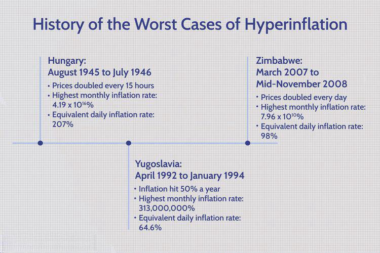

Understanding the complex interplay between currency devaluation, hyperinflation, and economic history is crucial for economists and investors alike. These economic phenomena not only reflect the challenges faced by nations in maintaining stable economic environments but also highlight the consequences of fiscal missteps. This article explores historical instances of hyperinflation and devaluation, focusing on notable cases such as Germany's Weimar Republic in the 1920s, Zimbabwe in the late 2000s, and post-World War II Hungary. Each case provides valuable lessons on the impacts of economic policies and the subsequent societal consequences.

The evolution of modern financial markets, particularly with the rise of algorithmic trading, offers novel solutions to managing these economic disturbances. Algorithmic trading—using pre-programmed trading instructions accounting for variables such as timing, price, and volume—allows for rapid responses to market changes, potentially mitigating risks associated with extreme inflationary scenarios.



By examining historical insights, the article aims to inform current strategies in financial markets. The ability to learn from past events and apply those lessons to develop sound economic frameworks is essential for policymakers and investors striving to make informed decisions in a volatile economic landscape. Understanding these concepts not only aids in assessing risks but also equips stakeholders with strategies to navigate the uncertainties of global markets.

## Table of Contents

## Understanding Currency Devaluation and Hyperinflation

Currency devaluation and hyperinflation are two significant economic phenomena with profound implications for national economies. Understanding them is crucial for economists and policymakers who need to navigate the challenges posed by these disruptions.

Currency devaluation refers to the intentional reduction of a currency's value relative to other currencies. This strategy is often employed by countries to enhance their export competitiveness. By making their goods cheaper for foreign buyers, nations hope to spur demand for domestic products, thereby boosting the economy. However, devaluation can lead to increased import costs, contributing to inflationary pressures within the domestic market.

Hyperinflation, on the other hand, represents a more extreme economic condition characterized by rapid and excessive price increases, typically exceeding 50% per month. This results when there is an uncontrollable increase in the money supply, often due to a central bank printing excessive amounts of currency in order to finance government deficits. Additionally, a precipitous decline in the value of money often follows a loss of confidence in government institutions or currency, further exacerbating the problem.

The causes of hyperinflation and currency devaluation frequently overlap, centering on a few key factors. Chief among these is the excessive expansion of the money supply without a corresponding growth in economic productivity. This imbalance originates from government policies, such as over-reliance on debt or failure to control fiscal deficits. Political instability and loss of market confidence also play crucial roles in driving these economic crises.

The consequences of these phenomena are severe. Hyperinflation and devaluation erode purchasing power, as wages often fail to keep pace with soaring prices, leading to a decline in living standards. This can result in widespread poverty and economic destabilization as savings are wiped out, and the cost of basic goods becomes unaffordable for the populace. The impact is particularly devastating for those on fixed incomes or without access to assets that can maintain their value in times of inflationary pressure.

Historical examples provide valuable insights into how countries' fiscal policies have been shaped by these economic challenges. For instance, during the hyperinflation of post-World War I Germany, known as the Weimar Republic era, the government resorted to printing money to meet reparations obligations, resulting in catastrophic inflation levels. Similarly, Zimbabwe experienced hyperinflation in the late 2000s underlining monetary mismanagement and political upheaval, leading to the displacement of the domestic currency in favor of foreign currencies.

Understanding the past allows us to appreciate the importance of maintaining sound fiscal and monetary policies to prevent such economic disasters. Countries that once faced hyperinflation have learned the necessity of imposing strict monetary controls and enhancing institutional trust to restore stability. These experiences highlight the delicate balance required in economic policymaking to avoid triggering the debilitating effects of currency devaluation and hyperinflation.

## Significant Historical Instances of Hyperinflation

Germany's Weimar Republic in the early 1920s presents one of the most striking instances of hyperinflation. After World War I, the Treaty of Versailles imposed heavy reparations on Germany, creating a financial strain that was exacerbated by the government's decision to print more money to pay off these debts. The result was runaway inflation, with the value of the Papiermark plummeting. At its peak, prices doubled every few days, rendering the currency almost worthless. This hyperinflation had profound social and economic consequences, leading to a loss of savings for citizens and a destabilized economy that contributed to the eventual rise of Nazism. Government intervention eventually ended the crisis by introducing the Rentenmark in 1923, which stabilized the currency and restored some economic order.

Zimbabwe's hyperinflation in the late 2000s is another profound example, driven mainly by political instability and poor economic policies under the leadership of President Robert Mugabe. The government's extensive printing of money to fund involvement in the Congo War and support controversial land reforms led to an overwhelming increase in money supply without a corresponding increase in economic output. Annual inflation reached an astronomical 89.7 sextillion percent in November 2008, with prices doubling almost daily (Hanke and Kwok, 2009). This economic disaster eroded public confidence, decimated savings, and left a significant portion of the population in poverty. Hyperinflation was only curtailed when Zimbabwe abandoned its currency in favor of using foreign currency in 2009, and the adoption of cash budgeting reduced budget deficits.

Hungary holds the record for the most extreme case of hyperinflation in history, experienced in the aftermath of World War II. The war had devastated the nation's infrastructure, and as the government attempted to rebuild, it resorted to printing vast amounts of money. Inflation rates skyrocketed to a level never seen before or since, with prices doubling approximately every 15 hours in mid-1946. The pengő, Hungary's currency at the time, became virtually useless. The government introduced a new currency, the forint, in August 1946, to replace the pengő, stabilize the economy, and restore public trust. This currency reform, combined with stringent fiscal policies, eventually curbed hyperinflation and set Hungary on the path to economic recovery.

Each of these historical cases underscores the severe impacts that hyperinflation can have on social and economic structures. They highlight the critical need for sound economic policies and stable governance to prevent and manage such crises. The lessons learned have informed modern economic strategies and policies worldwide, providing valuable insights for dealing with high inflation and economic mismanagement.

## The Role of Economic Policies in Managing Hyperinflation

Effective fiscal and monetary policies are essential in managing and preventing hyperinflation. Hyperinflation, characterized by extremely rapid price increases, is often fueled by an excessive money supply and loss of confidence in government institutions. Therefore, strategic economic policies are crucial to restoring and maintaining stability.

Currency reforms stand out as a primary method for addressing hyperinflation. By introducing a new currency or revaluing the current one, governments can reset the economy's financial structure and regain public and investor trust. A historical example of effective currency reform is the Weimar Republic's introduction of the Rentenmark in 1923, which helped stabilize the German economy by establishing a new currency backed by real assets rather than just government promises.

Fiscal responsibility is equally important, underscoring the need for governments to maintain balanced budgets and limit deficit spending. Excessive government spending, particularly when financed by printing money, is a frequent precursor to hyperinflation. By implementing policies that ensure fiscal discipline, countries can better control inflationary pressures. For instance, adopting conservative fiscal policies during economic expansions can build reserves that may be used to counteract inflation during downturns.

International aid can also play a significant role in stabilizing economies experiencing hyperinflation. Financial support from global organizations such as the International Monetary Fund (IMF) or World Bank can provide essential resources and technical assistance needed for economic recovery and restructuring. For example, international aid packages often come with stipulations for reform, encouraging the adoption of policies that promote long-term economic health.

Price controls, while contentious, have been used to provide immediate relief from hyperinflation. By capping prices on essential goods and services, governments can temporarily stabilize purchasing power. However, price controls must be implemented cautiously to avoid creating market distortions and shortages, as was seen in Zimbabwe in the 2000s.

Confidence-building measures, such as transparent governance and credible commitments to economic reforms, can significantly contribute to restoring economic stability. Establishing an independent central bank is one method to enhance monetary policy credibility. An independent central bank can focus on controlling inflation without succumbing to political pressures that might favor short-term monetary expansion.

Sound economic frameworks, emphasizing stable institutions and clear economic rules, are essential for preventing future hyperinflation crises. Economic history offers evidence that countries with robust legal and institutional frameworks tend to exhibit more stable economic environments. For instance, post-war Germany’s adherence to economic stability principles contributed to the "economic miracle" that followed.

Historical policy failures have provided valuable lessons for current economic governance. By examining past instances where poor policy choices exacerbated hyperinflation, modern policymakers can identify strategies to avoid similar pitfalls. For example, Argentina's repeated struggles with inflation underscore the importance of structural economic reform and consistent policy implementation.

In summary, managing hyperinflation requires a multifaceted approach, including currency reforms, fiscal discipline, international cooperation, and development of strong economic institutions. By learning from history and implementing strategic policies, countries can mitigate the risks of hyperinflation and promote economic stability.

## Algorithmic Trading: A Modern Solution to Economic Crises

Algorithmic trading employs sophisticated computer algorithms to execute trades at high speeds, taking advantage of even the slightest market fluctuations. These algorithms are designed to handle the vast influx of real-time data, making them an essential tool for navigating volatile financial environments, such as those characterized by hyperinflation.

In situations of hyperinflation, where traditional economic models often fail due to extreme price [volatility](/wiki/volatility-trading-strategies) and rapid currency devaluation, [algorithmic trading](/wiki/algorithmic-trading) can offer a systematic approach to protect investments. By leveraging mathematical models, these algorithms can identify patterns and make predictions on currency movements, enabling traders to hedge against the risks associated with hyperinflation.

One effective strategy employed within algorithmic trading is currency diversification. This involves spreading investments across multiple currencies to reduce risk exposure from a single devaluing currency. For instance, if a certain currency is predicted to devalue, an algorithm can automatically rebalance the investment portfolio to hold more stable or appreciating currencies. This strategy not only mitigates risk but also potentially enhances returns during turbulent economic times.

Another integral component of these trading models is sentiment analysis. Algorithms utilize natural language processing (NLP) techniques to analyze news, social media, and other information sources to gauge market sentiment. For example, Python libraries like `NLTK` and `TextBlob` can be used to quantify textual data emotions and predict their potential impact on market movements. Here's a simple sentiment analysis snippet using Python:

```python
from textblob import TextBlob

def analyze_sentiment(text):
    analysis = TextBlob(text)
    return analysis.sentiment.polarity

market_sentiment = analyze_sentiment("The economy is facing challenges, yet growth prospects remain positive.")
print(market_sentiment)
```

Such sentiment-driven insights allow algorithms to adjust trading strategies dynamically, keeping pace with market psychology and news-driven price movements, which is often critical during economic crises.

Firms specializing in algorithmic trading focus on enhancing their models to align with an ever-evolving market landscape. By incorporating risk management techniques and integrating AI technologies, these firms effectively safeguard capital while optimizing investment strategies. One key area is the development of [machine learning](/wiki/machine-learning) algorithms capable of learning and adapting from historical data, which enables a proactive approach to future economic challenges.

The speed and precision that algorithmic trading brings are unmatched, providing a competitive edge that is crucial in today's fast-paced financial markets. The ability to rapidly execute trades based on complex data sets ensures that traders remain agile, better equipped to manage economic disruptions, and capable of capitalizing on fleeting market opportunities. As such, algorithmic trading is not only a modern solution but an indispensable asset in mitigating the effects of economic crises like hyperinflation.

## Conclusion

The history of currency devaluation and hyperinflation illustrates the critical importance of implementing sound economic management practices. These historical events offer valuable lessons for nations aiming to develop policies capable of averting economic disasters. For instance, the hyperinflation experienced by Germany in the 1920s and Zimbabwe in the late 2000s demonstrates how political and monetary mismanagement can lead to extreme economic instability. By understanding the causes and effects of past hyperinflation and devaluation incidents, policymakers can devise strategies to foster economic resilience.

Algorithmic trading has emerged as a significant advancement in how markets can handle volatility and instability. By leveraging computer algorithms to execute trades swiftly in response to market dynamics, algorithmic trading can mitigate risks associated with currency fluctuations. This technology not only provides the agility needed to navigate volatile markets but also integrates complex strategies, such as currency diversification and sentiment analysis, to enhance investment stability.

Economies equipped with strategic implementation of learned historical insights, coupled with technology integration like algorithmic trading, are better positioned to withstand future economic challenges. The evolution of financial strategies underscores the essential need for adaptation in a global market susceptible to unpredictable events. Consequently, the amalgamation of historical wisdom and modern innovations is indispensable for nations to safeguard their economic environments against potential instability and crises.

## References & Further Reading

For those interested in deepening their understanding of hyperinflation and currency devaluation, several scholarly and practical resources provide valuable insights. Bernard Lietaer's "The Future of Money" and Adam Fergusson's "When Money Dies" are essential readings on the historical and socio-economic aspects of hyperinflation. These works explore the impact of monetary instability on societies, offering crucial context for modern economic challenges.

To comprehend the intricacies of algorithmic trading, Ernie Chan's "Algorithmic Trading: Winning Strategies and Their Rationale" and "Quantitative Trading" are excellent starting points. Chan provides practical insights into building algorithmic strategies that can mitigate risks associated with market volatility. These resources are further complemented by financial platforms such as Investopedia, which offer well-rounded analyses on hedging strategies and algorithmic trading technologies applicable in turbulent economic environments.

For an academic perspective, the Journal of Economic Perspectives delivers comprehensive studies on historical hyperinflation cases and fiscal policy responses, shedding light on the efficacy of different strategies. Online databases like JSTOR and SpringerLink house numerous papers and articles that explore the economic phenomena discussed, offering both theoretical and empirical perspectives.

Finally, the International Monetary Fund's (IMF) publications deliver authoritative analyses on how global monetary policies can prevent economic meltdowns, making them an invaluable resource for policymakers aiming to avoid repeating past mistakes. Combining these readings with the use of online platforms and academic journals will significantly enhance your understanding of the complex dynamics at play in managing economic instability.