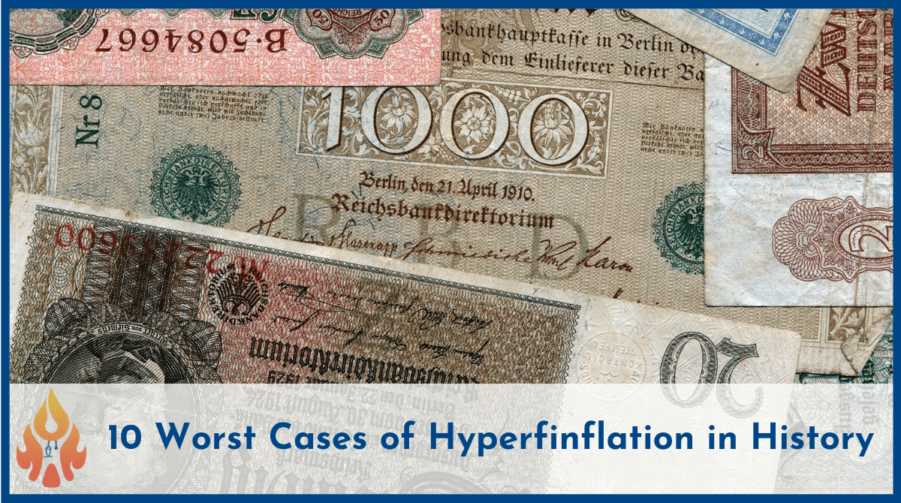

## Table of Contents

## What is hyperinflation and how does it differ from regular inflation?

Hyperinflation is when the prices of things like food and clothes go up really fast, much faster than regular inflation. It happens when a country's money loses its value very quickly. For example, if a loaf of bread costs $1 one day and $10 the next, that's hyperinflation. It can make life very hard because people's money doesn't buy as much, and they struggle to afford basic things.

Regular inflation is when prices go up slowly over time. It's normal and happens in most countries. For example, if a loaf of bread costs $1 this year and $1.05 next year, that's regular inflation. People usually expect it and can plan for it. The difference between the two is the speed and how much prices change. Hyperinflation is much faster and more extreme, causing big problems for people and the economy.

## Can you explain what currency devaluation means?

Currency devaluation happens when a country's government decides to make its money worth less compared to other countries' money. This usually happens with countries that have a fixed exchange rate, meaning their money's value is set against another currency, like the US dollar. When a government devalues its currency, it makes its exports cheaper for other countries to buy. This can help the country sell more things to other countries and boost its economy.

However, devaluation can also make things more expensive for people in that country. If the country needs to import things like food or medicine, those items will cost more because the local money is worth less. This can lead to higher prices and sometimes even inflation. People might find it harder to afford things they need, which can cause economic problems if not managed carefully.

## What are some common causes of hyperinflation?

Hyperinflation often happens when a country prints too much money. When there's too much money around, each piece of money becomes worth less. This can happen if a government is trying to pay for things without raising taxes or borrowing money. For example, if a country is in a war or has big debts, it might print more money to pay for these things. But when there's too much money, prices go up really fast because people have more money to spend, but there aren't more things to buy.

Another cause of hyperinflation can be a loss of trust in the country's money. If people think the money will be worth less soon, they'll spend it quickly before it loses value. This makes prices go up even faster. Sometimes, this happens after a big economic problem or if the government isn't managing the money well. When people lose faith in the money, it can lead to a cycle where prices keep going up and up, making it hard for the economy to get back to normal.

## How does hyperinflation affect the everyday life of citizens?

Hyperinflation makes life very hard for everyday people. When prices go up really fast, the money people have saved up loses its value quickly. This means that even if someone has some money saved, it might not be enough to buy basic things like food and medicine. People might have to spend all their money right away instead of saving it, because they know prices will be higher tomorrow. This can make it tough to plan for the future or pay for things like rent or school.

Also, hyperinflation can make jobs and businesses unstable. Companies might have to raise prices a lot just to keep up, but then people can't afford to buy their products. This can lead to fewer jobs and more people out of work. When people don't have steady jobs, it's even harder to make ends meet. In some cases, people might even use things like foreign money or trade goods directly because they don't trust their own money anymore. All of this makes daily life stressful and unpredictable.

## Can you provide examples of countries that have experienced hyperinflation in the past?

One example of a country that experienced hyperinflation is Germany in the 1920s. After World War I, Germany had a lot of debt and had to pay for war damages. The government started printing more money to pay for these costs, which led to prices going up very fast. At one point, people needed wheelbarrows full of money just to buy a loaf of bread. This hyperinflation made life very hard for Germans and helped lead to big political changes in the country.

Another example is Zimbabwe in the late 2000s. The government printed a lot of money to pay for things, and this caused prices to rise very quickly. At its worst, Zimbabwe had to print banknotes worth trillions of dollars, but they were still not enough to buy basic things. Many people lost their savings, and the economy fell apart. It took years for Zimbabwe to start recovering from this hyperinflation.

A third example is Hungary after World War II. In 1946, Hungary had the highest rate of hyperinflation ever recorded. Prices doubled every 15 hours, making money almost worthless. People had to [carry](/wiki/carry-trading) around huge amounts of cash just to buy daily necessities. The government finally stopped the hyperinflation by introducing a new currency, but the effects on people's lives were severe and long-lasting.

## What was the hyperinflation situation in Weimar Germany after World War I?

After World War I, Germany went through a very tough time with hyperinflation. The country had a lot of debt from the war and had to pay for damages, which they called reparations. The government started printing a lot more money to try and pay for everything. But this made the money worth less and less. Prices started going up really fast. At one point, people needed wheelbarrows full of money just to buy a loaf of bread. This made life very hard for everyone in Germany because their savings became worthless, and they couldn't afford basic things like food and clothes.

The hyperinflation in Weimar Germany didn't just cause money problems; it also led to big changes in the country. People were angry and frustrated because they couldn't trust their money anymore. This led to a lot of unrest and political problems. The hyperinflation made many people lose faith in the government and the economy. It was one of the reasons that helped Adolf Hitler and the Nazi Party gain power later on. The effects of the hyperinflation were felt for a long time and played a big part in shaping Germany's history.

## How did Zimbabwe's hyperinflation in the late 2000s impact its economy?

Zimbabwe's hyperinflation in the late 2000s had a huge impact on its economy. The government was printing a lot of money to pay for things, which made prices go up really fast. At its worst, Zimbabwe had to print banknotes worth trillions of dollars, but even those were not enough to buy basic things like food and medicine. This made life very hard for people because their money lost its value quickly. Many people lost all their savings, and businesses couldn't keep up with the rising costs. As a result, the economy fell apart, and unemployment went up a lot.

The hyperinflation also made it hard for Zimbabwe to get help from other countries. When a country's money is worth less and less, other countries and businesses don't want to lend them money or invest in them. This made it even harder for Zimbabwe to fix its problems. It took years for the country to start recovering, and even now, the effects of the hyperinflation are still felt. The government had to introduce a new currency and make big changes to try and rebuild the economy, but the road to recovery was long and tough.

## What measures can governments take to prevent or mitigate hyperinflation?

Governments can take several steps to prevent or mitigate hyperinflation. One important step is to control how much money they print. If they print too much money, it can lose its value and cause prices to go up really fast. Instead, governments can use other ways to pay for things, like raising taxes or borrowing money carefully. They can also work on making their economy stronger by encouraging more business and jobs, which can help keep prices stable.

Another way to fight hyperinflation is by having a strong central bank. A central bank can set rules about how much money is in the economy and make sure there isn't too much. They can also change interest rates to make borrowing money more or less expensive, which can help control how fast prices go up. If hyperinflation is already happening, the government might need to introduce a new currency to replace the old one that lost its value. This can be a big change, but it can help stop the hyperinflation and start fixing the economy.

## How do international organizations like the IMF respond to hyperinflation crises?

When a country is facing hyperinflation, international organizations like the International Monetary Fund (IMF) often step in to help. The IMF works with the country's government to create a plan to fix the economy. This might include giving the country loans to help them pay for things without printing more money. The IMF also gives advice on how to make the economy stronger, like changing laws or policies to encourage more jobs and businesses. They might also help the country set up a new currency if the old one is no longer useful.

The IMF's goal is to stop the hyperinflation and help the country get back on track. They keep a close eye on how the country is doing and make sure the money they lend is being used wisely. Sometimes, the IMF asks the country to make certain changes, like cutting spending or raising taxes, to make sure the economy stays stable. This can be hard for people in the country, but it's important for stopping the hyperinflation and making life better in the long run.

## What are the long-term effects of hyperinflation on a country's economic structure?

Hyperinflation can mess up a country's economy for a long time. When prices go up really fast, people lose trust in the money. This can make it hard for businesses to plan and grow because they don't know what prices will be like tomorrow. Banks might also be scared to lend money because they're worried about getting paid back. This can lead to fewer jobs and businesses, which makes the economy weaker. People might start using other ways to buy things, like trading goods or using foreign money, which can make the economy even more unstable.

After hyperinflation, a country might need to change its money system completely. They might have to introduce a new currency to replace the old one that lost its value. This can be a big change and take a long time to fix. The government might also need to make new rules and laws to make sure the economy stays stable. It can take years for people to start trusting the money again and for businesses to grow. Even after things get better, the memory of hyperinflation can make people careful and worried about the economy for a long time.

## How can hyperinflation lead to changes in a country's political landscape?

Hyperinflation can cause big changes in a country's politics because it makes life very hard for people. When prices go up really fast, people can't afford basic things like food and medicine. This makes them angry and frustrated with the government. They might lose trust in the leaders who let the economy get so bad. This can lead to protests and unrest as people demand change. Sometimes, this anger can help new political groups or leaders gain power, like what happened in Germany after World War I when the Nazi Party rose to power partly because of the hyperinflation.

Also, hyperinflation can make a country's politics unstable. When the economy is falling apart, it's hard for the government to make good decisions. They might have to make tough choices, like cutting spending or raising taxes, which can make people even more unhappy. Sometimes, other countries or international groups might step in to help, but this can also cause problems if people feel like their country is being controlled by outsiders. All of these things can lead to big changes in who runs the country and how it's run, sometimes for many years after the hyperinflation is over.

## What are the most effective strategies for recovering from hyperinflation and currency devaluation?

To recover from hyperinflation and currency devaluation, a country needs to stop printing too much money. Instead, the government should use other ways to pay for things, like raising taxes or borrowing money carefully. They might also need to introduce a new currency to replace the old one that lost its value. This can help people start trusting the money again. The government can work with a strong central bank to set rules about how much money is in the economy and change interest rates to keep prices stable. This helps stop prices from going up too fast and gives businesses and people a chance to plan for the future.

Another important part of recovery is making the economy stronger. The government can do this by making it easier for businesses to grow and create jobs. They might change laws or policies to encourage more investment and trade. International organizations like the IMF can help by giving loans and advice on how to fix the economy. These loans can help the country pay for things without printing more money. It's important for the government to use this help wisely and make the changes needed to keep the economy stable. Over time, these steps can help the country recover from hyperinflation and build a stronger economy for the future.

## References & Further Reading

For those interested in deepening their understanding of hyperinflation and currency devaluation, several scholarly and practical resources provide valuable insights. Bernard Lietaer's "The Future of Money" and Adam Fergusson's "When Money Dies" are essential readings on the historical and socio-economic aspects of hyperinflation. These works explore the impact of monetary instability on societies, offering crucial context for modern economic challenges.

To comprehend the intricacies of [algorithmic trading](/wiki/algorithmic-trading), Ernie Chan's "Algorithmic Trading: Winning Strategies and Their Rationale" and "Quantitative Trading" are excellent starting points. Chan provides practical insights into building algorithmic strategies that can mitigate risks associated with market [volatility](/wiki/volatility-trading-strategies). These resources are further complemented by financial platforms such as Investopedia, which offer well-rounded analyses on hedging strategies and algorithmic trading technologies applicable in turbulent economic environments.

For an academic perspective, the Journal of Economic Perspectives delivers comprehensive studies on historical hyperinflation cases and fiscal policy responses, shedding light on the efficacy of different strategies. Online databases like JSTOR and SpringerLink house numerous papers and articles that explore the economic phenomena discussed, offering both theoretical and empirical perspectives.

Finally, the International Monetary Fund's (IMF) publications deliver authoritative analyses on how global monetary policies can prevent economic meltdowns, making them an invaluable resource for policymakers aiming to avoid repeating past mistakes. Combining these readings with the use of online platforms and academic journals will significantly enhance your understanding of the complex dynamics at play in managing economic instability.

