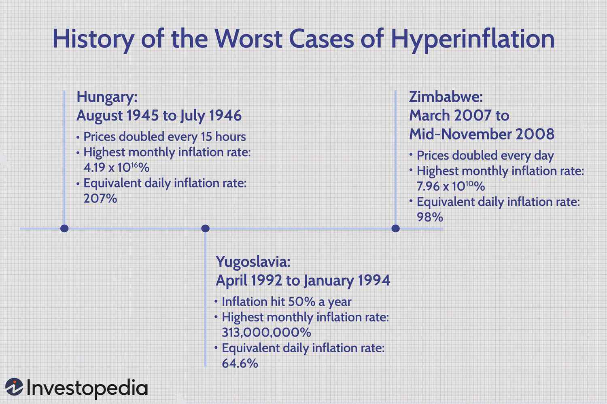

Hyperinflation is a severe economic phenomenon distinguished by an exceptionally rapid increase in prices, leading to a situation where the currency in question essentially loses its value. Unlike ordinary inflation, which can represent healthy economic growth when kept at manageable levels, hyperinflation is defined by inflation rates exceeding 50% per month. This extraordinary rate of inflation destabilizes economies, leading to drastic currency devaluation, and can be triggered by various factors including excessive money supply, fiscal mismanagement, and a loss of confidence in the nation's currency.

Throughout history, there have been several instances of hyperinflation that stand out due to their destructive economic impacts. Notable among these is the hyperinflation in the Weimar Republic in post-World War I Germany, where the excessive printing of money to cover war reparations led to a catastrophic drop in the German mark's value. Similarly, Zimbabwe experienced unprecedented hyperinflation in the late 2000s as a result of political policies and economic mismanagement, leading to massive poverty and economic breakdown. Hungary also faced hyperinflation just after World War II, with the worst known devaluation recorded, caused by post-war economic disruption and fiscal accidents.



These historical cases provide crucial insights into the severe economic impacts of hyperinflation, extending from the erosion of wealth and the disruption of basic economic frameworks to profound social consequences like increased poverty and economic instability. Additionally, in modern financial markets, understanding hyperinflation is vital, especially for algorithmic trading. This method of trading utilizes complex algorithms to handle rapid market changes, making it essential to develop strategies that can cope with the extreme volatility characteristic of hyperinflationary periods. Through currency diversification and risk management techniques, algorithmic trading can offer tools to manage the uncertainty and reactivity required in such volatile economic conditions. This article explores these aspects by examining historical episodes of hyperinflation, their economic impacts, and their implications for contemporary trading practices.

## Table of Contents

## Understanding Hyperinflation

Hyperinflation represents a severe economic abnormality where inflation spirals out of control, eroding the fundamental stability of a nation's economy. Typically identified by an inflation rate exceeding 50% per month, hyperinflation dramatically undermines the purchasing power of money, leading to a complete loss of confidence in the currency by the populace.

The essential characteristics of hyperinflation include a drastic devaluation of currency, a rapid surge in prices, and the consequential loss of purchasing power. This turbulent scenario disrupts the economic equilibrium as goods and services become increasingly unaffordable, fostering an environment of uncertainty and economic distress.

The core causes of hyperinflation are multifaceted, often rooted in excessive money supply, fiscal mismanagement, and a waning trust in the government's ability to manage the economic environment. Excessive money printing, usually undertaken to meet national debts or finance government spending without adequate backing by economic growth, leads to an unparalleled increase in the money supply. This condition inflates demand without a corresponding increase in the supply of goods, leading to upward pressure on prices. 

Additionally, fiscal mismanagement, such as persistent budget deficits without viable financing means, exacerbates the situation by placing continuous stress on a country's financial system. Finally, loss of confidence in the currency further accelerates hyperinflation, as individuals and businesses rush to convert local currency into tangible assets or more stable foreign currencies, thereby catalyzing the currency's decline in value.

Understanding these dynamics is crucial for policymakers and economists as they work to avert hyperinflation through fiscal responsibility, currency stabilization measures, and confidence-building initiatives within the economic framework.

## Historical Examples of Hyperinflation

Germany's Weimar Republic (1921-1923), Zimbabwe (2007-2009), and Hungary (1945-1946) are some of the most striking historical examples of hyperinflation, each presenting unique causes and outcomes that have been extensively analyzed by economists.

### Germany (Weimar Republic, 1921-1923)

In the aftermath of World War I, Germany faced significant economic turmoil, which led to one of the most infamous episodes of hyperinflation in recorded history. The Treaty of Versailles imposed heavy reparations on Germany, creating a substantial financial burden on the already strained economy. To meet these reparations, as well as to finance post-war reconstruction, the Weimar government resorted to excessive money printing.

The rampant inflation was characterized by an unfettered increase in money supply without corresponding economic growth, leading to extraordinary rises in prices. For instance, a loaf of bread that cost 250 marks in January 1923 soared to approximately 200 billion marks by the end of the year. This rendered the German mark practically worthless and caused severe economic instability. The social and economic fabric of the society was deeply affected, resulting in savings becoming valueless overnight and significant disruption in everyday transactions. [Source: Fergusson, Adam, *When Money Dies: The Nightmare of Deficit Spending, Devaluation, and Hyperinflation in Weimar Germany*]

### Zimbabwe (2007-2009)

Zimbabwe's hyperinflation period, largely spanning 2007 to 2009, was driven primarily by political instability and controversial economic policies. Land reforms in the early 2000s, which involved the seizure and redistribution of commercial farms, had a devastating effect on agricultural productivity and economic output. Compounded by a lack of fiscal discipline, the government began printing money excessively to finance its deficit and various populist initiatives.

By November 2008, Zimbabwe’s monthly inflation rate reached a staggering 79.6 billion percent, according to the Cato Institute. This hyperinflation resulted in the abandonment of the Zimbabwean dollar in favor of foreign currencies, and the economy shifted largely into informal transactions and barter trade. The socio-economic impact was severe, with widespread poverty, unemployment, and the collapse of public services. [Source: Hanke, Steve H., *R.I.P. Zimbabwe Dollar*]

### Hungary (1945-1946)

Hungary experienced the worst instance of hyperinflation ever recorded between 1945 and 1946. Post-World War II, the Hungarian economy was left in ruins, lack of productive capacity, and severe war debts. To combat these fiscal challenges, the government began indiscriminately printing currency, leading to the rapid devaluation of the pengő.

At its peak in July 1946, prices doubled approximately every 15 hours, and the highest banknote issued was for 100 quintillion pengő (10^20). The government eventually introduced a new currency, the forint, to stabilize the economy and succeeded in curbing inflation rates by drastically reducing the money supply and implementing economic reforms. Hungary's hyperinflation demonstrated the debilitating effects of currency devaluation in a post-war economy and the necessity of monetary reform to restore economic stability. [Source: Felcser, Dusán. *Post-war hyperinflation in Hungary: 75th anniversary*]

These examples underscore the destructive potential of hyperinflation, highlighting the significant role of governmental fiscal management and economic stability in preventing such crises.

## Economic Impact of Hyperinflation

Hyperinflation dramatically erodes wealth and undermines the foundational framework of an economy. Currency rapidly loses its purchasing power, rendering it nearly worthless and requiring colossal sums to purchase basic goods and services. This phenomenon precipitates a loss of confidence among investors and businesses, often sparking capital flight as both groups seek more stable environments. This exodus of investment and financial resources aggravates economic contractions, leading to further destabilization of the affected economy.

The disruption extends beyond financial markets. Socially, hyperinflation exacerbates poverty levels by diminishing real incomes and savings. As the cost of living escalates sharply, many individuals find themselves unable to afford essentials, which intensifies economic disparity and social unrest. In hyperinflationary environments, the marketplace may shift towards reliance on barter systems or the adoption of stable foreign currencies for transactions, as people abandon rapidly devaluing domestic currency. This departure can further weaken the local currency, entrenching the hyperinflationary spiral.

In economies beset by hyperinflation, governments and policymakers often struggle to restore confidence and stabilize the economic environment. History demonstrates that the longer hyperinflation persists, the more challenging it becomes to re-establish normal economic function and social stability. This necessitates robust policy measures and, frequently, international assistance to navigate the difficult path to recovery.

## Algorithmic Trading and Hyperinflation

Algorithmic trading utilizes sophisticated algorithms to automate and execute trades at high speeds, leveraging historical data, statistical models, and complex decision-making processes. This method proves to be particularly advantageous during periods of market [volatility](/wiki/volatility-trading-strategies), such as those induced by hyperinflation. In hyperinflationary environments, rapid price changes and market uncertainty present significant challenges for investors. Algorithmic trading systems are uniquely equipped to address these challenges due to their ability to process vast amounts of data and make quick decisions based on predefined strategies.

One of the primary strategies that [algorithmic trading](/wiki/algorithmic-trading) systems employ during hyperinflation is volatility management. High volatility can lead to increased risk and unpredictable market movements, making it crucial for algorithms to adapt swiftly. Volatility management involves the use of statistical techniques to estimate the extent of price fluctuations and adjust trading strategies accordingly. This can involve setting dynamic stop-loss orders or adjusting position sizes to mitigate potential losses.

Currency diversification is another strategy used by algorithmic traders during hyperinflation. By diversifying investments across multiple currencies, traders can hedge against the devaluation of any single currency, thus stabilizing their portfolio's value. Algorithmic systems can evaluate and identify optimal currency pairs based on historical correlations and predicted market movements.

Sentiment analysis represents a more sophisticated approach, allowing algorithms to analyze unstructured data from news articles, social media, and other sources. By assessing the political and economic sentiments surrounding currency markets, algorithms can predict market trends and make informed trading decisions. This involves natural language processing techniques to quantify the sentiment expressed in various data sources, subsequently integrating these insights into trading strategies.

Python, with libraries such as `pandas` for data manipulation, `numpy` for numerical computation, and `scikit-learn` for [machine learning](/wiki/machine-learning), serves as a powerful tool for implementing these algorithmic trading strategies. For instance, the following code snippet demonstrates how to apply a simple moving average strategy to manage volatility:

```python
import pandas as pd
import numpy as np

# Load historical currency data
data = pd.read_csv('currency_data.csv')
data['SMA'] = data['Closing_Price'].rolling(window=20).mean()

# Define trading strategy based on moving average
data['Position'] = np.where(data['Closing_Price'] > data['SMA'], 1, -1)

# Calculate returns
data['Returns'] = data['Position'].shift(1) * data['Closing_Price'].pct_change()

# Output the total returns
total_returns = data['Returns'].sum()
print(f"Total Returns: {total_returns:.2f}")
```

In conclusion, algorithmic trading presents an effective means of navigating the complexities of hyperinflation by deploying strategies that manage volatility, diversify currency exposure, and analyze market sentiment. These strategies enable traders to not only mitigate risks but also capitalize on the rapid market changes typical of hyperinflationary periods, ensuring robust financial outcomes.

## Lessons Learned

Historical instances of hyperinflation provide essential lessons on maintaining economic stability and preventing future financial turmoil. These cases emphasize the pivotal role of stable fiscal policies and sound economic management.

A consistent theme across hyperinflationary episodes is the crucial importance of maintaining fiscal discipline. Unchecked government spending, often financed by excessive money printing, typically precipitates hyperinflation. For example, the Weimar Republic's response to reparation payments post-World War I involved printing vast amounts of money, leading to dramatic currency devaluation. Such fiscal mismanagement serves as a stark warning for modern economies: fiscal policies should control deficits and ensure that government spending aligns with economic productivity levels.

Restoring confidence in both the currency and governmental structures emerges as a necessary step towards recovery from hyperinflation. Historical recoveries have shown that a reformed and transparent monetary policy is integral to rebuilding trust. Governments must demonstrate commitment to monetary stability, often requiring a complete overhaul of currency systems, as observed in Zimbabwe's adoption of foreign currencies to stabilize its economy post-hyperinflation. Institutional reforms and anti-corruption measures are typically required to regain public confidence and lay a foundation for economic recovery.

Investors and countries must recognize hyperinflation risks and develop strategies to mitigate them. Diversification of investments to hedge against currency devaluation, alongside international collaboration, can be effective. For countries, investing in a resilient monetary and fiscal framework is vital. Economies should focus on building strong central banks capable of implementing independent monetary policies that counteract inflationary pressures.

Ensuring long-term economic stability involves understanding warning signals of potential hyperinflationary pressures. Historical examples underline the significance of a proactive approach to economic policy, emphasizing the need for vigilance in policy planning and execution. By maintaining these principles, economies can guard against the destabilizing forces of hyperinflation, promoting sustainable growth and economic resilience.

## Conclusion

Hyperinflation remains one of the most severe economic challenges for nations, compelling governments and financial institutions to employ robust measures and seek international cooperation to manage and prevent its devastating effects. The episodes of hyperinflation throughout history serve as stark reminders of the economic instability and social disruptions that can arise from extreme inflationary pressures. These lessons underscore the critical importance of sound fiscal policies and reliable economic management.

In the context of contemporary financial markets, techniques such as algorithmic trading offer valuable insights and tools for navigating the heightened volatility that accompanies hyperinflation. By leveraging complex algorithms, traders can execute rapid transactions and adapt to changing market conditions more effectively. Methods like volatility management, currency diversification, and sentiment analysis are essential in these scenarios, enabling market participants to assess and respond to economic and political signals that influence currency dynamics.

A thorough understanding of past hyperinflation episodes aids investors, policymakers, and economists in recognizing risk signals and developing preemptive strategies. By studying these historical examples, communities can better anticipate potential economic disturbances and implement frameworks to mitigate the impacts of hyperinflation. Recognizing early warning signs and implementing countermeasures is key to ensuring long-term economic stability and protecting the wealth and livelihood of citizens in vulnerable economies.

In summary, the battle against hyperinflation demands vigilance, strategic foresight, and collaboration at both national and international levels. While algorithmic trading presents advanced methodologies to cope with market turmoil, the ultimate solutions lie in strengthening economic governance and safeguarding currency credibility. As the global economy continues to evolve, these lessons remain vital for anticipating financial crises and fostering sustainable economic growth.

## References & Further Reading

[1]: Fergusson, Adam. *When Money Dies: The Nightmare of Deficit Spending, Devaluation, and Hyperinflation in Weimar Germany*. [Available on Amazon](https://www.amazon.com/When-Money-Dies-Devaluation-Hyperinflation/dp/1586489941).

[2]: Hanke, Steve H. *R.I.P. Zimbabwe Dollar*. [Article on Cato Institute](https://www.cato.org/sites/cato.org/files/serials/files/cato-journal/2009/5/cj29n2-8.pdf).

[3]: Felcser, Dusán. *Post-war hyperinflation in Hungary: 75th anniversary*. [Research Article](https://www.jstor.org/stable/1831932).

[4]: Lopez de Prado, Marcos. ["Advances in Financial Machine Learning"](https://www.amazon.com/Advances-Financial-Machine-Learning-Marcos/dp/1119482089).

[5]: Aronson, David. ["Evidence-Based Technical Analysis: Applying the Scientific Method and Statistical Inference to Trading Signals"](https://www.amazon.com/Evidence-Based-Technical-Analysis-Scientific-Statistical/dp/0470008741). 

[6]: Jansen, Stefan. ["Machine Learning for Algorithmic Trading"](https://github.com/stefan-jansen/machine-learning-for-trading).

[7]: Chan, Ernest P. ["Quantitative Trading: How to Build Your Own Algorithmic Trading Business"](https://github.com/ftvision/quant_trading_echan_book).