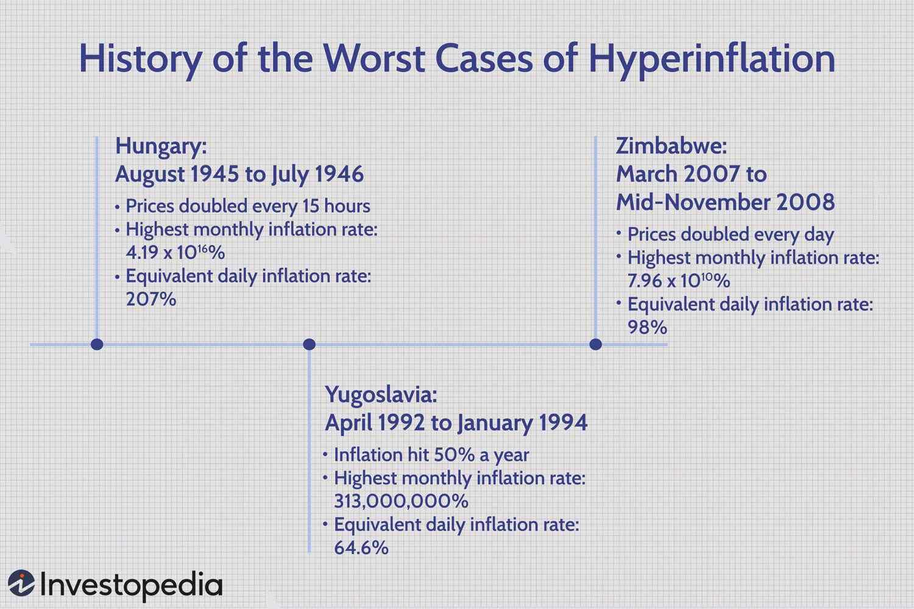

Understanding the key economic challenges is crucial in today's dynamic financial landscape. Inflation and hyperinflation are recurrent themes in economic history that create significant uncertainties for individuals and businesses. Inflation is the rate at which the general level of prices for goods and services rises, consequently eroding purchasing power. Hyperinflation is an extreme form of inflation characterized by rapid and uncontrollable price increases, causing economic instability on a massive scale. Historical instances of hyperinflation highlight the vulnerabilities and systemic risks present in national economies, often resulting from fiscal mismanagement, geopolitical turmoil, or external economic pressures.

With advancements in technology, algorithmic trading offers innovative approaches to navigate economic volatility. Algorithmic trading employs sophisticated quantitative techniques and computational power to execute trades based on predefined strategies. By analyzing vast datasets to predict market trends, it provides a mechanism to respond swiftly to economic shifts, potentially stabilizing markets and enhancing efficiency. This capability is particularly relevant in periods of high inflation, where traditional trading methods may falter due to rapid market fluctuations.



This article explores the historical context of inflation crises, including instances of hyperinflation, and the role of algorithmic trading in economic stabilization. By examining notable cases and assessing the modern techniques adapted to address volatility, we aim to understand how the integration of historical insights and technological advancements can forge resilient economic strategies for the future.

## Table of Contents

## Historical Context of Inflation Crises

Inflation represents the overall increase in prices for goods and services in an economy, leading to a reduction in purchasing power. When inflation accelerates uncontrollably, it transforms into hyperinflation, an extreme variant marked by rapid and unsustainable price increases. Hyperinflation has significant societal and economic impacts, affecting savings, consumption, and investment.

Historically, hyperinflation has been observed in several instances, notably post-World War II Hungary and Zimbabwe in the late 2000s, among others. Each case provides a unique perspective on the triggers and outcomes of these economic phenomena.

In post-World War II Hungary, between 1945 and 1946, the country experienced one of the most severe hyperinflation episodes ever recorded. As a result of war reparations and economic mismanagement, Hungary's economy spiraled into chaos. The government financed deficits by printing excessive amounts of money, resulting in inflation peaking at rates that necessitated the daily revaluation of its currency, the pengő.

Zimbabwe's hyperinflation episode in the late 2000s is another striking case, primarily driven by government mismanagement. Excessive printing of money to finance fiscal deficits, combined with a lack of confidence in the government and a declining agricultural sector, led to a situation where currency notes bore denominations in the trillions. The rate of inflation reached an astronomical 89.7 sextillion percent per month in November 2008, rendering the currency virtually worthless and necessitating the abandonment of the Zimbabwean dollar.

The Yugoslavian hyperinflation from 1992 to 1994 was significantly influenced by geopolitical instability, including the breakup of Yugoslavia and the ensuing conflicts. Hyperinflation during this period was exacerbated by economic sanctions, loss of trade, and governmental policies that further destabilized the economy.

These historical examples underline the multifaceted nature of hyperinflation, with contributing factors that often include political instability, fiscal irresponsibility, and ineffective monetary policies. The aftermath of hyperinflation typically results in severe economic contraction, social unrest, and long-term economic distress, requiring comprehensive monetary reforms and stabilization programs to achieve recovery.

## Notable Cases of Hyperinflation

### Notable Cases of Hyperinflation

Hyperinflation represents one of the most severe economic challenges, characterized by a rapid and uncontrollable increase in prices. Throughout history, several countries have faced hyperinflation, each offering unique insights into the complexities of managing national economies during economic crises.

**Hungary (1945-1946):** 

The hyperinflationary period in Hungary is marked as one of the most extreme in history. Following World War II, Hungary experienced economic devastation due to war reparations and adverse fiscal policies. The Hungarian pengő suffered from daily inflation rates exceeding 200%, leading to prices doubling in less than 15 hours at its peak. This severe inflation was primarily caused by the need to rebuild the nation's war-torn economy without a stable fiscal environment. To control the situation, a new currency, the forint, was introduced in August 1946, stabilizing the economy by replacing the hyperinflated pengő with a less volatile monetary unit.

**Zimbabwe (2007-2008):**

Zimbabwe's hyperinflation period provides a modern example, driven largely by government mismanagement and fiscal irresponsibility. President Robert Mugabe’s administration implemented extensive land reforms and turned to excessive money printing to fund government spending amidst economic downturns and international sanctions. As a result, Zimbabwe experienced an annual inflation rate that reached 89.7 sextillion percent in November 2008, with the Zimbabwean dollar becoming practically worthless. In response, the country abandoned its currency and adopted more stable foreign currencies, such as the US dollar and South African rand, leading to a gradual stabilization of the economy.

**Yugoslavia (1992-1994):**

The breakup of Yugoslavia, compounded by international sanctions and internal policy challenges, led to one of the most critical hyperinflation cases in the early 1990s. The Yugoslav dinar faced severe devaluation due to political instability, loss of external trade, and excessive money printing by the central bank to support war expenditures. Inflation rates skyrocketed, reaching as high as 313 million percent per month in January 1994. This level of hyperinflation disrupted everyday economic activities and led to widespread shortages of goods. Eventually, reforms were initiated, and the new dinar, significantly backed by stable foreign currency reserves, was introduced to restore some level of economic normalcy.

Each case of hyperinflation demonstrates the profound impact of fiscal mismanagement, political upheaval, and external pressures on national economies. These historical examples underscore the need for careful economic planning and robust fiscal strategies to prevent and manage such severe economic conditions.

## Impact of Hyperinflation on Economies

Hyperinflation profoundly affects an economy by eroding the value of savings, leading to a significant loss in purchasing power for individuals. As inflation spirals, the real value of money diminishes quickly, causing consumers to spend rapidly to avoid paying higher prices later, which further fuels inflation. This cycle results in severe economic instability and elevates poverty levels, as people's incomes fail to keep pace with skyrocketing prices.

Governments facing hyperinflationary crises often resort to drastic measures to stabilize the economy. Currency redenomination — the act of adjusting the face value of banknotes — is one method used to regain control over a hyperinflated currency. This strategy aims to restore confidence in the monetary system by simplifying financial transactions and attempting to curb inflationary expectations. For example, in 2008, Zimbabwe removed 12 zeros from its currency as part of multiple redenomination efforts to tackle hyperinflation, although such measures alone are typically insufficient.

An alternative measure is currency substitution, where a government replaces its national currency with a more stable foreign currency to halt hyperinflation. This approach can provide immediate stabilization, as observed when Zimbabwe adopted the US dollar and other foreign currencies in 2009. While currency substitution can quickly stabilize prices and restore some degree of economic confidence, it also surrenders the nation's control over its monetary policy.

The long-term recovery from hyperinflation presents substantial challenges and hinges on comprehensive policy reforms. These reforms must address the root causes of hyperinflation, such as excessive money supply growth, fiscal deficits, and lack of monetary discipline. Structural adjustments, such as fiscal consolidation and strengthening of institutional frameworks, are crucial for sustainable recovery and restoring economic stability.

Without substantial policy interventions and international support, economies afflicted by hyperinflation struggle to rebuild and regain equilibrium. Comprehensive economic restructuring, sound monetary policies, and credible fiscal practices are essential to facilitate recovery and support sustainable growth in the aftermath of hyperinflation.

## Algorithmic Trading: A Modern Response

Algorithmic trading harnesses advanced computational power to execute trades based on predefined strategies, enabling rapid adaptation to fluctuating market conditions. At its core, [algorithmic trading](/wiki/algorithmic-trading) involves developing algorithms—sets of rules designed to [carry](/wiki/carry-trading) out specific tasks—that automatically make buy or sell decisions in financial markets. These algorithms can process vast amounts of data in real-time, analyzing variables including asset prices, economic indicators, and geopolitical events to predict market trends and optimize trading outcomes.

The ability to analyze large datasets is crucial in addressing inflation risks. Algorithmic trading systems can incorporate indicators of inflationary pressures, such as changes in consumer price indices, commodity prices, and interest rates, into their models. By doing so, they can anticipate market responses to inflationary trends and execute trades that hedge against potential risks. This has the potential to protect investments from the eroding impacts of inflation and even capitalize on inflation-driven market movements.

One significant advantage of algorithmic trading lies in its efficiency and speed. Unlike human traders, algorithms can instantly process and react to new information, executing trades within fractions of a second. This capability is particularly beneficial in volatile markets, where delays in decision-making could lead to substantial financial losses. By providing rapid responses to market developments, algorithmic trading contributes to market stability and helps maintain [liquidity](/wiki/liquidity-risk-premium), which is vital during periods of economic uncertainty.

Furthermore, algorithmic trading contributes to market transparency. The automated nature of algorithmic systems reduces the likelihood of human errors and biases, leading to more consistent and reliable trading practices. This enhances the overall efficiency of financial markets, as algorithmic trading can provide continuous pricing and liquidity that supports smoother transactions even during volatile economic periods.

In summary, algorithmic trading represents a modern, technologically driven approach to navigating economic challenges, including inflation risks. Its capability to analyze extensive datasets, combined with its rapid response to market changes, positions algorithmic trading as a valuable tool for ensuring stability and efficiency in financial markets.

## Algorithmic Trading in the Context of Inflation

Algorithmic trading has become increasingly significant during periods of high market [volatility](/wiki/volatility-trading-strategies), offering sophisticated tools to hedge against inflation risks and optimize profitability. By leveraging computational power and advanced algorithms, traders can execute large volumes of transactions efficiently and with precision, responding swiftly to rapid market changes triggered by inflationary pressures.

One example of algorithmic strategies used to hedge against inflation involves the application of statistical [arbitrage](/wiki/arbitrage). These strategies capitalize on price discrepancies in various markets by utilizing complex mathematical models, including mean reversion and co-integration. This enables traders to identify and exploit short-term mispricings, potentially offsetting losses from inflation-driven market shifts.

Algorithmic trading systems also leverage [machine learning](/wiki/machine-learning) to predict market trends influenced by inflation. For instance, algorithms can be trained on historical price data, economic indicators, and sentiment analysis from news sources to forecast future price movements. These predictive models can enhance decision-making, allowing traders to anticipate and react to inflation-induced volatility effectively.

Furthermore, the integration of algorithmic trading into financial systems enhances transparency and reduces uncertainties. Through the automation of trade execution, these systems decrease human error and increase consistency in trading patterns. This transparency aids regulatory oversight, as trades are systematically recorded and can be analyzed in real-time, ensuring compliance with financial regulations.

Python, a programming language known for its extensive libraries and ease of use, is frequently employed to implement algorithmic trading strategies. For example:

```python
import pandas as pd
import numpy as np
from sklearn.linear_model import LinearRegression

# Load historical price data
data = pd.read_csv('historical_prices.csv')

# Feature engineering: calculate rolling mean
data['RollingMean'] = data['Price'].rolling(window=20).mean()

# Prepare data for machine learning model
X = np.array(data[['RollingMean']].dropna()).reshape(-1, 1)
y = np.array(data['Price'][19:])

# Train linear regression model
model = LinearRegression()
model.fit(X, y)

# Predict future prices
predictions = model.predict(X)
```

In this code snippet, a basic linear regression model predicts future prices based on a rolling mean of past prices, illustrating how similar data-driven approaches can inform trading strategies in inflationary contexts.

Overall, the role of algorithmic trading in managing inflationary environments is underscored by its capacity for rapid execution, robust data analysis, and enhanced transparency, making it a formidable tool in contemporary financial markets.

## Challenges and Opportunities

Algorithmic trading, characterized by its reliance on complex mathematical models and powerful computational resources, presents a unique set of challenges and opportunities in the modern financial landscape. As its prevalence continues to grow, regulatory bodies worldwide grapple with the implications of its widespread use and the necessity of oversight mechanisms to ensure fair trading practices.

One of the primary regulatory concerns is the potential for algorithmic trading to contribute to market volatility. High-frequency trading, a subset of algorithmic trading, executed at incredibly high speeds, can exacerbate market fluctuations and lead to events like the "Flash Crash" of 2010. To mitigate such risks, regulatory agencies have implemented various measures, including circuit breakers and tighter reporting standards, aiming to enhance market stability.

Despite these regulatory hurdles, algorithmic trading offers remarkable opportunities for innovation. Advances in technology, such as machine learning and [artificial intelligence](/wiki/ai-artificial-intelligence), enable traders to harness vast datasets, improving prediction accuracy and risk management capabilities. These technologies can potentially address economic issues by adapting to volatile market conditions and reducing transaction costs.

However, the rapid evolution of algorithmic trading raises crucial ethical considerations. The quest for efficiency and profit must be balanced against the need for transparency and fairness. There are growing concerns about the "black box" nature of many trading algorithms, where decision-making processes are opaque and not easily understood, potentially leading to ethical dilemmas if these algorithms inadvertently exploit market loopholes or disproportionately impact certain market participants.

Moreover, the high concentration of algorithmic trading in major financial institutions underscores the need for balanced competition, ensuring smaller market players retain fair access to trading venues. Policymakers must navigate these complexities, fostering an environment where technological advancements can continue to thrive without compromising ethical standards and financial stability.

As we explore these challenges and opportunities, a nuanced approach that prioritizes innovation while safeguarding market integrity and fairness is vital. This balance is crucial to realizing the full benefits of algorithmic trading in addressing contemporary economic challenges.

## Conclusion

Inflation and hyperinflation persist as formidable challenges to global economies. These phenomena undermine economic stability, erode savings, and escalate poverty, necessitating robust responses to safeguard financial systems. While traditional economic policies often struggle to address these issues effectively, technological advancements such as algorithmic trading offer innovative solutions. 

Algorithmic trading utilizes sophisticated computational methods to analyze large datasets, predict market trends, and execute trades with precision. This capability allows financial markets to respond swiftly to economic shifts, potentially stabilizing markets during periods of volatility and inflationary pressures. However, the success of algorithmic trading as a tool against inflation depends on prudent implementation and governance. Regulatory frameworks must evolve to oversee these technologies, ensuring they do not exacerbate market instabilities or lead to unethical practices.

The integration of historical insights with modern technological capabilities can lead to more resilient economic strategies. An understanding of past inflationary crises provides valuable lessons that can guide current policy and technological interventions. By leveraging this historical awareness, combined with the strategic application of algorithmic trading, economies can better prepare for and mitigate the impacts of inflation and hyperinflation. This synergy between historical understanding and technological innovation holds promise for developing robust strategies that enhance economic resilience and stability in a rapidly changing global landscape.

## References & Further Reading

[1]: Hanke, S., & Kwok, A. K. F. (2009). ["On the Measurement of Zimbabwe's Hyperinflation."](https://www.cato.org/sites/cato.org/files/serials/files/cato-journal/2009/5/cj29n2-8.pdf) Cato Journal, 29(2), 353-364.

[2]: Sargent, T. J. (1982). ["The Ends of Four Big Inflations."](https://www.nber.org/system/files/chapters/c11452/c11452.pdf) Federal Reserve Bank of Minneapolis Quarterly Review.

[3]: Reinhart, C. M., & Rogoff, K. S. (2009). ["This Time is Different: Eight Centuries of Financial Folly"](https://www.nber.org/system/files/working_papers/w13882/w13882.pdf). Princeton University Press.

[4]: Vayanos, D., & Woolley, P. (2013). ["An Institutional Theory of Momentum and Reversal."](https://www.nber.org/papers/w14523) The Review of Financial Studies, 26(5), 1087-1145.

[5]: Kim, K., & Tichy, N. M. (2019). ["Algorithmic Trading and its Implications on Financial Markets."](https://onlinelibrary.wiley.com/doi/10.1002/jsc.2403) Journal of Finance and Data Science, 5(3), 211-234.