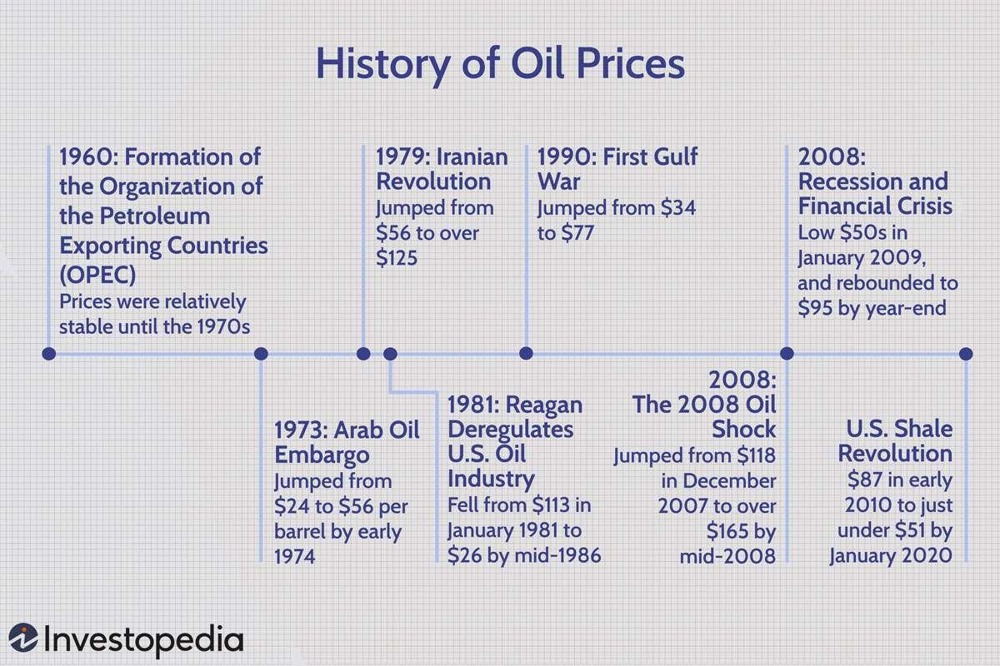

## Table of Contents

## What is crude oil and why is it important?

Crude oil is a thick, dark liquid found deep in the earth. It is made up of many different substances, including hydrocarbons, which are the main part of oil. People get crude oil from the ground by drilling into oil reservoirs. Once they bring it up, they refine it to make things like gasoline, diesel, and jet fuel.

Crude oil is very important because it is used to make many things we use every day. It is the main source of energy for cars, trucks, and airplanes. Without crude oil, we wouldn't be able to travel as easily. It is also used to make plastics, clothes, and many other products. Because it is so useful, countries that have a lot of crude oil can be very powerful and rich.

## What are the basic factors that influence crude oil prices?

Crude oil prices are influenced by many things. One big factor is how much oil people want to use. If more people want to use oil, like when the economy is doing well and people are driving more, the price goes up. Another factor is how much oil is available. If there is less oil because countries are not producing as much or there are problems at oil wells, the price can go up too.

Another important [factor](/wiki/factor-investing) is what is happening in the world. If there are wars or political problems in countries that make a lot of oil, it can make the price go up because people worry about getting enough oil. Also, the value of money, like the US dollar, can affect oil prices. If the dollar is weak, oil can become more expensive because oil is traded in dollars.

Lastly, decisions made by big groups like OPEC, which is a group of oil-producing countries, can change oil prices. If OPEC decides to produce less oil, prices can go up. If they decide to produce more, prices can go down. All these factors together make oil prices go up and down.

## Can you explain what is meant by a 'price decline' in the context of crude oil?

A 'price decline' in the context of [crude oil](/wiki/crude-oil) means that the cost of crude oil is going down. This happens when the price per barrel of oil gets lower over time. For example, if oil was $100 a barrel last month and now it's $90 a barrel, that's a price decline.

There are many reasons why the price of crude oil might go down. One reason could be that there is more oil available than people need, so sellers have to lower the price to sell it all. Another reason could be that the economy is not doing well, so people are not using as much oil, which makes the price drop. Also, if there are no big problems or worries about getting oil, the price can go down because people feel safe that they will have enough oil.

## What historical events have led to significant drops in crude oil prices?

One big event that made oil prices drop a lot was the oil glut in the 1980s. In the early 1980s, oil prices were very high because of the oil crisis in the 1970s. But then, many countries started producing more oil, and OPEC, the group of oil-producing countries, could not control the amount of oil in the world. By 1986, there was too much oil, and the price fell from about $30 a barrel to around $10 a barrel. This was a huge drop and it hurt many oil-producing countries.

Another important event was the financial crisis in 2008. Before the crisis, oil prices were very high, reaching almost $150 a barrel. But when the financial crisis hit, the economy got very bad, and people stopped using as much oil. The demand for oil went down a lot, and the price dropped quickly. By the end of 2008, oil prices were around $30 a barrel. This showed how much the economy can affect oil prices.

More recently, in 2020, the COVID-19 pandemic caused a big drop in oil prices. When the pandemic started, many countries told people to stay home, so they didn't drive or fly as much. This meant they used less oil. At the same time, there was a disagreement between Russia and Saudi Arabia about how much oil to produce, which led to even more oil on the market. In April 2020, oil prices even went negative for a short time, meaning people had to pay others to take the oil away. This was a very unusual and big drop in oil prices.

## How do geopolitical events affect crude oil price declines?

Geopolitical events can make oil prices go down if they change how much oil countries make or how much people want to use oil. For example, if there is a war or a big political problem in a country that makes a lot of oil, it can make people worry that there won't be enough oil. But if the problem gets solved quickly or if other countries start making more oil to help, the price can go down because people feel safer about having enough oil.

Another way geopolitical events can affect oil prices is by making the economy change. If there is a big political problem, it can make the economy slow down. When the economy is not doing well, people don't use as much oil because they are not driving or flying as much. This means there is less demand for oil, and the price goes down. For example, when there were big political problems in the Middle East, it sometimes made oil prices drop because people were worried about the economy.

## What role do economic recessions play in causing crude oil price declines?

Economic recessions can make oil prices go down because people use less oil during these times. When the economy is not doing well, people don't have as much money to spend. They drive less, take fewer trips, and businesses slow down, so they don't need as much oil. This means there is less demand for oil, and when there is less demand, the price of oil goes down.

Another way recessions affect oil prices is by making companies produce less oil. During a recession, oil companies might cut back on how much oil they make because they are not sure if they can sell it all. If there is more oil than people need, the price goes down because sellers have to lower the price to get rid of the extra oil. This happened during the 2008 financial crisis when oil prices dropped a lot because of the economic downturn.

## How have changes in oil production levels historically impacted crude oil prices?

Changes in oil production levels have a big effect on oil prices. When countries make more oil, there is more oil available than people need. This is called an oil glut. When there is too much oil, sellers have to lower the price to sell it all. For example, in the 1980s, many countries started making more oil, and OPEC couldn't control how much oil was in the world. This led to a big drop in oil prices from about $30 a barrel to around $10 a barrel by 1986.

On the other hand, if countries make less oil, the price can go up because there is less oil available. This can happen if there are problems at oil wells or if countries like those in OPEC decide to produce less oil on purpose. When OPEC cuts back on oil production, it can make the price go up because there is less oil for people to buy. But if other countries start making more oil to fill the gap, the price can go down again. This shows how important oil production levels are in deciding how much people have to pay for oil.

## What is the impact of technological advancements on crude oil price declines?

Technological advancements can make oil prices go down by helping people find and get oil more easily. New technology like better drilling methods and tools can help oil companies find oil in places that were hard to reach before. This means there can be more oil available, and when there is more oil, the price can go down because sellers have to lower the price to sell it all. For example, fracking, which is a way to get oil out of the ground by breaking up rocks, has helped the United States make a lot more oil. This has made oil prices go down because there is more oil on the market.

Also, technology can help people use less oil. New cars and machines that use less oil or use other kinds of energy can make people need less oil. When people use less oil, the demand for oil goes down, and this can make the price go down too. For example, electric cars don't use oil at all, so the more people use them, the less oil they need. This shows how technology can change how much oil people use and how much they have to pay for it.

## How do shifts in global energy policies contribute to crude oil price declines?

Shifts in global energy policies can make oil prices go down by changing how much oil people use. When countries make new rules to use less oil or to use other kinds of energy, like wind or solar power, people start using less oil. For example, if a country decides to use more electric cars instead of cars that use gas, they won't need as much oil. This means there is less demand for oil, and when there is less demand, the price of oil goes down.

Another way global energy policies can affect oil prices is by making more oil available. Some countries have rules that help them find and get more oil out of the ground. For example, if a country changes its rules to let companies drill for oil in new places, there can be more oil on the market. When there is more oil than people need, the price goes down because sellers have to lower the price to sell it all. So, changes in energy policies can make oil prices go down by changing how much oil people use and how much oil is available.

## Can you discuss the influence of OPEC decisions on historical crude oil price declines?

OPEC, which is a group of countries that make a lot of oil, can make oil prices go down by deciding to make more oil. In the 1980s, OPEC tried to control how much oil was in the world, but other countries started making more oil too. This made too much oil available, and the price dropped a lot. By 1986, oil prices went from about $30 a barrel to around $10 a barrel. This showed how OPEC's decisions can affect oil prices when they can't control how much oil is out there.

Another time OPEC's decisions made oil prices go down was in 2020. At the start of the year, OPEC and Russia couldn't agree on how much oil to make. Russia wanted to make more oil, but OPEC wanted to make less. They couldn't agree, so they both started making more oil. This made too much oil available, and when the COVID-19 pandemic started, people used even less oil. This made oil prices drop a lot, and they even went negative for a short time in April 2020. This shows how OPEC's decisions can make oil prices go down when they don't work together with other countries.

## What are the long-term trends in crude oil price declines and their causes?

Over the long term, crude oil prices have gone up and down a lot because of many different things. One big reason for price drops is when there is too much oil around. This happened in the 1980s when many countries started making more oil, and OPEC couldn't control how much oil was out there. This made prices drop from about $30 a barrel to around $10 a barrel by 1986. Another time was in 2008 during the financial crisis. The economy got very bad, so people didn't use as much oil, and the price dropped from almost $150 a barrel to around $30 a barrel. These examples show how having too much oil or a bad economy can make prices go down over time.

Another important reason for long-term price declines is changes in how people use oil. New technology like fracking has helped countries like the United States make more oil, which can make prices go down. Also, when people start using less oil because of new rules or because they switch to other kinds of energy like electric cars, this can make oil prices drop. For example, more countries are making rules to use less oil and more wind or solar power, which means less demand for oil. This shows how technology and new energy policies can change how much oil people use and affect oil prices over the long term.

## How do financial markets and speculative trading affect crude oil price declines?

Financial markets and speculative trading can make oil prices go down because they change how much people want to buy oil. Traders in financial markets guess what oil prices will do next. If they think prices will go down, they might sell oil or oil futures, which are promises to buy or sell oil later. When a lot of traders do this, it can make the price go down because there are more people trying to sell oil than buy it. This happened a lot during the 2008 financial crisis when traders were worried about the economy and started selling oil, which made the price drop a lot.

Another way financial markets can affect oil prices is through big funds that invest in oil. These funds, like hedge funds, can buy a lot of oil when they think the price will go up. But if they suddenly start selling a lot of oil because they think the price will go down, it can make the price drop quickly. For example, in 2020, when the COVID-19 pandemic started, many investors sold their oil investments because they were worried about how much oil people would use. This made oil prices drop a lot and even go negative for a short time in April 2020.

## References & Further Reading

[1]: Hamilton, J. D. (2009). ["Understanding Crude Oil Prices."](https://www.nber.org/papers/w14492) National Bureau of Economic Research.

[2]: Alquist, R., & Kilian, L. (2010). ["What Do We Learn from the Price of Crude Oil Futures?"](https://www.jstor.org/stable/40607046) Journal of Applied Econometrics.

[3]: Yergin, D. (2011). ["The Quest: Energy, Security, and the Remaking of the Modern World."](https://archive.org/details/questenergysecur0000yerg) Penguin Press.

[4]: ["Algorithmic and High-Frequency Trading"](https://www.amazon.com/Algorithmic-High-Frequency-Trading-Mathematics-Finance/dp/1107091144) by Irene Aldridge

[5]: Pirrong, C. (2011). ["The Economics of Commodity Trading Firms."](https://www.bauer.uh.edu/spirrong/economics-commodity-trading-firms.pdf) James A. Baker III Institute for Public Policy, Rice University.