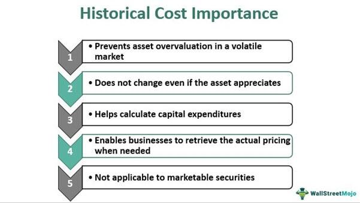

Historical cost accounting is a fundamental concept in the field of accounting, centered around the cost principle. This principle mandates that assets be recorded at their original purchase cost, without adjustment for market fluctuations over time. This method prioritizes objectivity and reliability in financial reporting, as historical costs provide a definitive value backed by transactional evidence. Understanding the cost principle is crucial in financial trading as it ensures that the financial statements reflect consistent and verifiable asset values, aiding in sound decision-making and risk assessment.

Algorithmic trading, employing computer algorithms to automate trading decisions, is gaining rapid popularity in financial markets. It executes trades at speeds and frequencies beyond human capabilities, optimizing strategies for greater efficiency. With the increasing complexity and speed of financial markets, the integration of robust accounting principles, such as the cost principle, into algorithmic trading strategies is crucial. This integration ensures transparency and accuracy, fortifying the foundation upon which algorithmic decisions are made.



The introduction of accounting principles like the cost principle into algorithmic trading involves several key elements. First, preserving data accuracy and financial statement integrity is vital, since algorithms rely heavily on historical and real-time data to backtest and optimize trading strategies. Furthermore, the cost principle's objective valuation methods have a direct impact on the performance of trading algorithms, which depend on accurate historical financial data to simulate potential future scenarios.

This article will explore the core concepts of historical cost accounting and their implications in finance. It will investigate how the cost principle can be effectively woven into algorithmic trading strategies, discuss the role of accounting accuracy in developing these sophisticated algorithms, and provide strategies and tools for integrating historical cost data into trading models. Moreover, we will look into the challenges and considerations of melding these fields, emphasizing potential pitfalls and ethical concerns. Finally, the article will serve as a guide for financial professionals and technologists to stimulate further discussion and innovation at the intersection of accounting and trading technology.

## Table of Contents

## Understanding the Cost Principle in Historical Cost Accounting

The cost principle is a fundamental accounting concept stipulating that assets should be recorded on the balance sheet at their original purchase cost. This principle plays a crucial role in financial reporting by ensuring consistency and reliability in financial statements. By recording assets at their historical cost, stakeholders can compare financial statements over time without the variability caused by fluctuating market values. Historical cost accounting provides a stable measure of performance, which is especially beneficial for financial analysts and investors assessing a company's historical performance trends and profitability.

One of the main advantages of historical cost accounting is its reliability and objectivity. Since the acquisition cost of an asset is typically verifiable through invoices, contracts, or similar documents, this method minimizes the potential for subjectivity or manipulation in financial reporting. This objectivity enhances the credibility of financial statements, allowing investors and stakeholders to make informed decisions based on transparent data.

However, historical cost accounting has its limitations. One significant drawback is its inability to reflect current market values. In dynamic markets, asset values can fluctuate significantly over time. As a result, financial statements prepared under the historical cost method may not accurately represent a company's current financial position, potentially misleading investors regarding the true value of its assets and liabilities. This limitation can be addressed to some extent with additional disclosures like fair value estimates, but the core financial statements may still lack a current valuation perspective.

Historical cost accounting is applied in various financial contexts, such as property, plant, and equipment (PP&E) reporting, inventory valuation, and long-term investments. For instance, a manufacturing company may record its machinery at the purchase price, depreciating it over its useful life without adjustments for current market value unless impairment occurs. This method is particularly useful for assets with long useful lives where market value assessments can be complex and volatile.

Despite its limitations, historical cost accounting remains relevant in modern trading environments for several reasons. It provides a standardized approach to asset valuation, ensuring consistency across different reporting periods and entities. This consistency is beneficial for companies involved in [algorithmic trading](/wiki/algorithmic-trading), where historical data is crucial for [backtesting](/wiki/backtesting) and developing robust trading algorithms. By maintaining a historical cost perspective, companies can more accurately assess their past financial decisions' impact on current profitability. Additionally, adherence to historical cost principles can help mitigate risks associated with trading algorithm [volatility](/wiki/volatility-trading-strategies) by avoiding abrupt valuation changes that might distort algorithmic calculations.

In summary, while historical cost accounting has its challenges, its foundational role in financial reporting continues to provide valuable stability and reliability. As financial markets evolve and the popularity of algorithmic trading increases, incorporating historical cost data into trading strategies offers a solid anchor to balance against market volatility.

## Role of Accounting Principles in Algorithmic Trading

Algorithmic trading, or algo trading, represents a transformative shift from traditional trading methods, where human decision-making is replaced or augmented by advanced computer algorithms. These algorithms execute trades at speeds and frequencies that are impossible for humans, capitalizing on market inefficiencies and potentially leading to enhanced profitability. Unlike the discretionary nature of traditional trading, algorithmic trading relies heavily on quantitative models and financial data analysis to make trade decisions, often without human intervention.

The accuracy of data and integrity of financial statements are critical when developing trading algorithms. Data inaccuracies can lead to erroneous trading signals, potentially resulting in significant financial losses. Therefore, ensuring the precision of financial statements and data sources is paramount to algorithmic trading success. Moreover, an exact representation of financial positions, assets, and liabilities is essential, especially when data is fed into algorithms for decision-making. Inaccuracies can stem from erroneous data entries, misinterpretations of financial disclosures, or outdated information, each of which can skew algorithm predictions and strategies.

The cost principle, inherent to historical cost accounting, dictates that assets should be recorded at their original purchase price. In the context of algorithmic trading, this principle can have a profound impact on the performance of trading algorithms. Historical cost data provides a baseline of financial information that can be crucial for evaluating investment opportunities and risks. Although it provides a reliable and objective measure, the application of the cost principle necessitates careful consideration, particularly as it may not always reflect current market valuations. For trading algorithms, the reliance on historical cost may lead to discrepancies when relevant market prices deviate significantly from recorded historical prices.

Backtesting, a key component of algorithmic trading strategy development, involves testing trading algorithms on historical financial data to evaluate their potential efficacy before actual deployment. Historical financial data offers insights into past market conditions, allowing traders and developers to simulate trading strategies and gauge prospective profitability or risks. The validity of backtesting results is heavily dependent on the accuracy and relevance of historical data, including adherence to the cost principle. In this sense, precise historical records allow for robust backtesting, providing a safeguard against unforeseeable threats in live market conditions.

Accounting anomalies or inaccuracies can lead to severe misconceptions in algorithmic trading results. These anomalies might arise from transcription errors, incorrect financial reporting, or deliberate misstatements. Such inaccuracies can distort the perception of an asset’s true value, thereby misleading algorithmic models that rely on this data to make trading decisions. For example, an incorrectly reported asset cost can alter the asset’s perceived worth, impacting decision trees within the algorithm and resulting in incorrect trade executions. To mitigate these risks, it is crucial for developers and traders to incorporate rigorous data validation processes and adhere to standardized accounting practices.

The role of accounting principles in algorithmic trading highlights the need for a structured and reliable approach to data management and application. By recognizing the significance of data accuracy, integrity, and the implications of historical cost, traders and developers can enhance the effectiveness and reliability of trading algorithms, ensuring they operate within a framework that reflects the true financial landscape.

## Integrating Cost Principle with Algo Trading Strategies

Integrating historical cost data into algorithmic trading strategies involves using traditional accounting principles to enhance the performance and reliability of trading models. This integration requires a thoughtful approach that balances historical data with real-time market information and utilizes appropriate tools and software.

### Strategies for Incorporating Historical Cost Data

One effective strategy is leveraging historical cost data to establish a baseline or benchmark within trading algorithms. This can involve using historical costs to orient [machine learning](/wiki/machine-learning) models by providing vetted and reliable financial information. Historical costs offer a solid foundation for algorithms by representing known and audited financial positions of entities.

**Example**: A trading algorithm might use an average inventory costing method, such as the moving average, based on historical costs to predict future stock levels and purchase timings. This gives a reliable point of reference that can be cross-referenced with current market conditions.

### Balancing Historical Cost Data with Real-time Market Information

To balance historical cost data with real-time market information, traders can employ statistical models and blending techniques. Weighted averages and Bayesian updating are two useful methods. By recalibrating historical data with real-time inputs, traders can maintain a model's accuracy and relevancy.

**Example**: Using Python, one could implement a Bayesian update model to adjust historical cost data according to recent market movements:

```python
import numpy as np

def bayesian_update(prior, likelihood, evidence):
    posterior = (likelihood * prior) / evidence
    return posterior

# Example values
prior = 0.6
likelihood = 0.7
evidence = 0.8
posterior = bayesian_update(prior, likelihood, evidence)
print(f"Updated Probability: {posterior}")
```

### Tools and Software

There are several tools and software platforms that facilitate the integration of accounting data into algorithmic models. Some popular choices include:

- **QuantConnect**: A cloud-based platform offering financial data and powerful backtesting capabilities.
- **Bloomberg Terminal**: Provides access to historical and real-time financial data, which can be crucial for backtesting and strategy execution.
- **Python Libraries**: Libraries like Pandas and NumPy are useful for data manipulation and analysis, which include features for handling financial data efficiently.

### Case Studies and Practical Applications

Case studies provide evidence of the advantages provided by integrating historical cost principles into trading strategies. For instance, a [hedge fund](/wiki/hedge-fund-trading-strategies) may use historical cost data to forecast asset depreciation rates, optimizing their buy-sell strategies based on these predictable financial changes.

**Case Study**: A notable example involved a proprietary trading firm using historical cost data to formulate baselines for energy sector investments. By analyzing historical energy costs and depreciation rates alongside current market prices, the firm was able to identify undervalued assets, leading to a significant increase in portfolio returns.

### Best Practices for Algorithm Developers

Algorithm developers should adhere to the following best practices to ensure robust trading strategies:

1. **Data Integrity**: Ensure the historical cost data used is audited and accurate.
2. **Model Flexibility**: Create algorithms that can adapt to new information while retaining the grounding provided by historical data.
3. **Risk Management**: Develop and incorporate risk management protocols that account for market volatility impacts on historical cost assumptions.
4. **Continuous Improvement**: Regularly update models with new historical and market data to maintain their relevance and performance.

Implementing these strategies requires a thorough understanding of both accounting principles and algorithmic trading, ensuring that historical cost data enhances rather than hampers the decision-making process in trading models.

## Challenges and Considerations

Blending accounting principles with algorithmic trading presents several challenges that practitioners must navigate. One significant challenge is the over-reliance on historical cost values in dynamic markets. Historical cost accounting records assets at their original purchase price, providing a clear and objective measure. However, financial markets are inherently volatile, and the static nature of historical cost does not capture real-time fluctuations in market value. This discrepancy can lead to outdated data inputs in trading algorithms, potentially resulting in inaccurate predictions and misguided trading decisions.

Another area of concern is the legal and ethical framework surrounding the use of historical data for trading purposes. Regulations such as the General Data Protection Regulation (GDPR) in the European Union dictate stringent guidelines on data usage, which require traders to ensure compliance when leveraging historical financial data. Ethically, traders must be cautious of the implications of using old data that may no longer reflect the current economic or market conditions, potentially leading to decisions that may not align with contemporary market realities.

To update accounting practices and ensure their relevance amidst rapid technological advancements, integration of techniques like fair value accounting can be considered. Fair value provides a more current estimation of an asset's worth by considering current market prices. Moreover, algorithmic models can be adjusted to incorporate both historical and real-time data, providing a more dynamic analysis framework. This balance can be achieved through data fusion techniques and the development of hybrid models that weigh historical and current data to reflect true market conditions.

Traders can employ several strategies to mitigate risks associated with historical cost reliance. One approach is the implementation of machine learning algorithms that can dynamically adjust trading strategies based on new data inputs. Python libraries such as Scikit-learn or TensorFlow enable traders to design models that learn from both historical and real-time data streams. This can help in recognizing patterns and adapting trading strategies in real-time, enhancing decision-making accuracy.

Furthermore, continuous data validation and cleansing processes should be established to ensure the integrity and relevance of the data being used. Deploying automated systems for real-time market data integration and implementing regular audits of algorithm performance against historical benchmarks can provide a safeguard against potential errors. Traders must also stay informed of updates in accounting standards and regulatory changes to ensure their practices remain compliant and effective.

In conclusion, while integrating accounting principles in algorithmic trading introduces complexities, strategic adoption of new methods and technologies can resolve such challenges and enhance trading outcomes.

## Conclusion

This article has explored the intricate relationship between historical cost accounting and algorithmic trading, highlighting the importance of integrating accounting principles into trading strategies. Historical cost accounting remains a cornerstone in financial reporting, valued for its reliability and objectivity. While it offers a stable foundation, its limitations, such as not reflecting current market values, underline the need for traders to balance it with real-time market information.

Algorithmic trading, distinguished by its reliance on advanced algorithms and high-speed data analysis, demands accuracy and integrity in financial data. By incorporating historical cost principles, traders can enhance the robustness and reliability of their trading algorithms. Historical financial data not only aids in backtesting but also ensures that algorithms are calibrated against stable benchmarks, helping to prevent discrepancies due to accounting inaccuracies.

The potential for future developments at this intersection is immense. As technology evolves, the integration of accounting data into algorithmic models will likely become more seamless, providing opportunities for innovative strategies in financial markets. Financial professionals and technologists are encouraged to further explore this synergetic relationship, pushing the boundaries of both accounting and algorithmic trading.

In conclusion, historical cost accounting provides indispensable insights and stability when aligned with algorithmic trading techniques, offering a balanced approach to strategy development. Traders and financial technologists are urged to continue evaluating the integration of these principles, ensuring that trading strategies remain both resilient and forward-looking, capitalizing on future advancements in trading technology.

## References & Further Reading

[1]: ["Financial Accounting and Equity Markets: A Focus on Consolidated Financial Statements"](https://www.investopedia.com/terms/c/consolidatedfinancialstatement.asp) by Mary E. Barth

[2]: Collimore, B., & Smith, L. (2012). ["Historical Cost vs. Fair Value Accounting in Times of Crisis."](https://www.researchgate.net/publication/291437467_Fair_Value_Accounting_vs_Historical_Cost_Accounting) Research Foundation of CFA Institute.

[3]: ["Algorithmic Trading: Winning Strategies and Their Rationale"](https://www.wiley.com/en-us/Algorithmic+Trading%3A+Winning+Strategies+and+Their+Rationale-p-9781118460146) by Ernest P. Chan

[4]: Danielsson, J. (2017). ["Financial Risk Forecasting: The Theory and Practice of Forecasting Market Risk with Implementation in R and MATLAB."](https://onlinelibrary.wiley.com/doi/book/10.1002/9781119205869) Wiley.

[5]: ["Accounting Standards and the Shift from Historical Cost to Fair Value Accounting"](https://fastercapital.com/content/Accounting-Standards--Accounting-Standards--The-Shift-from-Historical-Cost-to-Fair-Value.html) by Ronald G. King

[6]: Boyle, P. P., & Vorst, A. C. F. (1992). ["Option Replication in Discrete Time with Transaction Costs."](https://onlinelibrary.wiley.com/doi/full/10.1111/j.1540-6261.1992.tb03986.x) The Journal of Finance.

[7]: ["Applied Corporate Finance"](https://www.amazon.com/Applied-Corporate-Finance-Aswath-Damodaran/dp/1118808932) by Aswath Damodaran