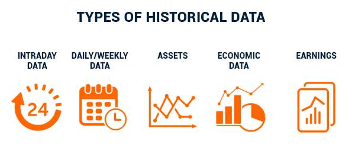

## Table of Contents

## What is historical data?

Historical data is information that was collected and recorded in the past. It can be about anything, like weather, prices, or events. People use historical data to learn about what happened before and to help make decisions for the future. For example, businesses might look at past sales data to plan for next year.

This type of data is important because it helps us understand patterns and trends over time. By studying historical data, we can see how things have changed and predict what might happen next. For instance, scientists use historical weather data to understand climate change. Overall, historical data is a valuable tool for learning from the past and planning for the future.

## Why is historical data important?

Historical data is important because it helps us learn from the past. By looking at information from long ago, we can see how things have changed over time. For example, if we want to know how the weather has changed, we can look at old weather reports. This helps scientists understand things like climate change better.

Also, historical data helps us make better decisions for the future. Businesses use past sales numbers to plan what to sell next year. Governments use old data to make new laws that can help people. By understanding what happened before, we can plan better and avoid making the same mistakes again.

In simple terms, historical data is like a guide from the past that helps us navigate the future. It shows us patterns and trends that we might not see otherwise. Whether it's for science, business, or everyday life, looking at historical data gives us valuable information to make smarter choices.

## How is historical data collected?

Historical data is collected in many different ways. In the old days, people wrote things down by hand in [books](/wiki/algo-trading-books) or on paper. They might have recorded things like the weather, how much something cost, or what happened at an important event. Today, we use computers and machines to collect data automatically. For example, weather stations send information to computers every day, and stores keep track of sales using cash registers.

Once the data is collected, it needs to be stored so it can be used later. In the past, this meant keeping books and papers safe in libraries or archives. Now, we store data on computers and in databases. This makes it easier to keep a lot of information and to find it when we need it. People who study history, like historians and scientists, use these stored records to learn about the past and see how things have changed over time.

## What are common sources of historical data?

Common sources of historical data include books, letters, and diaries. People in the past wrote down their thoughts and what happened around them. These writings can tell us a lot about history. Libraries and archives keep these old books and papers safe. Museums also have old objects like tools and clothes that show us how people lived long ago.

Another source of historical data is newspapers. They tell us what was happening at the time they were printed. Governments keep records too, like census data that counts how many people live in a place. These records can show how populations have changed over time. Today, we also use digital sources like websites and databases. They store a lot of information that we can look at to learn about the past.

Sometimes, historical data comes from things like photographs and videos. They show us what places and people looked like in the past. Scientists also use data from nature, like tree rings or ice cores, to learn about past climates. All these different sources help us understand history better.

## How can historical data be used in research?

Historical data is very important for research because it helps us understand the past. Researchers use this data to learn about how things like the weather, the economy, or people's lives have changed over time. For example, a scientist might use old weather records to study climate change. By looking at these records, they can see how temperatures have gone up or down over the years. This helps them understand what might happen in the future.

Another way historical data is used in research is to find patterns and trends. Businesses might use old sales data to see what products were popular in the past. This can help them decide what to sell in the future. Historians also use old letters, diaries, and newspapers to learn about important events and how people felt about them. By studying these sources, researchers can piece together a picture of what life was like long ago and how it has changed.

## What are the challenges in analyzing historical data?

Analyzing historical data can be hard because the information might be old and hard to read. Sometimes, the data is written in old handwriting or in languages that are not used anymore. This makes it tough to understand what the data says. Also, the data might be stored in old books or papers that can get damaged over time. If the data is lost or destroyed, it can be impossible to use it for research.

Another challenge is that historical data might not be complete. Sometimes, people in the past did not write down everything, so there are gaps in the information. This can make it hard to see the full picture of what happened. Also, the data might be biased, meaning it only shows one side of the story. For example, if only rich people wrote diaries, we might not know what life was like for poor people. Researchers have to be careful and look at many different sources to get a good understanding of the past.

## How does historical data differ from other types of data?

Historical data is information that was collected in the past. It is different from other types of data because it shows us what happened long ago. For example, weather records from 100 years ago are historical data. This kind of data helps us learn about the past and see how things have changed over time. Other types of data, like real-time data, are collected right now and show us what is happening at the moment.

Another way historical data is different is that it can be hard to get and understand. Old books, letters, and records might be written in old languages or handwriting that is hard to read. They can also be damaged or lost over time. In contrast, modern data is usually easier to collect and store because we use computers and digital tools. Historical data often has gaps and might not tell the whole story, while other types of data, like experimental data, are collected to answer specific questions and are more complete.

## What are the best practices for storing historical data?

The best way to store historical data is to keep it safe and organized. Old books, letters, and papers should be kept in a cool, dry place to stop them from getting damaged. Libraries and archives are good places for this because they have special rooms to protect these items. It's also important to keep everything in order so it's easy to find later. Using a system to label and catalog everything helps a lot.

Another good practice is to make copies of the data. This can be done by scanning old documents and saving them on computers. Digital copies are easier to share and can be kept safe in many places at once. It's also a good idea to use special software to keep track of the data. This way, if something happens to the original, the information is not lost. By following these steps, historical data can be kept safe for a long time and used by people in the future.

## How can historical data be used to predict future trends?

Historical data helps us predict future trends by showing us patterns from the past. For example, if we look at old weather records, we can see how temperatures have changed over the years. This helps scientists guess what the weather might be like in the future. Businesses also use past sales data to see what products were popular before. By understanding these patterns, they can make better guesses about what people might want to buy next year.

Another way historical data helps with predictions is by showing us how things like population and technology have changed. Governments use old census data to see how many people lived in a place and how that number has grown. This helps them plan for things like schools and hospitals in the future. By looking at how technology has improved over time, we can also predict what new inventions might come next. Overall, historical data gives us clues about the future by showing us what has happened before.

## What ethical considerations should be taken into account when using historical data?

When using historical data, it's important to think about privacy. Even though the data is old, it might still have information about people who are alive or their families. We should be careful not to share personal details without permission. Also, we need to respect the people who are in the data. They might not have known their information would be used in the future, so we should use it in a way that is fair and respectful.

Another thing to think about is bias. Historical data might not show the whole story because it was collected by people who had their own views. For example, if only rich people wrote diaries, we might not know what life was like for poor people. We need to look at many different sources to get a fair picture of the past. By being aware of these issues, we can use historical data in a way that is ethical and helps us learn the truth about history.

## How has technology impacted the way we collect and analyze historical data?

Technology has changed how we collect historical data a lot. In the past, people wrote things down by hand in books or on paper. Now, we use computers and machines to collect data automatically. For example, weather stations send information to computers every day, and stores keep track of sales using cash registers. This makes it easier to collect a lot of data quickly. Also, with the internet, we can share data with people all over the world. This means more people can help collect and study historical data.

Technology also helps us analyze historical data better. Before, people had to read old books and papers to find information. Now, we can use special software to look at large amounts of data at once. This software can find patterns and trends that we might not see otherwise. For example, scientists can use computers to study old weather data and see how the climate has changed over time. By using technology, we can learn more from historical data and make better guesses about the future.

## What advanced methodologies are used in the interpretation of historical data?

Advanced methodologies help us understand historical data better. One way is using computers to look at big sets of data. This is called data mining. It helps find patterns and trends that we might not see if we just looked at the data by hand. For example, scientists can use data mining to see how the weather has changed over many years. Another method is called [machine learning](/wiki/machine-learning). This is when computers learn from the data and can make guesses about what might happen next. It's like teaching a computer to think like a person, but faster and with more data.

Another important method is called text analysis. This is when we use computers to read and understand old books, letters, and newspapers. The computer can find important words and ideas that help us learn about the past. For example, if we want to know what people thought about a big event, we can use text analysis to see what words they used most often. Also, there's something called geographic information systems (GIS). This helps us see where things happened on a map. By putting historical data on a map, we can see how events and changes spread across different places. These advanced methods make it easier to learn from historical data and see the big picture of what happened in the past.

## References & Further Reading

[1]: Bergstra, J., Bardenet, R., Bengio, Y., & Kégl, B. (2011). ["Algorithms for Hyper-Parameter Optimization."](https://papers.nips.cc/paper/4443-algorithms-for-hyper-parameter-optimization) Advances in Neural Information Processing Systems 24.

[2]: ["Advances in Financial Machine Learning"](https://www.amazon.com/Advances-Financial-Machine-Learning-Marcos/dp/1119482089) by Marcos Lopez de Prado

[3]: ["Evidence-Based Technical Analysis: Applying the Scientific Method and Statistical Inference to Trading Signals"](https://www.amazon.com/Evidence-Based-Technical-Analysis-Scientific-Statistical/dp/0470008741) by David Aronson

[4]: ["Machine Learning for Algorithmic Trading"](https://github.com/PacktPublishing/Machine-Learning-for-Algorithmic-Trading-Second-Edition) by Stefan Jansen

[5]: ["Quantitative Trading: How to Build Your Own Algorithmic Trading Business"](https://books.google.com/books/about/Quantitative_Trading.html?id=j70yEAAAQBAJ) by Ernest P. Chan