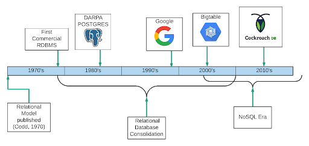

## Table of Contents

## What is a historical database?

A historical database is a collection of old information that is saved and organized so people can look at it later. This information can be about anything from the past, like old records, documents, or data about events that happened a long time ago. People use historical databases to learn about history, find out how things used to be, and understand changes over time.

These databases are important because they help keep history alive. They are used by researchers, historians, and students who want to study the past. By looking at the information in a historical database, people can see patterns and learn from history. This can help them make better decisions in the future.

## Why are historical databases important?

Historical databases are important because they keep old information safe and organized. This information can be about anything from the past, like old records, documents, or data about events that happened a long time ago. By saving this information, historical databases help us remember and learn about history. They are like big libraries of the past that we can visit anytime we want to know more about how things used to be.

These databases are used by many people, like researchers, historians, and students. They help these people study the past and understand how things have changed over time. By looking at the information in a historical database, people can see patterns and learn from history. This can help them make better decisions in the future. For example, if we know what caused problems in the past, we can try to avoid those problems now.

In simple terms, historical databases are like time machines for information. They let us go back in time and see what happened before. This is very useful because it helps us understand our world better and make smarter choices. Without historical databases, we would lose a lot of important information about our past, and it would be harder to learn from history.

## What types of data are typically stored in historical databases?

Historical databases store many different types of old information. This can include old documents like letters, diaries, and newspapers. They also keep records like birth certificates, marriage licenses, and census data. These records help us know about people's lives and important events from the past.

Another type of data in historical databases is about events and happenings. This can include information about wars, elections, and natural disasters. These databases might also have data about how people lived, like what they ate, what jobs they had, and how they spent their time.

Sometimes, historical databases also store pictures, maps, and even videos from the past. These help us see what places looked like a long time ago and how things have changed. All this information together gives us a full picture of history and helps us understand it better.

## How do historical databases differ from other types of databases?

Historical databases are different from other types of databases because they focus on keeping old information safe and organized. While other databases might store current data like customer information or sales records, historical databases keep old records, documents, and data about past events. This means they are like big libraries of the past, where you can find information about how things used to be, rather than just what is happening now.

Another way historical databases differ is in how they are used. People usually use other databases for everyday tasks, like keeping track of business transactions or managing personal information. But historical databases are mainly used by researchers, historians, and students who want to study the past. They help these people understand history and see how things have changed over time. So, while other databases are about the present and future, historical databases are all about learning from the past.

## What are some common sources for populating historical databases?

Historical databases get their information from many different places. One common source is old documents like letters, diaries, and newspapers. These can tell us a lot about what people thought and did in the past. Another source is official records, like birth certificates, marriage licenses, and census data. These records help us know about people's lives and important events. Sometimes, historical databases also use information from [books](/wiki/algo-trading-books) and other written works that talk about history.

Another source for historical databases is data about events and happenings. This can include information about wars, elections, and natural disasters. Museums and archives often have a lot of this kind of information. Historical databases might also use pictures, maps, and even old videos. These help us see what places looked like a long time ago and how things have changed. All these sources together help make historical databases full of useful information about the past.

## Can you name some well-known historical databases?

Some well-known historical databases are the Library of Congress's Chronicling America, which has a big collection of old American newspapers. Another one is the National Archives and Records Administration (NARA), which keeps lots of important government records and documents from the United States. These databases help people learn about history by looking at old newspapers and government records.

Another famous historical database is the British Library's UK Web Archive, which saves old websites so people can see what the internet looked like in the past. Also, the Internet Archive's Wayback Machine is a well-known database that keeps old versions of websites and other digital information. These databases are important because they show how the internet and digital world have changed over time.

Other notable historical databases include the FamilySearch database, which helps people find information about their family history, and the JSTOR database, which has a lot of old academic articles and books. These databases are used by people who want to learn about their family's past or study history and other subjects in detail.

## What are the challenges in maintaining and updating historical databases?

Keeping historical databases up to date and in good shape can be hard. One big challenge is making sure the old information stays safe and doesn't get lost or damaged. This means the people in charge need to take good care of the old documents, records, and data. They also need to make sure the information is stored in a way that it can be used for a long time. This can be tricky because old paper can get damaged easily, and digital information can get lost if it's not saved right.

Another challenge is adding new information to the database. As time goes on, people find more old documents and records that can be added to the database. But it takes a lot of work to check if the new information is correct and fits well with what's already there. It's important to make sure the new information is true and useful. Also, the people who take care of the database need to keep it organized so that others can find what they need easily. This can be a big job because historical databases can have a lot of information.

Sometimes, it can be hard to keep up with new technology too. As computers and software change, the people who manage the database need to make sure it can still be used and that the information is safe. This means they might need to move the data to new systems or update how the database works. All these things make maintaining and updating historical databases a big challenge, but it's important work to help keep history alive and accessible for everyone.

## How can historical databases be used for research purposes?

Historical databases are very helpful for research because they have a lot of old information that researchers can use to learn about the past. For example, if someone wants to study how people lived a long time ago, they can look at old records like census data or diaries in the database. This helps them understand things like what jobs people had, what they ate, and how they spent their time. Researchers can also use historical databases to find out about important events like wars or elections. By looking at old newspapers and government records, they can see what happened and how people felt about it.

Another way historical databases help with research is by showing how things have changed over time. Researchers can compare old information with what is happening now to see patterns and trends. For example, if someone is studying changes in population, they can use census data from different years to see how the number of people in a place has grown or shrunk. This can help them understand why these changes happened and what might happen in the future. By using historical databases, researchers can learn a lot about history and use that knowledge to make better decisions today.

## What technologies are commonly used in the development of historical databases?

In making historical databases, people often use different kinds of technology to keep old information safe and easy to find. One common technology is digital scanning, which turns old paper documents into digital files. This helps keep the information safe because digital files don't get damaged like paper can. Another important technology is database management systems, like MySQL or PostgreSQL. These systems help organize the information so that it's easy for people to search and find what they need. They also make sure the data stays safe and can be used for a long time.

Another technology used in historical databases is data preservation software. This software helps make sure the digital files stay good and can be read even as technology changes. For example, it can turn old file types into new ones that work with today's computers. Also, web technologies like HTML and JavaScript are used to make the databases easy to use online. This means people can look at the information from anywhere, not just in a library or archive. All these technologies work together to help keep history alive and make it easy for people to learn from the past.

## How do data integrity and accuracy issues affect historical databases?

Data integrity and accuracy are really important for historical databases. If the information in the database is not correct or gets changed by mistake, it can make it hard for people to trust and use the database. For example, if someone is studying old records about a war, they need to be sure the dates and events are right. If the information is wrong, it can lead to wrong ideas about what happened. So, keeping the data accurate and unchanged is key to making sure the database is useful for learning about history.

Another problem is that old documents can be hard to read or understand. Sometimes, the writing is faded or the paper is damaged, which can make it tough to get the information right. Also, people who enter the data into the database might make mistakes, like typing the wrong numbers or dates. These errors can spread and cause big problems for researchers who use the database. That's why it's important to check and double-check the information to make sure it's as accurate as possible. This helps keep the historical database reliable and useful for everyone who wants to learn from the past.

## What are the best practices for archiving data in historical databases?

When archiving data in historical databases, it's important to make sure the information stays safe and correct. One good way to do this is by using digital scanning to turn old paper documents into digital files. This helps keep the information from getting damaged or lost. It's also a good idea to use database management systems like MySQL or PostgreSQL to organize the data. These systems help keep the information in order and make it easy for people to find what they need. Another important thing is to check the data carefully before adding it to the database. This helps make sure it's accurate and useful for people who want to learn from it.

Another best practice is to use data preservation software. This software helps make sure the digital files stay good and can be read even as technology changes. It can turn old file types into new ones that work with today's computers. It's also helpful to have clear rules for how to add new information to the database. This means checking new data to make sure it's correct and fits well with what's already there. By following these practices, historical databases can stay reliable and useful for a long time, helping people learn about the past and understand history better.

## How can historical databases be integrated with modern data analysis tools?

Historical databases can be connected with modern data analysis tools to help people learn more from old information. By using tools like spreadsheets or special software for analyzing data, researchers can look at the old records and find patterns or trends. For example, they might use a tool to see how the population of a city changed over time or to compare old and new data about a certain topic. This helps them understand history better and see how things have changed.

To make this work, the old information in the historical database needs to be in a format that the modern tools can use. This might mean turning old documents into digital files that can be read by computers. Once the data is in the right format, people can use different analysis tools to look at it in new ways. They might use graphs, charts, or other visual ways to show the data, which can make it easier to see important details and learn from the past.

## References & Further Reading

[1]: ["Advances in Financial Machine Learning"](https://www.amazon.com/Advances-Financial-Machine-Learning-Marcos/dp/1119482089) by Marcos Lopez de Prado

[2]: ["Evidence-Based Technical Analysis: Applying the Scientific Method and Statistical Inference to Trading Signals"](https://www.amazon.com/Evidence-Based-Technical-Analysis-Scientific-Statistical/dp/0470008741) by David Aronson

[3]: ["Machine Learning for Algorithmic Trading"](https://github.com/PacktPublishing/Machine-Learning-for-Algorithmic-Trading-Second-Edition) by Stefan Jansen

[4]: ["Quantitative Trading: How to Build Your Own Algorithmic Trading Business"](https://books.google.com/books/about/Quantitative_Trading.html?id=j70yEAAAQBAJ) by Ernest P. Chan

[5]: Bergstra, J., Bardenet, R., Bengio, Y., & Kégl, B. (2011). ["Algorithms for Hyper-Parameter Optimization."](https://dl.acm.org/doi/10.5555/2986459.2986743) Advances in Neural Information Processing Systems 24.