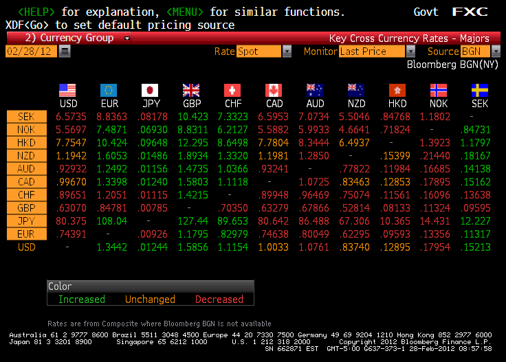

Algorithmic trading relies significantly on data-driven decisions, where speed, accuracy, and the ability to analyze vast datasets in real-time are paramount. A cornerstone of this approach is the utilization of historical databases, which are instrumental in shaping and crafting trading algorithms. These databases, filled with extensive past trading data, allow traders to simulate and backtest strategies on historical events before deploying them in live markets. This process is vital for understanding potential outcomes and fine-tuning algorithms to ensure they respond effectively to market conditions.

The evolution of data technologies greatly influences the strategies used in algorithmic trading. With advancements in database management systems and data processing capabilities, traders now have tools that allow them to harness large data volumes more efficiently. This progression has opened new possibilities for developing sophisticated algorithmic models that can adapt to rapid market shifts.

In this article, the focus is placed on the intricacies of selecting the appropriate database for algorithmic trading. Several key characteristics and challenges are outlined to guide the choice of an optimal database for storing and analyzing historical trading data. The decision is not trivial, as it directly affects the performance and success of trading algorithms. Advances in data storage and processing technologies continue to redefine best practices in this field, making it essential for traders and developers to stay informed about the latest capabilities and trends in database technologies.

## Table of Contents

## The Role of Historical Databases in Algorithmic Trading

Historical databases are integral to the foundation of [algorithmic trading](/wiki/algorithmic-trading), serving as the repository for vast amounts of past trading data. This data is essential for the process known as [backtesting](/wiki/backtesting), which allows traders and developers to simulate trading strategies using historical data to evaluate their potential performance before applying them in live markets. Backtesting can be instrumental in assessing the effectiveness of a strategy, its robustness, and its risk management capabilities. 

Access to reliable and timely data is paramount for refining these algorithms. As market conditions and dynamics evolve over time, having up-to-date and accurate historical data allows for continuous refinement and tuning of trading strategies to adapt to changing trends. This refinement process enables the identification and correction of inefficiencies or potential pitfalls in the algorithms.

Moreover, historical databases are valuable for uncovering market trends and anomalies. Analyzing large datasets can reveal patterns and signals that are not immediately apparent in real-time data streams. These insights allow traders to anticipate potential market movements or identify outliers that could represent trading opportunities. 

Effective data management is crucial to maximizing the success of trading strategies. Efficient storage, retrieval, and processing of historical data reduce latency and computational burdens, enhancing the overall responsiveness and accuracy of algorithmic trading systems. This efficiency, in turn, allows for quicker decision-making processes, which are vital in fast-paced trading environments. 

Overall, historical databases not only fortify algorithmic trading by providing the necessary data infrastructure but also empower traders with the analytical tools required to make informed decisions based on past market behavior.

## Characteristics of an Ideal Database for Algo Trading

An ideal database for algorithmic trading must possess specific features to handle the demands of fast-paced financial markets. One critical characteristic is fast data ingestion to process large volumes of trading events efficiently. As financial markets generate massive amounts of data in real-time, the database must be capable of quickly ingesting and storing this data without becoming a bottleneck.

In addition to fast ingestion, support for real-time analytics and pattern recognition is essential. Algorithmic trading strategies rely on the ability to analyze data almost instantaneously to identify market trends, price movements, and potential anomalies. This requires the database to offer robust tools for pattern recognition and streaming analytics, allowing for timely and informed trading decisions.

Durability and consistency in storage capabilities are also crucial. Financial institutions must ensure that their data is consistently accurate and securely stored, adhering to the ACID (Atomicity, Consistency, Isolation, Durability) properties to prevent data loss and maintain data integrity. This is particularly important during high-frequency trading, where even minor data discrepancies can lead to significant financial impacts.

Scalable architecture is another vital feature. As trading data volumes grow, the database should seamlessly scale to accommodate this increase without deterioration in performance. Scalability ensures that the system remains responsive and efficient even as the amount of data expands over time, providing the capacity for both horizontal and vertical scaling.

Lastly, support for both Online Transaction Processing (OLTP) and Online Analytical Processing (OLAP) is necessary to effectively balance the needs of transaction processing and analytic workloads. OLTP capabilities are essential for the high-[volume](/wiki/volume-trading-strategy), short-duration transactions typical in trading environments, whereas OLAP capabilities offer deep analytical insight, guiding strategic decision-making. An ideal database strikes a balance, seamlessly handling concurrent transactions and complex queries.

## Popular Databases Used in Algorithmic Trading

Algorithmic trading relies on efficient database systems capable of handling vast amounts of financial data. Below are some popular databases used in this field, each with its distinct features and advantages.

**MemSQL**

MemSQL, now known as SingleStore, is a cloud-native database renowned for its proficiency in fast data analytics and strict SQL compliance. It is designed to ingest large volumes of data rapidly, making it ideal for real-time analytics in trading environments. The database supports transactional and analytical workloads, offering a Hybrid Transactional/Analytical Processing (HTAP) capability. MemSQL’s distributed architecture ensures low-latency query performance, essential for executing algorithmic trading strategies that rely on quick insights.

**ClickHouse**

ClickHouse is an open-source columnar database management system that excels in online analytical processing (OLAP). It is particularly suited for querying large datasets efficiently, thanks to its column-oriented storage. However, ClickHouse has certain limitations; it lacks native support for transactions, which can be a drawback for applications requiring strict data consistency. Despite this, its performance in analytical queries makes it a valuable tool in analyzing historical trade data and identifying trends.

**PostgreSQL and TimescaleDB**

PostgreSQL is a powerful open-source relational database emphasizing extensibility and SQL compliance. Its ability to handle complex queries makes it a versatile tool for many applications, including algorithmic trading. TimescaleDB, built as an extension on top of PostgreSQL, is optimized for time-series data analysis. This makes TimescaleDB particularly relevant for tracking and analyzing stock prices and trading volumes over time, providing traders with the ability to develop and backtest strategies based on time-dependent data.

**Comparison with MySQL**

MySQL, a well-established relational database, is often used in various trading applications due to its robustness and ease of use. However, it may not match the performance of specialized databases like ClickHouse or TimescaleDB when handling large-scale analytical queries or time-series data. While MySQL is suitable for transactional operations, its limitations come to the fore in high-frequency trading environments where speed and efficiency are paramount.

**DolphinDB**

DolphinDB is a specialized high-performance time-series database tailored for financial data applications. It is designed to handle ultra-fast data processing, making it particularly effective in environments where real-time decision-making is critical. DolphinDB's architecture supports high concurrency and low-latency queries, which are crucial for executing complex trading algorithms promptly.

In summary, the choice of a database for algorithmic trading depends on the specific needs and constraints of the trading environment. Each of these databases brings unique strengths to the table, from MemSQL’s real-time analytics capabilities to DolphinDB’s ultra-fast processing, influencing how traders gather insights and execute strategies effectively.

## Challenges in Database Selection

Selecting the appropriate database for algorithmic trading involves navigating several key challenges. A primary consideration is the balance between cost and performance, particularly for startups that may have limited resources. High-performance databases often come with significant costs, making it critical to evaluate the trade-offs and determine whether the improved performance justifies the expense. 

Furthermore, ensuring robust community support and comprehensive documentation is essential. Open-source databases typically offer extensive community resources, which can be invaluable for troubleshooting and optimizing database usage. Proprietary solutions may provide official support, but the availability and depth of community engagement can vary. Reliable documentation is crucial for both understanding database capabilities and effectively implementing them into trading systems.

Another challenge is managing complex data ingestion rates and query performance. Trading systems require the ingestion of vast amounts of data in near real-time. The database must efficiently process this data to ensure timely and accurate trading decisions. High-frequency trading, in particular, demands rapid data handling to remain competitive. Techniques such as partitioning, indexing, and caching can be employed to enhance performance, but they may also add complexity to the system architecture.

Adapting to database-specific query languages and capabilities is another hurdle that can impact the development and maintenance of trading algorithms. Each database may have its own syntax and optimization strategies, necessitating specialized knowledge and potentially leading to a steeper learning curve for developers. This can increase the initial setup time and ongoing maintenance requirements, which should be factored into the decision-making process.

Finally, consideration of future scalability and data growth is imperative. The selected database should not only meet current performance needs but also accommodate future data volume increases. Scalability can be achieved through distributed database systems or by selecting a solution that offers seamless integration with cloud services capable of dynamically adjusting resources based on demand. Adjusting configurations to handle larger datasets efficiently ensures longevity and adaptability as trading operations evolve.

Analyzing these challenges enables organizations to make informed decisions, aligning their database selection with both immediate requirements and long-term strategic goals.

## Future Trends in Databases for Algo Trading

Algorithmic trading continually evolves alongside advancements in database technologies, which are crucial for the effective handling and analysis of large and complex datasets. Recent trends indicate significant progress in various database features and capabilities, promising to reshape the landscape of algorithmic trading.

Hybrid Transactional/Analytical Processing (HTAP) databases are gaining traction. These databases seamlessly merge transaction processing (OLTP) and analytical processing (OLAP) capabilities. By doing so, HTAP databases offer real-time analytics on live data without the need for separate data silos. For algorithmic traders, this means the ability to conduct immediate analysis and decision-making on trading data as it enters the system, thus optimizing latency.

Machine learning (ML) integration is another growing trend. Databases are increasingly embedding [machine learning](/wiki/machine-learning) functionalities to enable predictive analytics and automated decision-making. This integration allows traders to leverage sophisticated ML algorithms directly within the database, reducing the overhead associated with data transfer to external systems for analysis. Such capabilities are crucial for developing algorithms that adapt and respond to market conditions in real-time.

The ecosystem of open-source databases continues to evolve, bringing enhanced feature sets to algorithmic trading. Open-source platforms often incorporate community feedback rapidly, leading to innovations such as improved query performance, better scalability, and advanced analytical functions. These enhancements provide traders with robust tools for data analysis and strategy development while maintaining cost-effectiveness.

Real-time data processing is becoming increasingly vital in databases used for algorithmic trading. The push towards instantaneous data analytics ensures that trading strategies are executed at the optimal moment, which is critical in high-frequency trading scenarios. Databases are now focusing on minimizing latency in data ingestion and query processing to meet these demands.

Innovations in data storage strategies and hardware architectures are further influencing database capabilities. Developments in storage technologies, such as non-volatile memory express (NVMe) and high-capacity solid-state drives, are enabling faster data access and retrieval times. The use of parallel processing hardware and in-memory computing also accelerates query processing, allowing databases to handle more substantial amounts of data swiftly and efficiently.

These trends underscore a pivotal shift towards more integrated, real-time, and intelligent database systems that are better equipped to handle the rigorous demands of algorithmic trading. As these technologies continue to evolve, they offer promising avenues for traders seeking to enhance their competitive edge in the financial markets.

## Conclusion

Choosing the right historical database is a fundamental component in achieving success in algorithmic trading. Such databases are indispensable for storing and managing extensive datasets that form the basis of backtesting and refining trading algorithms. The selection process involves understanding and balancing performance and cost; a high-performance database could greatly enhance algorithm speed and accuracy but may also incur high infrastructure costs. This trade-off requires careful evaluation based on the specific requirements and financial constraints of the trading operation.

Moreover, staying updated with emerging technologies is essential. The rapid evolution in data storage and processing solutions presents opportunities for traders to integrate cutting-edge technologies that can improve strategy performance. For example, advancements in in-memory processing, distributed systems, and cloud computing have significantly increased data processing speed and reduced latency, enabling more sophisticated trading strategies. Algorithms that leverage these advancements can potentially outperform those using outdated technologies.

Looking ahead, trends such as hybrid transaction/analytical processing (HTAP) systems and integrated machine learning analytics within databases promise to reshape database requirements for algorithmic trading. These innovations will offer traders new tools for analyzing market data more efficiently and effectively. Therefore, an ongoing assessment of emerging database technologies will be necessary to maintain a competitive edge.

Lastly, aligning database selection with business strategies and technological capacities is paramount. Traders should evaluate their business models, data volumes, and complexity of trading strategies to choose a database system that meets current and future needs. This careful alignment will ensure that technological investments support business growth and adaptability in a dynamic trading environment.

## References & Further Reading

[1]: ["Advances in Financial Machine Learning"](https://www.amazon.com/Advances-Financial-Machine-Learning-Marcos/dp/1119482089) by Marcos Lopez de Prado

[2]: ["Evidence-Based Technical Analysis: Applying the Scientific Method and Statistical Inference to Trading Signals"](https://www.amazon.com/Evidence-Based-Technical-Analysis-Scientific-Statistical/dp/0470008741) by David Aronson

[3]: ["Machine Learning for Algorithmic Trading"](https://github.com/PacktPublishing/Machine-Learning-for-Algorithmic-Trading-Second-Edition) by Stefan Jansen

[4]: ["Quantitative Trading: How to Build Your Own Algorithmic Trading Business"](https://books.google.com/books/about/Quantitative_Trading.html?id=j70yEAAAQBAJ) by Ernest P. Chan

[5]: Bergstra, J., Bardenet, R., Bengio, Y., & Kégl, B. (2011). ["Algorithms for Hyper-Parameter Optimization."](https://dl.acm.org/doi/10.5555/2986459.2986743) Advances in Neural Information Processing Systems 24.