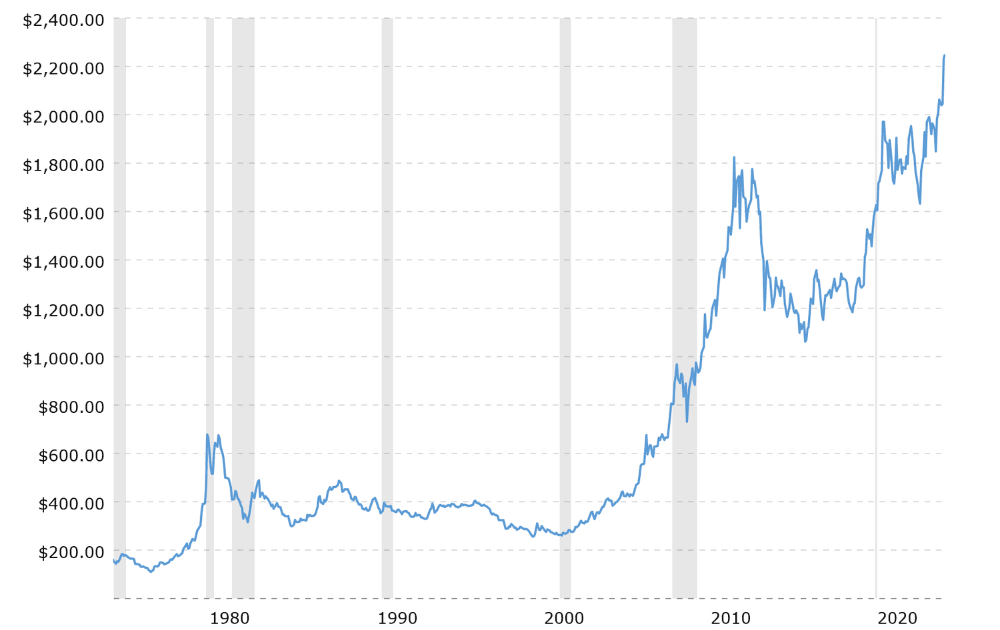

## Table of Contents

## What is gold and why has it been valued historically?

Gold is a soft, shiny, yellow metal that people have loved for thousands of years. It is found in the earth and can be shaped into jewelry, coins, and other things. Gold doesn't rust or tarnish, so it stays beautiful forever. It is also rare, which means there isn't a lot of it, making it special and valuable.

People have valued gold throughout history for many reasons. One big reason is that it looks beautiful and lasts a long time. Kings and queens used gold to show their power and wealth. Gold was also used as money because it was easy to carry and everyone agreed it was valuable. Even today, people still use gold for jewelry and as a way to save money because it keeps its value over time.

## How have gold prices been tracked over time?

Gold prices have been tracked over time by looking at how much gold was worth in different places and at different times. In the past, people would write down how much gold they could trade for other things like food, animals, or other goods. Later, when countries started using gold as money, they would keep records of how much gold was needed to buy things or how much gold they had in their banks. These records helped people understand how the value of gold changed over time.

Today, gold prices are tracked more easily with computers and the internet. Every day, the price of gold is set in big markets around the world, like in London and New York. These prices are recorded and shared online, so anyone can see how much gold is worth at any time. People use this information to decide when to buy or sell gold, and to understand how gold's value changes with things like wars, economic changes, and new discoveries of gold.

## What were the major gold price fluctuations in the 20th century?

In the early 20th century, gold prices were pretty stable because many countries used the gold standard, which meant their money was backed by gold. But things changed a lot during the Great Depression in the 1930s. In 1933, the U.S. government stopped people from keeping gold, and in 1934, they raised the official price of gold from $20.67 to $35 per ounce. This was a big jump, but after that, the price stayed at $35 per ounce until the 1970s.

In the 1970s, things got really exciting for gold prices. The U.S. stopped using the gold standard in 1971, which meant the price of gold could go up and down more freely. By the end of the decade, gold prices shot up a lot because of high inflation and people worrying about the economy. In 1980, gold reached an all-time high of $850 per ounce. After that, prices went down for a while, but they started going up again in the late 1990s and early 2000s. By the end of the 20th century, gold was worth around $280 per ounce, but it kept going up in the new century.

## What economic factors influence gold price fluctuations?

Gold prices can go up and down because of many economic things. One big thing is inflation, which is when the prices of things like food and toys go up over time. When people think inflation is going to get worse, they might buy more gold because it keeps its value better than money. Another thing that can change gold prices is what's happening with the economy. If people are worried about a recession, which is when the economy is not doing well, they might buy gold because it's seen as a safe place to put their money. Also, when the value of a country's money goes down, gold can become more expensive because it's priced in that money.

Interest rates can also affect gold prices. When interest rates are low, people might buy more gold because they can't get much money from saving in the bank. But when interest rates go up, people might choose to save their money in the bank instead of buying gold. Another [factor](/wiki/factor-investing) is how much gold is being bought and sold around the world. If big countries like China and India buy a lot of gold, the price can go up. On the other hand, if people are selling a lot of gold, the price can go down. All these things together make gold prices move around a lot.

## How do geopolitical events impact gold prices?

Geopolitical events, like wars or big political changes, can make gold prices go up and down. When there's a lot of uncertainty or trouble in the world, people often get worried about their money. They might think that the money they have in the bank could lose value or that their country's economy might get worse. Because of this, they might buy more gold. Gold is seen as a safe thing to have when times are tough because it's been valuable for a long time and it's not tied to just one country's money.

For example, if there's a war happening, people might buy more gold because they're not sure what will happen next. They might think that their money could become less valuable or that they might need to move to another country quickly. Also, if there's a big change in government or a country faces new rules from other countries, like sanctions, this can make people nervous. When people are nervous, they often turn to gold as a way to keep their money safe. So, big events around the world can make gold prices change a lot.

## What role does inflation play in gold price movements?

Inflation is when the prices of things like food and toys go up over time. When people think inflation is going to get worse, they might buy more gold because it keeps its value better than money. Gold doesn't lose value as easily as money does when prices are going up everywhere. So, if people expect inflation to go up, they might buy gold to protect their money from losing value.

When inflation is high, gold can become more expensive because people want to buy it to keep their money safe. This demand can push the price of gold up. On the other hand, if inflation is low and people think it will stay low, they might not feel the need to buy as much gold. So, inflation can make gold prices move a lot because it affects how people see the value of their money and what they do to protect it.

## How have changes in currency values affected gold prices historically?

When the value of a country's money changes, it can affect how much gold costs. If a country's money becomes worth less compared to other countries' money, gold can seem more expensive in that country. For example, if the U.S. dollar gets weaker, it takes more dollars to buy the same amount of gold. This happened a lot in the 1970s when the U.S. stopped using the gold standard, which meant the price of gold could change more freely. People started to worry about their money losing value, so they bought more gold, making its price go up.

On the other hand, if a country's money becomes stronger, it can make gold seem cheaper in that country. For example, if the U.S. dollar gets stronger, it takes fewer dollars to buy the same amount of gold. This can happen when a country's economy is doing well, and people feel more confident about their money. So, changes in how much a country's money is worth can make gold prices go up or down, depending on whether the money is getting weaker or stronger.

## What are the key differences in gold price trends between the 19th and 21st centuries?

In the 19th century, gold prices were pretty stable because many countries used the gold standard. This meant that their money was directly tied to how much gold they had. For example, the U.S. set the price of gold at $20.67 per ounce for a long time. People used gold as money, so its price didn't change much. But even then, big events like the California Gold Rush in 1849 could shake things up a bit because more gold was found, which could make its value go down a little.

In the 21st century, gold prices are much more up and down. This is because countries no longer use the gold standard, so gold's price can change more freely. Big events like the financial crisis in 2008 made people worried about their money, so they bought more gold, pushing its price up. By 2011, gold reached a high of over $1,900 per ounce. Since then, prices have gone up and down a lot because of things like inflation, changes in currency values, and big world events. Overall, gold prices in the 21st century are much more exciting and unpredictable than they were in the 19th century.

## How do gold mining production levels influence gold prices?

When more gold is mined, it can make the price of gold go down. This is because there's more gold to go around, so it's not as rare or special anymore. If miners find a big new gold mine, like they did during the California Gold Rush, the price of gold might drop because there's suddenly a lot more gold out there. But if it's hard to find new gold, or if mining gets more expensive, less gold might be mined. This can make gold more valuable because there's less of it to buy.

On the other hand, if there's a sudden drop in how much gold is being mined, the price can go up. This happened during the COVID-19 pandemic when some mines had to close down. With less gold coming out of the ground, people who wanted to buy gold had to pay more for it. So, the amount of gold that miners produce can really shake up the price, making it go up if there's less gold, or down if there's more gold.

## What predictive models are used to forecast gold price fluctuations?

People use different ways to guess how gold prices might change. One way is by looking at what's happening with the economy. They use things like how much prices are going up (inflation), how strong or weak a country's money is, and if the economy is doing well or not. These models use numbers and math to see patterns and guess what might happen next. They can also look at how much gold is being mined and how much people want to buy gold.

Another way is by using computers and special math to look at past gold prices. These models try to find patterns in how gold prices have moved before and use that to guess future prices. They can also use news and big events around the world to help with their guesses. These computer models can be very complicated, but they help people see what might happen to gold prices in the future.

## How have technological advancements in trading affected gold price volatility?

Technological advancements in trading have made gold prices move up and down more quickly. In the past, people had to call each other or meet in person to buy and sell gold. Now, with computers and the internet, people can trade gold all over the world in just seconds. This means that if something big happens, like a war or a big change in the economy, people can react very fast. They might buy or sell a lot of gold right away, which can make the price go up or down a lot in a short time.

Also, new technology has made it easier for more people to trade gold. Before, only big banks and rich people could trade gold easily. Now, anyone with a computer or a phone can trade gold. This means more people are buying and selling gold, which can make the price move around more. Sometimes, computers can even trade gold by themselves, using special programs that can buy and sell very quickly. All these things together can make gold prices more exciting and unpredictable.

## What are the implications of gold price fluctuations for global financial markets?

When gold prices go up and down a lot, it can shake up the whole world's money system. Gold is seen as a safe thing to have when people are worried about their money or the economy. So, if gold prices jump up, it might mean people are scared about something big happening, like a war or a bad economy. This can make other things in the financial markets move too. For example, if a lot of people start buying gold, they might sell their stocks or other investments to get the money to buy gold. This can make stock prices go down.

On the other hand, when gold prices go down, it can make people feel more sure about the economy. They might think things are getting better, so they put their money into other things like stocks or real estate. But big changes in gold prices can also make people unsure and nervous. If gold prices drop a lot, it might make people think that the economy is going to get worse, and they might start selling their other investments too. So, gold prices moving around a lot can make the whole world's money system feel like a rollercoaster.

## References & Further Reading

[1]: Baur, D. G., & Lucey, B. M. (2010). ["Is Gold a Hedge or a Safe Haven? An Analysis of Stocks, Bonds and Gold."](https://onlinelibrary.wiley.com/doi/10.1111/j.1540-6288.2010.00244.x) Journal of Banking & Finance, 34(8), 1886-1898.

[2]: Erb, C. B., & Harvey, C. R. (2013). ["The Golden Dilemma."](https://www.nber.org/papers/w18706) Financial Analysts Journal, 69(4), 10-42.

[3]: Tvedt, T. (2008). ["The Real Price of Gold and Money Politics."](https://www.worldcat.org/title/real-price-of-everything-rediscovering-the-six-classics-of-economics/oclc/785572829) Open Economies Review, 19, 559-588.

[4]: Yao, J., Li, Y., & Tan, C. L. (2000). ["Option Pricing Using Neural Networks."](https://www.sciencedirect.com/science/article/pii/S0305048399000663) IEEE Transactions on Neural Networks, 11(3), 674-682.

[5]: ["Algorithmic Trading: Winning Strategies and Their Rationale"](https://www.amazon.com/Algorithmic-Trading-Winning-Strategies-Rationale-ebook/dp/B00CY5HC0U) by Ernie Chan

[6]: Hull, J. C. (2012). ["Options, Futures, and Other Derivatives"](https://www.semanticscholar.org/paper/Options%2C-Futures%2C-and-Other-Derivatives-Hull/89bdee500c8623864fc9eb7a471546aa713acc44), 8th Edition, Pearson.