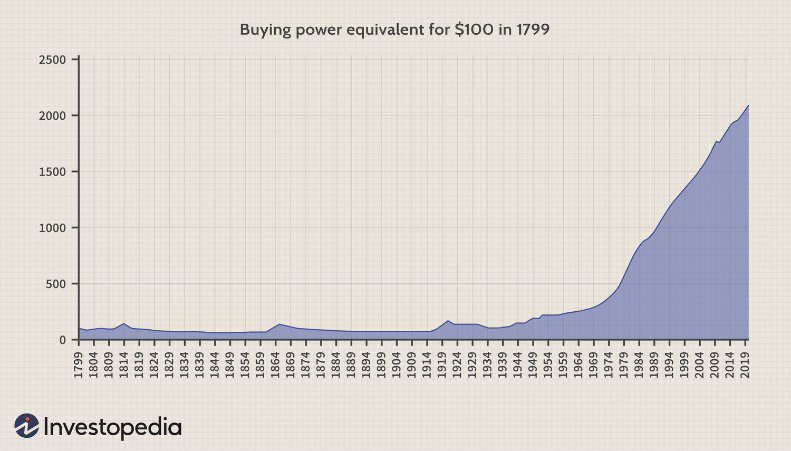

The intricate relationship between economic rates, inflation, and algorithmic trading in U.S. history forms the backbone of financial analysis and policy-making. Understanding historical trends in these areas provides invaluable insights into future economic strategies and the development of more robust trading algorithms. This article explores the evolution of inflation rates in the U.S., the impact of economic policies, and the role of algorithmic trading in the financial ecosystem.

Inflation, as a central economic phenomenon, affects purchasing power and the overall stability of an economy. Over the years, it has been influenced by a variety of factors including government policies, global events, and market behaviors. The understanding of these historical trends is crucial for policymakers and economists aiming to foresee economic challenges and opportunities. Examining periods of economic upheaval such as the Great Depression, the post-World War II era, and the stagflation of the 1970s offers insights into the complex mechanisms that drive inflation and economic rates.



Algorithmic trading, on the other hand, represents the technological evolution within financial markets, leveraging sophisticated algorithms to make trading decisions. These algorithms analyze vast sets of economic data, including inflation rates, to predict market movements and optimize trading strategies. As financial markets continue to evolve, the interaction between inflation data and algorithmic models highlights the importance of integrating economic insights into technological frameworks.

The exploration of these topics not only sheds light on the past but also guides the formulation of strategies aimed at enhancing market efficiency and stability. The intricate dance between inflation, economic policies, and algorithmic trading underscores the dynamic nature of financial ecosystems. The guidance offered by these analyses aids in shaping informed decisions in both economic policy and investment strategies, ensuring resilience in the face of economic uncertainties.

## Table of Contents

## Understanding Inflation and Economic Data

Inflation serves as a foundational economic indicator, reflecting the rate at which the general level of prices for goods and services increases over time. This phenomenon reduces purchasing power, thus exerting a considerable influence on economic decision-making and the formulation of monetary policies. It is generally quantified using indices such as the Consumer Price Index (CPI) and Personal Consumption Expenditures (PCE).

The Consumer Price Index (CPI) measures the average change over time in the prices paid by urban consumers for a market basket of consumer goods and services. The formula for calculating CPI can be expressed as:

$$
\text{CPI} = \left( \frac{\text{Cost of Market Basket in a Given Year}}{\text{Cost of Market Basket in Base Year}} \right) \times 100
$$

Similarly, the Personal Consumption Expenditures (PCE) price index offers a broader measure by encompassing all goods and services consumed, including those purchased by entities other than households, making it a more comprehensive gauge of inflation. Both indices play a critical role in economic policy-making, guiding central banks in steering economic growth.

Throughout U.S. history, inflation trends have been shaped by various significant events. Economic disruptions such as wars have often led to inflation spikes due to increased demand and resource allocation away from civilian consumption toward military needs. Policy changes, particularly those concerning fiscal and monetary policies, have also had a profound impact on inflation levels. The Bretton Woods agreement, for example, established a fixed currency exchange rate system, influencing inflation by controlling currency valuations until its collapse in the early 1970s.

Additionally, global economic dynamics like the oil crises of the 1970s introduced stagflation, a scenario characterized by high inflation and stagnant economic growth. Such events underscore the interconnectedness of inflation with broad economic phenomena, necessitating agile policy responses.

Comprehending inflation data is pivotal for evaluating current economic conditions. It aids governments and monetary authorities in devising effective fiscal and monetary strategies tailored to the prevailing economic environment. For instance, during periods of high inflation, central banks may opt to increase interest rates to curb spending and reduce money supply, thereby stabilizing prices. Conversely, in deflationary contexts, lowering interest rates might be employed to stimulate economic activity.

The intricate understanding of inflation and its historical context provides clarity on how past and present economic forces shape the strategies necessary for maintaining stability and fostering economic growth.

## Historical Inflation Rates: 1929-2024

The history of U.S. inflation rates from 1929 to 2024 reflects a spectrum of economic challenges and transformations, underscoring the dynamic nature of the American economy. The Great Depression, beginning in 1929, showed a period of significant deflation, characterized by a severe contraction in economic activity and plummeting prices. During this era, consumer prices fell sharply as the economy grappled with low demand and high unemployment.

Following the economic stress of the 1930s, the post-World War II period brought about an environment of economic expansion and moderate inflation. The influx of consumer demand and government expenditures contributed to a steady rise in prices, as the economy adjusted to peacetime conditions.

The 1970s were marked by a distinct inflationary episode known as stagflation, where the economy faced simultaneous high inflation and stagnant economic growth. This period was exacerbated by oil shocks and ineffective policy responses, which resulted in prolonged economic malaise. During this time, the Consumer Price Index (CPI) rose at an average annual rate significantly higher than in the preceding or following decades.

Progressing into the late 20th century and early 21st century, inflation rates began to stabilize. The Federal Reserve adopted more sophisticated monetary policies, targeting inflation rates to ensure economic balance and growth. This era saw the application of [interest rate](/wiki/interest-rate-trading-strategies) adjustments to manage the economic cycle, leading to relatively low and stable inflation.

However, the resurgence of inflation post-COVID-19 represents a new challenge for economic policymakers. The pandemic resulted in global supply chain disruptions and unprecedented fiscal stimuli, contributing to inflationary pressures unseen in previous decades. These events underline the need for adaptive economic policies that respond swiftly to changing economic conditions.

Analyzing historical inflation rates provides a valuable framework for understanding current economic conditions. By studying past patterns, policymakers and economists can better anticipate future challenges and shape more effective economic strategies. The lessons drawn from these historical episodes emphasize the necessity of robust, responsive policies to navigate the complexities of an ever-evolving economic landscape.

## The Role of Monetary Policy

Monetary policy, primarily conducted by the Federal Reserve, is a cornerstone in the management of inflation within the United States. The overarching objective of the Federal Reserve is to maintain a stable inflation rate, thereby fostering conditions conducive to sustained economic growth and stability. This is achieved through a variety of tools, notably interest rate adjustments and open market operations.

Interest rate adjustments are a primary mechanism through which the Federal Reserve influences inflation. By altering the federal funds rate, the interest rate at which depository institutions lend balances to each other overnight, the Federal Reserve can indirectly influence a wide range of economic activities. A lower interest rate typically encourages borrowing and investment by reducing the cost of financing. Conversely, a higher rate tends to restrain borrowing and spending, thereby cooling inflationary pressures.

Open market operations involve the buying and selling of government securities in the open market to regulate the money supply. When the Fed buys securities, it injects [liquidity](/wiki/liquidity-risk-premium) into the banking system, which can lower interest rates and boost economic activity. Selling securities has the opposite effect, reducing liquidity and potentially increasing rates to curb inflation.

Effective monetary policy necessitates a harmonious coordination with fiscal measures—government spending and tax policies—aimed at managing the overall economic demand. This coordination is essential in tackling both inflationary and deflationary scenarios, ensuring that policy measures do not counteract but rather complement one another.

Historical analysis of successful monetary policy interventions provides valuable lessons. For instance, during periods of economic uncertainty, like the 2008 financial crisis, coordinated efforts between monetary policy and fiscal measures proved instrumental in stabilizing the economy. These experiences underscore the importance of agile and informed policy-making to address contemporary economic challenges effectively. 

The dynamic nature of economic systems requires ongoing assessment and adaptation of monetary policy strategies to meet evolving economic conditions. This continuous learning and adaptation reflect the complexity and the critical role of monetary policy in sustaining economic health and resilience.

## Algorithmic Trading and Inflation Data

Algorithmic trading leverages inflation data to enhance trading strategies by analyzing economic trends for optimal decision-making. These algorithms incorporate numerous economic indicators, with inflation playing a critical role. By examining inflation metrics such as the Consumer Price Index (CPI) and the Personal Consumption Expenditures (PCE), traders can improve the predictive accuracy of their models.

Complex algorithms can process vast amounts of data, identifying patterns and forecasting market trends. Python, often used in developing these algorithms, provides libraries such as NumPy and pandas for efficient data handling and analysis. Consider the following Python example for calculating a moving average of inflation data, which can inform trading decisions:

```python
import pandas as pd

# Hypothetical inflation data
inflation_data = [2.1, 2.3, 1.8, 2.0, 1.9, 2.4, 2.2]
df = pd.DataFrame(inflation_data, columns=['Inflation'])

# Calculate moving average
df['Moving_Average'] = df['Inflation'].rolling(window=3).mean()

print(df)
```

Integration of inflation data in trading systems supports better risk management and asset allocation. By utilizing forecasts, traders can adjust portfolios to hedge against inflation risks. Algorithms adaptively respond to economic shifts, showcasing the dynamic interaction between economic indicators and trading technologies.

The advancement in algorithmic capabilities positions these systems to utilize inflation data for strategic advantages. With [machine learning](/wiki/machine-learning) and [artificial intelligence](/wiki/ai-artificial-intelligence) continuing to advance, future algorithms will likely incorporate ever-more sophisticated models, further enhancing their ability to navigate inflationary environments.

The efficient use of inflation data in [algorithmic trading](/wiki/algorithmic-trading) exemplifies the symbiotic relationship between economic data analysis and trading technology, offering improved market insights and decision-making capabilities.

## Conclusion

Inflation and algorithmic trading significantly influence the financial landscape by intertwining economic indicators with technological advancements. Historical analysis of inflation trends offers essential insights that shape both macroeconomic strategies and sophisticated trading algorithms, ultimately aiding in market stabilization. By understanding past inflation events, policymakers and traders can develop informed strategies that anticipate economic fluctuations and optimize investment portfolios.

Keeping a vigilant eye on inflation is indispensable for preserving economic resilience. Effective monitoring allows for timely adjustments in monetary policies and trading positions, ensuring that economic stability is maintained. This requires a robust framework for analyzing inflation data, taking into account various economic factors that can impact purchasing power and consumer behavior.

Technological advancements have revolutionized the use of inflation data in shaping economic policies and trading decisions. Enhanced computational capabilities and the advent of machine learning facilitate more accurate forecasting models and automated trading systems. These technologies allow for real-time processing and interpretation of inflation metrics, which are critical for executing timely and effective financial strategies.

Adapting to changes in inflation dynamics and technological progress is crucial for sustaining economic growth and stability. Financial market participants, including policymakers, investors, and algorithm developers, must continuously update their methodologies to reflect current data and technological possibilities. Embracing these innovations ensures that the economic system remains robust and capable of navigating the complexities of a rapidly evolving global market.

## References & Further Reading

For those interested in a detailed exploration of inflation and trading, several authoritative sources offer extensive insights:

1. **U.S. Bureau of Labor Statistics**: This resource is invaluable for understanding historical and current inflation data in the United States. It provides comprehensive statistics on the Consumer Price Index (CPI) and other inflation measures. These datasets are fundamental for analyzing economic trends and assessing the impacts of inflation on purchasing power and economic policy. More information can be accessed through their official website: [BLS Inflation Data](https://www.bls.gov/cpi/).

2. **Federal Reserve Publications**: The Federal Reserve plays a pivotal role in shaping monetary policy, which directly affects inflation rates. Their publications include reports and papers on their policy tools, such as interest rate adjustments and open market operations, and how these influence inflation. These documents are critical for understanding the Federal Reserve's approach to maintaining economic stability: [Federal Reserve Publications](https://www.federalreserve.gov/publications.htm).

3. **Academic Analyses**: Numerous studies and scholarly articles explore the intricate relationship between inflation, economic policy, and algorithmic trading. These analyses provide theoretical and empirical insights into how inflation affects market dynamics and decision-making in trading environments. Libraries and databases such as JSTOR and Google Scholar are excellent resources for academic papers on these topics.

4. **Algorithmic Trading Books and Journals**: The role of algorithmic trading is increasing in today's financial markets, making it crucial to understand its interaction with economic indicators like inflation. Books and journals specializing in financial engineering and quantitative trading often discuss the integration of economic data, including inflation metrics, into trading models. Key resources include the "Journal of Financial Markets" and texts like "Algorithmic Trading: Winning Strategies and Their Rationale."

5. **Online Courses and Lectures**: Numerous universities and platforms offer courses on economics, monetary policy, and algorithmic trading. These often include comprehensive modules on inflation's impact on economic stability and trading strategies. Platforms like Coursera and edX host lectures from prestigious institutions that cover these topics in detail.

These resources provide foundational knowledge and advanced insights, enabling readers to better comprehend the dynamics of inflation and its role in the evolving landscape of algorithmic trading and economic policy development.

