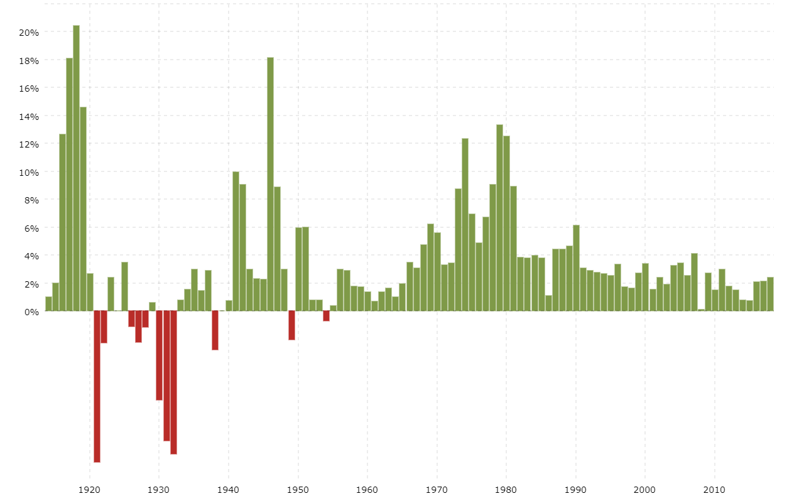

## Table of Contents

## What is inflation?

Inflation is when the prices of things we buy, like food and toys, go up over time. It means that the money we have can buy less stuff than before. Imagine if a candy bar cost $1 last year, but this year it costs $1.10. That's inflation happening.

Inflation can happen for many reasons. Sometimes, it's because there's too much money chasing too few goods. Other times, it might be because the costs of making things, like the materials or the workers' wages, go up. Governments and banks try to keep inflation in check so it doesn't get too high, which can make life harder for everyone.

## How is inflation measured in the United States?

In the United States, inflation is measured by looking at the prices of a bunch of different things that people buy every day. The main way to do this is by using something called the Consumer Price Index, or CPI for short. The CPI keeps track of the prices of things like food, clothes, and gas. Every month, people go out and check the prices of these items in stores all over the country. Then, they compare these prices to what they were last month and last year to see if they've gone up or down.

The CPI is important because it helps us understand how much more expensive life is getting. If the CPI goes up a lot, it means inflation is high, and things are getting more expensive faster. The government and the Federal Reserve, which is like the country's big bank, use the CPI to make decisions about money and the economy. They might change interest rates or do other things to try to keep inflation from getting too high or too low.

## What was the average inflation rate in the US during the 20th century?

During the 20th century, the average inflation rate in the United States was about 3.1% per year. This means that, on average, prices went up by a little over 3% every year. There were times when inflation was much higher, like during the 1970s, and times when it was much lower, like during the 1930s.

Inflation rates can change a lot from year to year, and they were influenced by big events like wars and economic booms and busts. For example, after World War II, there was a lot of inflation because the economy was growing fast and there was a lot of demand for goods. On the other hand, during the Great Depression in the 1930s, prices actually fell, which is called deflation. Overall, though, the 20th century saw a steady, moderate rise in prices year after year.

## Can you list significant periods of high inflation in US history?

One big time of high inflation in the US was during the 1970s. This was called stagflation because the economy was not growing, but prices were going up fast. In 1974, inflation hit almost 11%, which was really high. People were upset because their money was not going as far, and it was hard to buy things. The government tried different things to stop inflation, but it took a while to bring it down.

Another time was right after World War II, in the late 1940s. Prices jumped a lot because there was a lot of demand for things after the war, but not enough stuff to buy. Inflation got up to about 14% in 1947. The government had to step in and control prices to calm things down. It was a tough time, but eventually, inflation went back to normal.

In the early 1980s, there was another spike in inflation. It reached over 13% in 1980. The Federal Reserve, which is like the country's big bank, decided to raise interest rates a lot to fight inflation. This made borrowing money more expensive, which slowed down the economy but also helped bring inflation down. By the mid-1980s, inflation was back under control.

## What was the highest recorded inflation rate in the US, and when did it occur?

The highest recorded inflation rate in the United States happened in 1917, during World War I. That year, the inflation rate reached about 17.4%. This was a really tough time because the war made everything more expensive. The government had to spend a lot of money on the war, and this caused prices to go up a lot.

During World War I, there was a big demand for goods and materials for the war effort. At the same time, there were not enough workers because many people were fighting in the war. This made it hard to keep up with the demand, and prices kept going up. The high inflation rate in 1917 was a big problem for people because their money could buy less and less.

## How did the Great Depression affect inflation rates in the US?

During the Great Depression, which lasted from 1929 to 1939, the US actually saw deflation instead of inflation. Deflation is when prices go down, not up. In the early 1930s, prices fell a lot because people were not buying things. Many people lost their jobs and did not have money to spend, so stores had to lower their prices to sell anything. The biggest drop in prices happened in 1932 when prices fell by about 10%.

The Great Depression was a tough time because deflation made things even worse. When prices go down, people might wait to buy things, hoping they will get even cheaper. This means businesses sell less and might have to lay off more workers, which makes the economy even weaker. The government tried different things to stop the deflation and help the economy, but it took a long time for things to get better. By the late 1930s, the economy started to recover, and prices began to stabilize.

## What were the inflation rates during World War II and how did they impact the economy?

During World War II, the US saw inflation rates go up a lot. From 1941 to 1945, inflation was around 2-3% each year, but after the war ended, it jumped to about 14% in 1947. This happened because the government spent a lot of money on the war, and there was a lot of demand for goods. At the same time, many things were hard to get because they were needed for the war effort.

The high inflation after World War II affected the economy in big ways. People had money saved up from the war, but there were not enough things to buy. This made prices go up even more. The government had to step in and control prices to stop inflation from getting out of control. It took a few years, but by the early 1950s, inflation calmed down and the economy started to grow again.

## How have inflation rates varied in the US since the year 2000?

Since the year 2000, inflation rates in the US have gone up and down. In the early 2000s, inflation was pretty low, usually around 2-3% each year. But then, in 2008, there was a big economic crisis called the Great Recession. During this time, inflation dropped a lot because people were not buying things, and prices did not go up as much. By 2009, inflation was only about 0.4%, which was very low.

After the Great Recession, inflation started to go back up slowly. From 2010 to 2019, inflation was usually between 1-2% each year. This was good because it meant prices were going up, but not too fast. Then, in 2020, the COVID-19 pandemic hit. At first, inflation was low because people were scared and not spending money. But by 2021 and 2022, inflation jumped up a lot, reaching over 7% in 2021 and over 8% in 2022. This was because the economy was recovering, and there were problems with getting things like food and gas. The government and the Federal Reserve had to work hard to try to bring inflation back down.

## What role did the Federal Reserve play in managing inflation rates historically?

The Federal Reserve, or the Fed, has been really important in trying to keep inflation under control in the US. They do this mainly by changing something called interest rates. When inflation is too high, the Fed might raise interest rates to make borrowing money more expensive. This slows down spending and helps cool down the economy, which can bring inflation down. On the other hand, if inflation is too low or if the economy is not doing well, the Fed might lower interest rates to make borrowing cheaper, which can help the economy grow and push inflation up a bit.

Historically, the Fed has had to deal with some big challenges. For example, in the 1970s, when inflation was really high, the Fed had to raise interest rates a lot to fight it. This made borrowing money very expensive and slowed down the economy, but it helped bring inflation down. In the 1980s, the Fed did something similar to fight another round of high inflation. More recently, during the 2008 financial crisis and the 2020 COVID-19 pandemic, the Fed lowered interest rates to help the economy recover and keep inflation from falling too low. By doing these things, the Fed tries to keep inflation at a level that is good for the economy, usually around 2%.

## How do historical US inflation rates compare with those of other major economies?

When we look at inflation rates in the US compared to other big countries, we see that the US has generally had pretty stable inflation over the years. For example, during the 20th century, the average inflation rate in the US was around 3.1%. This is similar to what we saw in other developed countries like the UK, where inflation was about 3.5% on average, and Japan, which had around 2.5%. These countries all had times of high inflation, like in the 1970s, but they also managed to keep inflation under control most of the time.

However, there are some big differences when we look at other parts of the world. In some countries, inflation has been much higher and harder to control. For example, in the 1980s and 1990s, many countries in Latin America, like Argentina and Brazil, had very high inflation, sometimes even hyperinflation, where prices go up super fast. In Argentina, inflation hit over 3,000% in 1989. This is way higher than anything the US has ever seen. Even more recently, countries like Venezuela have had extreme inflation, with rates going over a million percent in some years. So, while the US has had its ups and downs with inflation, it has been much more stable than in some other parts of the world.

## What economic theories explain the causes of inflation in the US?

One big theory about why inflation happens in the US is called demand-pull inflation. This happens when people want to buy more stuff than what's available. Imagine if everyone suddenly wanted to buy a lot more toys, but the toy factories couldn't make enough toys fast enough. The price of toys would go up because there are too many people trying to buy them. This can happen when the economy is doing really well, and people have more money to spend. The government might spend a lot of money, or the Federal Reserve might print more money, which can make demand go up and push prices higher.

Another theory is called cost-push inflation. This happens when the costs of making things go up, and businesses have to raise their prices to cover these costs. For example, if the price of oil goes up, it costs more to make and ship things, so companies might raise the prices of their products. Wages can also play a part. If workers want higher pay and companies agree, those higher wages can make the cost of making things go up, which can lead to higher prices for customers. Both demand-pull and cost-push theories help explain why inflation happens in the US, and they can happen at the same time, making prices go up even more.

## How have changes in technology and globalization influenced inflation rates in the US over the last few decades?

Changes in technology have had a big impact on inflation rates in the US over the last few decades. New technology can make things cheaper to make. For example, computers and machines can do work faster and better than people, which means companies can make more stuff without spending as much money. This can help keep prices from going up too fast. Also, the internet has made it easier for people to compare prices and find the best deals, which puts pressure on businesses to keep their prices low. All these things together have helped keep inflation down in the US.

Globalization has also played a big role in keeping inflation low. This means that the US is more connected to other countries, and we buy and sell a lot of things from around the world. When companies can make things in other countries where it's cheaper, they can sell those things for less money in the US. This is called importing goods, and it helps keep prices down. Also, competition from other countries makes US companies work harder to keep their prices low. So, globalization has helped make sure that inflation doesn't go up too fast in the US.

## What is the relationship between understanding inflation and economic data?

Inflation serves as a foundational economic indicator, reflecting the rate at which the general level of prices for goods and services increases over time. This phenomenon reduces purchasing power, thus exerting a considerable influence on economic decision-making and the formulation of monetary policies. It is generally quantified using indices such as the Consumer Price Index (CPI) and Personal Consumption Expenditures (PCE).

The Consumer Price Index (CPI) measures the average change over time in the prices paid by urban consumers for a market basket of consumer goods and services. The formula for calculating CPI can be expressed as:

$$
\text{CPI} = \left( \frac{\text{Cost of Market Basket in a Given Year}}{\text{Cost of Market Basket in Base Year}} \right) \times 100
$$

Similarly, the Personal Consumption Expenditures (PCE) price index offers a broader measure by encompassing all goods and services consumed, including those purchased by entities other than households, making it a more comprehensive gauge of inflation. Both indices play a critical role in economic policy-making, guiding central banks in steering economic growth.

Throughout U.S. history, inflation trends have been shaped by various significant events. Economic disruptions such as wars have often led to inflation spikes due to increased demand and resource allocation away from civilian consumption toward military needs. Policy changes, particularly those concerning fiscal and monetary policies, have also had a profound impact on inflation levels. The Bretton Woods agreement, for example, established a fixed currency exchange rate system, influencing inflation by controlling currency valuations until its collapse in the early 1970s.

Additionally, global economic dynamics like the oil crises of the 1970s introduced stagflation, a scenario characterized by high inflation and stagnant economic growth. Such events underscore the interconnectedness of inflation with broad economic phenomena, necessitating agile policy responses.

Comprehending inflation data is pivotal for evaluating current economic conditions. It aids governments and monetary authorities in devising effective fiscal and monetary strategies tailored to the prevailing economic environment. For instance, during periods of high inflation, central banks may opt to increase interest rates to curb spending and reduce money supply, thereby stabilizing prices. Conversely, in deflationary contexts, lowering interest rates might be employed to stimulate economic activity.

The intricate understanding of inflation and its historical context provides clarity on how past and present economic forces shape the strategies necessary for maintaining stability and fostering economic growth.

## References & Further Reading

For those interested in a detailed exploration of inflation and trading, several authoritative sources offer extensive insights:

1. **U.S. Bureau of Labor Statistics**: This resource is invaluable for understanding historical and current inflation data in the United States. It provides comprehensive statistics on the Consumer Price Index (CPI) and other inflation measures. These datasets are fundamental for analyzing economic trends and assessing the impacts of inflation on purchasing power and economic policy. More information can be accessed through their official website: [BLS Inflation Data](https://www.bls.gov/cpi/).

2. **Federal Reserve Publications**: The Federal Reserve plays a pivotal role in shaping monetary policy, which directly affects inflation rates. Their publications include reports and papers on their policy tools, such as interest rate adjustments and open market operations, and how these influence inflation. These documents are critical for understanding the Federal Reserve's approach to maintaining economic stability: [Federal Reserve Publications](https://www.federalreserve.gov/publications.htm).

3. **Academic Analyses**: Numerous studies and scholarly articles explore the intricate relationship between inflation, economic policy, and algorithmic trading. These analyses provide theoretical and empirical insights into how inflation affects market dynamics and decision-making in trading environments. Libraries and databases such as JSTOR and Google Scholar are excellent resources for academic papers on these topics.

4. **Algorithmic Trading Books and Journals**: The role of algorithmic trading is increasing in today's financial markets, making it crucial to understand its interaction with economic indicators like inflation. Books and journals specializing in financial engineering and quantitative trading often discuss the integration of economic data, including inflation metrics, into trading models. Key resources include the "Journal of Financial Markets" and texts like "Algorithmic Trading: Winning Strategies and Their Rationale."

5. **Online Courses and Lectures**: Numerous universities and platforms offer courses on economics, monetary policy, and algorithmic trading. These often include comprehensive modules on inflation's impact on economic stability and trading strategies. Platforms like Coursera and edX host lectures from prestigious institutions that cover these topics in detail.

These resources provide foundational knowledge and advanced insights, enabling readers to better comprehend the dynamics of inflation and its role in the evolving landscape of [algorithmic trading](/wiki/algorithmic-trading) and economic policy development.

