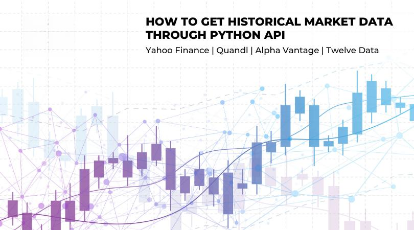

## Table of Contents

## What is historical market data and why is it important?

Historical market data is information about how prices and trading volumes of stocks, commodities, or other financial instruments have changed over time. It includes details like the highest and lowest prices, the closing price at the end of each trading day, and how many shares or units were traded. This data can go back many years and is usually shown in charts or tables.

This data is important because it helps people make better decisions about buying and selling. By looking at past trends, investors can see patterns and predict what might happen next. For example, if a stock has gone up every December for the last ten years, someone might decide to buy it in November. Also, historical data helps businesses understand how their products are doing compared to the past, and it helps economists study the overall health of the economy.

## How can Python be used to access historical market data?

Python can be used to access historical market data by using special libraries that are made for this purpose. One popular library is called `yfinance`, which lets you download data from Yahoo Finance easily. You just need to install the library, then use a few lines of code to tell it which stock you want data for and how far back you want to go. For example, you can ask for the stock price of Apple from the last five years. The library will then give you this data in a format that's easy to work with, like a table.

Once you have the data, you can do many things with it in Python. You can make charts to see how the stock price has changed over time, or you can do math to find out things like the average price or how much the price has gone up and down. This is useful for people who want to make smart choices about buying or selling stocks. Python makes it easy to get this data and then use it to help make decisions.

## What are some popular Python APIs for retrieving historical market data?

There are a few popular Python APIs that people use to get historical market data. One of them is `yfinance`. It's really easy to use because you just need to install it and then you can ask it to get data from Yahoo Finance. You tell it which stock you want and how far back you want the data, and it gives you a table with all the prices and trading volumes. Another popular one is `pandas-datareader`. This one can pull data from different places, not just one, like Yahoo Finance, the Federal Reserve Economic Data (FRED), and more. It works well with the `pandas` library, which is great for working with data in Python.

Another useful API is `Alpha Vantage`. It's good because it gives you both free and paid options, so you can start with the free one and then maybe pay for more data later if you need it. You can use it to get stock prices, currency exchange rates, and even [cryptocurrency](/wiki/cryptocurrency) data. It's a bit different because you need to sign up for an API key, but once you have that, you can use it to pull data into Python. All these APIs make it easy to get historical market data and start analyzing it right away.

## How do you set up and authenticate with a Python API for market data?

To set up and authenticate with a Python API for market data, you first need to choose an API like `yfinance`, `pandas-datareader`, or `Alpha Vantage`. For `yfinance` and `pandas-datareader`, you don't need to do any special authentication. You just install the library using a command like `pip install yfinance` or `pip install pandas-datareader`. After installing, you can start using the library right away to pull data from sources like Yahoo Finance or the Federal Reserve.

For `Alpha Vantage`, you need to sign up on their website to get an API key. This key is like a special password that lets you use their service. Once you have the key, you install the `alpha_vantage` library with `pip install alpha_vantage`. Then, in your Python code, you use the key to connect to the API. You do this by creating an object with your key, like `ts = TimeSeries(key='YOUR_API_KEY', output_format='pandas')`. After that, you can use this object to get data about stocks, currencies, or cryptocurrencies.

## What are the basic steps to fetch historical stock prices using a Python API?

To fetch historical stock prices using a Python API like `yfinance`, first, you need to install the library. You can do this by opening a command prompt or terminal and typing `pip install yfinance`. Once it's installed, you can start using it in your Python code. You just need to import the library with `import yfinance as yf` at the beginning of your script. Then, you can create a ticker object for the stock you're interested in, like `stock = yf.Ticker("AAPL")` if you want data for Apple.

After setting up the ticker object, you can use it to get historical data. You do this by calling the `history` method on the ticker object. For example, `data = stock.history(period="1y")` will get you one year of historical data for Apple. The `period` parameter can be set to different values like "1d", "5d", "1mo", "3mo", "6mo", "1y", "2y", "5y", "10y", or "ytd" for year-to-date. Once you have the data, it's stored in a `pandas` DataFrame, which makes it easy to analyze or plot the data.

## How can you handle and process large datasets of historical market data in Python?

When you have a lot of historical market data to handle in Python, you can use the `pandas` library. This library is great for working with big sets of data because it lets you read the data quickly and do things like sorting, filtering, and grouping easily. For example, if you have data for many years, you might want to break it down into smaller pieces, like looking at data for each year or month separately. `pandas` can help you do this without making your computer slow down. You can also use `pandas` to clean up the data, like getting rid of any missing values or fixing any mistakes.

Once your data is ready, you might want to do some math on it or make charts to see what's happening. `pandas` works well with other Python libraries like `numpy` for doing math and `matplotlib` or `seaborn` for making charts. If your dataset is really big, you might need to use special tricks to keep your computer from getting too slow. One way is to use a library called `dask`, which is like `pandas` but can handle even bigger datasets by breaking them into smaller parts and working on them one at a time. This way, you can still do all the things you need to do with your data, even if it's huge.

## What are common data formats for historical market data and how to work with them in Python?

Historical market data often comes in two common formats: CSV (Comma-Separated Values) and JSON (JavaScript Object Notation). CSV files are simple text files where each line is a row of data, and the values in each row are separated by commas. This format is easy to read and write, and it's widely used because it can be opened with many different programs. JSON files, on the other hand, are also text files but they store data in a more structured way, using curly braces and colons to show how different pieces of data are related. JSON is good for more complex data because it can handle nested structures, which means data within data.

In Python, you can work with CSV files using the `csv` module or the `pandas` library. The `csv` module lets you read and write CSV files line by line, which is good if you just need to go through the data once. But if you want to do more with the data, like sorting or making charts, `pandas` is better because it can load the whole CSV file into a DataFrame, which is like a big table you can work with easily. For JSON files, you can use the `json` module to read and write them. Like with CSV, `pandas` can also handle JSON files and turn them into DataFrames, which makes it easy to do things like filtering or grouping the data. Both formats are easy to work with in Python, and choosing between them depends on what you need to do with the data.

## How can you perform basic data analysis on historical market data using Python libraries?

To perform basic data analysis on historical market data using Python, you can use the `pandas` library. This library helps you read and work with data easily. For example, if you have a CSV file with stock prices, you can use `pandas` to load the data into a DataFrame. Once the data is in a DataFrame, you can do things like finding the average price of a stock over time or looking at how much the price goes up and down. You can also sort the data to see the highest and lowest prices, or filter it to look at data from a specific time period. `pandas` makes all these tasks simple and quick, even if you have a lot of data.

Another useful thing you can do with `pandas` is to make charts to see trends in the data. For this, you can use another library called `matplotlib` or `seaborn`, which work well with `pandas`. You can make line charts to see how a stock's price changes over time, or bar charts to compare different stocks. If you want to look at more than one thing at the same time, like price and trading [volume](/wiki/volume-trading-strategy), you can use scatter plots. These charts help you understand the data better and spot patterns that might not be easy to see just by looking at numbers. By using these tools, you can get a lot of useful information from historical market data.

## What advanced techniques can be used to analyze trends and patterns in historical market data?

To find trends and patterns in historical market data, you can use something called time series analysis. This is a fancy way of looking at data that changes over time. You can use a tool in Python called `statsmodels` to do this. With time series analysis, you can see if a stock's price goes up and down in a way that repeats over time, like every year or every month. This can help you guess what might happen next. Another cool thing you can do is use [machine learning](/wiki/machine-learning). This is where you teach a computer to find patterns in the data by itself. You can use a library called `scikit-learn` to do this. The computer looks at a lot of past data and tries to figure out what makes the stock price go up or down. This can be really helpful for making smart choices about buying or selling stocks.

Another advanced technique is called technical analysis. This is where you look at charts and use special rules to guess what will happen next with a stock's price. You can use Python libraries like `ta` or `pandas-ta` to help with this. These libraries have a lot of ready-made tools that can find things like moving averages or support and resistance levels in the data. These are special numbers that traders watch to decide when to buy or sell. Also, something called sentiment analysis can be useful. This is where you look at what people are saying about a stock on social media or news websites. You can use natural language processing tools like `nltk` or `TextBlob` to see if people are talking positively or negatively about a stock. This can give you another clue about where the stock price might be headed.

## How can you integrate machine learning models with historical market data using Python?

To integrate machine learning models with historical market data in Python, you can use libraries like `pandas` to handle the data and `scikit-learn` to build and train your models. First, you need to load your historical market data into a `pandas` DataFrame. This makes it easy to clean up the data and get it ready for the machine learning model. You might need to fill in any missing values or turn dates into numbers that the computer can understand better. Once your data is ready, you can split it into two parts: one part for training the model and another part for testing it. This helps you see if your model is good at guessing what will happen with stock prices.

After you have your data ready, you can use `scikit-learn` to create and train a machine learning model. There are many types of models you can try, like linear regression for simple predictions or more complex ones like random forests or neural networks. You pick a model and then use the training data to teach it how stock prices have changed in the past. Once the model is trained, you can use it to make predictions on the test data to see how well it works. If the predictions are close to what really happened, your model is doing a good job. You can then use this model to help make smart choices about buying or selling stocks, based on what it thinks might happen next.

## What are the best practices for storing and managing historical market data efficiently in Python?

When storing and managing historical market data in Python, it's important to use tools that can handle a lot of information quickly and easily. One of the best ways to do this is by using the `pandas` library. `pandas` lets you load your data into a DataFrame, which is like a big table where you can sort, filter, and group your data. This makes it easy to work with large datasets without slowing down your computer. If your data is really big, you might want to use `dask`, which is like `pandas` but can handle even bigger datasets by breaking them into smaller parts and working on them one at a time. This way, you can still do all the things you need to do with your data, even if it's huge.

Another good practice is to save your data in a way that's easy to get back later. You can use formats like CSV or JSON to store your data, but if you have a lot of data, it might be better to use a database. Python has libraries like `SQLite` or `SQLAlchemy` that let you save your data in a database and get it back quickly. This is helpful if you need to look at your data a lot or if you want to share it with other people. Also, make sure to keep your data organized by using clear names for your files and folders, and by writing notes about what each piece of data means. This makes it easier to find and use your data later.

## How can you automate the process of updating and analyzing historical market data using Python scripts?

To automate the process of updating and analyzing historical market data using Python, you can set up a script that runs regularly to fetch new data and then process it. You can use a library like `yfinance` to download the latest stock prices from Yahoo Finance. In your script, you can tell `yfinance` which stocks you want data for and how far back you need to go. Once the new data is downloaded, you can add it to your existing data, making sure not to duplicate any information. You can use `pandas` to handle this, as it makes it easy to combine and clean up data. After updating the data, you can set up your script to save the new dataset to a file or a database, so it's ready for the next time you need it.

After the data is updated, you can have your script automatically analyze it. Using `pandas`, you can do things like calculate the average price of a stock over time or see how much the price goes up and down. If you want to look for trends or patterns, you can use more advanced tools like `statsmodels` for time series analysis or `scikit-learn` for machine learning. These libraries can help you predict what might happen next with the stock prices. To make sure your script runs without you having to start it each time, you can use a tool like `cron` on Unix systems or the Task Scheduler on Windows to run your script at set times, like every day or every week. This way, your data stays up-to-date and your analysis keeps running smoothly without any extra work from you.

## References & Further Reading

[1]: Bergstra, J., Bardenet, R., Bengio, Y., & Kégl, B. (2011). ["Algorithms for Hyper-Parameter Optimization."](https://papers.nips.cc/paper/4443-algorithms-for-hyper-parameter-optimization) Advances in Neural Information Processing Systems 24.

[2]: ["Advances in Financial Machine Learning"](https://www.amazon.com/Advances-Financial-Machine-Learning-Marcos/dp/1119482089) by Marcos Lopez de Prado

[3]: ["Evidence-Based Technical Analysis: Applying the Scientific Method and Statistical Inference to Trading Signals"](https://www.amazon.com/Evidence-Based-Technical-Analysis-Scientific-Statistical/dp/0470008741) by David Aronson

[4]: ["Machine Learning for Algorithmic Trading"](https://github.com/stefan-jansen/machine-learning-for-trading) by Stefan Jansen

[5]: ["Quantitative Trading: How to Build Your Own Algorithmic Trading Business"](https://books.google.com/books/about/Quantitative_Trading.html?id=j70yEAAAQBAJ) by Ernest P. Chan