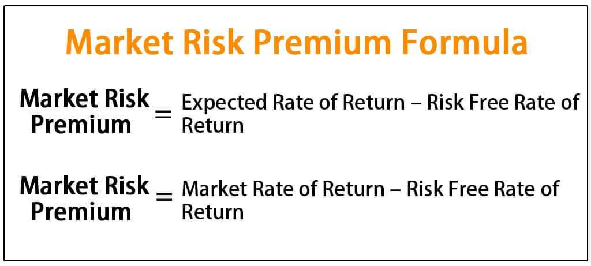

Investment risks are a constant consideration for investors seeking to maximize returns in financial markets. This article examines critical aspects of investment risks, focusing on the nuances of market risk premium and algorithmic trading. Understanding these components is crucial for investors as they navigate the complex landscape of financial markets. This article will outline the nature of market risk and the concept of market risk premium, assessing their impact on investment decisions. Additionally, the potential risks and advantages associated with algorithmic trading will be explored to provide a comprehensive understanding. The goal is to offer insights that empower investors to make informed decisions and effectively manage risks for optimized returns.

## Table of Contents

## Understanding Investment Risks in Financial Markets

Investment risks in financial markets are multifaceted, arising primarily from economic, political, and market-specific factors. Understanding these risks is crucial for any investor seeking to protect their investments while capitalizing on potential gains.

Market risk, also referred to as systematic risk, represents the possibility that investors will experience losses due to fluctuations affecting the entire market, not just individual securities or sectors. Factors contributing to market risk include changes in interest rates, corporate earnings, geopolitical events, and macroeconomic trends. For example, an unexpected hike in interest rates could adversely affect bond prices across the board, whereas a political crisis could lead to widespread panic selling in stock markets.

In addition to market risk, investors must navigate other risk types, such as credit risk, [liquidity](/wiki/liquidity-risk-premium) risk, and operational risk. Credit risk arises when a borrower fails to meet their obligations, affecting fixed-income securities like bonds. Liquidity risk involves the difficulty of quickly converting an investment into cash without significantly affecting its price. Operational risk pertains to failures in internal processes, people, or systems, potentially leading to financial loss.

Risk management strategies are vital for addressing these risks and safeguarding investments. Key strategies include diversification, where investments are spread across various asset classes to reduce exposure to any single risk source. Diversification can mitigate the impact of market downturns, as gains in some areas may offset losses in others.

Implementing stop-loss orders is another effective risk management technique. A stop-loss order automatically triggers the sale of a security when its price falls to a predetermined level, thereby limiting an investor's loss.

Another critical aspect is continuous monitoring of market conditions and portfolio performance. Investors can use various tools and techniques to track economic indicators and market trends, ensuring they are prepared to adjust their strategies when necessary.

Understanding and assessing investment risks allows investors to make informed decisions that align with their risk tolerance and financial goals. By employing robust risk management practices, investors can reduce the negative impacts of market [volatility](/wiki/volatility-trading-strategies) and enhance the overall stability of their investment portfolios.

## Market Risk Premium: Definition and Significance

The market risk premium represents the excess return an investor anticipates receiving from investing in a market portfolio that carries risk, as opposed to a risk-free asset. This concept plays a pivotal role in asset pricing models, such as the Capital Asset Pricing Model (CAPM), which is expressed as:

$$
E(R_i) = R_f + \beta_i (E(R_m) - R_f)
$$

where:
- $E(R_i)$ is the expected return of investment $i$.
- $R_f$ is the risk-free rate of return.
- $\beta_i$ is the sensitivity of investment $i$'s returns to the overall market returns.
- $E(R_m)$ is the expected return of the market.
- $(E(R_m) - R_f)$ is the market risk premium.

Calculating the market risk premium involves subtracting the risk-free rate, typically based on government bond yields, from the expected market return. Several factors affect the value of the market risk premium over time, including economic conditions, investor risk aversion, and changes in expected market volatility.

Historically, the market risk premium has shown variability due to shifts in macroeconomic fundamentals, geopolitical events, and market sentiments. During periods of economic prosperity, investor confidence tends to drive down the premium as risk aversion decreases. Conversely, in times of economic uncertainty, the premium often rises as investors demand higher compensation for taking on additional risk.

Understanding fluctuations in the market risk premium provides insights into investor behavior. For instance, a high market risk premium may suggest that investors are collectively anticipating significant market volatility or downturns. On the other hand, a low premium could indicate optimism and a subdued perception of market risk.

Through historical analysis, investors can discern patterns, such as how investor psychology and external factors influence the market risk premium. These insights enable investors to make informed decisions about asset allocation, risk assessment, and expected return calculations, ultimately aiding in the alignment of investment strategies with market conditions.

## Algorithmic Trading: Benefits and Risks

Algorithmic trading, often referred to as 'algo trading,' employs computer algorithms to automate buying and selling decisions in financial markets. By utilizing these algorithms, traders can execute orders with remarkable speed and precision. One of the primary benefits of [algorithmic trading](/wiki/algorithmic-trading) is the improvement in efficiency. Algorithms can process a vast amount of data at speeds unattainable by human traders, enabling them to capitalize on market opportunities within fractions of a second. This rapid execution minimizes slippage, which is the difference between the expected price of a trade and the actual price at which the trade is executed.

Another advantage of algo trading is the reduction of emotional biases in trading decisions. Human traders are often swayed by emotions such as fear and greed, which can lead to irrational decision-making. Algorithms operate based on predefined rules and logic, ensuring consistent and emotion-free transactions. This objectivity can lead to more disciplined trading strategies and potentially better outcomes over time.

However, despite these advantages, algorithmic trading is not devoid of risks. Technical glitches pose a significant threat; for instance, errors in the coding of trading algorithms can lead to unintended transactions, resulting in substantial financial losses. Furthermore, the reliance on technology means that hardware or software failures could disrupt trading operations.

Market amplification is another risk associated with algorithmic trading. Since algorithms can execute trades at high speeds, they have the potential to exacerbate market volatility. In situations where many algorithms respond to market triggers, rapid automated transactions can lead to sharp market movements, sometimes beyond what fundamentals would justify. This was notably observed during events like the 2010 "Flash Crash," where significant price swings occurred within minutes.

Cybersecurity threats also loom large in the world of algo trading. Trading systems are valuable targets for cybercriminals, who may seek to manipulate algorithms or steal sensitive information. Ensuring robust security measures and encryption protocols is vital to safeguarding trading platforms from such threats.

To mitigate these risks, traders employing algorithmic strategies should implement comprehensive risk management techniques. Techniques such as stress testing and [backtesting](/wiki/backtesting) algorithms against historical data can help identify potential weaknesses and ensure robustness. Regular monitoring and updating of algorithms are also crucial to adapt to changing market conditions. Furthermore, implementing circuit breakers—mechanisms to temporarily halt trading under extreme conditions—can prevent catastrophic losses during unexpected market events.

In conclusion, while algorithmic trading offers substantial benefits in terms of speed and efficiency, it also introduces specific risks that must be carefully managed. Understanding and addressing these risks is essential for traders to harness the full potential of algorithmic strategies effectively.

## The Role of Risk Management in Investing

Effective risk management strategies are paramount in safeguarding investments against market uncertainties. This involves a proactive approach to identifying, analyzing, and mitigating the various risks associated with investing. Key principles of risk management include diversification, stop-loss orders, and continuous monitoring, each playing a crucial role in protecting investments from adverse market movements.

Diversification is a foundational strategy that spreads investments across a variety of asset classes and sectors to minimize risk. By not concentrating assets in a single investment, investors can reduce the impact of a poor-performing asset on their overall portfolio. The principle behind diversification is to increase the probability of exposure to favorable returns while mitigating the potential for large losses. According to Modern Portfolio Theory, diversification can optimize a portfolio's expected return based on a given level of market risk.

Stop-loss orders are another critical tool for risk management. These orders allow investors to set a predetermined price at which their investment will automatically sell, thus limiting potential losses. This mechanism is vital for maintaining discipline in volatile markets where emotional decision-making might otherwise lead to greater losses. By setting stop-loss orders, investors can ensure that their losses are cut early and capital is preserved for future opportunities.

Continuous monitoring of investments is essential to effective risk management. Markets are dynamic, with economic indicators, political events, and market sentiments affecting asset prices. Regularly reviewing the performance of investments and staying informed about market conditions can help investors make timely decisions. This also includes revisiting and adjusting investment strategies to align with updated financial goals and risk tolerance levels.

In the context of algorithmic trading, the implementation of technical safeguards and robust backtesting strategies is necessary to minimize vulnerabilities. Algorithmic trading systems are designed to execute trades based on preset criteria without human intervention, and errors in these systems can lead to significant financial losses. Technical safeguards, such as error-checking mechanisms and fail-safes, are crucial in preventing these issues. Additionally, backtesting trading algorithms on historical data helps ensure that they perform as expected under various market conditions. This involves simulating trading strategies using historical data to validate their effectiveness and to identify potential weaknesses before deploying them in live markets.

Aligning risk management with investment goals and risk tolerance levels is vital for maintaining a balanced investment approach. Investors should assess their financial objectives, time horizons, and willingness to bear risk before making investment decisions. This alignment ensures that the strategies employed in managing risks are appropriate for the individual investor's profile, promoting a more personalized approach to investment risk management.

In summary, effective risk management involves a combination of diversification, stop-loss mechanisms, continuous monitoring, technical safeguards, and strategy testing. By incorporating these elements, investors can shield themselves from market uncertainties and enhance the resilience of their investment portfolios.

## Conclusion

Investment in financial markets involves inherent risks, but with proper understanding and management of these risks, significant rewards are attainable. By comprehending the market risk premium, which represents the expected additional return from investing in a risky market portfolio instead of risk-free assets, investors can make more informed decisions regarding where to allocate resources for maximum potential return. Similarly, gaining an understanding of algorithmic trading, with its potential for increased efficiency and reduced emotional bias, allows investors to leverage technology to optimize their trading strategies. 

A key strategy in successful investing is balancing the pursuit of high returns with rigorous risk management practices. This involves employing diversification to spread out risk, utilizing stop-loss orders to limit potential losses, and continually monitoring market conditions to adjust strategies as needed. For those engaging in algorithmic trading, implementing robust technical safeguards and conducting thorough backtests of trading models are crucial steps in minimizing vulnerabilities.

Armed with insights into market risk premium and the operational dynamics of algorithmic trading, investors are better positioned to navigate financial markets. These insights empower them to exercise greater confidence and strategic acumen, making them capable of turning potential market uncertainties into opportunities for growth.

## References & Further Reading

[1]: Damodaran, A. (2012). ["Equity Risk Premiums (ERP): Determinants, Estimation, and Implications."](https://people.stern.nyu.edu/adamodar/pdfiles/papers/ERP2012.pdf) Working Paper, Stern School of Business. 

[2]: ["Algorithmic Trading and DMA: An Introduction to Direct Access Trading Strategies"](https://www.amazon.com/Algorithmic-Trading-DMA-introduction-strategies/dp/0956399207) by Barry Johnson

[3]: Fama, E. F., & French, K. R. (2004). ["The Capital Asset Pricing Model: Theory and Evidence."](https://www.aeaweb.org/articles?id=10.1257/0895330042162430) Journal of Economic Perspectives, 18(3), 25-46.

[4]: ["Risk Management and Financial Institutions"](https://www.simonfoucher.com/MBA/FINA%20695%20-%20Risk%20Management/riskmanagementandfinancialinstitutions4theditionjohnhull-150518225205-lva1-app6892.pdf) by John C. Hull

[5]: Cartea, Á., Jaimungal, S., & Penalva, J. (2015). ["Algorithmic and High-Frequency Trading."](https://assets.cambridge.org/97811070/91146/frontmatter/9781107091146_frontmatter.pdf) Cambridge University Press.