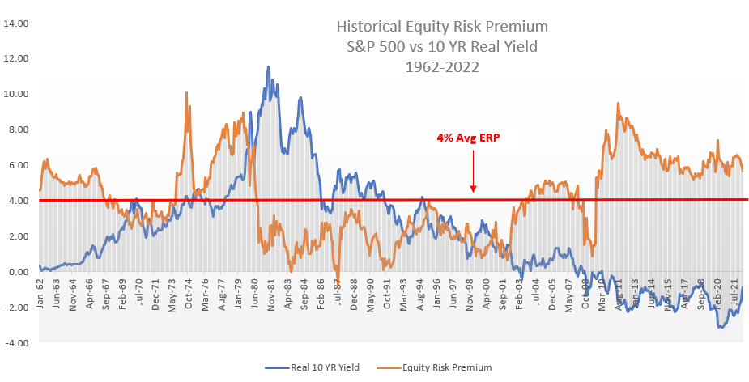

## Table of Contents

## What is the market risk premium?

The market risk premium is the extra return that investors expect to earn from investing in the stock market compared to a risk-free investment, like government bonds. It's like a reward for taking the risk of investing in stocks, which can go up and down a lot more than safer investments. The market risk premium helps investors decide if the potential extra returns from stocks are worth the extra risk.

To calculate the market risk premium, you subtract the expected return of a risk-free investment from the expected return of the market. For example, if the expected return of the market is 8% and the risk-free rate is 3%, the market risk premium would be 5%. This number can change over time based on how the economy is doing and how investors feel about taking risks.

## Why is the market risk premium important for investors?

The market risk premium is important for investors because it helps them understand the extra reward they might get for choosing to invest in the stock market instead of safer options like government bonds. By knowing the market risk premium, investors can decide if the potential extra returns from stocks are worth the risk. If the market risk premium is high, it means investors might get a bigger reward for taking on more risk, which could make stocks more attractive.

On the other hand, if the market risk premium is low, it might not seem worth it to take on the extra risk of stocks when safer investments are available. The market risk premium also helps investors compare different investment opportunities. By looking at the market risk premium, they can see if other investments might offer better rewards for the level of risk involved. This way, investors can make smarter choices about where to put their money.

## How is the market risk premium calculated?

The market risk premium is calculated by taking the expected return of the stock market and subtracting the expected return of a risk-free investment. The expected return of the stock market is what investors think they will earn on average from investing in stocks. The risk-free return is usually the interest rate on government bonds, which are considered very safe. For example, if the expected return of the stock market is 8% and the risk-free rate is 3%, you would subtract 3% from 8% to get a market risk premium of 5%.

This calculation helps investors understand the extra reward they might get for choosing to invest in stocks instead of safer options. The market risk premium can change over time because both the expected return of the stock market and the risk-free rate can go up or down. For instance, if the economy is doing well, the expected return of the stock market might go up, which could increase the market risk premium. But if the risk-free rate goes up because interest rates rise, the market risk premium might go down. This makes it important for investors to keep an eye on both numbers.

## What historical data is typically used to estimate the market risk premium?

To estimate the market risk premium, people often look at historical data. They use the past returns of the stock market and compare them to the returns of risk-free investments like government bonds. For example, they might look at the average yearly return of the stock market over the last 50 or 100 years and then subtract the average yearly return of government bonds over the same period. This gives them an idea of what the market risk premium has been in the past.

This historical data helps investors guess what the market risk premium might be in the future. But it's important to remember that the past doesn't always predict the future. Economic conditions, interest rates, and how people feel about taking risks can all change over time. So while historical data is useful, it's just one piece of the puzzle when trying to figure out the market risk premium.

## How has the market risk premium varied over different time periods?

The market risk premium has changed a lot over different time periods. In the long run, like over the last 100 years, the market risk premium in the U.S. has been around 5-6%. But if you look at shorter periods, like 10 or 20 years, the numbers can be very different. For example, during the 1990s, the market risk premium was lower because the stock market did really well and people felt more confident about investing in stocks. But after the dot-com bubble burst in the early 2000s, the market risk premium went up because people were more worried about the risks of investing in stocks.

Even within shorter time frames, the market risk premium can change a lot. During times of economic trouble, like the 2008 financial crisis, the market risk premium can spike because people want a bigger reward for taking on the risk of stocks. On the other hand, during good economic times, like the mid-2010s, the market risk premium can be lower because people feel safer about investing in the stock market. So, the market risk premium is not a fixed number; it moves up and down based on what's happening in the economy and how people feel about taking risks.

## What are the differences in market risk premium across different countries?

The market risk premium can be different from one country to another. This is because each country has its own economy, laws, and risks. For example, in the United States, the long-term market risk premium has been around 5-6%. But in countries that are seen as riskier, like some in Latin America or Africa, the market risk premium might be higher. Investors want a bigger reward for putting their money in places where things can be more unpredictable.

Even among developed countries, the market risk premium can vary. In Europe, the market risk premium might be a bit lower than in the U.S. because the economies are different and investors might see less risk. But in countries like Japan, where the economy has had ups and downs, the market risk premium might be higher at times. So, when investors look at different countries, they need to think about how much extra reward they want for the risks they are taking in each place.

## How do economic conditions influence the market risk premium?

Economic conditions play a big role in shaping the market risk premium. When the economy is doing well, like when there are lots of jobs and people are spending money, the stock market usually does better too. This can make the market risk premium go down because investors feel safer about putting their money in stocks. They might not need as much extra reward for the risk because they think the chances of losing money are lower. On the other hand, if the economy is struggling, like during a recession, the market risk premium can go up. Investors get more worried about losing their money, so they want a bigger reward for taking the risk of investing in stocks.

Interest rates also matter a lot when it comes to the market risk premium. If interest rates are low, the returns on safe investments like government bonds go down. This can make stocks look more attractive because the difference between what you can earn from stocks and what you can earn from safe investments gets bigger. So, the market risk premium might go up. But if interest rates go up, the returns on safe investments get better, and the market risk premium might go down because the extra reward for investing in stocks doesn't seem as big. So, both the general health of the economy and interest rates can make the market risk premium change over time.

## What are the limitations of using historical data to estimate future market risk premiums?

Using historical data to guess what the market risk premium will be in the future has some problems. The past doesn't always tell us what will happen next. The economy, interest rates, and how people feel about taking risks can all change a lot over time. What worked in the past might not work in the future. For example, if the economy was booming 20 years ago, that doesn't mean it will be booming next year. So, looking at old numbers can sometimes lead investors to make wrong guesses about the future.

Another problem is that historical data can be hard to understand. It can be tricky to figure out the right time period to look at. Should we look at the last 10 years, 50 years, or 100 years? Different time periods can give very different answers about what the market risk premium has been. Also, the data might not be perfect. Sometimes, the numbers we have might not be completely right or might be missing important details. So, while historical data can give us some clues, it's not a perfect way to predict what the market risk premium will be in the future.

## How can the market risk premium be used in asset pricing models like the Capital Asset Pricing Model (CAPM)?

The market risk premium is a key part of the Capital Asset Pricing Model (CAPM), which helps investors figure out what return they should expect from an investment. In CAPM, the expected return of an investment is made up of the risk-free rate plus a part that depends on how risky the investment is compared to the whole market. This part is called the "beta" of the investment. To find out the extra return for the risk, you multiply the investment's beta by the market risk premium. So, if an investment is twice as risky as the market (beta of 2) and the market risk premium is 5%, the extra return for the risk would be 10%.

Using the market risk premium in CAPM helps investors see if an investment is worth it. If the expected return from an investment, calculated using CAPM, is higher than other options with the same risk, it might be a good choice. But if the expected return is lower, investors might want to look for other investments. The market risk premium is really important because it shows how much extra reward investors should expect for taking on the risk of the market. This helps them make smarter choices about where to put their money.

## What are some alternative methods to estimate the market risk premium?

One way to guess the market risk premium without just looking at the past is to ask experts what they think. Surveys can be done where people who know a lot about the stock market share their ideas on what the market risk premium might be in the future. This can be helpful because it takes into account what people are thinking right now, not just what happened a long time ago. But, it's still a guess, and different experts might have different ideas, so it's not perfect.

Another method is to use models that look at things like how much risk people are willing to take, how the economy is doing, and what's happening with interest rates. These models try to predict the market risk premium by thinking about all these different pieces. They can be more complicated but might give a better idea of what might happen in the future. Still, these models are not always right because they depend on a lot of guesses and assumptions about how things will change. So, while they can be useful, they also have their own problems.

## How do changes in investor sentiment affect the market risk premium?

Changes in how investors feel can really change the market risk premium. When investors are feeling good and confident about the future, they might not need as much extra reward for putting their money in the stock market. This can make the market risk premium go down because people are willing to take on more risk without asking for a bigger reward. On the other hand, if investors are feeling scared or worried, they might want a bigger reward for taking on the risk of stocks. This can make the market risk premium go up because people need more of a reason to invest in something that they see as risky.

For example, if there's good news about the economy, like more jobs or higher spending, investors might feel more confident. They might think the stock market will do well, so they don't need as big of a reward for taking on the risk. But if there's bad news, like a recession or a big drop in the stock market, investors might get scared. They might want a bigger reward for putting their money in stocks because they're worried about losing it. So, how investors feel can make the market risk premium go up or down, depending on whether they're feeling confident or worried.

## What are the implications of a high versus a low market risk premium for investment strategies?

When the market risk premium is high, it means investors can get a bigger reward for taking on the risk of the stock market. This might make stocks look more attractive compared to safer investments like government bonds. Investors might decide to put more of their money into stocks because they think the extra reward is worth the risk. They might also look for stocks that are riskier than the market average because those stocks could offer even bigger rewards. So, a high market risk premium can lead investors to take on more risk in hopes of getting higher returns.

On the other hand, when the market risk premium is low, the extra reward for investing in stocks isn't as big. This might make stocks seem less appealing compared to safer investments. Investors might decide to put more of their money into safer options like bonds because the difference in returns isn't worth the extra risk of stocks. They might also look for ways to lower their risk, like investing in more stable companies or diversifying their investments. So, a low market risk premium can lead investors to be more cautious and focus on protecting their money rather than trying to grow it quickly.

## What is the Market Risk Premium: Its Definition and Significance?

The market risk premium represents the excess return an investor anticipates receiving from investing in a market portfolio that carries risk, as opposed to a risk-free asset. This concept plays a pivotal role in asset pricing models, such as the Capital Asset Pricing Model (CAPM), which is expressed as:

$$
E(R_i) = R_f + \beta_i (E(R_m) - R_f)
$$

where:
- $E(R_i)$ is the expected return of investment $i$.
- $R_f$ is the risk-free rate of return.
- $\beta_i$ is the sensitivity of investment $i$'s returns to the overall market returns.
- $E(R_m)$ is the expected return of the market.
- $(E(R_m) - R_f)$ is the market risk premium.

Calculating the market risk premium involves subtracting the risk-free rate, typically based on government bond yields, from the expected market return. Several factors affect the value of the market risk premium over time, including economic conditions, investor risk aversion, and changes in expected market volatility.

Historically, the market risk premium has shown variability due to shifts in macroeconomic fundamentals, geopolitical events, and market sentiments. During periods of economic prosperity, investor confidence tends to drive down the premium as risk aversion decreases. Conversely, in times of economic uncertainty, the premium often rises as investors demand higher compensation for taking on additional risk.

Understanding fluctuations in the market risk premium provides insights into investor behavior. For instance, a high market risk premium may suggest that investors are collectively anticipating significant market volatility or downturns. On the other hand, a low premium could indicate optimism and a subdued perception of market risk.

Through historical analysis, investors can discern patterns, such as how investor psychology and external factors influence the market risk premium. These insights enable investors to make informed decisions about asset allocation, risk assessment, and expected return calculations, ultimately aiding in the alignment of investment strategies with market conditions.

## References & Further Reading

[1]: Damodaran, A. (2012). ["Equity Risk Premiums (ERP): Determinants, Estimation, and Implications."](https://people.stern.nyu.edu/adamodar/pdfiles/papers/ERP2012.pdf) Working Paper, Stern School of Business. 

[2]: ["Algorithmic Trading and DMA: An Introduction to Direct Access Trading Strategies"](https://www.amazon.com/Algorithmic-Trading-DMA-introduction-strategies/dp/0956399207) by Barry Johnson

[3]: Fama, E. F., & French, K. R. (2004). ["The Capital Asset Pricing Model: Theory and Evidence."](https://www.aeaweb.org/articles?id=10.1257/0895330042162430) Journal of Economic Perspectives, 18(3), 25-46.

[4]: ["Risk Management and Financial Institutions"](https://www.simonfoucher.com/MBA/FINA%20695%20-%20Risk%20Management/riskmanagementandfinancialinstitutions4theditionjohnhull-150518225205-lva1-app6892.pdf) by John C. Hull

[5]: Cartea, Á., Jaimungal, S., & Penalva, J. (2015). ["Algorithmic and High-Frequency Trading."](https://assets.cambridge.org/97811070/91146/frontmatter/9781107091146_frontmatter.pdf) Cambridge University Press.
