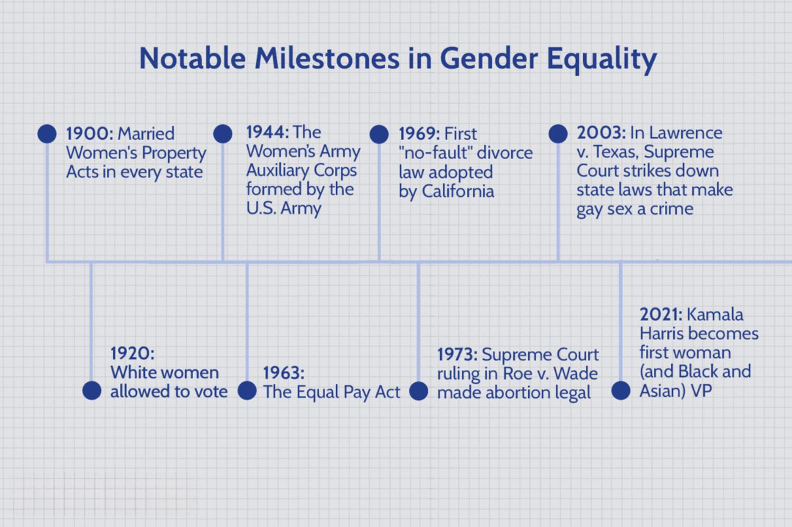

American history is an intricate tapestry woven from pivotal moments that have collectively shaped the nation's cultural and social landscape. Among these, the history of LGBTQ+ communities in America stands out for its significant milestones. These milestones not only mark the ongoing struggle for equality and recognition but also highlight the progress and achievements that have been made over the decades. From the Stonewall Riots, a turning point in the fight for LGBTQ+ rights, to the legalization of same-sex marriage, these events have altered public perception and policy in ways that resonate throughout the nation.

In parallel with these social transformations, technology has evolved at an unprecedented pace, with algorithmic trading emerging as a revolutionary force within the financial sector. Algorithmic trading, or algo trading, utilizes complex algorithms and high-speed data processing to execute trades in financial markets. It has revolutionized the field by enhancing trading efficiency, increasing liquidity, and reducing transaction costs. These technological advancements illustrate the significant impact that innovation can have across various sectors.

This article seeks to explore the intersection between these two seemingly disparate areas: the milestones of LGBTQ+ American history and the impact of algorithmic trading on the financial industry. By examining these subjects together, we can gain a deeper understanding of their broader societal implications and the ways in which they have contributed to reshaping the modern American landscape. This intersection also offers insights into how diverse social progress and technological advancements together fuel continuous transformation, driving us towards a more inclusive and innovative future.

## Table of Contents

## LGBTQ+ Milestones in American History

From the Stonewall Riots to the legalization of same-sex marriage, the LGBTQ+ movement in the United States has achieved numerous significant milestones, marking profound shifts in societal norms and laws. The Stonewall Riots, which erupted in June 1969, are frequently cited as the catalyst for the modern LGBTQ+ rights movement in America. This uprising took place at the Stonewall Inn in New York City, where patrons resisted a police raid, sparking demonstrations that highlighted the pervasive discrimination faced by LGBTQ+ individuals. The riots galvanized activists and laid the groundwork for the formation of advocacy groups, such as the Gay Liberation Front and the Gay Activists Alliance, which pushed for greater rights and recognition.

The early 2000s witnessed a surge in legal victories and increasing societal acceptance for LGBTQ+ individuals. One of the most notable outcomes of this era was the Supreme Court's ruling in Obergefell v. Hodges in 2015, which legalized same-sex marriage nationwide. This landmark decision marked the culmination of years of activism and legal battles advocating for marriage equality. The ruling not only validated same-sex couples' relationships in the eyes of the law but also affirmed their rights to equal protection and dignity.

Beyond legal triumphs, cultural milestones have played a crucial role in altering public perception and fostering acceptance. Representation of LGBTQ+ individuals in media, literature, and sports has contributed to increasing visibility and normalization. Characters like Ellen DeGeneres’ portrayal in her 1997 sitcom and more recent shows like "Queer Eye" have reshaped mainstream understanding of LGBTQ+ lives. In sports, the coming out of athletes like Jason Collins, who became the first openly gay player in the NBA in 2013, challenged stereotypes and inspired inclusivity on and off the field.

These historic achievements have collectively fostered greater equality, awareness, and appreciation for LGBTQ+ rights within the United States. The progress made reflects both societal shifts toward inclusion and the relentless efforts of activists and allies dedicated to securing justice and equality. Each milestone builds upon the last, creating a foundation for future advancements and the continued struggle for comprehensive civil rights.

## Understanding Algorithmic Trading

Algorithmic trading is the sophisticated practice of using computer programs and algorithms to manage and execute trades with remarkable speed and [volume](/wiki/volume-trading-strategy). This innovative method leverages advanced computational power to assess a multitude of market variables and execute transactions more efficiently than traditional manual trading methods. The emergence of [algorithmic trading](/wiki/algorithmic-trading), particularly since the late 20th century, has revolutionized financial markets by streamlining trading processes and reducing human intervention.

Central to algorithmic trading is the utilization of data analysis and complex mathematical models to make strategic trading decisions. These algorithms are designed to analyze vast datasets, identifying lucrative trading opportunities based on pre-determined criteria. They are capable of executing trades at a fraction of a second, a feat unattainable by human traders. This speed enhances market [liquidity](/wiki/liquidity-risk-premium)—defined as the ease with which an asset can be bought or sold without affecting its price—and reduces transaction costs for participants in the financial markets.

The transformation brought about by algorithmic trading is profound, reshaping traditional investment strategies with its capacity for high-frequency trading ([HFT](/wiki/high-frequency-trading-strategies)). This type of trading involves thousands of orders executed in fractions of a second, capitalizing on minute price discrepancies in the market to generate profit. The popularity of high-frequency trading underscores the efficiency algorithms bring to the financial ecosystem, as they help align prices more closely with supply and demand dynamics.

However, the rapid evolution of algorithmic trading also introduces significant regulatory challenges and ethical considerations. The speed and volume of trades executed by algorithms can lead to market [volatility](/wiki/volatility-trading-strategies), as evidenced by incidents such as the "Flash Crash" of May 6, 2010, where the U.S. stock market briefly plunged, wiping out nearly $1 trillion in market value. To address these issues, regulators worldwide are implementing measures to monitor and control the behavior of algorithms, ensuring they operate within the established legal and ethical frameworks.

The ethical considerations in algorithmic trading revolve around fairness, transparency, and the potential for algorithmic biases that could disadvantage certain market participants. Algorithm-driven trading systems must be designed with care to prevent market manipulation and ensure equal access to market information.

In conclusion, algorithmic trading has brought significant advancements to the financial markets through improved efficiency and liquidity while simultaneously presenting new regulatory and ethical challenges. As this domain continues to evolve, ongoing efforts are essential to balance innovation with the need for oversight and fairness in financial trading practices.

## Intersection and Impact: LGBTQ+ Representation in Financial Markets

Historically, the financial sector has been characterized by a lack of diversity, with barriers to entry persisting for underrepresented groups, including the LGBTQ+ community. However, recent years have seen a notable shift as LGBTQ+ individuals become increasingly visible within the finance industry. This increased representation includes areas such as algorithmic trading, where diverse perspectives contribute to enhanced decision-making processes and innovative solutions. 

Financial organizations are progressively adopting inclusive practices and policies, thereby creating environments where diversity is seen as a driver of innovation. Recognizing the value of diverse teams, corporations are implementing practices that support LGBTQ+ employees and foster inclusivity. This shift not only promotes social equality but has also been shown to improve market efficiency and creativity. Research indicates that diverse teams can lead to better performance outcomes, enhancing both operational effectiveness and financial returns.

Inclusive algorithmic trading platforms illustrate the broader impact of embracing intersectionality across various professional fields. By valuing the input of LGBTQ+ individuals, these platforms benefit from a wide range of insights and perspectives, leading to more robust and adaptive trading strategies. Moreover, organizations that prioritize diversity and inclusion tend to attract a broader talent pool, improving competitiveness in the marketplace.

By celebrating and promoting LGBTQ+ representation within finance, particularly in specialized fields like algo trading, the industry sets a critical precedent for inclusion across all sectors. The integration of diverse identities not only strengthens the financial industry's moral framework but also enhances its strategic capabilities. As the financial landscape continues to evolve, the inclusion of LGBTQ+ voices will be instrumental in driving progressive change and fostering a richer, more dynamic market environment.

## Challenges and Opportunities

Despite significant strides towards inclusivity, the financial sector continues to present challenges for the LGBTQ+ community, particularly in the context of algorithmic trading and related fields. Discrimination, both overt and systemic, persists as a barrier to the full participation of LGBTQ+ individuals, affecting their career advancement and workplace experiences. Addressing these challenges requires a multi-faceted approach that includes promoting diversity, dismantling biases, and fostering equitable opportunities within the industry.

Diversity and inclusion efforts in financial markets often involve creating policies and practices that actively support underrepresented groups, including the LGBTQ+ community. Overcoming systemic biases entails recognizing and addressing the implicit prejudices that may exist within hiring practices, performance evaluations, and corporate cultures. By implementing comprehensive diversity training and inclusive policies, organizations can begin to dismantle these biases, creating environments where all employees feel valued and respected.

Algorithmic trading offers unique opportunities to confront inclusivity challenges through data-driven decision-making. The objective nature of algorithms can serve as a tool to minimize human biases in trading strategies and employment practices. By employing algorithms to analyze performance metrics and hiring approaches, organizations can identify patterns that may indicate bias and take corrective actions. This approach not only promotes fairer practices but can also enhance the accuracy and efficiency of trading strategies by relying on objective data.

The growth of advocacy and education around LGBTQ+ issues has emerged as a powerful force for empowering both individuals and organizations in financial sectors. Advocacy groups play a crucial role in raising awareness of LGBTQ+ challenges and promoting best practices for inclusion. Collaborative efforts between advocacy groups and financial institutions can lead to the development of resources and programs that support LGBTQ+ individuals in their careers. Educational initiatives, such as seminars and workshops, can further enhance understanding and acceptance in the workplace, fostering an environment of inclusion.

Creating an inclusive financial environment is not just a moral imperative but a strategic advantage. By embracing diverse identities and professional expertise, financial markets can drive innovation and performance improvements. Diversity enhances problem-solving capabilities and promotes creative solutions, essential components in the fast-paced world of algo trading. Organizations that prioritize inclusion can attract a broader talent pool, retain top performers, and ultimately achieve better business outcomes.

In summary, while the financial sector, including algorithmic trading, faces notable challenges concerning LGBTQ+ inclusion, there are significant opportunities for growth and improvement. By leveraging the power of data-driven decision-making, promoting advocacy, and fostering inclusive workplaces, this sector can become a leader in diversity and equality, setting an example for others to follow.

## Conclusion

The historical milestones achieved by the LGBTQ+ community and the technological advancements in algorithmic trading have both played pivotal roles in shaping contemporary American society. These advancements underscore the transformative power of advocacy, innovation, and inclusivity. Progress in LGBTQ+ rights, from legal victories to cultural acceptance, illustrates how social advocacy can foster equality and reshape public perceptions. Similarly, the evolution of algorithmic trading demonstrates innovation's capacity to revolutionize industries through efficiency and new financial strategies.

By recognizing and embracing diversity, industries such as finance can lead the way toward a more equitable future. The inclusion of diverse voices in financial sectors, including LGBTQ+ individuals, promotes not only social equality but also enhances creativity and efficiency within these markets. This embrace of diversity serves as a model for other sectors, reflecting a broader potential for growth and fairness.

Understanding these dynamics invites us to envision a society where all individuals, regardless of identity, have the opportunity to thrive. The convergence of social progress and technological advancements highlights the importance of inclusivity in driving positive societal change. As these forces continue to intersect, they reaffirm the value of diverse perspectives in fostering innovation and equity across various fields.

## References & Further Reading

[1]: Armstrong, E. (2002). ["Forging Gay Identities: Organizing Sexuality in San Francisco, 1950-1994."](https://archive.org/details/forginggayidenti0000arms) University of Chicago Press.

[2]: Marcus, E. (2002). ["Making History: The Struggle for Gay and Lesbian Equal Rights, 1945-1990."](https://archive.org/details/makinggayhistory0000marc) Harper Perennial.

[3]: Niederhoffer, V. (1997). ["The Education of a Speculator."](https://archive.org/details/educationofspecu0000nied) John Wiley & Sons.

[4]: Clarke, R.G., de Silva, H., & Thorley, S. (2006). ["Minimum-Variance Portfolio Composition."](https://www.semanticscholar.org/paper/Minimum-Variance-Portfolio-Composition-Clarke-Silva/85624fd08859d778bc41daf10ef0b934d775d8a5) Financial Analysts Journal, 59(1), 56-69.

[5]: Sun, W. (2019). ["The History of LGBTQ Law."](https://www.cambridge.org/core/books/cambridge-world-history-of-sexualities/history-of-sexuality-and-lgbtq-history/3C907C494F6194CF023DF9C3CC3A7AAD) SSRN Electronic Journal.

[6]: Hasbrouck, J., & Saar, G. (2013). ["Low-latency trading."](https://papers.ssrn.com/sol3/papers.cfm?abstract_id=1695460) Journal of Financial Markets, 16(4), 646-679. 

[7]: Aldrich, R. (2006). ["Gay Life and Culture: A World History."](https://books.google.com/books/about/Gay_Life_and_Culture.html?id=NDobAAAAYAAJ) Thames & Hudson.