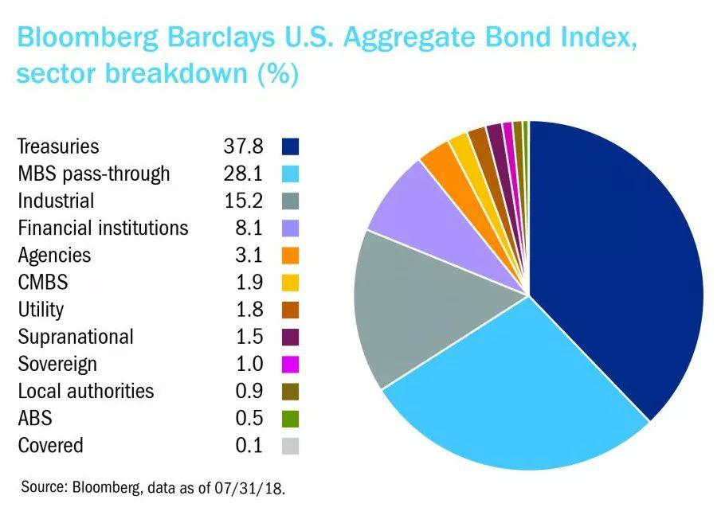

## Table of Contents

## What is the bond market and why is it important?

The bond market is a place where people and organizations can buy and sell bonds. Bonds are like loans that you give to a government or a company. In return, they promise to pay you back the money you lent them, plus some extra money called interest. The bond market is very big and includes many different types of bonds, like government bonds, corporate bonds, and municipal bonds.

The bond market is important for several reasons. First, it helps governments and companies raise money. When they need cash, they can sell bonds to investors instead of borrowing from banks. This money can be used to build roads, start new businesses, or do other important projects. Second, the bond market gives investors a safe place to put their money. Bonds are usually less risky than stocks, so people who want steady income and less risk often invest in bonds. This makes the bond market a key part of the financial system.

## When did the bond market first emerge historically?

The bond market has been around for a long time, starting way back in the Middle Ages. Around the 12th and 13th centuries, governments and cities in Europe began to issue bonds to raise money for wars and building projects. For example, the city of Venice issued bonds to finance its naval fleet. These early bonds were simple promises to pay back the money with interest, and they laid the groundwork for what we know today as the bond market.

Over time, the bond market grew and became more organized. By the 17th century, the Dutch and British governments were regularly issuing bonds, which helped them fund their growing empires and military campaigns. The development of stock exchanges in Amsterdam and London also helped make trading bonds easier and more widespread. Today, the bond market is a huge and complex part of the global financial system, but it all started with those early efforts to borrow money in medieval Europe.

## How have government bonds evolved over time?

Government bonds have changed a lot since they first started. In the beginning, during the Middle Ages, governments would issue simple promises to pay back money with interest. These early bonds were used to fund wars and big building projects. Over time, as countries like the Netherlands and Britain grew, they started using bonds more often to pay for their empires and military. By the 17th century, these bonds were being traded on stock exchanges, making it easier for people to buy and sell them.

As time went on, government bonds became more complex and varied. In the 20th century, governments started issuing different types of bonds, like savings bonds for regular people and treasury bonds for big investors. They also started using bonds to manage the economy, like selling more bonds to take money out of circulation when they wanted to slow down inflation. Today, government bonds are a key part of the financial world, used by countries to borrow money and by investors to find safe places to put their money.

## What role did the bond market play during major historical events like wars or economic crises?

During wars, the bond market has been very important for governments. They used bonds to raise money to pay for soldiers, weapons, and other things they needed. For example, in World War I and World War II, countries like the United States and the United Kingdom sold war bonds to their citizens. These bonds helped the governments borrow money from people at home, which was crucial for funding the war efforts. People bought these bonds not just to help their country, but also because they would get their money back with interest after the war.

In economic crises, the bond market also plays a big role. When the economy is in trouble, like during the Great Depression in the 1930s or the 2008 financial crisis, governments often issue more bonds to raise money. This money can be used to help the economy by funding projects that create jobs or by giving money to people who need it. At the same time, investors often turn to government bonds because they are seen as safe investments during uncertain times. This demand for bonds can help calm the financial markets and make things more stable.

## How have technological advancements influenced the development of the bond market?

Technology has changed the bond market a lot. In the past, buying and selling bonds was hard because people had to meet in person or use the mail. But now, with computers and the internet, it's much easier. You can buy and sell bonds from anywhere using online platforms. This has made the bond market bigger and more active because more people can join in. Also, technology helps make trading faster and more accurate, which makes the bond market work better.

Another big change is how technology helps with information. Before, it was hard to know what was happening in the bond market because news traveled slowly. Now, with the internet and special software, you can see prices and news about bonds right away. This helps people make better choices about buying and selling bonds. Plus, technology like blockchain is starting to be used for bonds, which could make them even safer and easier to trade in the future.

## What are the key differences between historical and modern bond trading practices?

In the past, trading bonds was a lot harder than it is now. People had to meet in person or send letters to buy and sell bonds. This made the bond market smaller and slower because it took a long time to get information and make trades. Also, only a few people, like rich investors and big banks, could easily join in because they had the resources to do so. The bond market was less active and less open to everyone.

Today, technology has changed everything. With computers and the internet, you can trade bonds from anywhere in the world using online platforms. This has made the bond market bigger and faster because more people can join in and trades can happen quickly. Also, with the internet, you can get information about bonds right away, which helps people make better choices. Modern bond trading is more active, more open to everyone, and more efficient than it was in the past.

## How has the regulation of the bond market changed over the years?

In the past, the bond market didn't have a lot of rules. Governments and companies could issue bonds and people could buy and sell them without much control from the government. This sometimes led to problems, like when companies went bankrupt and couldn't pay back their bonds. Over time, people realized that the bond market needed more rules to protect investors and make sure everything was fair. So, countries started to create laws and set up agencies to watch over the bond market.

Today, the bond market is much more regulated than it used to be. In many countries, there are strict rules about how bonds can be issued and traded. For example, in the United States, the Securities and Exchange Commission (SEC) makes sure that companies tell the truth about their bonds. There are also rules about how brokers and dealers can trade bonds, to stop them from cheating or making bad deals. These rules help keep the bond market safe and fair for everyone involved.

## What were the major turning points in the history of the bond market?

The bond market has had a few big moments that changed it a lot. One of the earliest was in the Middle Ages, when cities like Venice started selling bonds to pay for their wars and building projects. This was the start of governments using bonds to borrow money. Later, in the 17th century, the Dutch and British governments began issuing bonds more often, which helped them fund their empires. The creation of stock exchanges in Amsterdam and London made it easier to trade these bonds, and the bond market began to grow.

Another big change came in the 20th century. During World War I and World War II, governments sold war bonds to their citizens to help pay for the wars. This showed how important the bond market could be in big events. After these wars, the bond market kept growing and becoming more complex. In the 20th century, new types of bonds, like savings bonds and treasury bonds, were created. Also, technology started to change the bond market. With computers and the internet, buying and selling bonds became faster and easier, making the market bigger and more active.

## How have international bond markets developed and interacted historically?

International bond markets started to grow a lot in the 20th century. Before that, countries mostly traded bonds within their own borders. But as countries began to do more business with each other, they started to buy and sell bonds from other countries too. This was helped by better communication and transportation, which made it easier to trade across borders. A big moment was after World War II, when countries needed to rebuild and started selling bonds to investors all over the world. This made the bond market more global and connected.

Over time, international bond markets became even more important. In the 1970s and 1980s, countries with a lot of money, like oil-rich nations, started investing in bonds from other countries. This helped the bond market grow even more. Also, new financial centers like London and New York became important places for trading international bonds. Today, the bond market is very global. Countries and companies from all over the world issue bonds, and investors from everywhere buy them. This means that what happens in one country's bond market can affect others, making the world's economies more connected.

## What are some notable historical bond market bubbles or crashes?

One big bubble in the bond market happened in Japan in the late 1980s. During this time, people thought that Japan's economy would keep growing forever, so they bought a lot of bonds. This made bond prices go really high. But then, in the early 1990s, Japan's economy started to slow down. People got scared and started selling their bonds, which made the prices fall a lot. This was called the Japanese asset price bubble, and it showed how risky the bond market can be when people get too excited.

Another famous crash was during the Great Depression in the 1930s. In the late 1920s, many people were buying bonds because they thought the economy would keep growing. But when the stock market crashed in 1929, people got scared and started selling everything, including bonds. This made bond prices fall a lot, and many people lost money. The bond market crash made the Great Depression even worse because it was hard for governments and companies to borrow money when they needed it most.

More recently, the 2008 financial crisis also affected the bond market. Before the crisis, many people were buying bonds, especially mortgage-backed securities, which are bonds tied to home loans. But when the housing market crashed, these bonds lost a lot of value. This caused a big panic in the bond market, and many banks and investors lost a lot of money. The 2008 crisis showed how problems in one part of the bond market can spread to the whole financial system.

## How have different types of bonds (e.g., municipal, corporate) evolved historically?

Municipal bonds started a long time ago, when cities and towns needed money to build things like roads and schools. In the Middle Ages, places like Venice sold bonds to get money for their projects. Over time, as cities grew bigger, they used municipal bonds more and more. In the United States, cities started selling these bonds in the 19th century to pay for big projects. Today, municipal bonds are used by cities and states to borrow money for all kinds of things, like building hospitals and fixing bridges. They are popular with investors because the interest they pay is often not taxed.

Corporate bonds are a bit newer than municipal bonds. They really started to be used in the 19th century, when big companies needed money to grow. For example, railroad companies in the United States sold bonds to build new tracks. As time went on, more and more companies started using corporate bonds to borrow money. Today, corporate bonds are a big part of the bond market. Companies use them to pay for new factories, buy other companies, or do other big projects. Investors like corporate bonds because they can get higher interest rates than government bonds, but they are also riskier because companies can go bankrupt.

## What are the current trends in the bond market that have historical precedents?

One big trend in the bond market today is that more people are buying government bonds because they think they are safe. This is a lot like what happened during the Great Depression and the 2008 financial crisis. Back then, people were scared about the economy, so they put their money into government bonds because they thought it was a safe place to keep it. Today, with worries about the economy and things like inflation, people are doing the same thing. They are buying government bonds to protect their money, just like people did in the past.

Another trend is that technology is making the bond market bigger and easier to use. This is similar to what happened when stock exchanges were created in the 17th century. Back then, the new exchanges made it easier for people to buy and sell bonds, which helped the bond market grow. Today, with the internet and online platforms, more people can trade bonds from anywhere in the world. This is making the bond market even bigger and more active, just like the stock exchanges did a long time ago.

## What is the Rise of Algorithmic Trading in Bonds?

Algorithmic trading, primarily driven by high-frequency trading ([HFT](/wiki/high-frequency-trading-strategies)), has significantly increased the efficiency of the bond market. This approach employs sophisticated algorithms and computer models to execute large orders with high speed and minimal human intervention. These algorithms are designed to identify trading opportunities by analyzing market conditions, price movements, and historical data. Such precision and speed have introduced a new dynamic to bond trading, contrasting with traditional methods that relied heavily on manual intervention and slower response times.

High-frequency trading in bonds has had a marked impact on [liquidity](/wiki/liquidity-risk-premium), a critical [factor](/wiki/factor-investing) for ensuring that large transactions can occur without dramatically affecting market prices. The introduction of HFT has generally improved liquidity in the bond market, making it easier for traders to buy and sell bonds quickly. Coupled with reduced transaction costs, [algorithmic trading](/wiki/algorithmic-trading) offers a more efficient and cost-effective alternative to conventional trading methods. However, while these practices enhance market fluidity, they also raise concerns regarding potential increases in market [volatility](/wiki/volatility-trading-strategies) and the risk of flash crashes, where prices drop rapidly and recover in a short period.

The integration of [machine learning](/wiki/machine-learning) and data analytics is advancing algorithmic trading, allowing for even greater automation and accuracy in trading strategies. Machine learning models are adept at recognizing patterns and correlations in large datasets, which can then be used to predict bond price movements and identify optimal trading strategies. For example, by employing regression models, traders can forecast future bond prices based on current and historical data:

$$
\text{Bond Price}_{t+1} = \beta_0 + \beta_1 \cdot \text{Interest Rate}_t + \beta_2 \cdot \text{Economic Indicator}_t + \epsilon
$$

Here, $\text{Bond Price}_{t+1}$ is the predicted bond price for the next time period, $\text{Interest Rate}_t$ and $\text{Economic Indicator}_t$ are predictors, $\beta$ represents coefficients derived from historical data, and $\epsilon$ is the error term.

Moreover, algorithmic trading systems utilize real-time data analytics to continuously refine these models, ensuring the trading strategies remain robust and adaptable to changing market dynamics. The increasing use of [artificial intelligence](/wiki/ai-artificial-intelligence) and machine learning marks a shift towards more automated and intelligent trading environments in the bond market. This evolution is accelerating with advancements in technology, indicating that algorithmic trading will continue to play a pivotal role in shaping the future landscape of bond markets. As these technologies evolve, striking a balance between market efficiency and stability remains a crucial challenge for regulators and market participants alike.

## References & Further Reading

[1]: ["History of the Bond Market."](https://www.investopedia.com/articles/06/centuryofbonds.asp) Corporate Finance Institute.

[2]: Fabozzi, F. J. (2012). ["The Handbook of Fixed Income Securities."](https://www.amazon.com/Handbook-Fixed-Income-Securities-Ninth/dp/1260473899) McGraw-Hill Education.

[3]: ["Algorithmic Trading in Fixed Income Markets."](https://papers.ssrn.com/sol3/papers.cfm?abstract_id=2305886) J.P. Morgan.

[4]: Guo, H., Wang, Y., & Xu, X. E. (2013). ["The Dynamics of Bond Market Liquidity."](https://molhort.biomedcentral.com/articles/10.1186/s43897-024-00118-y) Financial Management, 42(3).

[5]: ["Bonds: An Introduction to the Core Concepts"](https://www.amazon.com/Bonds-Introduction-Concepts-Mark-Mobius/dp/0470821477) by European Union External Action.

[6]: Hasbrouck, J. (2018). ["The Empirical Dynamics of High-Frequency Trading."](https://pages.stern.nyu.edu/~jhasbrou/) Journal of Financial Econometrics.

[7]: ["The Role of Automation in the Bond Markets."](https://www.ft.com/content/76c40338-4417-4f6f-98f9-c914a53bdd43) Bank for International Settlements Working Papers.