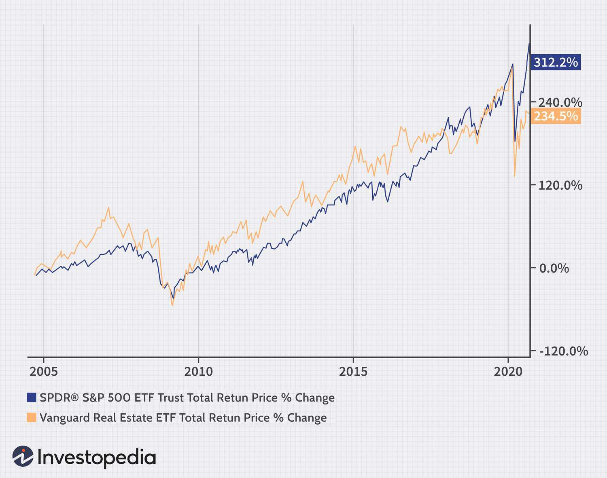

Investment strategies are continually transforming, with technology serving as a critical catalyst in these advancements. Real estate and the stock market are historically notable pathways to generating wealth. They offer unparalleled opportunities for both individual and institutional investors, seeking to diversify their portfolios and achieve financial growth.

In recent times, algorithmic trading has emerged as a transformative approach, known for its efficiency and potential to enhance investment outcomes considerably. Algorithmic trading employs complex algorithms and automated systems to execute trades at high speed and precision, minimizing the role of human intervention. This has led to increased participation in the stock market, offering a competitive edge through rapid analysis and execution.



The modern investment landscape is also impacted by global and local economic factors, technological advancements, and evolving investor preferences. Real estate, with its tangible assets, and the stock market, with its liquidity and higher average returns, have both benefited from technology-driven strategies. The infusion of algorithmic tools into these markets promises improved decision-making and optimization of investment strategies.

This article examines the performance of real estate and the stock market, focusing on how algorithmic trading has reshaped these investment areas. By understanding the technological underpinnings and market dynamics, investors can better strategize and maximize potential returns while navigating the complexities of modern investing.

## Table of Contents

## Historical Performance of Real Estate and Stock Market

The historical performance of real estate and the stock market showcases notable differences in their annualized returns over extended periods. On average, the stock market has consistently provided higher returns, yielding approximately 10% annually. This rate of return surpasses that of real estate, which typically ranges between 4% to 8%.

During specific periods, such as the Great Moderation—a time of reduced volatility and stable economic growth from the mid-1980s to 2007—real estate investments outperformed stocks. This period was characterized by low inflation and interest rates, which bolstered real estate values. However, despite these occasional outperformance periods, the stock market has generally been more profitable over the long term. 

When comparing the performances of these two investment avenues, it is essential to consider different time frames. Market conditions, economic cycles, and external factors can significantly influence returns and alter the comparative outcomes of real estate and stocks. For instance, while real estate may offer stability during economic downturns due to its tangible asset nature, the stock market often rebounds quicker due to investor confidence and market dynamics post-recession.

In quantitative analysis, such variations can be studied using various statistical measures and models to predict and compare future returns. Financial analysts and investors benefit from assessing the historical data using modern computational tools like Python to simulate potential outcomes and devise optimized investment strategies.

## Key Differences Between Real Estate and Stock Market Investments

Stocks and real estate represent two fundamentally different investment vehicles, each offering distinct characteristics and benefits to investors. While both have historically contributed to wealth accumulation, their differing properties often suit various investor needs and preferences.

Stocks are generally characterized by higher [volatility](/wiki/volatility-trading-strategies) compared to real estate. This volatility, while introducing greater risk, also offers the potential for higher returns. Stock investments benefit from [liquidity](/wiki/liquidity-risk-premium), allowing investors to quickly buy and sell shares with relative ease. This liquidity makes stocks an attractive option for those seeking to capitalize on short-term market movements or requiring quick access to their invested capital.

On the other hand, real estate investments offer tangible value and are often considered more stable. The physical nature of real estate provides a sense of security, as properties can appreciate over time due to factors like location, development, and economic conditions. This tangibility does, however, come at the cost of liquidity. Real estate transactions can be complex, time-consuming, and subject to significant transaction costs, making it a less flexible investment.

Another notable difference between stocks and real estate concerns tax treatment and ownership implications. Stocks typically involve simpler tax considerations, such as capital gains tax and dividend taxation. In contrast, real estate investments can offer tax advantages like depreciation and mortgage interest deductions, which can offset income and reduce taxable obligations. However, managing these tax benefits may require a more hands-on approach and in-depth understanding of property laws.

Furthermore, ownership of stocks generally does not involve the responsibilities associated with owning real estate, such as maintenance and property management. Investors in real estate must consider these additional costs and efforts, which can impact overall returns and risk exposure.

Overall, understanding these key differences helps investors align their choices with personal financial goals, risk tolerance, and preferences for liquidity and control.

## Understanding Algorithmic Trading

Algorithmic trading uses computer programs to execute trades according to predefined criteria. This method leverages advanced technology to automate the trading process, minimizing human intervention. By employing algorithms, traders can systematically identify patterns or trends and make trading decisions based on these findings. 

One of the primary advantages of [algorithmic trading](/wiki/algorithmic-trading) is its speed. Computers can process large volumes of data and execute orders far quicker than a human trader. This speed enables traders to capitalize on short-term market discrepancies, potentially enhancing profitability. For example, if a stock's price discrepancy arises between exchanges, algorithms can execute [arbitrage](/wiki/arbitrage) trades instantaneously, capitalizing on microsecond differences.

Efficiency is another significant benefit. Algorithms can execute trades at the most favorable prices, and they can check multiple market conditions simultaneously. This leads to reduced transaction costs and increased precision in placing orders. The continuous operation of algorithmic trading systems ensures that opportunities available during non-market hours are also captured, as these systems can function 24/7.

Algorithmic trading also reduces human error and emotional decision-making. By sticking to a programmed strategy, trades are executed purely based on logic rather than emotional reactions to market swings. This consistency helps in maintaining a disciplined approach to trading, which is crucial for long-term success.

In addition, algorithmic trading can optimize entry and [exit](/wiki/exit-strategy) points more effectively than manual trading. By analyzing historical market data, algorithms can pinpoint optimal times to enter or exit trades, potentially increasing the profitability of investments in both the stock market and real estate. For instance, an algorithm might be programmed to buy a stock if its moving average rises above a certain threshold and sell it when the price hits a predefined upper limit.

A simple example in Python to demonstrate a basic algorithmic trading strategy could involve using a moving average crossover strategy.

```python
import pandas as pd
import numpy as np

# Simple moving averages
def moving_average(data, window_size):
    return data.rolling(window=window_size).mean()

# Generate signals based on moving average crossover
def generate_signals(prices, short_window, long_window):
    signals = pd.DataFrame(index=prices.index)
    signals['price'] = prices
    signals['short_mavg'] = moving_average(prices, short_window)
    signals['long_mavg'] = moving_average(prices, long_window)
    signals['signal'] = 0.0

    # Create signals
    signals['signal'][short_window:] = np.where(
        signals['short_mavg'][short_window:] > signals['long_mavg'][short_window:], 1.0, 0.0)

    # Generate trading orders
    signals['positions'] = signals['signal'].diff()
    return signals

# Example stock prices
prices = pd.Series([100, 101, 102, 101, 105, 107, 110, 108, 107, 105])

# Generate signals
signals = generate_signals(prices, short_window=2, long_window=5)

print(signals)
```

In this example, `generate_signals` creates trading signals based on the crossing of a short-term moving average over a long-term moving average, a common method in algorithmic trading.

Algorithmic trading, through such sophisticated strategies, has become an essential tool for traders looking to improve their market strategies by leveraging technology.

## Impact of Algorithmic Trading on Real Estate and Stock Markets

Algorithmic trading has markedly influenced both the stock and real estate markets. In stock markets, algorithmic trading enhances liquidity and price efficiency by facilitating rapid execution of trades that align with market trends and investor behavior. Algorithms, equipped with high-frequency trading capabilities, can process massive volumes of data in real time. This capacity allows them to identify and exploit arbitrage opportunities quickly, thereby maintaining market liquidity. As studies suggest, increased liquidity generally results in tighter bid-ask spreads, leading to more efficient price discovery processes in stock markets (Hendershott, Jones, & Menkveld, 2011).

However, the proliferation of algorithmic trading also presents risks, such as sudden spikes in volatility. These can occur when algorithms, responding to the same market signals, trigger simultaneous transactions that exacerbate price movements. Events such as the "Flash Crash" of May 2010 exemplify how rapid, algorithm-driven transactions can lead to significant market disruptions (Kirilenko et al., 2017).

In the real estate sector, algorithmic trading, often driven by [artificial intelligence](/wiki/ai-artificial-intelligence) (AI), facilitates improved market analysis, property selection, and risk management. Algorithms can analyze diverse data sets, including property prices, economic indicators, and socio-demographic profiles, which assist investors in making informed decisions. AI models can forecast market trends and evaluate the potential growth of specific properties, thus enhancing decision-making processes in real estate investments (Bourassa et al., 2020).

Moreover, the integration of AI with algorithmic trading democratizes market participation for both individual and institutional investors. AI tools, such as robo-advisors, offer personalized investment strategies by evaluating an investor's risk tolerance and financial goals, making sophisticated trading strategies accessible to a broader audience. This integration allows investors to leverage technological advancements for better-informed investment decisions without extensive expertise in trading algorithms.

The accessibility of advanced trading tools has also led to greater competition among institutional investors, who continuously seek innovation and efficiency gains from algorithmic solutions. This dynamic drives the evolution of more sophisticated, reliable algorithms that can analyze larger datasets to predict market movements with greater accuracy.

In conclusion, while algorithmic trading contributes positively to liquidity and price efficiency in stock markets, it also introduces challenges such as volatility spikes. In real estate, AI-driven algorithms enhance market analysis and decision-making, providing strategic advantages. The widespread integration of AI with algorithmic trading tools underscores its transformative potential in both investment domains, heightening participation and competitiveness.

## Advantages and Challenges of Algorithmic Trading

Algorithmic trading, leveraging advanced computational models and technologies, offers a range of advantages that can enhance investment strategies for traders and investors alike. One of the primary benefits is speed. Algorithmic systems can execute orders in fractions of a second, capitalizing on market opportunities faster than any human trader. This rapid execution allows traders to respond instantaneously to market changes, maximizing potential gains and minimizing losses.

Efficiency is another vital advantage. Algorithms can process vast amounts of data across multiple markets and instruments simultaneously, identifying trading opportunities that might be missed by manual analysis. This capability is crucial for high-frequency trading, where the margin for error is minimal, and profits depend on the exploitation of small price discrepancies.

Consistency in executing trading strategies is enhanced through algorithmic trading. By removing human emotion and biases, algorithms ensure that trades are conducted according to predefined criteria, leading to more predictable outcomes. Traders can backtest strategies using historical data to evaluate their potential effectiveness before applying them to live markets. This process allows for the optimization of trading strategies, minimizing the risk of loss.

However, algorithmic trading is not without its challenges. Regulatory scrutiny is increasing as authorities strive to prevent market manipulation and ensure fair practice. Traders must adhere to strict regulations, which can pose a barrier to entry for new participants. Moreover, the reliance on data accuracy is paramount. Flawed or incomplete data can lead to erroneous trades and substantial financial losses.

Another significant challenge is the potential for market disruption if these algorithms malfunction or are poorly executed, which can lead to "flash crashes" or significant volatility spikes. As algorithms trade large volumes at high speeds, errors can quickly compound, affecting broader market stability. Thus, robust risk management systems and protocols are essential to mitigate these risks.

In summary, while algorithmic trading offers considerable advantages in speed, efficiency, consistency, and strategy [backtesting](/wiki/backtesting), the challenges of regulatory compliance, data accuracy, and market impact require careful navigation to fully leverage its potential.

## Future Trends in Algorithmic Trading

Advancements in artificial intelligence (AI) and [machine learning](/wiki/machine-learning) are significantly enhancing the capabilities of algorithmic trading. AI's ability to process vast amounts of data and identify patterns has transformed trading strategies, leading to more informed and timely decisions. Machine learning models, particularly those based on [deep learning](/wiki/deep-learning) techniques, are improving the precision and adaptability of algorithmic systems. These models can dynamically adjust to market changes, learning from new data continuously to refine their predictive accuracy.

Robo-advisory services and automated trading platforms are poised to gain wider acceptance, democratizing access to sophisticated trading tools that were once exclusive to large financial institutions. These platforms leverage AI to provide personalized investment advice and execute trades on behalf of users, based on algorithmically-driven assessments of risk and potential return. As these services become more intuitive and accessible, individual investors will benefit from advanced algorithms that can manage portfolios with increased efficiency.

The evolution of technology will likely make algorithmic trading more integral to investment strategies across various sectors. With the proliferation of high-frequency trading, low-latency infrastructures, and smart contracts enabled by blockchain technology, investment firms are integrating these advancements to stay competitive. Quantum computing, although still emerging, promises to accelerate complex calculations and optimizations, potentially revolutionizing trading algorithms.

Given these trends, the trading landscape is expected to evolve further, with algorithmic trading systems becoming smarter and more autonomous. Investors and firms are encouraged to stay abreast of these technological innovations to harness their full potential in strategic investment planning. As AI and machine learning continue to advance, algorithmic trading will remain a pivotal element in shaping the future of financial markets.

## Conclusion

Real estate and the stock market each offer distinct avenues for investment gains, marked by unique risks and rewards. Real estate investments often appeal to those seeking tangible assets with potential for stable, long-term appreciation, while the stock market attracts investors aiming for higher returns with greater liquidity and risk. As these financial landscapes evolve, algorithmic trading has emerged as a transformative tool, enhancing the potential for optimizing investment strategies and maximizing returns across both asset classes.

Algorithmic trading leverages computer algorithms to execute trades based on predefined criteria, offering benefits such as increased speed, efficiency, and consistency. It significantly reduces human error and emotional decision-making, allowing for precise entry and exit points that can amplify profitability. In stock markets, algorithmic trading has contributed to improved liquidity and pricing efficiency, although it also introduces challenges such as volatility spikes and regulatory scrutiny.

In real estate, the integration of AI-driven algorithmic trading facilitates advanced market analysis, property selection, and risk management. This technological advancement empowers investors to make more informed decisions, thereby enhancing their ability to capture value in a traditionally less liquid market. 

Understanding the benefits and limitations of algorithmic trading is essential for investors aiming to navigate these complex markets effectively. While the potential for increased returns and optimized strategies is significant, challenges such as data accuracy, regulatory concerns, and market impact must be carefully managed. As technology continues to advance, algorithmic trading will likely become increasingly integral to successful investment strategies, offering new opportunities and posing new questions for investors in both real estate and the stock market.

## References & Further Reading

[1]: Hendershott, T., Jones, C. M., & Menkveld, A. J. (2011). [Does Algorithmic Trading Improve Liquidity?](https://onlinelibrary.wiley.com/doi/full/10.1111/j.1540-6261.2010.01624.x) The Review of Financial Studies, 24(8), 2585–2612.

[2]: Kirilenko, A. A., Kyle, A. S., Samadi, M., & Tuzun, T. (2017). [The Flash Crash: High-Frequency Trading in an Electronic Market.](https://www.jstor.org/stable/26652722) The Journal of Finance, 72(3), 967-998.

[3]: Bourassa, S. C., Hoesli, M., & Sun, J. (2020). [The Price of Residential Land: An Empirical Analysis.](https://papers.ssrn.com/sol3/papers.cfm?abstract_id=477782) Journal of Property Investment & Finance, 38(1), 20-36.

[4]: Lopez de Prado, M. (2018). ["Advances in Financial Machine Learning"](https://www.amazon.com/Advances-Financial-Machine-Learning-Marcos/dp/1119482089). John Wiley & Sons.

[5]: Chan, E. P. (2009). ["Quantitative Trading: How to Build Your Own Algorithmic Trading Business"](https://github.com/ftvision/quant_trading_echan_book). Wiley Trading.

[6]: Jansen, S. (2020). ["Machine Learning for Algorithmic Trading"](https://github.com/stefan-jansen/machine-learning-for-trading). Packt Publishing.