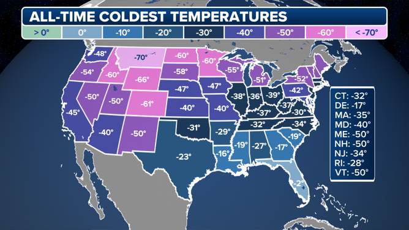

## Table of Contents

## What is considered a record low temperature?

A record low temperature is the coldest temperature ever recorded in a specific place. It is an important piece of information for scientists and weather experts because it helps them understand the climate and weather patterns of that area.

For example, the record low temperature for the entire world was -128.6 degrees Fahrenheit (-89.2 degrees Celsius) in Antarctica. This record helps scientists learn more about how cold it can get on Earth and how it affects the environment and living things.

## How are record low temperatures measured and verified?

Record low temperatures are measured using special tools called thermometers. These thermometers are placed in weather stations all around the world. When the temperature drops very low, the thermometer records the exact number. Scientists and weather experts then check these numbers to make sure they are correct. They compare the new temperature with the old record to see if it is really a new record low.

To verify a record low temperature, experts look at the data from many different sources. They make sure the thermometer was working properly and that the temperature was measured correctly. Sometimes, they even check other weather stations nearby to see if they recorded similar low temperatures. This helps them be sure that the new record is accurate and trustworthy. Once everything is checked, they can officially say that a new record low temperature has been set.

## What is the coldest temperature ever recorded on Earth?

The coldest temperature ever recorded on Earth was -128.6 degrees Fahrenheit, which is the same as -89.2 degrees Celsius. This record low temperature was measured in Antarctica at a place called Vostok Station on July 21, 1983. Antarctica is very cold because it is at the South Pole and has a lot of ice.

Scientists used a special thermometer to measure this very cold temperature. They checked the data carefully to make sure it was correct. This record helps us understand how cold it can get on our planet and how it affects the environment and living things.

## Where and when was the coldest temperature recorded?

The coldest temperature ever recorded on Earth was -128.6 degrees Fahrenheit, which is the same as -89.2 degrees Celsius. This very cold temperature was measured in Antarctica at a place called Vostok Station. Vostok Station is a research base where scientists study the weather and the environment.

This record low temperature was recorded on July 21, 1983. Scientists used a special thermometer to measure it and checked the data carefully to make sure it was correct. Antarctica is very cold because it is at the South Pole and has a lot of ice, which is why such a low temperature was possible there.

## How do record low temperatures impact local ecosystems?

Record low temperatures can have a big impact on local ecosystems. When it gets very cold, it can be hard for plants and animals to survive. Some plants might freeze and die, and animals might have trouble finding food or staying warm. For example, if a lake freezes over completely, fish and other water animals might not be able to get enough oxygen and could die. This can change the whole balance of the ecosystem because some animals depend on others for food.

In places where it gets very cold, some animals and plants have adapted to survive the cold. They might grow thicker fur or feathers, or go into hibernation to save energy. But when the temperature drops to a record low, even these adaptations might not be enough. This can lead to fewer animals and plants surviving, which can affect the whole food chain. Over time, if record low temperatures happen more often, it could change what kinds of plants and animals can live in that area.

## What are the historical trends in record low temperatures?

Over the years, scientists have been keeping track of record low temperatures all over the world. They have found that in some places, the record lows have not changed much in a long time. For example, the record low temperature in Antarctica has been the same since it was first measured in 1983. This shows that some places can stay very cold, even as the world's climate changes.

In other places, record low temperatures have been getting warmer. This is because the Earth is getting warmer overall, a process called global warming. Scientists have noticed that in many parts of the world, the coldest temperatures are not as cold as they used to be. This change can affect how plants and animals live and grow, and it can also change the weather patterns in those areas.

## How does climate change affect record low temperatures?

Climate change makes the Earth warmer overall, which can change how cold it gets in different places. Because the world is getting warmer, the coldest temperatures, or record lows, are not as cold as they used to be in many areas. This happens because the air and oceans are holding more heat, which makes it harder for temperatures to drop very low. Scientists have noticed that in many parts of the world, the record low temperatures are getting warmer over time.

Even though the Earth is getting warmer, some places can still have very cold temperatures. But these extreme cold events might happen less often because of climate change. For example, in Antarctica, the record low temperature has stayed the same since 1983, showing that some places can still be very cold. However, overall, the trend is that record low temperatures are becoming less extreme as the planet continues to warm up.

## What technologies are used to monitor and predict record low temperatures?

Scientists use special tools to keep track of how cold it gets. One important tool is the thermometer, which measures the temperature. These thermometers are placed in weather stations all over the world. They send the temperature data to computers, which help scientists see if a new record low temperature has been set. Satellites also help by taking pictures of the Earth from space. They can see where it is very cold and send that information back to scientists.

To predict record low temperatures, scientists use computers with special programs called weather models. These models use a lot of information, like the temperature, wind, and air pressure, to guess what the weather will be like in the future. By looking at this information, scientists can tell if it might get very cold soon. They can also use past weather data to see if there are patterns that might help them predict when a new record low might happen.

## How do record low temperatures vary by region and altitude?

Record low temperatures can be very different depending on where you are in the world. Some places, like Antarctica, are very cold all the time because they are at the South Pole and have a lot of ice. The record low temperature there is much colder than in other places. In places closer to the equator, it is usually warmer, so the record low temperatures are not as cold. For example, the record low temperature in Antarctica is -128.6 degrees Fahrenheit, but in a place like Singapore, it is much warmer, with a record low of about 66 degrees Fahrenheit.

Altitude also makes a big difference in how cold it can get. Higher up in the mountains, it is usually colder than at lower places. This is because the air gets thinner as you go up, and it can't hold as much heat. For example, the record low temperature at the top of Mount Everest is much colder than at the base of the mountain. So, when scientists talk about record low temperatures, they have to think about both where the place is on the Earth and how high up it is.

## What are the social and economic impacts of record low temperatures?

Record low temperatures can have big effects on people and money. When it gets very cold, people might have to stay inside to stay safe and warm. This can mean schools and businesses close, and people can't go to work or do things they usually do. This can hurt the economy because businesses lose money when they can't open. Also, when it's very cold, people use more heat to stay warm, which can make energy bills go up. If people can't pay these higher bills, it can be hard for them.

The cold can also break things like pipes and roads. When water in pipes freezes, it can make the pipes break, which can be expensive to fix. Roads can get icy and dangerous, which can lead to car accidents and more money spent on fixing roads. In places where it doesn't usually get very cold, people might not be ready for it, so the damage can be even worse. Governments and communities have to spend money to help people and fix things after a very cold spell, which can be a big cost.

## How have record low temperatures been used in historical climatology studies?

Scientists who study the climate use record low temperatures to learn about the past. They look at old records to see how cold it got in different places over time. This helps them understand if the Earth is getting warmer or colder. For example, if they see that record lows are not as cold as they used to be, it might mean the Earth is getting warmer. This information can also help them see if there are patterns in the weather that happen over many years.

In historical climatology, record low temperatures are important because they can show big changes in the climate. Scientists compare these records with other information, like tree rings and ice cores, to get a full picture of the past climate. By studying these records, they can learn about big events like ice ages or warm periods in history. This helps them predict what might happen to the climate in the future and how it might affect people and nature.

## What are the future projections for record low temperatures based on current climate models?

Climate scientists use special computer programs called climate models to guess what might happen with temperatures in the future. These models show that because of climate change, the Earth is getting warmer. This means that record low temperatures might not be as cold as they used to be in many places. The models predict that the coldest temperatures we see will slowly get warmer over time. This is because the air and oceans are holding more heat, which makes it harder for temperatures to drop very low.

Even though the Earth is getting warmer, some places can still have very cold temperatures. But these extreme cold events might happen less often because of climate change. For example, in places like Antarctica, the record low temperature might stay the same for a long time because it is already very cold there. But overall, the trend is that record low temperatures will become less extreme as the planet continues to warm up. This change can affect how plants and animals live and grow, and it can also change the weather patterns in different areas.

## How can weather data be leveraged in algorithmic trading?

Weather data has rapidly emerged as a critical asset for investors looking to maintain a competitive edge in ever-evolving and efficient markets. The integration of these meteorological insights into [algorithmic trading](/wiki/algorithmic-trading) frameworks allows for a novel approach to predicting market fluctuations, particularly in sectors like energy and agricultural commodities. With the advent of advanced analytics and access to real-time climate data, traders can construct sophisticated predictive models that accurately depict potential market behaviors.

One key strategy in leveraging weather data is the integration with algorithmic trading models geared towards understanding demand dynamics. For instance, energy markets are susceptible to climate variations; colder temperatures can increase heating demand, while hotter temperatures can elevate cooling requirements. Traders can capitalize on these patterns by incorporating temperature forecasts into their trading algorithms to anticipate energy demand surges and dips. An example formula used might be:

$$
\text{Demand Index} = \alpha \times \text{Temperature Anomaly} + \beta
$$

where $\alpha$ and $\beta$ are coefficients determined through historical data analysis.

In the agricultural sector, weather forecasts directly influence the prediction of crop yields. This, in turn, affects the prices of commodities like wheat, corn, and soybeans. By integrating precipitation and temperature forecasts, traders can refine their predictions of harvest sizes and adjust their futures contracts accordingly. Machine learning techniques provide a robust framework for this integration, with models such as time series forecasting and neural networks offering precise market predictions based on past weather-pattern data.

Python, a preferred language for such tasks, offers extensive libraries such as Pandas for data manipulation and Sci-kit Learn for implementing [machine learning](/wiki/machine-learning) algorithms. A simple example of using Python to predict agricultural market changes could involve:

```python
import pandas as pd
from sklearn.model_selection import train_test_split
from sklearn.ensemble import RandomForestRegressor

# Load weather and commodity prices data
data = pd.read_csv('weather_commodity_dataset.csv')

# Features might include temperature, precipitation, and other climatic indicators
X = data[['temperature', 'precipitation']]
y = data['commodity_price']

# Split the data into training and test sets
X_train, X_test, y_train, y_test = train_test_split(X, y, test_size=0.2, random_state=42)

# Initialize and train the Random Forest model
model = RandomForestRegressor(n_estimators=100, random_state=42)
model.fit(X_train, y_train)

# Prediction
predictions = model.predict(X_test)
```

This example demonstrates how traders can employ statistical methods alongside machine learning techniques to process vast quantities of weather data, thereby strategically aligning their investments with anticipated market shifts. Such integration transforms traditional trading paradigms, enabling investors to exploit the nuanced interplay between weather conditions and market dynamics, ultimately optimizing their investment strategies.

## References & Further Reading

[1]: Alonso, A. M., & Peña, D. (2019). ["Weather Trading: Trading Algorithms Based on Weather Changes."](https://pmc.ncbi.nlm.nih.gov/articles/PMC8672459/) Journal of Applied Econometrics, 34(7), 1107-1124.

[2]: Lopez de Prado, M. (2018). ["Advances in Financial Machine Learning."](https://www.amazon.com/Advances-Financial-Machine-Learning-Marcos/dp/1119482089) Wiley.

[3]: Jansen, S. (2018). ["Machine Learning for Algorithmic Trading: Predictive models to extract signals from market and alternative data for systematic trading strategies with Python."](https://github.com/stefan-jansen/machine-learning-for-trading) Packt Publishing.

[4]: Aronson, D. (2006). ["Evidence-Based Technical Analysis: Applying the Scientific Method and Statistical Inference to Trading Signals."](https://www.amazon.com/Evidence-Based-Technical-Analysis-Scientific-Statistical/dp/0470008741) Wiley.

[5]: Chan, E. P. (2009). ["Quantitative Trading: How to Build Your Own Algorithmic Trading Business."](https://github.com/ftvision/quant_trading_echan_book) Wiley.

[6]: Campello, M., Gao, J., & Jiang, W. (2020). ["Weather-Induced Mood, Institutional Investors, and Stock Returns: A Systematic Approach."](https://www.sciencedirect.com/science/article/pii/S0925527324003335) Review of Financial Studies, 33(2), 1116-1142.