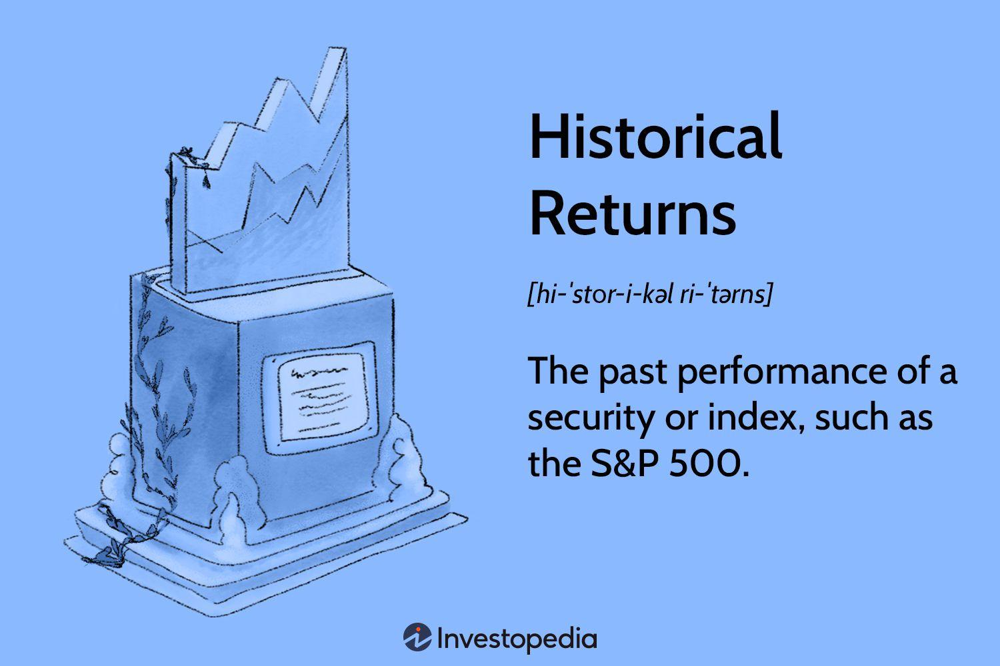

## Table of Contents

## What are historical returns?

Historical returns are the profits or losses that an investment has made over a certain period in the past. When people talk about historical returns, they are usually looking at how well an investment, like a stock or a mutual fund, has done over time. For example, if you bought a stock and it went up in value over five years, the historical return would show how much money you made during those five years.

These returns are important because they help investors understand how an investment has performed in the past. By looking at historical returns, people can get an idea of how risky an investment might be and how much they could potentially earn. However, it's important to remember that past performance doesn't guarantee future results. Just because an investment did well in the past doesn't mean it will do well in the future.

## Why are historical returns important for investors?

Historical returns are important for investors because they give a clear picture of how an investment has done in the past. When someone is thinking about putting their money into something, like a stock or a fund, they want to know if it has made money before. By looking at historical returns, investors can see if the investment has gone up or down over time. This helps them understand if the investment might be a good choice for them.

Another reason historical returns are important is that they help investors figure out how risky an investment might be. If an investment's value has jumped around a lot in the past, it might be more risky. On the other hand, if it has grown steadily, it might be less risky. Knowing this can help investors decide if they are comfortable with the level of risk. But, it's always good to remember that just because something did well in the past, it doesn't mean it will do well in the future.

## How do you calculate historical returns for a single investment?

To calculate the historical return for a single investment, you need to know the starting value and the ending value of the investment over a certain period. Let's say you bought a stock for $100 and after one year, it was worth $110. To find the historical return, you subtract the starting value from the ending value, which gives you $10. Then, you divide that by the starting value ($100) and multiply by 100 to get a percentage. In this case, the historical return would be ($110 - $100) / $100 * 100 = 10%.

If you want to calculate the historical return over multiple periods, like several years, you need to consider the effect of compounding. For example, if that same stock was worth $120 after the second year, you would calculate the return for each year separately and then combine them. The first year's return was 10%, and the second year's return would be ($120 - $110) / $110 * 100 = about 9.09%. To get the total historical return over the two years, you would use the formula for compound growth: (1 + 0.10) * (1 + 0.0909) - 1 = about 20.09%. This tells you the total growth over the two years, taking into account that the investment grows on top of the previous year's gains.

## What is the difference between nominal and real returns?

Nominal returns are the total amount of money you make from an investment without taking inflation into account. If you buy a stock for $100 and it goes up to $110 in a year, your nominal return is 10%. This is the basic way to see how much your money grew, but it doesn't tell you if your money's value changed because of inflation.

Real returns, on the other hand, show how much your investment grew after adjusting for inflation. Inflation is when the prices of things go up over time, which can make your money worth less. To find the real return, you take the nominal return and subtract the inflation rate. If the inflation rate was 2% in the year your stock went up to $110, your real return would be 10% - 2% = 8%. This gives you a better idea of how much your money's value actually increased.

## How can historical returns be used to assess investment risk?

Historical returns help investors see how risky an investment might be. By looking at the past performance of an investment, like a stock or a fund, investors can see if the value has gone up and down a lot or stayed pretty steady. If the value has been jumping around a lot, it means the investment is more risky. For example, if a stock's value goes from $100 to $150 and then back to $100 in a short time, it's a sign that the investment can be unpredictable and risky.

On the other hand, if an investment's value grows slowly but steadily over time, it might be less risky. Investors can use historical returns to calculate something called [volatility](/wiki/volatility-trading-strategies), which is a measure of how much the investment's value changes. High volatility means more risk, while low volatility means less risk. By understanding these patterns in historical returns, investors can decide if they are comfortable with the level of risk before they put their money into an investment.

## What are common time periods used for calculating historical returns?

People usually look at historical returns over different time periods to see how an investment has done. Some common time periods are one year, three years, five years, and ten years. A one-year return shows how the investment did in the last year. Three-year and five-year returns give a better idea of how the investment has performed over a medium amount of time. Ten-year returns are used to see how the investment did over a long time, which can be helpful for understanding long-term trends.

Each of these time periods can tell investors something different about the investment. A one-year return might show how the investment reacted to recent events, like a big change in the market. Three-year and five-year returns can help investors see if the investment has been growing steadily or if it's been up and down a lot. Ten-year returns can show how the investment has done through different economic cycles, which can be important for planning for the future.

## How do you calculate the annualized return from historical data?

To calculate the annualized return from historical data, you need to know the total return of the investment over a certain period and how many years that period covers. Let's say you invested $1,000 and after 3 years, it grew to $1,300. The total return would be ($1,300 - $1,000) / $1,000 = 0.30 or 30%. To find the annualized return, you use the formula: (1 + total return)^(1/number of years) - 1. For our example, it would be (1 + 0.30)^(1/3) - 1 = about 0.091 or 9.1%. This means your investment grew by about 9.1% each year, on average.

Annualized returns are useful because they help you see how well your investment did each year, even if you held it for more than one year. This makes it easier to compare different investments over different time periods. If you had another investment that grew 20% over 2 years, its annualized return would be (1 + 0.20)^(1/2) - 1 = about 0.095 or 9.5%. By comparing the annualized returns, you can see which investment did better on a yearly basis.

## What is the significance of geometric vs. arithmetic returns in historical analysis?

Geometric returns and arithmetic returns are two ways to look at how an investment did over time. Geometric returns, also called compound returns, show the average growth rate of an investment over many years. They take into account that the money you earn in one year can earn more money in the next year. So, if you have an investment that grows a lot one year and loses a lot the next year, the geometric return will show you the true average growth, considering the ups and downs. This is really important if you want to know how your investment will grow over a long time.

Arithmetic returns, on the other hand, are simpler. They just add up the returns from each year and then divide by the number of years to get an average. This method doesn't consider that the money you earn can earn more money later. So, arithmetic returns can make an investment look better than it really is, especially if the returns change a lot from year to year. For short periods or when you want a quick idea of how an investment did, arithmetic returns can be okay. But if you're planning for the long term, geometric returns give a more accurate picture of what to expect.

## How can historical returns be adjusted for inflation?

To adjust historical returns for inflation, you need to find out the inflation rate for the time period you're looking at. Let's say you made a 10% return on your investment in one year, but the inflation rate was 2% that year. To get the real return, you subtract the inflation rate from the nominal return. So, in this case, your real return would be 10% - 2% = 8%. This tells you how much your money actually grew, after accounting for the fact that prices went up.

Adjusting for inflation is important because it gives you a more accurate picture of how well your investment did. If you only look at the nominal return, you might think your money grew more than it really did. For example, if you earned 5% on your investment but inflation was 3%, your real return is only 2%. This helps you understand if your investment kept up with the rising costs of things or if it actually lost value in terms of what you can buy with it.

## What are the limitations of using historical returns for predicting future performance?

Historical returns can give you a good idea of how an investment did in the past, but they don't tell you exactly what will happen in the future. This is because the future can be different from the past. Things like new laws, big events in the world, or changes in how people spend money can make an investment go up or down in ways that you can't predict just by looking at old data. So, while historical returns can help you see patterns and risks, they can't guarantee that an investment will do the same thing again.

Another problem with using historical returns to predict the future is that they don't show everything that might affect an investment. For example, if a company's stock did well in the past, it might not do well if the company gets a new leader who makes bad choices, or if a new competitor comes along. Also, the economy can change in big ways that historical data can't predict. So, while historical returns are useful, they are just one piece of the puzzle when you're trying to guess what might happen next with your investments.

## How do you calculate historical returns for a portfolio of investments?

To calculate historical returns for a portfolio of investments, you need to know the value of each investment at the beginning and end of the time period you're looking at. First, figure out how much each investment grew or shrank during that time. For example, if you have three investments and one grew by 10%, another by 5%, and the last one lost 2%, you need to find out how much each one contributed to your overall portfolio. You do this by multiplying the return of each investment by the percentage of your portfolio it makes up. If the first investment is 40% of your portfolio, its contribution to the total return would be 10% times 40%, which is 4%.

Once you have the contribution from each investment, add them all together to get the total return for your portfolio. In our example, if the second investment is 30% of your portfolio, its contribution would be 5% times 30%, which is 1.5%. The third investment, if it's 30% of your portfolio, would contribute -2% times 30%, which is -0.6%. Adding these up, 4% from the first investment, 1.5% from the second, and -0.6% from the third, gives you a total portfolio return of 4% + 1.5% - 0.6% = 4.9%. This way, you can see how your whole portfolio did over the time period you chose.

## What advanced statistical methods can be used to analyze historical returns data?

Advanced statistical methods can help you understand historical returns better. One common method is regression analysis, which looks at how different things, like the overall stock market or interest rates, affect your investment's returns. This can show you if your investment goes up or down because of these factors. Another method is time series analysis, which looks at how returns change over time. This can help you see patterns, like if returns are usually higher in some months or if they go up and down in a cycle. These methods can give you a deeper understanding of how your investment behaves and what might affect it.

Another useful method is Monte Carlo simulation, which uses random numbers to see how different situations could affect your investment's returns. This helps you see all the possible outcomes and how likely they are. For example, it can show you how your investment might do in a bad economy or if the stock market crashes. Lastly, there's risk-adjusted performance measures like the Sharpe Ratio, which looks at how much return you get for the risk you take. A higher Sharpe Ratio means you're getting more return for the risk you're taking, which can help you compare different investments and see which one is better after considering how risky they are.

## What are historical returns?

Historical returns refer to the past performance of an investment, typically expressed as a percentage gain or loss over a specified period. Calculating historical returns involves determining the percentage change in the value of an investment from an initial point to a subsequent point. This calculation often includes both the appreciation in the price of the asset and any additional returns accrued from dividends or interest. The formula for calculating the basic return on investment (ROI) is:

$$
\text{ROI} = \left( \frac{\text{Final Value} - \text{Initial Value} + \text{Income}}{\text{Initial Value}} \right) \times 100
$$

Historical returns serve as a critical tool for investors and financial analysts because they provide empirical data to assess past performance. They allow stakeholders to gauge how well a particular security or portfolio has performed relative to expectations and benchmarks. Historical performance is often used as a benchmark against which future investment decisions and portfolio allocations are made.

Additionally, historical returns are invaluable when making predictions about future price movements. Although past performance is not always indicative of future results, historical data can provide insights into potential future behavior, especially when employing statistical models, [machine learning](/wiki/machine-learning) algorithms, or technical analysis techniques. Investors frequently use historical data to identify trends, cycles, and patterns that may recur.

Securities and indexes such as the S&P 500 are often linked to discussions of historical returns. The S&P 500, composed of 500 of the largest publicly traded companies in the United States, is widely regarded as a gauge of the overall U.S. equity market performance. Historical returns of the S&P 500 are frequently cited as a benchmark for evaluating the performance of both mutual funds and individual stocks.

For example, if an investor purchased shares of a stock for $100 and sold those shares a year later for $120, in addition to receiving $5 in dividends, the historical return would be calculated as follows:

$$
\text{ROI} = \left( \frac{120 - 100 + 5}{100} \right) \times 100 = 25\%
$$

This return reflects both capital appreciation and income from dividends, providing a comprehensive picture of the investment's historical performance. By understanding historical returns, investors can gain insight into the potential risks and rewards associated with different investment options, allowing for more informed financial decision-making.

## What are the methods for calculating historical returns?

Calculating historical returns is an essential process in financial analysis, providing investors and analysts with insights into the past performance of securities and other investments. This section outlines the methods for calculating historical returns, emphasizing the use of percentages for expressing returns, the concept of annualized returns, and real-world examples demonstrating these calculations.

### Step-by-Step Process of Calculating Historical Returns

Historical returns of an asset are typically calculated by determining the percentage change in price over a specific period. The basic formula for calculating the simple return is:

$$
\text{Return} = \frac{P_{\text{end}} - P_{\text{begin}}}{P_{\text{begin}}} \times 100
$$

where $P_{\text{end}}$ is the asset's price at the end of the period, and $P_{\text{begin}}$ is the price at the beginning.

#### Example Calculation

Consider an asset with a starting price of $100 and an ending price of $120 over a one-year period:

$$
\text{Return} = \frac{120 - 100}{100} \times 100 = 20\%
$$

This indicates a 20% return over the period.

### Use of Percentages to Express Returns

Expressing returns as percentages allows for easy comparison across different assets and time periods. It standardizes the performance metric, making it independent of the initial investment amount. This percentage change is a critical component when comparing the performance of different investments or assessing the return against benchmarks, such as the S&P 500.

# to Annualized Historical Returns

Annualizing returns involves converting a return over any time period into an annual return, allowing for more straightforward comparisons. The annualized return can be computed using geometric average for compounding effects over multiple periods. The formula is:

$$
\text{Annualized Return} = \left( (1 + \text{Total Return})^{\frac{1}{n}} \right) - 1
$$

where $\text{Total Return}$ is the product of the return over each period, and $n$ is the number of years.

#### Example Calculation

Suppose an asset has a total return of 44% over three years. The annualized return would be calculated as follows:

$$
\text{Annualized Return} = \left( (1 + 0.44)^{\frac{1}{3}} \right) - 1 \approx 0.1296 \text{ or } 12.96\%
$$

This shows that the asset grew at an average annual rate of 12.96% over the three-year period.

### Real-World Examples

To better understand historical return calculations, consider the example of a stock index like the S&P 500. If the S&P 500 index grew from 2,500 to 3,000 over a single year, the return would be:

$$
\text{Return} = \frac{3000 - 2500}{2500} \times 100 = 20\%
$$

If we want to annualize a multi-year return of 50% over five years, the calculation would be:

$$
\text{Annualized Return} = \left( (1 + 0.50)^{\frac{1}{5}} \right) - 1 \approx 0.0845 \text{ or } 8.45\%
$$

These calculations show how historical returns are not only about understanding past performance but are also critical for predicting future potential and creating sound investment strategies.

## What are the Advanced Techniques in Historical Data Analysis?

The analysis of historical data is pivotal for constructing robust financial models and strategies. Advanced techniques, particularly those involving statistical and machine learning frameworks, play an essential role in extracting valuable insights from historical data.

Statistical models, such as regression analysis, are employed to discern patterns and relationships between different financial variables. Multiple regression, for instance, can assess how an asset's returns are influenced by several independent variables, such as interest rates or economic indicators. The formula for multiple regression is:

$$
Y = \beta_0 + \beta_1X_1 + \beta_2X_2 + ... + \beta_nX_n + \epsilon
$$

where $Y$ is the dependent variable (e.g., asset returns), $\beta_0$ is the intercept, $\beta_1, \beta_2, ..., \beta_n$ are the coefficients for each independent variable $X_1, X_2, ..., X_n$, and $\epsilon$ is the error term.

Machine learning models have gained prominence due to their ability to handle vast datasets and uncover complex, non-linear relationships. Algorithms such as decision trees, random forests, and support vector machines (SVMs) are utilized for classifying financial data and predicting future trends. A popular technique, neural networks, can identify patterns not easily visible through traditional models. An example of a Python implementation using a [neural network](/wiki/neural-network) for historical price prediction might involve libraries like TensorFlow or PyTorch.

Technical analysis capitalizes on historical price and [volume](/wiki/volume-trading-strategy) data to forecast future price movements. This approach uses various indicators, like moving averages and relative strength index (RSI), to identify trends, [momentum](/wiki/momentum), and potential reversal points. The moving average, a common indicator, is defined as:

$$
MA_t = \frac{1}{n} \sum_{i=0}^{n-1} P_{t-i}
$$

where $MA_t$ is the moving average at time $t$, $P_{t-i}$ is the price at time $t-i$, and $n$ is the number of periods considered.

The implementation of historical data analysis is enhanced through various software and tools that streamline data processing and model building. Python, with its extensive libraries like NumPy, pandas, and scikit-learn, provides a robust environment for data manipulation and analysis. Additionally, platforms such as R and MATLAB offer specialized capabilities for statistical computing and visualization.

In summary, advanced techniques in historical data analysis leverage statistical models, machine learning approaches, and technical analysis to empower financial analysts with the tools needed for informed decision-making. As technology advances, these methodologies will continue to evolve, offering more refined and precise insights.

## References & Further Reading

[1]: Bergstra, J., Bardenet, R., Bengio, Y., & Kégl, B. (2011). ["Algorithms for Hyper-Parameter Optimization."](https://papers.nips.cc/paper/4443-algorithms-for-hyper-parameter-optimization) Advances in Neural Information Processing Systems 24.

[2]: ["Advances in Financial Machine Learning"](https://www.amazon.com/Advances-Financial-Machine-Learning-Marcos/dp/1119482089) by Marcos Lopez de Prado

[3]: ["Evidence-Based Technical Analysis: Applying the Scientific Method and Statistical Inference to Trading Signals"](https://www.amazon.com/Evidence-Based-Technical-Analysis-Scientific-Statistical/dp/0470008741) by David Aronson

[4]: ["Machine Learning for Algorithmic Trading"](https://github.com/stefan-jansen/machine-learning-for-trading) by Stefan Jansen

[5]: ["Quantitative Trading: How to Build Your Own Algorithmic Trading Business"](https://www.amazon.com/Quantitative-Trading-Build-Algorithmic-Business/dp/1119800064) by Ernest P. Chan