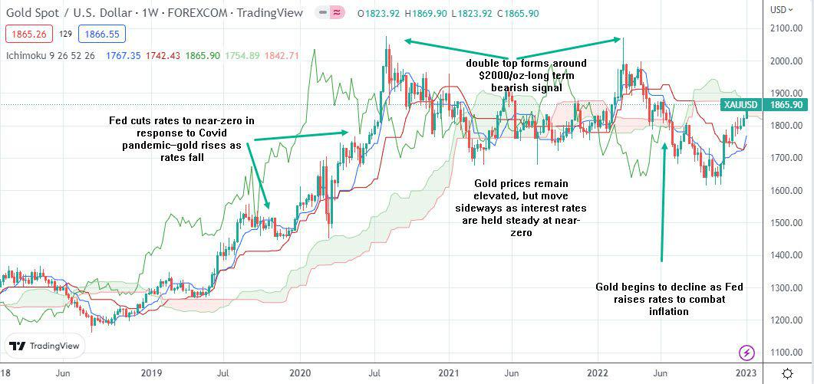

Gold has long been considered a symbol of wealth and power, captivating humanity through centuries. Its intrinsic value, based on its rarity and physical properties, has persisted throughout economic booms and busts. Ancient civilizations, such as the Egyptians and Incas, revered gold not only for its decorative beauty but as a spiritual and societal asset. This affinity for gold has facilitated its transition into a widely accepted form of currency and a standard measure of wealth.

In the financial world, gold occupies a unique position as a durable, non-corrosive precious metal that remains a preferred investment vehicle. Its stability acts as a hedge against inflation and economic instability, retaining its status as a safe-haven asset during times of fiscal crisis. Furthermore, gold's utility extends beyond finance into various industrial applications, including electronics, dentistry, and aerospace, due to its non-reactivity and excellent conductivity.



With technological advancements, algorithmic trading has revolutionized the trading of gold and other precious metals. These automated systems utilize complex algorithms to analyze market patterns and execute trades, often outperforming traditional trading methods. The efficiency gained from algorithmic trading allows participants to capitalize on market trends and manage risks with unprecedented precision.

Algorithmic traders frequently use the gold-silver ratio—a crucial metric in the precious metals market—to guide trading decisions. This ratio provides insights into the relative value of gold and silver, signaling potential market opportunities. The algorithmic strategies based on this ratio enable traders to optimize entry and exit points and adapt to fluctuating market conditions in real time.

As financial markets grow more sophisticated, the relevance of gold remains entrenched in modern investment portfolios. Traders and investors must continuously adapt and refine their algorithmic strategies to effectively navigate the complexities of a dynamic financial landscape.

## Table of Contents

## Historical Significance of Gold

Gold's allure can be traced back to ancient civilizations such as the Egyptians and Incas, where it was esteemed for its beauty and rarity. These early societies valued gold not only as a material for crafting intricate jewelry and artifacts but also as a symbol of power and divine favor. The Egyptians, for instance, buried their pharaohs with vast quantities of gold, reflecting its significance in their culture and its association with eternal life.

As time progressed, gold's role evolved from that of a decorative material to a widely accepted form of currency and a standard measure of wealth. Its inherent qualities, such as malleability, resistance to tarnish, and scarcity, made it an ideal medium for economic exchange. By the time of the Greek and Roman empires, gold coins were in circulation, serving as a fundamental component of these civilizations' economic structures.

The adoption of the gold standard in the 19th century marked a pivotal moment in the history of global finance. Under this system, the value of a country's currency was directly linked to a specific quantity of gold, ensuring stability and uniformity in international trade. The gold standard facilitated an era of economic growth and predictability, as it provided a reliable framework for exchanging goods and settling debts between nations. 

However, the gold standard era faced significant challenges, particularly during periods of economic strain such as World War I and the Great Depression. These events exposed the limitations of rigidly tying currencies to gold reserves, leading to its eventual decline. Throughout the mid-20th century, countries began to phase out the gold standard in favor of fiat currency systems, which allowed for more flexible monetary policies. Despite the transition to fiat systems, gold continues to hold an intrinsic value, sustaining its status as a reliable store of wealth.

## Gold as a Precious Metal

Gold, distinguished by its physical and chemical properties, stands as a prominent precious metal in today's financial markets. Its enduring appeal is attributed to its durability, resistance to corrosion, and rarity—characteristics that have sustained its demand across centuries. 

Gold's role as a hedge against inflation and economic instability is well-documented. Its value tends to remain stable or even appreciate when fiat currencies are devalued or during periods of economic turmoil. This makes it a reliable safe-haven asset for investors seeking to preserve wealth. Historical data illustrates that during times of fiscal crisis, such as the 2008 global financial crisis, gold prices often increase as investors flock to its stability in contrast to volatile stock markets. 

In addition to its financial attributes, gold is indispensable in industrial applications. Its excellent conductivity and resistance to corrosion make it a valuable component in electronics, where it is used in connectors, switch and relay contacts, and semiconductor devices. In aerospace, gold is employed in satellite and spacecraft circuitry due to its reliable conductivity and reflective properties, which can shield sensitive components from radiation. Dentistry also benefits from gold's biocompatibility and malleability, with gold alloys serving as materials for crowns, bridges, and orthodontic appliances.

The unique combination of gold's investment appeal and industrial utility ensures its sustained demand and significance in the global market.

## The Emergence of Algorithmic Trading in Precious Metals

Algorithmic trading has transformed the landscape of precious metal investments, including gold, by leveraging powerful computational techniques to automate and enhance trading activities. This approach utilizes algorithms—sets of rules or instructions for solving problems or completing tasks—which are programmed to analyze vast amounts of market data, detect patterns, and make trading decisions with high speed and efficiency.

The introduction of [algorithmic trading](/wiki/algorithmic-trading) in precious metals is closely tied to advancements in computing power and data processing capabilities. These technologies enable algorithms to scour extensive datasets, identifying trends and opportunities that might be invisible to the human eye. By doing so, algorithmic systems can execute trades faster than traditional manual methods, thus securing optimal prices and minimizing the impact of market [volatility](/wiki/volatility-trading-strategies).

Algorithmic trading systems employ complex strategies that are crafted to exploit market inefficiencies. A common strategy involves statistical [arbitrage](/wiki/arbitrage), where algorithms seek to take advantage of price discrepancies between related assets—such as different gold futures contracts—or between the spot price of gold and derivative instruments. These strategies are driven by predictive modeling, which forecasts future price movements based on historical data and statistical indicators.

Risk management is another critical aspect improved by algorithmic trading. Algorithms can incorporate various risk assessment tools and techniques to evaluate and mitigate potential losses. These tools can adjust trading volumes, stop-loss orders, and leverage ratios in real-time, responding dynamically to changing market conditions. Such precision in risk management is often unattainable through conventional trading methods.

The efficiency of algorithmic trading is further enhanced by [machine learning](/wiki/machine-learning), where algorithms are not only predetermined but also adaptive. Machine learning models can learn from past trades, continuously refining their strategies based on new data inputs. For instance, a machine learning algorithm could analyze historical correlations between gold prices and macroeconomic indicators, adapting its trading strategy as these relationships evolve.

Overall, the convergence of algorithmic trading and precious metals markets showcases a significant shift towards automation and data-driven decision-making. As technology continues to evolve, the role of algorithms in optimizing trading performance and reducing risks in volatile markets is expected to become increasingly prominent. 

By capitalizing on algorithmic trading, traders in the precious metals markets can gain a competitive edge, leveraging the efficiency, speed, and analytical prowess of sophisticated algorithms.

## The Gold-Silver Ratio in Algorithmic Trading

The gold-silver ratio is a critical metric in the precious metals market, offering insights into the relative value between gold and silver. Historically, this ratio has facilitated an understanding of market dynamics and investor sentiment toward these metals. It represents the number of ounces of silver required to purchase one ounce of gold, serving not just as a measure of value but also as a tool for trading strategies.

The appeal of utilizing the gold-silver ratio within algorithmic trading lies in its ability to signal potential price shifts and market trends. Algorithmic traders leverage this ratio to pinpoint optimal entry and [exit](/wiki/exit-strategy) points in the market. A relatively high gold-silver ratio might suggest that silver is undervalued compared to gold, potentially signaling a buying opportunity for silver or a selling opportunity for gold. Conversely, a low ratio could imply gold is undervalued, indicating a purchase opportunity for gold or the need to offload silver investments.

Implementing algorithmic trading systems that focus on the gold-silver ratio requires a combination of historical analysis and real-time data processing. These systems utilize sophisticated algorithms to monitor fluctuations in the gold-silver ratio, enabling traders to react swiftly to market changes.

For example, in Python, traders might set up algorithms that monitor the ratio using data streams from financial APIs. Here's a basic illustration of such an algorithm:

```python
import requests

def fetch_gold_price():
    # Example API call to fetch gold price
    response = requests.get('https://api.example.com/gold-price')
    return response.json().get('price')

def fetch_silver_price():
    # Example API call to fetch silver price
    response = requests.get('https://api.example.com/silver-price')
    return response.json().get('price')

def calculate_gold_silver_ratio(gold_price, silver_price):
    return gold_price / silver_price

def main():
    gold_price = fetch_gold_price()
    silver_price = fetch_silver_price()
    ratio = calculate_gold_silver_ratio(gold_price, silver_price)

    print(f"Current gold-silver ratio: {ratio}")
    # Define strategy based on ratio
    if ratio > historical_high_threshold:
        print("Consider buying silver or selling gold")
    elif ratio < historical_low_threshold:
        print("Consider buying gold or selling silver")

# historical thresholds need to be determined from past data analysis
historical_high_threshold = 80
historical_low_threshold = 50

if __name__ == "__main__":
    main()
```

Fluctuations in the gold-silver ratio offer valuable signals about prevailing market sentiment and underlying supply-demand dynamics. Algorithmic systems that are tuned to respond to these fluctuations can capitalize on emerging opportunities, adjusting their strategies to maximize profitability. Employing such algorithms provides traders with a competitive edge by automating the decision-making process, reducing latency, and enhancing the ability to react to market movements promptly.

## Backtesting and Strategy Development

Backtesting is a critical component in the development of algorithmic trading strategies, allowing traders to evaluate the potential success of their strategies using historical data. This process involves simulating trades as they would have occurred in the past, offering insights into a strategy's profitability and risk profile without risking actual capital. By analyzing past market conditions, traders can observe how different strategies might perform under various scenarios, providing an essential tool for identifying weaknesses and strengths.

To conduct [backtesting](/wiki/backtesting) effectively, traders often make use of advanced software and programming languages such as Python. Python offers numerous financial libraries, such as Pandas and NumPy, which are instrumental in processing large datasets and performing statistical analyses. A simple backtesting script in Python might involve initializing a strategy, running it against historical data, and collecting performance metrics. These metrics often include key performance indicators such as cumulative returns, Sharpe ratio, and maximum drawdown.

```python
import pandas as pd
import numpy as np

# Example: Simple moving average crossover strategy
def backtest_strategy(data, short_window, long_window):
    signals = pd.DataFrame(index=data.index)
    signals['price'] = data['price']
    signals['short_mavg'] = data['price'].rolling(window=short_window, min_periods=1).mean()
    signals['long_mavg'] = data['price'].rolling(window=long_window, min_periods=1).mean()
    signals['signal'] = 0.0
    signals['signal'][short_window:] = np.where(signals['short_mavg'][short_window:] > signals['long_mavg'][short_window:], 1.0, 0.0)
    signals['positions'] = signals['signal'].diff()
    return signals

# Assume 'data' is a DataFrame with historical price data
results = backtest_strategy(data, short_window=40, long_window=100)
```

Beyond coding and data analysis, backtesting involves testing a variety of parameters to optimize strategy performance. This could include adjusting technical indicators, entry and exit conditions, and risk management rules. By iterating on these parameters, traders aim to develop algorithms that can perform consistently across different market regimes.

Effective backtesting provides traders with confidence in deploying their strategies in live markets. It ensures that the strategy is robust and not merely a result of market data fitting, which could lead to overfitting – a common pitfall where a strategy performs well on historical data but fails in real-market conditions due to its lack of adaptability.

The ultimate goal of backtesting and strategy development is to build reliable trading systems that can withstand the volatility and complexity of financial markets. Continuous refinement and testing are essential, as market dynamics are ever-changing, requiring traders to adapt their strategies accordingly. This disciplined approach enables traders to mitigate risks and enhance their chances of success in the competitive world of algorithmic trading.

## Conclusion

Gold has remained a cornerstone in investment portfolios due to its historical significance and enduring value. Its status as a symbol of wealth and a reliable store of value has persisted through changing economic conditions and financial innovations. The intrinsic characteristics of gold, such as its durability, rarity, and universal acceptance, continue to attract investors looking for stability and security.

Algorithmic trading has emerged as a transformative tool in precious metals markets, offering traders the ability to enhance both efficiency and profitability. By using advanced algorithms, traders can capitalize on market trends and execute decisions with precision. One of the key strategies in algorithmic trading involves leveraging the gold-silver ratio, which provides valuable insights into the relative value of these two metals. This ratio can highlight potential opportunities for entry and exit points, helping traders make informed decisions.

In a rapidly evolving financial landscape, traders must continuously adapt and refine their algorithms to address the complexities of dynamic markets. This involves incorporating real-time data, testing various scenarios through backtesting, and optimizing risk management techniques. The goal is to ensure robustness and efficacy across diverse trading conditions, enabling traders to maintain a competitive edge and achieve sustainable success.

## Frequently Asked Questions (FAQs)

What makes gold a valuable investment?

Gold's value as an investment is underpinned by several inherent characteristics that have been recognized for centuries. Firstly, its physical properties—such as density, malleability, and resistance to corrosion—make it ideal for crafting durable and aesthetically appealing objects, thereby sustaining demand across various uses. Additionally, gold serves as a safe-haven asset; during periods of economic uncertainty or inflation, investors often flock to gold to preserve wealth, as it tends to retain value better than many other assets. Historically, gold's scarcity and universal recognition as a form of currency have bolstered its status as a reliable store of value, independent of any single nation's economic policies. Furthermore, its limited supply, with new production constrained by mining capacities, often places gold in an advantageous position compared to fiat currencies, which can be subject to inflationary pressures from overproduction.

How does the gold-silver ratio inform trading decisions?

The gold-silver ratio is a metric used to determine how many ounces of silver are needed to purchase one ounce of gold. It is calculated as:

$$
\text{Gold-Silver Ratio} = \frac{\text{Price of Gold (per ounce)}}{\text{Price of Silver (per ounce)}}
$$

This ratio provides insights into the relative valuation between gold and silver, assisting traders in identifying potentially overvalued or undervalued conditions in the precious metals markets. If the ratio is historically high, it may suggest that silver is undervalued relative to gold, prompting traders to consider buying silver. Conversely, a low ratio could imply that gold is undervalued. Algorithmic traders utilize this ratio to drive automated trading strategies, analyzing historical averages and current market conditions to identify optimal entry and exit points. By exploiting deviations from historical norms, traders can potentially profit from reversion trends, enhancing the effectiveness of their trading initiatives.

What are the advantages of using algorithmic trading in precious metals markets?

Algorithmic trading presents multiple advantages in the context of precious metals markets, including speed, precision, and the ability to process large volumes of data. Algorithms can execute trades orders of magnitude faster than human traders, capitalizing on fleeting market opportunities that might otherwise be missed. This speed allows algorithms to take advantage of real-time price movements and exploit arbitrage opportunities across different markets or instruments. Moreover, algorithmic systems can analyze complex datasets, identifying patterns and trends that may not be immediately apparent through manual analysis. These systems also enhance risk management by permitting the backtesting of strategies under historical market conditions, helping traders optimize their approaches before deployment. Furthermore, algorithms reduce the emotional component of trading, ensuring decisions are driven by data and predefined criteria rather than human biases or reactions to market volatility. This systematic approach enhances consistency and can lead to more reliable trading outcomes over time.

## References & Further Reading

For further insights into the topics discussed in this article, consider exploring a range of literature and resources that can deepen your understanding of gold and precious metals trading, as well as algorithmic trading strategies. 

1. **History of the Gold-Silver Ratio**: To understand how the gold-silver ratio has evolved and its impact on trading strategies, you might explore historical analyses and economic studies. The U.S. Geological Survey reports and publications by the World Gold Council often provide valuable data and interpretations.

2. **Algorithmic Trading Strategies**: Books such as "Algorithmic Trading: Winning Strategies and Their Rationale" by Ernie Chan and "Quantitative Trading: How to Build Your Own Algorithmic Trading Business" by Dr. Ernie Chan offer comprehensive guides on developing and implementing algorithmic trading systems.

3. **Precious Metals Investment Frameworks**: Essential readings could include "The New Case for Gold" by James Rickards and "Gold and Silver: Updated and Expanded" by Michael Maloney, which provide insights into investing in gold and other precious metals as part of a diversified portfolio.

4. **Online Resources**: Websites such as Investopedia provide articles and tutorials on gold markets, precious metals investments, and algorithmic trading techniques. Additionally, the CME Group’s educational resources cover futures and options trading in the metals markets.

5. **Academic Journals**: Journals like the Journal of Finance and the Journal of Commodity Markets occasionally publish papers focusing on the technical aspects of trading and market analysis, including studies on precious metals.

Engaging with these resources can offer a more nuanced understanding of the dynamics in precious metals trading and the role played by sophisticated trading strategies in modern financial markets.