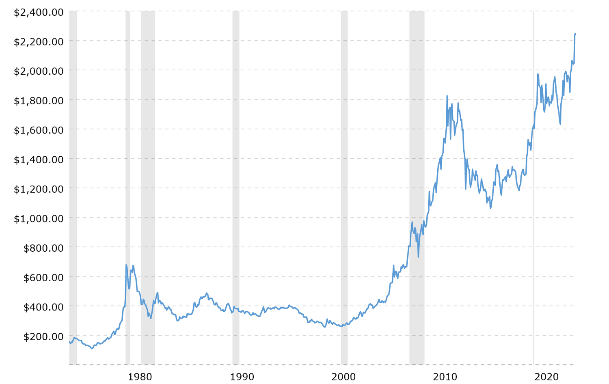

## Table of Contents

## What is gold and why has it been valued throughout history?

Gold is a shiny, yellow metal that people have loved for a long time. It is found in the ground and is very heavy. Gold does not rust or change color, so it lasts a long time. It is also soft, which means it can be shaped into different things like jewelry and coins.

People have valued gold throughout history because it is rare and beautiful. In many cultures, gold was used as money because it was easy to carry and hard to fake. Kings and queens wore gold to show they were important. Even today, people still use gold for jewelry and as a way to save money because it keeps its value over time.

## How was gold first discovered and used by ancient civilizations?

Gold was first discovered by ancient people who found shiny, yellow pieces of it in rivers and streams. They noticed that gold was heavy and did not rust, so it was different from other rocks and metals. These early humans started using gold to make simple jewelry and decorations. They would hammer the gold into shapes because it was soft and easy to work with.

As civilizations grew, people learned more about gold. Ancient Egyptians, for example, used gold in their art and to make beautiful jewelry. They believed gold was the skin of their gods and used it in religious ceremonies. The Egyptians also made gold coins, which helped them trade with other places. In other parts of the world, like ancient Mesopotamia and China, people also started using gold for money and to show wealth and power. Over time, gold became very important in many cultures because it was rare and lasted a long time.

## What role did gold play in the economies of ancient empires like Egypt and Rome?

In ancient Egypt, gold was very important for the economy. The Egyptians used gold to make coins, which they used to buy and sell things. These gold coins made trading easier because everyone agreed on the value of gold. Gold was also used to pay for big projects like building pyramids. Because gold was rare and shiny, it showed that the pharaohs were rich and powerful. People from other lands wanted to trade with Egypt to get their gold, which helped the economy grow.

In ancient Rome, gold played a big role in the economy too. The Romans used gold coins called 'aureus' for money. These coins helped the Romans trade with other countries and keep their empire strong. Gold was also used to pay soldiers and build roads and buildings. Just like in Egypt, having a lot of gold showed that Rome was a rich and powerful empire. The Romans even had special places called mints where they made their gold coins. This helped control the economy and made sure everyone trusted their money.

## How did gold influence trade routes and exploration during the Age of Discovery?

During the Age of Discovery, gold was a big reason why explorers went out to find new places. Countries like Spain and Portugal wanted to find new sources of gold to make their countries richer. They heard stories about places far away that had lots of gold, like the Americas. So, they sent explorers like Christopher Columbus to find these places. When explorers found gold in the new lands, it made more people want to go there. This led to the creation of new trade routes across the Atlantic Ocean.

Gold also changed how people traded with each other. When explorers found gold in the Americas, they brought it back to Europe. This gold helped European countries trade with each other and with other parts of the world. The gold from the Americas made Spain very rich and powerful. It also made other countries want to find their own gold, so they started exploring Africa and Asia too. These new trade routes and explorations changed the world, connecting different places and cultures in new ways.

## What was the impact of the gold standard on global economies in the 19th and 20th centuries?

The gold standard was a system where countries used gold to back up their money. In the 19th and early 20th centuries, many countries used this system. It helped make trade between countries easier because everyone agreed on the value of gold. If a country's money was backed by gold, people trusted it more. This made the world economy more stable. Countries could trade with each other without worrying about their money losing value. For example, if Britain wanted to buy things from the United States, they could use gold-backed money, and both countries knew it was worth the same amount.

However, the gold standard also had problems. It made it hard for countries to control their own economies. If a country didn't have enough gold, it couldn't print more money, even if it needed to. This could lead to economic problems like recessions. During the Great Depression in the 1930s, many countries stopped using the gold standard because it made their economic problems worse. By the mid-20th century, most countries had moved away from the gold standard. Today, countries use other ways to manage their money and economies, but the gold standard had a big impact on how global trade and economies worked for many years.

## How has the perception and use of gold changed from ancient times to the modern era?

From ancient times to the modern era, the way people see and use gold has changed a lot. In ancient times, gold was very special because it was rare and shiny. People used it to make jewelry and coins. Ancient Egyptians thought gold was the skin of their gods and used it in religious ceremonies. In Rome and other places, gold coins helped people trade with each other. Gold showed that a country or a person was rich and powerful. It was also used to pay for big projects like building pyramids and roads.

In the modern era, gold is still valued, but people use it in different ways. While it is still used for jewelry and as a way to save money, gold is also used in technology. It's in things like computers and cell phones because it conducts electricity well. The gold standard, where countries backed their money with gold, was used for a long time but stopped in the 20th century. Now, gold is seen more as an investment. People buy and sell gold like they do with stocks. Even though it's not used for money like it used to be, gold is still seen as something safe to invest in because it keeps its value over time.

## What are some key historical events that significantly affected the value of gold?

One big event that changed the value of gold was the discovery of gold in California in 1848. This started the California Gold Rush, where lots of people rushed to California to find gold. Because so much gold was found, the price of gold went down for a while. But the rush also made more people want gold, so over time, the value went back up. This event showed how finding new gold can change its value.

Another important time was during the Great Depression in the 1930s. Many countries were using the gold standard, where their money was backed by gold. But during the depression, people started to lose trust in banks and wanted their money in gold instead. This made the value of gold go up a lot. Countries like the United States had to stop using the gold standard because it was making their economic problems worse. This showed how big economic events can affect the value of gold.

In the 1970s, another big change happened when the United States stopped linking the dollar to gold. Before this, other countries could exchange their dollars for gold. When the U.S. stopped this, it made the value of gold go up because people were not sure about the value of money anymore. This event showed how changes in how countries manage their money can affect the value of gold.

## How do geopolitical events influence the price and demand for gold today?

Geopolitical events can make the price of gold go up and down. When there is trouble or uncertainty in the world, like wars or big political changes, people often want to buy gold. They think of gold as a safe place to put their money because it keeps its value even when other things are risky. For example, if there is a big conflict in a country that makes people worried about their money, they might buy more gold. This extra demand can push the price of gold up.

Also, when countries put rules or sanctions on each other, it can affect the price of gold. If a country that makes a lot of gold has sanctions put on it, it might be harder to get that gold. This can make the price go up because there is less gold available. On the other hand, if a big event makes people think the world is getting safer, they might sell their gold and buy other things. This can make the price of gold go down. So, what happens in the world can really change how much people want gold and what they are willing to pay for it.

## What is the relationship between gold and inflation, and how has this relationship evolved historically?

Gold and inflation have always been connected. When prices go up a lot, which is called inflation, people often buy more gold. They think of gold as a way to keep their money safe because gold usually keeps its value even when prices are going up. In the past, when countries used the gold standard, the amount of money they could print was tied to how much gold they had. This helped keep inflation under control because if a country didn't have more gold, it couldn't make more money.

Over time, the way gold and inflation work together has changed. When countries stopped using the gold standard in the 20th century, they could print more money without needing more gold. This made inflation different, but people still saw gold as a good way to protect their money from inflation. Today, when inflation goes up, the price of gold often goes up too. People buy gold because they think it will keep its value better than money that is losing value because of inflation. So, even though the gold standard is gone, gold is still seen as a safe place to put money when prices are rising.

## How do central banks' policies affect the global gold market?

Central banks' policies can have a big impact on the global gold market. When central banks change interest rates or print more money, it can affect how much gold people want to buy. If a central bank lowers interest rates, borrowing money becomes cheaper, and people might invest in things like gold instead of keeping their money in the bank. Also, if a central bank prints more money, it can lead to inflation, and people might buy gold to protect their money from losing value.

Central banks also buy and sell gold themselves, which can change the price of gold. If a central bank decides to buy a lot of gold, it can make the price go up because there is more demand. On the other hand, if a central bank sells a lot of its gold, it can make the price go down because there is more gold available. So, what central banks do with their policies and their own gold can really affect how much gold costs and how much people want to buy it around the world.

## What are the current trends in gold investment and how do they compare to historical patterns?

Today, people still see gold as a good way to invest their money, but how they do it is a bit different from the past. Right now, a lot of people are buying gold in small amounts, like through gold exchange-traded funds (ETFs) or digital gold platforms. These ways let people invest in gold without having to buy and store physical gold. Also, more people are using gold as a way to protect their money from things like inflation or big changes in the world. This is similar to how people used gold in the past, but now it's easier and more people can do it.

Historically, people bought gold to make money or to show they were rich. In ancient times, gold was used for coins and jewelry, and it showed power and wealth. During the gold standard, people used gold to back up their money, which helped control inflation. Today, while gold is still used for jewelry and as a way to save money, it's also seen as a safe investment. People buy gold when they're worried about the economy or when they want to spread out their investments. So, while the reasons for investing in gold are similar to the past, the ways people do it and how many people can do it have changed a lot.

## What future scenarios could impact the historical significance and value of gold?

In the future, many things could change how important and valuable gold is. If there are big changes in the world, like new wars or big economic problems, people might want to buy more gold. They would see gold as a safe place to put their money, just like they do now. Also, if new technology finds more gold or makes it easier to get, there could be more gold around. This might make the price of gold go down because it's not as rare anymore. On the other hand, if countries start using gold in new ways, like in space travel or new kinds of technology, the demand for gold might go up and make it more valuable.

Another thing that could change the value of gold is if people start using different kinds of money. Right now, we use paper money and digital money, but in the future, we might use something else. If a new kind of money becomes very popular and people trust it more than gold, they might not want to buy gold as much. But if the new money doesn't work well, people might go back to gold because it's been trusted for a long time. So, the future of gold depends a lot on what happens in the world and how people decide to use their money.

## What are Frequently Asked Questions (FAQs)?

What makes gold a valuable investment?

Gold's value as an investment is underpinned by several inherent characteristics that have been recognized for centuries. Firstly, its physical properties—such as density, malleability, and resistance to corrosion—make it ideal for crafting durable and aesthetically appealing objects, thereby sustaining demand across various uses. Additionally, gold serves as a safe-haven asset; during periods of economic uncertainty or inflation, investors often flock to gold to preserve wealth, as it tends to retain value better than many other assets. Historically, gold's scarcity and universal recognition as a form of currency have bolstered its status as a reliable store of value, independent of any single nation's economic policies. Furthermore, its limited supply, with new production constrained by mining capacities, often places gold in an advantageous position compared to fiat currencies, which can be subject to inflationary pressures from overproduction.

How does the gold-silver ratio inform trading decisions?

The gold-silver ratio is a metric used to determine how many ounces of silver are needed to purchase one ounce of gold. It is calculated as:

$$
\text{Gold-Silver Ratio} = \frac{\text{Price of Gold (per ounce)}}{\text{Price of Silver (per ounce)}}
$$

This ratio provides insights into the relative valuation between gold and silver, assisting traders in identifying potentially overvalued or undervalued conditions in the precious metals markets. If the ratio is historically high, it may suggest that silver is undervalued relative to gold, prompting traders to consider buying silver. Conversely, a low ratio could imply that gold is undervalued. Algorithmic traders utilize this ratio to drive automated trading strategies, analyzing historical averages and current market conditions to identify optimal entry and [exit](/wiki/exit-strategy) points. By exploiting deviations from historical norms, traders can potentially profit from reversion trends, enhancing the effectiveness of their trading initiatives.

What are the advantages of using [algorithmic trading](/wiki/algorithmic-trading) in precious metals markets?

Algorithmic trading presents multiple advantages in the context of precious metals markets, including speed, precision, and the ability to process large volumes of data. Algorithms can execute trades orders of magnitude faster than human traders, capitalizing on fleeting market opportunities that might otherwise be missed. This speed allows algorithms to take advantage of real-time price movements and exploit [arbitrage](/wiki/arbitrage) opportunities across different markets or instruments. Moreover, algorithmic systems can analyze complex datasets, identifying patterns and trends that may not be immediately apparent through manual analysis. These systems also enhance risk management by permitting the [backtesting](/wiki/backtesting) of strategies under historical market conditions, helping traders optimize their approaches before deployment. Furthermore, algorithms reduce the emotional component of trading, ensuring decisions are driven by data and predefined criteria rather than human biases or reactions to market [volatility](/wiki/volatility-trading-strategies). This systematic approach enhances consistency and can lead to more reliable trading outcomes over time.

## References & Further Reading

For further insights into the topics discussed in this article, consider exploring a range of literature and resources that can deepen your understanding of gold and precious metals trading, as well as algorithmic trading strategies. 

1. **History of the Gold-Silver Ratio**: To understand how the gold-silver ratio has evolved and its impact on trading strategies, you might explore historical analyses and economic studies. The U.S. Geological Survey reports and publications by the World Gold Council often provide valuable data and interpretations.

2. **Algorithmic Trading Strategies**: Books such as "Algorithmic Trading: Winning Strategies and Their Rationale" by Ernie Chan and "Quantitative Trading: How to Build Your Own Algorithmic Trading Business" by Dr. Ernie Chan offer comprehensive guides on developing and implementing algorithmic trading systems.

3. **Precious Metals Investment Frameworks**: Essential readings could include "The New Case for Gold" by James Rickards and "Gold and Silver: Updated and Expanded" by Michael Maloney, which provide insights into investing in gold and other precious metals as part of a diversified portfolio.

4. **Online Resources**: Websites such as Investopedia provide articles and tutorials on gold markets, precious metals investments, and algorithmic trading techniques. Additionally, the CME Group’s educational resources cover futures and options trading in the metals markets.

5. **Academic Journals**: Journals like the Journal of Finance and the Journal of Commodity Markets occasionally publish papers focusing on the technical aspects of trading and market analysis, including studies on precious metals.

Engaging with these resources can offer a more nuanced understanding of the dynamics in precious metals trading and the role played by sophisticated trading strategies in modern financial markets.

