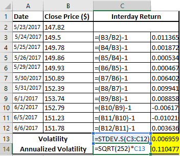

Volatility plays a pivotal role in financial markets by shaping investment decisions and guiding risk management strategies. In financial terms, volatility refers to the degree of variation in the price of a financial instrument over time, reflecting the level of uncertainty or risk about the size of changes in an asset's value. Understanding and analyzing volatility is crucial for market participants as it helps in assessing potential risks and rewards associated with investment choices.

This article focuses on historical volatility, a specific type of volatility measurement that considers past price movements to estimate future price variability. Historical volatility represents the fluctuation of an asset's returns over a predefined period using statistical methods. It is a key indicator for evaluating the past behavior of security prices and serves as a foundation for more complex risk assessment models in financial analysis.



Accurate calculation of historical volatility allows investors and traders to make informed decisions, adjust portfolios, and optimize their strategies. By examining the standard deviation of logarithmic returns, market participants can better understand market dynamics and tailor their approaches to align with their risk tolerance and investment goals.

In algorithmic trading, historical volatility plays a significant role by informing risk management practices and refining trading algorithms. High-frequency traders, in particular, leverage volatility to enhance algorithm parameters, ensuring more efficient trade execution. Given the inherent complexities and rapid changes in financial markets, mastering the calculation and application of historical volatility remains indispensable for traders and investors aiming to enhance their decision-making processes.

## Table of Contents

## Understanding Historical Volatility

Historical volatility quantifies the degree to which an asset's returns fluctuate over a defined period, using statistical methods. It captures the past behavior of security prices, which is crucial for assessing risks associated with investments. By analyzing historical volatility, investors can discern patterns and trends that indicate the potential volatility of future prices. Volatility is a measure of risk; hence, understanding its historical values helps in forecasting and managing investment risks more effectively.

The computation of historical volatility involves the standard deviation of an asset’s returns over a specific period. The standard deviation provides insight into the [dispersion](/wiki/dispersion-trading) of returns, which reflects the level of uncertainty or risk in the price movement of a security. A higher standard deviation indicates greater volatility, thus suggesting a riskier asset.

Historical [volatility](/wiki/volatility-trading-strategies) is particularly significant because it offers a retrospective view of how volatile an asset has been, allowing investors to gauge its stability or riskiness. It is instrumental in risk management and investment planning by providing a benchmark against which current or expected volatility can be compared. This past data aids in developing asset pricing models, managing portfolios, and setting hedging strategies.

The volatility measure can guide investors in anticipating potential rewards linked to their investment decisions. When assessing market risks, investors might opt for high volatility assets to achieve greater potential returns, albeit with increased risk. Conversely, they may seek low volatility assets for more stable, though possibly lower, returns.

In sum, historical volatility serves as a vital instrument in financial analysis by measuring the extent of price variability. It supports investors and traders in assessing risks and forecasting future asset price movements, thereby serving as a foundational element in informed decision-making.

## Calculating Historical Volatility

Historical volatility is a statistical measure used to capture the movement in an asset's price over a specific timeframe. The standard approach to calculate historical volatility is by employing the standard deviation of the logarithmic returns of the asset's price. This method provides a more accurate representation of percentage change, especially for financial time series.

To calculate historical volatility, follow these key steps:

1. **Compute Daily Returns**: Identify the asset prices for the period under consideration. Calculate the daily returns using the formula: 
$$
   R_t = \ln\left(\frac{P_t}{P_{t-1}}\right)

$$
   where $R_t$ is the daily logarithmic return on day $t$, $P_t$ is the price of the asset on day $t$, and $P_{t-1}$ is the price on the previous day.

2. **Calculate the Average Return**: Determine the average of these logarithmic returns over the selected period.

3. **Determine Standard Deviation**: Measure the dispersion of returns by calculating their standard deviation. The formula is:
$$
   \sigma = \sqrt{\frac{1}{N-1} \sum_{t=1}^{N} (R_t - \bar{R})^2}

$$
   where $\sigma$ represents the standard deviation, $N$ is the number of observations (days), and $\bar{R}$ is the average return computed in the previous step.

4. **Annualize the Volatility**: Translate the period-specific volatility to an annualized metric to facilitate easy comparison across various assets or indices. If daily returns are used, annualize by multiplying by the square root of the number of trading days in a year (usually $\sqrt{252}$ for standard financial markets):
$$
   \text{Annualized Volatility} = \sigma \times \sqrt{252}

$$

### Implementation in Excel and Python

**Excel**: In Excel, users can compute logarithmic returns in a column next to the price data and employ built-in formulas like `=AVERAGE(range)` for mean and `=STDEV(range)` for standard deviation. Annualization can be performed using simple multiplication.

**Python**: Here's a simplified code example using Python with the popular libraries pandas and numpy:

```python
import pandas as pd
import numpy as np

# Assume df is a pandas DataFrame with a column 'Price'
df['Log_Returns'] = np.log(df['Price'] / df['Price'].shift(1))
mean_return = df['Log_Returns'].mean()
std_dev = df['Log_Returns'].std()

annualized_volatility = std_dev * np.sqrt(252)
print(f"Annualized Volatility: {annualized_volatility}")
```

This code snippet calculates the logarithmic returns of an asset's price, computes their standard deviation, and annualizes the result. By automating these calculations in software tools like Excel or using programs like Python, traders and analysts can efficiently assess historical volatility, enhancing their understanding of market behavior and supporting informed decision-making.

## Volatility in Financial Analysis

Analyzing volatility is crucial for financial analysis as it provides insights into market dynamics and the risk profiles of securities. Historical volatility, which measures the variability of an asset's returns over time, can be a powerful tool in this regard. By examining historical volatility, traders and investors can customize their strategies to better handle market fluctuations.

One practical application of historical volatility is in determining stop-loss levels. Traders set stop-loss orders at specific price points to limit potential losses from adverse price movements. Historical volatility offers a statistical basis for placing these orders by estimating the expected variability in an asset's price. A high level of volatility might suggest wider stop-loss thresholds to accommodate larger price swings, whereas lower volatility could lead to tighter stops.

Position sizing is another area where historical volatility comes into play. Optimal position sizes can be calculated by considering the volatility of the underlying asset. More volatile assets, implying greater potential for price fluctuation, may necessitate smaller position sizes to manage risk, while less volatile assets might permit larger positions.

Trading frequency can also be influenced by volatility analysis. Assets with higher historical volatility levels often require more frequent monitoring and potentially faster trading responses, capitalizing on rapid price changes. Conversely, less volatile assets may allow a more passive trading approach, with fewer trades and less frequent analysis required.

Historical comparisons of an asset's volatility allow traders and investors to set expectations for future market behavior. By evaluating volatility over various periods, it is possible to identify normal or baseline levels of price variation. Deviations from these normal levels can be indicative of changing market conditions or upcoming price shifts, guiding investment decisions accordingly.

Through leveraging historical volatility, market participants can refine their risk management strategies and investment frameworks, leading to enhanced decision-making capabilities.

## Role of Historical Volatility in Algorithmic Trading

Algorithmic trading frequently depends on historical volatility as a vital component for risk management and refining trading strategies. Volatility provides essential insights into the unpredictability of asset prices, allowing algorithmic models to adjust their approaches dynamically. High-frequency traders, in particular, benefit from utilizing historical volatility metrics to enhance trade execution by tailoring algorithm parameters to the current market environment.

For instance, when markets experience elevated levels of volatility, algorithms can be adjusted to either increase trading frequency or modify position sizes to capitalize on price swings. Conversely, during periods of low volatility, the models might reduce trading activity to avoid potential losses in a stagnant market. This adaptability is crucial for maintaining competitive advantages and achieving optimal trading outcomes.

Volatility influences not just the execution of trades but also the design and development of algorithmic models. By incorporating historical volatility data, developers can calibrate algorithms to differentiate between normal and exceptional market conditions. This can be particularly effective in developing strategies that are robust to varied market scenarios, thus reducing the risk of substantial losses.

In [algorithmic trading](/wiki/algorithmic-trading), two primary measures of volatility are frequently applied: historical volatility and implied volatility. Historical volatility is backward-looking, calculated based on past price data, typically through standard deviation. Implied volatility, on the other hand, is forward-looking, derived from the prices of options markets. While historical volatility provides insights into long-term price trends, it can be effectively paired with implied volatility to provide a comprehensive understanding of future expectations and risks.

Moreover, using historical volatility as a benchmarking tool allows traders to assess the extremity of current market conditions relative to historical norms. This benchmarking can prevent overfitting—that is, tailoring a strategy too closely to past data at the expense of future applicability—a common pitfall in algorithmic trading strategy development.

Python, a popular language for algorithmic trading, offers simple tools to incorporate historical volatility calculations. The `pandas` library, for instance, can be used to compute the standard deviation of asset returns over a specified period to determine historical volatility. Here's an example of such a calculation:

```python
import pandas as pd
import numpy as np

# Assume 'df' is a DataFrame with daily closing prices of an asset
df['returns'] = df['close'].pct_change()
historical_volatility = np.std(df['returns']) * np.sqrt(252)  # Annualized volatility

print(f"Historical Volatility: {historical_volatility:.2%}")
```

Understanding and effectively harnessing historical volatility enables traders to fine-tune their algorithms, employ proactive risk measures, and adjust to changing market dynamics, thereby playing a critical role in the success of algorithmic trading strategies.

## Challenges in Using Historical Volatility

When utilizing historical volatility in financial analysis, several challenges can arise due to the nature and behavior of financial markets. A primary concern is the sensitivity of historical volatility to the chosen time frame. Since historical volatility is calculated based on past data, the length of the period selected for measurement can significantly influence the outcome. For instance, using short time frames may produce highly variable results, while longer periods might smooth out fluctuations, potentially masking more recent trends or anomalies.

Furthermore, the non-stationarity of financial data presents another significant challenge. Financial markets are dynamic, with statistical properties such as mean and variance changing over time. This non-stationarity means that historical volatility might not consistently represent future risk, as past patterns don't necessarily predict future behaviors. The dynamic and unpredictable nature of markets can lead to errors in forecasting future volatility using historical data.

External shocks or unforeseen market events, such as geopolitical tensions or economic announcements, can drastically and swiftly alter volatility levels. Such events are unpredictable and can introduce significant noise into volatility calculations, which could lead to inaccurate risk assessments.

Traders must also be vigilant about the risk of overfitting their strategies to historical data. Overfitting occurs when a model is too closely tailored to past trends, rendering it inefficient or ineffective in new, unseen market conditions. To mitigate this risk, traders can employ robust statistical techniques and incorporate broader data sets into their analyses.

Utilizing historical volatility effectively requires an acknowledgment of these challenges and a strategic approach to overcoming them. By adopting adaptive models that account for changes in market dynamics, traders can improve their ability to anticipate future volatility and adjust their strategies accordingly.

## Conclusion

Historical volatility (HV) is a fundamental component in financial markets, serving as a crucial tool for both risk management and strategy development. It quantifies the degree of variation in an asset's prices over time, enabling traders and investors to better understand potential risks and returns associated with their financial decisions. Despite its importance, HV has some inherent limitations, primarily due to its backward-looking nature. It relies on past data to project future price movements, which may not always account for unforeseen market dynamics or abrupt external shocks.

To mitigate these limitations, historical volatility is often combined with other indicators and analytical tools, enhancing trading performance by providing a more comprehensive market view. For instance, pairing HV with implied volatility, which reflects market expectations of future volatility derived from options prices, can offer a balanced insight into both past market behavior and future predictions. Additionally, incorporating technical indicators like moving averages, Relative Strength Index (RSI), or Bollinger Bands can assist traders in making more informed decisions.

As financial markets continue to evolve, with increasing complexity and the influence of technological advancements, the mastery of volatility calculation remains imperative for traders. Understanding and accurately calculating volatility not only aids in developing effective trading strategies but also enhances the ability to navigate fluctuating market conditions successfully. Therefore, while historical volatility may have limitations, its strategic combination with other market indicators will continue to be an integral part of informed decision-making and risk assessment in trading practices.

## References & Further Reading

[1]: Hull, J. C. (2015). "Options, Futures, and Other Derivatives" (9th Edition). Pearson. 

[2]: Andersen, T. G., Bollerslev, T., Christoffersen, P. F., & Diebold, F. X. (2006). ["Volatility and Correlation Forecasting."](https://www.nber.org/papers/w8160) In Handbook of Economic Forecasting (Vol. 1, pp. 777-878). 

[3]: Cont, R. (2001). ["Empirical Properties of Asset Returns: Stylized Facts and Statistical Issues."](http://rama.cont.perso.math.cnrs.fr/pdf/empirical.pdf) Review of Financial Studies, 15(1), 1-29.

[4]: Hull, J. C., & White, A. (1998). ["Incorporating Volatility Updating into the Historical Simulation Method for Value at Risk."](https://www.researchgate.net/publication/2645882_Incorporating_volatility_updating_into_the_historical_simulation_method_for_VaR) Journal of Risk, 1(1), 5-19.

[5]: Taleb, N. N. (2007). "The Black Swan: The Impact of the Highly Improbable." Random House.

[6]: Poon, S.-H., & Granger, C. W. J. (2003). ["Forecasting Volatility in Financial Markets: A Review."](https://www.aeaweb.org/articles?id=10.1257/002205103765762743) Journal of Economic Literature, 41(2), 478-539.