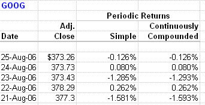

In recent years, algorithmic trading has emerged as a dominant force in financial markets, leveraging technology and data analytics for precise trading strategies. This approach automates trading decisions using complex algorithms to evaluate a multitude of market variables quickly and efficiently. The speed and precision of algorithmic trading provide a competitive edge in the fast-paced trading environment, allowing for instant execution of trades, which maximizes profit potential and minimizes human error.

Central to the success of these strategies is effective risk management, which involves systematically assessing potential risks and estimating their impact on future outcomes. Algorithmic trading strategies need to incorporate robust risk assessment mechanisms to safeguard against market volatility, liquidity shortages, and operational errors that could have detrimental effects on financial portfolios. These systems must dynamically factor in real-time data and emerging trends to adjust trading strategies accordingly.



This article focuses on the role of risk assessment, future risk estimation, and historical volatility in algorithmic trading. Risk assessment helps in identifying the potential threats to financial strategies, while historical volatility offers insights into past price fluctuations, providing a baseline for predicting future market behaviors. Future risk estimation builds on these insights to forecast potential market scenarios, integrating statistical techniques and data analytics.

We will explore how these elements come together to inform trading decisions and enhance profitability. By employing sophisticated risk management techniques, traders can not only protect themselves from adverse market events but also optimize their trading strategies to achieve better returns. Special emphasis will be placed on Monte Carlo analysis, a statistical methodology extensively used in algorithmic trading. Monte Carlo simulations allow traders to model various market conditions and assess the potential risks and returns of trading strategies, offering a probabilistic perspective that aids in making informed decisions.

Additionally, we will examine the tools and techniques used, such as value at risk (VaR), stress testing, artificial intelligence, and machine learning, which further augment the capabilities of algorithmic trading systems. Together, these strategies and tools ensure that traders maintain a competitive and adaptive stance in a continually evolving marketplace.

## Table of Contents

## Understanding Risk Assessment in Algo Trading

Risk assessment in algorithmic trading is a critical process that involves the systematic identification and analysis of factors that could potentially compromise the effectiveness of trading strategies. This involves evaluating a myriad of risks such as market volatility, liquidity shortages, and operational errors, which can all impact financial outcomes.

Market [volatility](/wiki/volatility-trading-strategies) represents the frequency and magnitude of price movements in financial markets, which is a crucial consideration for algorithmic traders. Fluctuations can affect not just the immediate price of an asset but also overall market sentiment, thereby influencing trading strategies that rely on short-term price changes.

Liquidity risk, another significant concern, refers to the difficulty in executing transactions without causing significant price shifts. A lack of market [liquidity](/wiki/liquidity-risk-premium) can result in slippages, where the executed price differs from the expected price, negatively affecting trade profitability.

Operational risk encompasses potential failures in processes, people, or systems. In the context of [algorithmic trading](/wiki/algorithmic-trading), this often includes algorithm errors, data feed issues, and hardware malfunctions. Given the reliance on technology, robust systems and safeguards are necessary to mitigate these risks.

Predicting potential scenarios that might harm financial portfolios is essential for effective risk assessment. This involves not just recognizing existing threats but also modeling potential future conditions that could arise from unforeseen market movements or external events.

Quantification of risks allows traders to set realistic performance benchmarks and harmonize trading strategies with their risk tolerance levels. This can be achieved using mathematical and statistical models that estimate potential losses based on historical data and current market conditions. For example, the Value at Risk (VaR) model is commonly used to estimate the maximum potential loss over a specified time frame with a given level of confidence.

```python
# Example of a simple VaR calculation using Python
import numpy as np

# Assuming a portfolio with a monthly return of 1% and a standard deviation of 5%
mu = 0.01  # Expected return
sigma = 0.05  # Standard deviation

# Define the confidence level, e.g., 95%
confidence_level = 0.95

# Calculate the VaR
z_score = np.percentile(np.random.randn(10000), (1 - confidence_level) * 100)
var = mu + z_score * sigma
print(f"Value at Risk (VaR): {var:.2%}")
```

Aligning trading strategies with quantified risks ensures that traders are appropriately compensated for the risks they take on. This alignment is crucial not only for individual trades but also for maintaining the overall integrity and performance of the trading portfolio.

## Historical Volatility: Gauging Future Risk

Historical volatility is a statistical measure that reflects the degree of variability or fluctuations in the price of an asset over a specified period. It serves as an integral tool for estimating future risk, even though it may not guarantee accurate predictions of market movements. By examining past price changes, investors can develop a baseline to understand the potential amplitude of future price swings.

To calculate historical volatility, the standard deviation of past price returns is typically used. This method provides insight into the [dispersion](/wiki/dispersion-trading) of past price values around their mean, indicative of the asset's past volatility. The formula for the standard deviation of historical returns is:

$$
\sigma = \sqrt{\frac{\sum_{i=1}^{N}(R_i - \overline{R})^2}{N-1}}
$$

where $\sigma$ is the historical volatility, $R_i$ is the return for a given period $i$, $\overline{R}$ is the average return, and $N$ is the number of periods.

By leveraging historical volatility, investors can infer risk levels associated with different assets. A higher historical volatility suggests that the asset's price has experienced significant swings in the past, which may imply higher risk. Conversely, lower historical volatility indicates relatively stable prices.

Investors often employ historical volatility metrics when deciding on the allocation of capital to various assets. By understanding the past fluctuations in price, they can better assess the risk-return profile of an asset. This process involves weighing potential returns against the associated risks, thus aiding in the strategic distribution of resources within a financial portfolio. As such, historical volatility remains an essential metric for traders and investors seeking to navigate financial uncertainty effectively.

## Monte Carlo Analysis in Risk Estimation

Monte Carlo analysis serves as a statistical technique designed to model and simulate the probability of different outcomes within a stochastic process, offering significant utility in algorithmic trading. Its primary application in trading lies in simulating potential price paths over time, allowing traders to examine the probability distribution of various outcomes. This can include expected returns, potential losses, and the resilience of an investment strategy.

A Monte Carlo simulation in trading typically begins by defining a financial model that incorporates stochastic processes to reflect market behavior. The geometric Brownian motion (GBM) is often employed as a mathematical model for simulating asset prices. The basic GBM formula is:

$$
S(t) = S(0) \cdot \exp\left((\mu - \frac{1}{2} \sigma^2)t + \sigma W(t)\right)
$$

where:
- $S(t)$ is the simulated price at time $t$,
- $S(0)$ is the initial price,
- $\mu$ is the drift coefficient, representing the expected return,
- $\sigma$ is the volatility of the asset,
- $W(t)$ is a Wiener process or standard Brownian motion.

### Python Example

Here's a Python code snippet showcasing a simple Monte Carlo simulation using Python's `numpy` library to project stock prices:

```python
import numpy as np

# Parameters
S0 = 100  # initial stock price
mu = 0.05  # expected return
sigma = 0.2  # volatility
T = 1  # time horizon in years
dt = 0.01  # time step
n_simulations = 10000  # number of simulations

# Simulate price paths
n_steps = int(T / dt)
price_paths = np.zeros((n_steps, n_simulations))
price_paths[0] = S0

for t in range(1, n_steps):
    z = np.random.standard_normal(n_simulations)
    price_paths[t] = price_paths[t-1] * np.exp((mu - 0.5 * sigma**2) * dt + sigma * np.sqrt(dt) * z)

# Analyze results
final_prices = price_paths[-1]
expected_return = np.mean(final_prices)
risk = np.std(final_prices)

print(f"Expected Return: {expected_return:.2f}")
print(f"Risk (standard deviation): {risk:.2f}")
```

### Application in Risk Management

In addition to simulating price paths, Monte Carlo analysis assesses drawdowns, which are peak-to-trough declines during a specific period. Understanding potential drawdowns and their probability distribution supports robust risk management strategies. Traders can analyze the resilience and stability of a trading strategy by examining how often extreme drawdowns occur or how they correlate with market conditions.

Furthermore, Monte Carlo methods can optimize risk management frameworks by evaluating the impact of random market inputs on portfolio performance. This is essential for developing strategies that can withstand market turbulence and unexpected events.

Monte Carlo simulations' robustness stems from their ability to incorporate randomness and variability in inputs, generating thousands of potential scenarios. These scenarios help traders estimate the distribution of potential outcomes for their strategies, offering a comprehensive view of possible risks and returns. However, successful implementation requires careful consideration of input data quality, model assumptions, and computational resources to produce reliable estimates.

## Tools and Techniques for Effective Risk Management

Effective risk management in algorithmic trading relies on a suite of tools and techniques designed to identify, quantify, and mitigate potential risks. This section outlines some of the most critical methods utilized by traders to ensure robust and adaptive risk management strategies.

One of the fundamental tools in risk management is the Value at Risk (VaR) model, which quantifies the potential loss in value of a portfolio over a defined period for a given confidence interval. The VaR is employed to estimate the maximum expected loss and is a crucial metric for setting risk limits. The calculation is typically expressed as:

$$
\text{VaR} = \mu \cdot \Delta t + z \cdot \sigma \cdot \sqrt{\Delta t}
$$

where $\mu$ is the expected return, $\Delta t$ is the time period, $z$ is the z-score (reflecting the desired confidence level), and $\sigma$ is the standard deviation of portfolio returns.

Stress testing complements VaR by simulating extreme market scenarios to understand their impact on portfolio health. These tests help traders prepare for unlikely but plausible market events, assessing their potential damage and devising contingency strategies.

Scenario analysis expands on this by considering a wide array of potential future states, assessing how different conditions could influence portfolio performance. Traders employ scenario analysis to evaluate strategies against diverse market evolutions, enhancing resilience.

Advanced algorithmic risk management platforms are increasingly integral in this context. These platforms leverage real-time data processing capabilities to support quick and informed decision-making. Through continuous data aggregation and analysis, traders can adjust strategies promptly in reaction to new information.

The integration of Artificial Intelligence (AI) and Machine Learning (ML) further enhances these capabilities. By analyzing patterns and trends within large datasets, AI can facilitate dynamic strategy adjustments based on emerging market conditions. Machine-learning algorithms can improve predictive models and signal generation, making risk management processes more intelligent and responsive.

Collaborative and technological frameworks also play a crucial role in risk management, ensuring that risk strategies are robust and adaptive to change. These frameworks facilitate the sharing of insights and methodologies among stakeholders, promoting a cohesive approach to risk management.

In summary, a combination of traditional risk management tools like VaR, stress testing, and scenario analysis, along with cutting-edge technologies such as AI and real-time platforms, empower traders to better predict, monitor, and manage risks. The use of these tools in concert allows for a more comprehensive and proactive approach, essential for thriving in today's fast-paced trading environments.

## Challenges and Limitations

Applying Monte Carlo methods in algorithmic trading presents challenges that necessitate a deep understanding of computational processes and statistical modeling. While Monte Carlo simulations offer sophisticated insights into probabilistic outcomes, they demand extensive computational power. This requirement stems from the need to run numerous iterations to achieve meaningful results, potentially involving thousands, or even millions, of simulated paths to capture various market scenarios accurately.

A critical limitation of Monte Carlo simulations is their dependency on the quality of input data and the assumptions made about market behavior. The precision of these simulations is significantly influenced by the representativeness and accuracy of historical data. Inaccurate data can lead to unreliable predictions, misguiding traders with erroneous risk estimations. For instance, if the historical data underrepresents a specific market condition, the simulation may not fully account for such events, resulting in skewed outcomes.

Furthermore, simulations require careful consideration of market assumptions, including volatility, interest rates, and correlations between assets. Incorrect assumptions can skew the results of the Monte Carlo analysis, potentially leading to flawed trading strategies. The challenge lies in accurately modeling these assumptions to reflect realistic market behavior.

There's also a noteworthy risk associated with over-reliance on historical data when using Monte Carlo simulations. Historical data, while providing a framework for potential future trends, may not always reflect upcoming market conditions due to unprecedented economic events or shifts in market dynamics. The 2008 financial crisis is one such example of an event that historical data might not have fully captured.

To address these challenges, a balanced approach is essential. Traders should integrate multiple risk management strategies alongside Monte Carlo simulations to ensure a more robust risk assessment framework. Diversifying these strategies helps mitigate the weaknesses inherent in relying solely on any single method. This might include incorporating real-time market data updates, stress testing, and scenario analysis, allowing for adjustments when market conditions diverge from historical patterns.

By embracing a holistic strategy that combines various methodologies, traders can more effectively navigate the limitations of Monte Carlo simulations, ultimately leading to sounder risk management decisions in algorithmic trading.

## Conclusion

Risk management is a cornerstone of successful algorithmic trading, providing traders with the tools needed to navigate the complexities of global markets. At the heart of this discipline lies the integration of historical volatility analysis, Monte Carlo simulations, and advanced risk management tools. These components work in concert to enhance the precision of risk prediction and mitigation strategies.

Historical volatility offers a foundational understanding of market behavior by analyzing past price movements. This analysis helps in setting the stage for more dynamic forecasting models, even though it is not infallible. Its role as a baseline cannot be understated; traders use it to gauge how much capital to commit to various asset classes.

Monte Carlo simulations add another robust layer to this framework. By generating numerous potential market scenarios, they provide valuable insights into the distribution of future returns and risk levels associated with different trading strategies. This stochastic process helps identify both best-case and worst-case outcomes, allowing for more informed decision-making.

Advanced risk management tools, including [value at risk](/wiki/var-value-at-risk) models and real-time processing platforms, complement these analytical approaches. The integration of [artificial intelligence](/wiki/ai-artificial-intelligence) and [machine learning](/wiki/machine-learning) enables adaptive and responsive trading strategies, continuously recalibrating in response to market changes.

As we move forward, the fusion of these methodologies with cutting-edge technological advancements promises to further refine the efficacy of algorithmic trading. The adoption of machine learning, for instance, could transform not only the speed but also the accuracy of predicting market trends. Moreover, impending innovations in data analytics are likely to offer deeper insights into market dynamics, enhancing the predictive capabilities of trading algorithms.

Finally, as global markets evolve with increasing complexity and interconnectedness, maintaining a proactive approach to risk assessment and management will be indispensable. Traders must remain vigilant, employing a diversified arsenal of strategies to adapt to changing conditions. This dynamic approach will enable them to capitalize on opportunities while safeguarding against potential downturns, ensuring sustained profitability in the fast-paced world of algorithmic trading.

## References & Further Reading

[1]: ["Advances in Financial Machine Learning"](https://www.amazon.com/Advances-Financial-Machine-Learning-Marcos/dp/1119482089) by Marcos Lopez de Prado

[2]: Litterman, R., & Winkelmann, K. (1998). ["Estimating Covariance Matrices"](https://people.duke.edu/~charvey/Teaching/IntesaBci_2001/GS_Estimating_covariance_matrices.pdf). Risk Management: Approaches and Applications. 

[3]: Hull, J. C. (2009). ["Options, Futures, and Other Derivatives"](https://www.semanticscholar.org/paper/Options%2C-Futures%2C-and-Other-Derivatives-Hull/89bdee500c8623864fc9eb7a471546aa713acc44). Pearson.

[4]: Glasserman, P. (2003). ["Monte Carlo Methods in Financial Engineering"](https://link.springer.com/book/10.1007/978-0-387-21617-1). Springer.

[5]: Jorion, P. (2007). ["Value at Risk: The New Benchmark for Managing Financial Risk"](https://link.springer.com/article/10.1007/s11408-007-0057-3). McGraw-Hill.

[6]: Taleb, N. N. (2007). ["The Black Swan: The Impact of the Highly Improbable"](https://www.stat.berkeley.edu/~aldous/157/Books/Black_Swan-sub.pdf). Random House. 

[7]: Tsay, R. S. (2010). ["Analysis of Financial Time Series (3rd Edition)"](https://onlinelibrary.wiley.com/doi/book/10.1002/9780470644560) Wiley.

[8]: Hull, J., & White, A. (1998). ["Incorporating volatility updating into the historical simulation method for value-at-risk"](https://www.researchgate.net/profile/John-Hull-6/publication/2645882_Incorporating_volatility_updating_into_the_historical_simulation_method_for_VaR/links/00b7d5335d8e2394d0000000/Incorporating-volatility-updating-into-the-historical-simulation-method-for-VaR.pdf). Journal of Risk. 

[9]: Fabozzi, F. J., Focardi, S. M., & Kolm, P. (2006). ["Financial Modeling of the Equity Market: From CAPM to Cointegration"](https://onlinelibrary.wiley.com/doi/book/10.1002/9781119201236). Wiley.